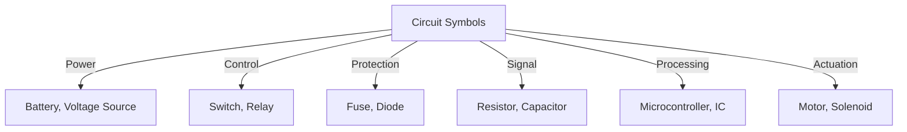
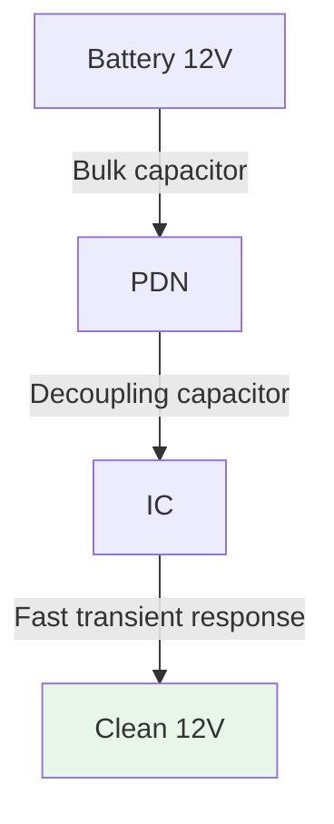
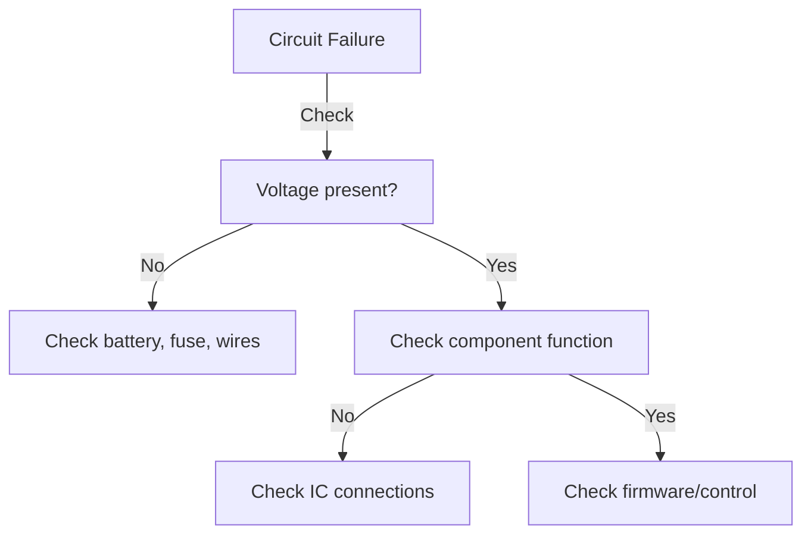

import { Callout } from 'fumadocs-ui/components/callout';
import { Tab, Tabs } from 'fumadocs-ui/components/tabs';
import { Step, Steps } from 'fumadocs-ui/components/steps';

# Circuit Design Principles and Applications

Professional circuit design requires understanding electrical principles, PCB layout, component selection, and real-world constraints. This section covers practical circuit design for robotics.

## Schematic Design Fundamentals

### Reading Circuit Symbols

Common symbols in robotic circuits:



**Key symbols:**
- **Battery**: ---|+|---|-|  (Power source)
- **Resistor**: ~~~  (Opposition to current)
- **Capacitor**: -||  (Stores charge)
- **Diode**: >|  (One-way current)
- **Transistor**: > (Amplifier/switch)
- **IC**: Square with pins (Integrated circuit)

### Schematic Organization

Well-organized schematic:

```
Top: Power supply section
Middle: Signal processing (microcontroller)
Left: Input (sensors)
Right: Output (motors, actuators)
Bottom: Ground connections
```

### Example: Simple Motor Control Circuit

```
        +12V
         |
        [10A fuse]
         |
    [Motor driver IC]
      /  |  \
   PWM  GND  Motor output → [Motor]
     |
    [Microcontroller]
     |
    GND (common ground)
```

---

## PCB Layout Best Practices

### Layer Stack (typical 4-layer board)

```
Layer 1 (Top):    Signal traces, components
Layer 2:          Power plane (usually +5V or GND)
Layer 3:          Ground plane
Layer 4 (Bottom): Power distribution, more signals
```

**Why multiple layers?**
- Better signal integrity
- Easier ground distribution
- Reduced noise
- More room for traces

### Trace Routing

**Good practices:**
- Keep traces short (fewer reflections)
- Separate analog from digital grounds
- 45° bends (not 90° - reduces reflections)
- Ground return path near signal traces
- Minimum trace width: see amperage guidelines

**Common trace widths:**
```
1A: 10 mils
3A: 24 mils
5A: 40 mils
10A: 80+ mils (or use copper pour)
```

### Component Placement

```
Motor driver (hot component): Corner with airflow
Capacitors: Very close to IC pins
Resistors: Near sensors for filtering
Connectors: Edges for accessibility
```

---

## Power Distribution Networks

### PDN Design

A good Power Distribution Network minimizes voltage ripple:



### Capacitor Selection

**Bulk capacitors** (large):
- Value: 1000-2200 µF
- Purpose: Store energy for large transients
- Placement: Near power entry

**Decoupling capacitors** (small):
- Value: 0.1 µF ceramic
- Purpose: High-frequency noise filtering
- Placement: Right next to IC power pins

**Example PDN for microcontroller:**
```
12V Battery
    ↓
1000 µF bulk (low ESR)
    ↓
100 µF ceramic
    ↓
0.1 µF × 4 (one per power pin pair)
    ↓
Microcontroller 5V pins
```

---

## Signal Integrity

### Noise Sources

```
Electromagnetic: Motors, switches, power
Conducted: High current spikes through wires
Radiated: EMI from fast signals
```

### Noise Mitigation

<Steps>
<Step>
### Separate Analog and Digital Grounds

Analog signals (sensors) and digital signals (logic) should have separate grounds that meet at one point.

```
Analog ground ─ ⊕ ─ Digital ground
              (star point)
```

This prevents digital noise from corrupting analog signals.
</Step>

<Step>
### Use Ground Planes

Continuous copper ground layer provides:
- Low impedance return paths
- Reduced EMI radiation
- Better noise immunity

Instead of thin ground wires, use broad copper areas.
</Step>

<Step>
### Ferrite Beads and Inductors

Add ferrite beads on power supply leads to smooth transients:

```
Battery → [Ferrite bead] → Circuit
```

Ferrite beads: Cheap, simple, effective for high-frequency noise
</Step>

<Step>
### Shielding

For sensitive signals (SPI, I2C), use shielded cables:

```
Signal line ─────┐
                 ├─ Twisted together
Ground line ─────┘

Shield (braid) around both
```

Shield connected to ground at source only.
</Step>
</Steps>

---

## Component Integration

### Microcontroller Circuit

Minimum viable schematic:

```
         +5V
          |
    [100µF]
          |
    [10kΩ pull-up]
          |
         [Button]
          |
    Microcontroller pin
          |
         GND
```

### Motor Driver Integration

```
        +12V
         |
    [Motor driver IC]
    /   |    \
  PWM  GND  Motor
   |          |
   MCU    Power supply
```

### Sensor Integration

```
+5V ──[10kΩ]──┬── ADC pin (Microcontroller)
              |
           [Sensor]
              |
             GND
```

---

## Protection Circuits

### Reverse Polarity Protection

Prevents damage if battery connected backward:

```
Option 1: Diode (loses ~0.7V)
  Battery(+) ──[Diode]── Circuit(+)
  Battery(−) ─────────── Circuit(−)

Option 2: P-channel MOSFET (no loss)
  Battery(+) ──[PMOS]── Circuit(+)
  Battery(−) ────────── Circuit(−)
  (PMOS blocks reverse polarity)
```

### Over-Current Protection

Fuses or auto-reset breakers:

```
Fuse rating: I_fuse = 1.5 × I_max_normal

Example: Motor normally draws 5A
→ Use 7-8A fuse
```

### Transient Protection

TVS (Transient Voltage Suppression) diodes protect against spikes:

```
            ┌─ TVS diode ─┐
Power ──────┤              ├──── Component
            └─────────────┘
            (clamps spikes)
```

---

## Real-World Design Example: Quadcopter ESC Integration

```
LiPo Battery (3S, 11.1V)
    ↓
[XT60 connector]
    ↓
[15A fuse]
    ↓
Main PDB (Power Distribution Board)
    ├─ ESC 1 → Motor 1
    ├─ ESC 2 → Motor 2
    ├─ ESC 3 → Motor 3
    ├─ ESC 4 → Motor 4
    └─ Flight controller (5V regulated)
        ├─ Gyro sensor
        ├─ Compass
        ├─ Barometer
        └─ RC receiver (PWM)
```

**Key design decisions:**
- Single battery for all ESCs (common practice)
- 5V regulator for sensitive flight controller
- Separate ground plane for each motor
- Capacitors on battery input
- TVS diodes on sensor lines

---

## Testing and Verification

### Pre-Power Checks

Before connecting battery:
1. Visual inspection: No solder bridges
2. Continuity test: Traces connected properly
3. Resistance test: No shorts between power/ground
4. Polarity check: Capacitors oriented correctly

### Power-On Sequence

```
Step 1: Connect battery with current limiter (0.5A limit)
Step 2: Verify voltage at various points (should match design)
Step 3: Gradually increase current limit
Step 4: Verify all components supply voltage
Step 5: Enable one system at a time
Step 6: Check for noise and stability
```

### Failure Analysis

If circuit doesn't work:



---

## Common Design Patterns in Robotics

### Pattern 1: Motor Control

```
MCU PWM output → Motor driver IC → Motor + Battery
```

### Pattern 2: Sensor Input

```
Sensor output → Filtering circuit → ADC input (MCU)
```

### Pattern 3: Communication

```
MCU UART → RS485/CAN transceiver → Wireless module
```

### Pattern 4: Power Management

```
Battery → Switching regulator → 3 different voltages
        → Fuse/protection
        → Distribution board
```

---

## Design Tools and Resources

**Recommended tools:**
- **KiCad**: Free, open-source PCB design
- **LTspice**: Free circuit simulation
- **Fusion 360**: Free 3D CAD with PCB layout

**Online resources:**
- Component datasheets (always consult!)
- Reference designs (manufacturer app notes)
- Community forums (electronics SE, Reddit r/electronics)

---

## Summary

**Circuit Design Flow:**

1. **Specification**: List components, voltages, currents
2. **Schematic**: Draw connections, verify with theory
3. **Layout**: Place components, route traces
4. **Fabrication**: Order PCB or build by hand
5. **Assembly**: Solder components, test continuity
6. **Testing**: Power up, verify voltages, troubleshoot

**Key Principles:**

✓ Separate high and low current circuits
✓ Use proper ground distribution
✓ Filter power supplies with capacitors
✓ Protect against transients and reverse polarity
✓ Minimize trace lengths, especially for sensitive signals
✓ Follow component datasheets exactly
✓ Test thoroughly before deployment

**For Robotics Specifically:**

✓ Design for motor current spikes
✓ Isolate analog sensors from digital noise
✓ Plan for heating (thermal management)
✓ Design for expansion (future components)
✓ Make circuits modular (easier to debug)