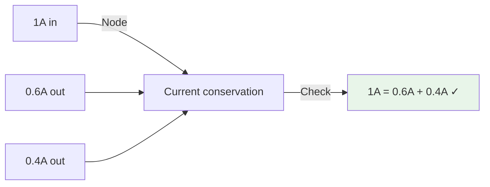
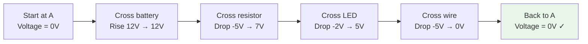

import { Callout } from 'fumadocs-ui/components/callout';
import { Tab, Tabs } from 'fumadocs-ui/components/tabs';

# Kirchhoff's Laws - KVL and KCL

Ohm's Law works for simple circuits, but real robots have complex networks of components. Kirchhoff's Laws allow you to analyze any circuit, no matter how complex. These two fundamental laws form the basis of circuit analysis.

## Kirchhoff's Current Law (KCL)

### The Law

**Definition:** The sum of currents entering a node equals the sum of currents leaving that node.

```
Σ I_in = Σ I_out
```

Or equivalently:
```
Σ I_all = 0 (considering direction)
```

**Physical meaning:** Charge cannot accumulate at a node - what flows in must flow out.

### Visual Representation



### Example: Robot with Multiple Loads

**Battery powering three devices:**

```
┌─────────────────────┐
│    12V Battery      │
│    (5A source)      │
└────────┬────────────┘
         │ 5A total current
    ┌────┴────┬────────┬────────┐
    │         │        │        │
  Motor    Servo    LEDs    Computer
  (3A)     (1.2A)  (0.5A)   (0.3A)
    │         │        │        │
    └────┬────┴────────┴────────┘
         │ 5A total current
         │ (back to battery)

Check: 3 + 1.2 + 0.5 + 0.3 = 5A ✓
```

### Practical Application: Current Distribution

**Problem:** Design power distribution from 12V battery to three devices. Battery can supply 20A max.

```
Device 1 (Motor): Needs 8A
Device 2 (Servo): Needs 5A  
Device 3 (Logic): Needs 2A
Total needed: 15A ✓ Within 20A limit

Check:
At main split: 15A in = 8A + 5A + 2A out ✓
```

---

## Kirchhoff's Voltage Law (KVL)

### The Law

**Definition:** The sum of voltages around any closed loop in a circuit equals zero.

```
Σ V_loop = 0
```

Or: The sum of voltage rises equals the sum of voltage drops.

```
Σ V_rise = Σ V_drop
```

### Understanding KVL

When you go around a complete loop:
- Voltage **rises** when crossing a battery (+ side)
- Voltage **drops** when crossing a resistor or component (in direction of current)
- You return to the same potential: net change = 0

### Visual Example



### KVL Equation for Series Circuit

**Simple series circuit: Battery, R1, R2, R3**

```
V_battery = V_R1 + V_R2 + V_R3
12V = (I×R1) + (I×R2) + (I×R3)
```

---

## Combining KVL and KCL

### Example: Multi-Loop Circuit

**Circuit with two loops:**

```
        ┌─────R1─────┐
        │            │
    12V │            │ Loop 1
    ┌──┴┬─────R2─────┤
    │   │            │
    └───┼────R3──────┤ Loop 2
        │            │
        └────────────┘
```

**Using KCL at main node:**
```
I_battery = I_loop1 + I_loop2
```

**Using KVL for Loop 1:**
```
12V = I_loop1 × R1 + I_loop1 × R2
```

**Using KVL for Loop 2:**
```
0 = I_loop2 × R2 - I_loop1 × R3
(Or: I_loop2 × R2 = I_loop1 × R3)
```

---

## Practical Circuit Analysis Example

### Problem: Robotic Voltage Distribution Network

**Scenario:**
- 12V battery with internal resistance R_bat = 0.2Ω
- Supplies: Motor (requires 6V), Servo (requires 5V), Computer (requires 3.3V)
- Each needs specific voltage and current

```
Battery → Regulator_1 (12V→6V) → Motor (3A)
       → Regulator_2 (12V→5V) → Servo (1.5A)
       → Regulator_3 (12V→3.3V) → Computer (0.5A)
```

**Analysis using KCL:**

Total current from battery:
```
I_total = 3A + 1.5A + 0.5A = 5A
```

Voltage at battery terminals (accounting for internal resistance):
```
V_battery_terminal = 12V - (5A × 0.2Ω) = 12V - 1V = 11V
```

Each regulator must handle:
```
Regulator 1: 11V in → 6V out for 3A motor
Regulator 2: 11V in → 5V out for 1.5A servo
Regulator 3: 11V in → 3.3V out for 0.5A computer
```

**Using KVL for each regulator:**

Regulator 1 loop:
```
11V = V_drop_regulator1 + 6V
V_drop_regulator1 = 5V
Power wasted: 5V × 3A = 15W (heat!)
```

---

## KVL and KCL in Complex Networks

### Mesh Current Method

For complex circuits with multiple sources and loads:

1. Identify all loops (meshes)
2. Assume current direction in each loop
3. Apply KVL to each loop
4. Solve system of equations

**Example: 2-loop circuit**

```
        ┌──R1──┐
    12V │      │
    ┌──┤      ├──┐
    │  └──────┘  │ R2
    │            │
    │  ┌──────┐  │
    └──┤      ├──┘
       └──R3──┘
       5V source
```

**Setup:**
- Loop 1: 12V → R1 → R2 → Back to 12V
- Loop 2: 5V → R3 → R2 → Back to 5V

**Equations (KVL):**
```
Loop 1: 12 = I_1×R1 + (I_1 - I_2)×R2
Loop 2: 5 = I_2×R3 + (I_2 - I_1)×R2
```

Solving gives actual currents in each branch.

---

## Current Division (KCL Application)

### The Current Divider Formula

When current splits into parallel paths:

```
I_1 = I_total × (R_2 / (R_1 + R_2))
I_2 = I_total × (R_1 / (R_1 + R_2))
```

Current divides inversely proportional to resistance!

### Example: Power LED Array

**Setup:**
- 12V source
- Two LED strings in parallel:
  - String 1: 4 red LEDs (2V each) + 100Ω resistor
  - String 2: 6 red LEDs (2V each) + 200Ω resistor

**Analysis:**

String 1 voltage drop across resistor:
```
V_R1 = 12V - (4 × 2V) = 4V
I_1 = 4V / 100Ω = 0.04A = 40mA
```

String 2 voltage drop across resistor:
```
V_R2 = 12V - (6 × 2V) = 0V (exactly!)
I_2 = 0V / 200Ω = 0A (doesn't work - no current!)
```

**Problem:** String 2 needs adjustment:
```
Change to 150Ω:
V_R2 = 12V - 12V = 0V (still doesn't work!)

Solution: Use 5 LEDs instead of 6
V_R2 = 12V - (5 × 2V) = 2V
I_2 = 2V / 200Ω = 0.01A = 10mA (low but works)
```

---

## Voltage Division (KVL Application)

### The Voltage Divider Formula

When voltage divides across resistors in series:

```
V_out = V_in × (R2 / (R1 + R2))
```

### Example: Sensor Interface

**Analog sensor (0-5V) connected to microcontroller with 0-3.3V input**

Need voltage divider:
```
3.3V max input from 5V sensor output

3.3 = 5 × (R2 / (R1 + R2))
3.3 / 5 = R2 / (R1 + R2)
0.66 = R2 / (R1 + R2)

Common solution: R1 = 10k, R2 = 20k
Check: 5 × (20k / 30k) = 5 × 0.667 = 3.33V ✓
```

---

## Summary

**Kirchhoff's Current Law (KCL):**

- ✓ Charge conservation at nodes
- ✓ Σ I_in = Σ I_out
- ✓ Used to verify current distribution
- ✓ Basis for current divider formula

**Kirchhoff's Voltage Law (KVL):**

- ✓ Energy conservation around loops
- ✓ Σ V_around_loop = 0
- ✓ Used to solve complex circuits
- ✓ Basis for voltage divider formula

**Practical Applications:**

1. Verify power distribution calculations
2. Analyze multi-source circuits
3. Design voltage/current dividers
4. Troubleshoot circuit failures
5. Design complex sensor networks