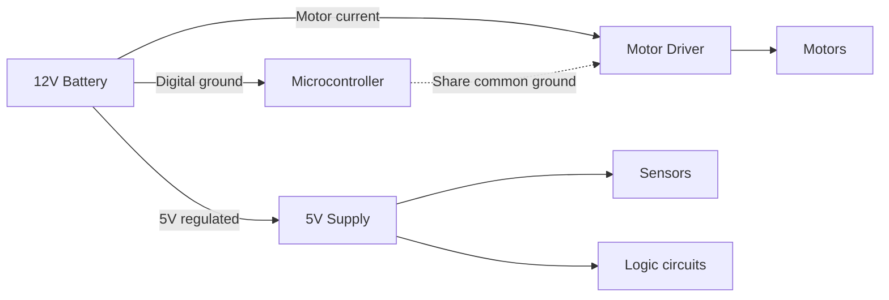
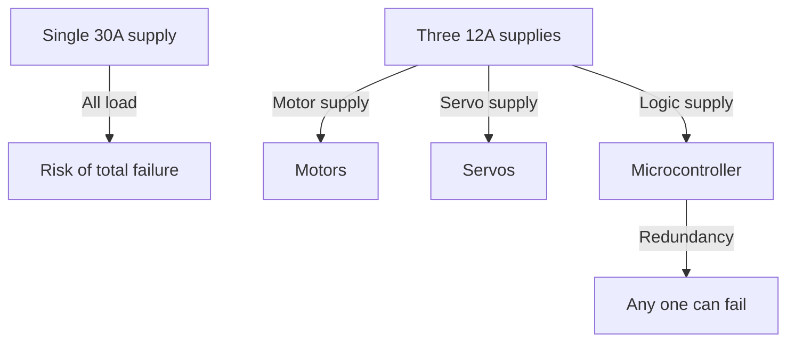

import { Callout } from 'fumadocs-ui/components/callout';
import { Tab, Tabs } from 'fumadocs-ui/components/tabs';
import { Accordion, Accordions } from 'fumadocs-ui/components/accordion';

# Load Balancing and Circuit Design

Effective load balancing ensures that power is distributed efficiently across all components, preventing overloads, voltage drops, and component failures. In robotics, proper circuit design is critical for stable, reliable operation.

## Load Distribution Fundamentals

### What is Load?

**Definition:** The total current (and power) consumed by all connected devices in a circuit.

```
Total Load Current = I_motor1 + I_motor2 + I_servo + I_sensor + I_microcontroller + ...
```

### Peak vs Average Load

Different components draw different amounts of current at different times:

| Component | Peak Current | Average Current | Duration |
|-----------|-------------|-----------------|----------|
| Motor startup | 10-50 A | 5-15 A | 0.5-2 sec |
| Servo holding | 1-2 A | 0.3-0.8 A | Continuous |
| LED | 0.02 A | 0.02 A | Continuous |
| Sensor | 0.05-0.1 A | 0.05-0.1 A | Continuous |
| Microcontroller | 0.05-0.3 A | 0.05-0.3 A | Continuous |

**Important:** Battery and wiring must handle peak current, not just average!

### Current Distribution Example

20 kg robot with:
- 4 DC motors (3 A each at full power) = 12 A
- 2 servos (1 A each) = 2 A
- Microcontroller + sensors = 0.3 A
- Communication module = 0.2 A

```
Peak current: 12 + 2 + 0.3 + 0.2 = 14.5 A
Average (mixed speed): ~8 A
```

---

## Power Supply Design

### Battery Selection for Load

**Rule of Thumb:**
```
Battery Capacity (Ah) = Peak Load (A) × Operating Time (hours)
                       ÷ Usable Capacity (70-80%)
```

**Example:**
- Peak load: 15 A
- Target runtime: 2 hours
- Usable capacity: 80%

```
Required: 15 A × 2 h ÷ 0.8 = 37.5 Ah

Choose 40 Ah battery (with margin)
```

### Voltage Regulation

Most circuits require stable voltage. Motor surges can cause voltage dips:

```mermaid
graph TD
    A["Battery 12V"] -->|Voltage drop| B["12V supply"]
    C["Motor startup"] -->|Surge| D["Voltage dips to 10V"]
    E["Microcontroller"] -->|Expects 5V"] F["Regulated 5V supply"]
    
    style B fill:#e8f5e9
    style D fill:#ffebee
    style F fill:#e8f5e9
```

**Solution: Voltage Regulators**
- Linear regulators (LDO): Simple, inefficient
- Buck converters: Efficient for step-down
- Boost converters: For step-up

**Example circuit:**
```
Battery 12V → Buck converter → 5V @ 3A (for microcontroller)
Battery 12V → Motor driver → Motors (direct)
```

---

## Circuit Design Principles

### Separate Power Rails

High-current devices (motors) and low-current devices (sensors) should have separate power paths:



**Why separate?**
- Motor current spikes cause noise
- Noise damages sensitive electronics
- Separate rails minimize cross-coupling

### Ground Plane

A solid ground connection is critical:

```
Good:  Thick wire or PCB ground plane
Bad:   Thin wire for ground, thick for power
```

**Example:** 14 A motor current over 0.5 m thin wire:
```
Voltage drop = I × R = 14 A × (wire resistance)
Thin wire (~0.5 Ω/meter): drop = 14 × 0.25 = 3.5 V! (Disaster!)
Thick wire (~0.05 Ω/meter): drop = 14 × 0.025 = 0.35 V (OK)
```

### Capacitor Filtering

Capacitors smooth out voltage spikes from motor surges:

```
Motor starts → Current surge
              → Voltage dips (boom!)
              
With capacitor:
Motor starts → Capacitor releases charge
              → Voltage stays stable
              → Microcontroller happy!
```

**Typical design:**
```
Large capacitor (1000-2200 µF) near motor driver
Small capacitors (10-100 µF) near each IC
```

---

## Load Balancing Strategies

### Strategy 1: Distribute Across Power Supply

Instead of one large power supply, use multiple smaller ones:



### Strategy 2: Sequential Motor Activation

Don't turn on all motors simultaneously (peak current spike):

```
Time 0:   Turn on motor 1 (3 A)
Time 0.5s: Turn on motor 2 (3 A)
Time 1.0s: Turn on motor 3 (3 A)
Result: Smooth 0→3→6→9 A ramp instead of 0→12 A spike
```

### Strategy 3: Soft Start

Gradually ramp motor speed instead of full-power start:

```
Hard start: 0 → 100% power instantly = 50 A spike
Soft start: 0 → 100% power over 1 second = 5 A/s ramp
```

Many motor controllers have ramp/soft-start features.

---

## Practical Design Checklist

<Callout type="success" title="Circuit Design Checklist">

**Power Supply Selection:**
- ✓ Calculate peak current of all devices
- ✓ Choose battery with 20-30% margin above peak
- ✓ Verify battery voltage matches circuit requirements
- ✓ Check continuous discharge rating

**Wiring and Connectors:**
- ✓ Select wire gauge for current (AWG chart)
- ✓ Use thick wires for high current (< 3% drop)
- ✓ Proper connectors rated for current (XT60, XT90, etc.)
- ✓ Crimp properly or solder securely

**Voltage Regulation:**
- ✓ Regulate high-current and low-current separately
- ✓ Add bulk capacitance near motor drivers
- ✓ Add ceramic capacitors near ICs
- ✓ Test voltage under load

**Ground Connection:**
- ✓ Use thick ground wire (same as power)
- ✓ Common ground between all supplies
- ✓ Ground plane on PCB if possible
- ✓ Minimize ground loop resistance

**Protection:**
- ✓ Fuses or circuit breakers on each major branch
- ✓ TVS diodes across inductive loads
- ✓ Reverse polarity protection
- ✓ Over-current protection

**Testing:**
- ✓ Measure voltage under full load
- ✓ Check for excessive noise on oscilloscope
- ✓ Thermal imaging to spot hot components
- ✓ Stress test with extended operation

</Callout>

---

## Real-World Examples

### Example 1: Mobile Robot

```
Component         Current    Voltage
Motors (4×)      12 A       12V
Servos (2×)       2 A        6V (regulated)
Microcontroller   0.3 A      5V (regulated)
Sensors           0.2 A      5V (regulated)
LED indicator     0.05 A     5V
─────────────────────────────────────
Peak Total       14.5 A      12V battery
```

**Circuit Design:**
```
12V LiPo (5S, 50C, 5000 mAh)
↓
Main fuse 20A
├─ Motor driver → 4 DC motors
├─ Buck converter 12V→6V 5A → Servo controller
└─ Buck converter 12V→5V 3A → Microcontroller
                               ├─ Sensors
                               └─ LED
```

### Example 2: Robotic Arm

```
Component              Current  Voltage
Base motor            3 A      12V
Shoulder motor        2 A      12V
Elbow motor          1.5 A     12V
Wrist servo           1 A      6V
Gripper servo         1 A      6V
Microcontroller       0.3 A    5V
─────────────────────────────────────
Peak Total (all)      8.8 A    12V battery
Average (partial)    ~4 A      
```

**Design consideration:**
- All motors rarely run simultaneously
- Implement load balancing
- Use soft-start on arm motors
- Separate servo supply prevents noise

---

## Common Design Mistakes

| Mistake | Problem | Solution |
|---------|---------|----------|
| **Undersized battery** | Voltage collapse during peak load | Calculate peak + 30% margin |
| **Thin ground wire** | Voltage noise, system resets | Ground wire = power wire thickness |
| **No capacitors** | Motor spikes destroy electronics | Add 1000 µF bulk + 10 µF per IC |
| **Shared high/low current** | Noise couples into sensors | Separate power rails, common ground |
| **No fuses** | Short circuit destroys components | Fuse each major branch |
| **Mixed connector types** | Hard to manage, safety risk | Standardize on XT60 or similar |

---

## Summary

**Key Design Principles:**

✓ Calculate peak current, not just average
✓ Separate high and low current circuits
✓ Use proper wire gauge and connectors
✓ Regulate voltage independently where needed
✓ Minimize ground loop resistance
✓ Filter voltage with appropriate capacitors
✓ Protect with fuses and over-current protection
✓ Test thoroughly under full load

**Design Process:**

1. List all components and their current ratings
2. Calculate peak and average load
3. Select battery with margin
4. Design voltage regulation
5. Choose wire gauges and connectors
6. Add protection and filtering
7. Build and test
8. Iterate if needed