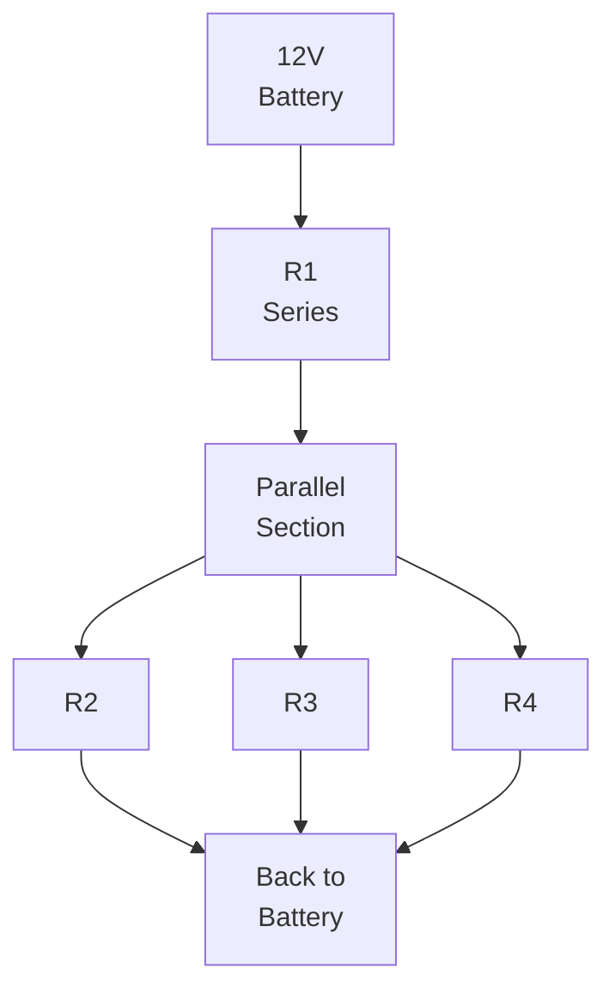

import { Callout } from 'fumadocs-ui/components/callout';
import { Tab, Tabs } from 'fumadocs-ui/components/tabs';

# Series and Parallel Circuits

Most robotic circuits combine series and parallel elements. Understanding how components behave in each configuration is essential for circuit design, troubleshooting, and optimization.

## Series Circuits

### Definition and Characteristics

**Series circuit:** Components connected in a single path where current flows through each component sequentially.

```
Battery → Component 1 → Component 2 → Component 3 → Back to Battery
```

**Key characteristics:**

| Property | Value |
|----------|-------|
| **Current** | Same through all components |
| **Voltage** | Divides among components |
| **Total R** | R_total = R1 + R2 + R3 + ... |
| **Advantage** | Simple, predictable |
| **Disadvantage** | One failure breaks circuit |

### Series Resistance

**Total resistance is sum of individual resistances:**

```
R_total = R1 + R2 + R3 + ... + Rn
```

**Example: Three resistors (10Ω, 20Ω, 30Ω) in series**

```
R_total = 10 + 20 + 30 = 60Ω
```

### Series Current

Since current is the same everywhere:

```
I = V_total / R_total
```

**Example: 12V battery with 60Ω total resistance**

```
I = 12V / 60Ω = 0.2A = 200mA
```

Current through each resistor: **200mA**

### Series Voltage Division

Voltage divides proportionally to resistance:

```
V1 = V_total × (R1 / R_total)
V2 = V_total × (R2 / R_total)
V3 = V_total × (R3 / R_total)
```

**Example from above:**

```
V1 = 12V × (10/60) = 2V
V2 = 12V × (20/60) = 4V
V3 = 12V × (30/60) = 6V
Check: 2 + 4 + 6 = 12V ✓
```

### Series Battery Connection

Batteries in series add voltages:

```
3 × 1.5V alkaline cells in series = 4.5V
2 × 3.7V Li-ion cells in series = 7.4V
4 × 3.7V Li-ion cells in series = 14.8V
```

**Problem:** All batteries must be removed if one dies!

---

## Parallel Circuits

### Definition and Characteristics

**Parallel circuit:** Components connected across the same voltage, each with its own path.

```
        ┌─ Component 1 ─┐
Battery ┤ Component 2 ├ Back to Battery
        └─ Component 3 ─┘
```

**Key characteristics:**

| Property | Value |
|----------|-------|
| **Voltage** | Same across all components |
| **Current** | Divides among components |
| **Total R** | 1/R_total = 1/R1 + 1/R2 + ... |
| **Advantage** | Failure of one doesn't affect others |
| **Disadvantage** | More complex, higher total current |

### Parallel Resistance

**Reciprocal formula:**

```
1/R_total = 1/R1 + 1/R2 + 1/R3 + ...
```

**For two resistors:**

```
R_total = (R1 × R2) / (R1 + R2)
```

**Example: 30Ω and 60Ω in parallel**

```
R_total = (30 × 60) / (30 + 60)
        = 1800 / 90
        = 20Ω

Check using reciprocal:
1/R = 1/30 + 1/60 = 2/60 + 1/60 = 3/60 = 1/20
So R = 20Ω ✓
```

### Parallel Current Division

Current divides inversely proportional to resistance:

```
I1 = I_total × (R_total / R1)
```

**Example: 12V source with 30Ω and 60Ω in parallel**

```
R_total = 20Ω (from above)
I_total = 12V / 20Ω = 0.6A

I_30Ω = 0.6A × (20/30) = 0.6A × 0.667 = 0.4A
I_60Ω = 0.6A × (20/60) = 0.6A × 0.333 = 0.2A

Check: 0.4A + 0.2A = 0.6A ✓
```

### Parallel Battery Connection

Batteries in parallel increase current capacity but maintain voltage:

```
2 × 12V 5Ah batteries in parallel = 12V 10Ah
(double the amp-hours, same voltage)
```

**Advantage:** Better reliability (one can fail, other carries load)
**Requirement:** All batteries must have same voltage!

---

## Mixed Series-Parallel Circuits

### Common Configuration

Most real circuits combine series and parallel:



### Analysis Method

**Step-by-step approach:**

1. **Simplify parallel sections** (find equivalent resistance)
2. **Add series resistances**
3. **Calculate total current**
4. **Work backwards** to find individual currents and voltages

### Example: Power Distribution Network

**Robot power system:**

```
        ┌─ Motor 1 (6Ω) ─┐
12V ─ Wire(0.2Ω) ┤ Motor 2 (6Ω) ├─ Back
        └─ Motor 3 (6Ω) ─┘
```

**Step 1: Parallel resistance (3 × 6Ω)**

```
1/R_parallel = 1/6 + 1/6 + 1/6 = 3/6 = 1/2
R_parallel = 2Ω
```

**Step 2: Total resistance**

```
R_total = R_wire + R_parallel = 0.2Ω + 2Ω = 2.2Ω
```

**Step 3: Total current**

```
I_total = 12V / 2.2Ω = 5.45A
```

**Step 4: Voltage at parallel motors**

```
V_motors = 12V - (5.45A × 0.2Ω) = 12V - 1.09V = 10.91V
```

**Step 5: Current in each motor**

```
I_each = 10.91V / 6Ω = 1.82A per motor
Check: 1.82 + 1.82 + 1.82 = 5.45A ✓
```

---

## Practical Robotic Examples

### Example 1: LED Indicator Array

**Requirement:** 4 indicator LEDs (red, green, yellow, blue) all powered from 5V supply

**Approach:** Parallel with individual current-limiting resistors

```
        ┌─ R_red ─ LED_red ─┐
5V ─────┤ R_green ─ LED_green ├─ GND
        ├ R_yellow ─ LED_yellow ├
        └─ R_blue ─ LED_blue ─┘
```

**Design:**
- Each LED: 2V forward voltage, 20mA current
- Resistor needed: (5V - 2V) / 20mA = 150Ω
- Use 150Ω or 180Ω resistor for each

**Total current:** 4 × 20mA = 80mA (acceptable)

### Example 2: Sensor Network

**Requirement:** Multiple sensors (each 50Ω equivalent) need 3.3V from microcontroller GPIO

**Problem:** GPIO can only source 20mA max

**Solution:** Don't put sensors directly in parallel; use buffer

```
MCU (3.3V) → OpAmp Buffer → Parallel Sensors
            (can drive 100mA)
```

### Example 3: Motor with Brake and Capacitor

**Circuit:**
```
12V ─ MOSFET ─ Motor ─┬─ GND
                      │
                   Capacitor
                    (parallel)
```

**Purpose:** Capacitor provides short-term current during switching

---

## Component Combinations in Robotics

### Series Applications

**When to use series:**

- LEDs in long chains (voltage multiplication)
- Batteries to increase voltage
- Resistors for high precision (stack tolerances)
- Inductors for high-frequency filtering

### Parallel Applications

**When to use parallel:**

- Motors for redundancy
- Batteries for capacity
- Capacitors for energy storage
- Resistors for power handling

---

## Series-Parallel Design Checklist

<Callout type="success" title="Circuit Design Checklist">

**Before implementing:**
- [ ] Calculate total current draw
- [ ] Verify power supply capacity
- [ ] Design for load distribution
- [ ] Plan for component failures
- [ ] Add safety margins (30-50%)

**During implementation:**
- [ ] Test series connections first
- [ ] Verify voltages at each node
- [ ] Measure actual currents
- [ ] Check for hot components

**After assembly:**
- [ ] Verify all voltages with multimeter
- [ ] Measure total and branch currents
- [ ] Monitor for 30 minutes idle
- [ ] Test under full load

</Callout>

---

## Summary

**Series Circuits:**
- ✓ Single path for current
- ✓ Current same everywhere, voltage divides
- ✓ Total R = sum of individual resistances
- ✓ One failure breaks circuit
- ✓ Good for voltage multiplication (batteries)

**Parallel Circuits:**
- ✓ Multiple paths for current
- ✓ Voltage same everywhere, current divides
- ✓ Total R = 1/(sum of reciprocals)
- ✓ One failure doesn't affect others
- ✓ Good for capacity and redundancy

**Mixed Circuits:**
- ✓ Simplify parallel sections first
- ✓ Add series resistances
- ✓ Calculate total current
- ✓ Work backwards for individual values
- ✓ Verify with measurements