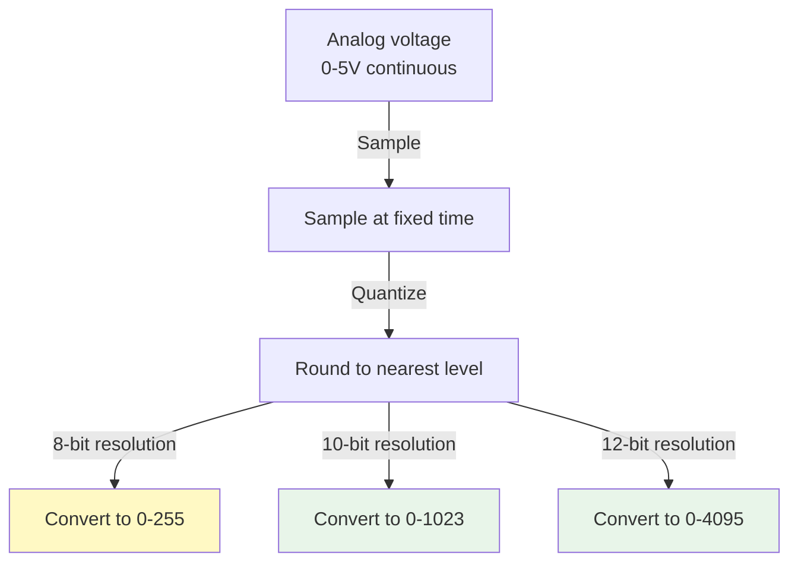

import { Callout } from 'fumadocs-ui/components/callout';
import Image from 'next/image';
import { Tab, Tabs } from 'fumadocs-ui/components/tabs';

# Sensor Basics and Interfacing

Sensors are the robot's senses. Understanding how to read and process sensor data is critical for any autonomous system.

## Sensor Types in Robotics

### Distance Sensing

**Ultrasonic (HC-SR04):**
```
Principle: Sound wave echo time
Range: 2cm - 4m
Resolution: ~3mm
Output: Pulse width (time)
Pros: Cheap, non-contact
Cons: Affected by temperature, soft surfaces
```

<Image
  src="/docimg/simesc.jpg"
  alt="Ultrasonic sensor (HC-SR04) mounted on robot for distance measurement"
  width={400}
  height={300}
  className="rounded-lg shadow-md"
/>

**Figure: HC-SR04 ultrasonic sensor - reliable distance measurement for robotics**

**Infrared (Sharp GP2Y0A):**
```
Principle: Infrared light reflection
Range: 10cm - 80cm (varies by model)
Resolution: ~2cm
Output: Analog voltage (non-linear)
Pros: Fast, compact
Cons: Affected by ambient light, short range
```

**LIDAR:**
```
Principle: Laser distance measurement
Range: 0.5m - 40m
Resolution: ~2cm
Output: Serial data or PWM
Pros: Accurate, long range, 2D/3D mapping possible
Cons: Expensive ($50-1000+)
```

### Motion Sensing

**Accelerometer (MPU6050):**
```
Measures: Linear acceleration (g-force)
Range: Typically ±2, ±4, ±8, ±16g
Resolution: ~16-bit (16000 LSB/g)
Output: I2C or SPI
Axes: 3-axis (X, Y, Z)
```

**Gyroscope:**
```
Measures: Angular velocity (rotation rate)
Range: Typically ±250, ±500, ±1000, ±2000 °/s
Resolution: ~16-bit
Output: I2C or SPI
Axes: 3-axis (pitch, roll, yaw)
```

**Magnetometer (Compass):**
```
Measures: Magnetic field direction
Range: Limited by Earth's field (typically ±80 µT)
Output: I2C or SPI
Axes: 3-axis (X, Y, Z)
Uses: Determine robot heading
```

### Environmental Sensors

**Temperature (DHT22):**
```
Measures: Ambient temperature
Range: -40 to 80 °C
Accuracy: ±0.5 °C
Output: Single-wire digital
Also measures: Humidity
```

**Pressure (BMP180):**
```
Measures: Atmospheric pressure
Range: 300-1100 hPa
Output: I2C
Can estimate: Altitude
```

---

## Analog vs Digital Sensors

### Analog Sensors

Output continuously varying voltage:

```
Voltage represents: Some physical quantity
Example: 0V = obstacle far away, 5V = obstacle close

Interfacing:
Sensor output → Analog input (A0)
ADC converts to: 0-1023 digital value

Resolution = 5V / 1024 = 4.88 mV per step
```

### Digital Sensors

Output discrete digital signals:

```
Examples: Button (HIGH/LOW), encoder (pulses)

Interfacing:
Sensor output → Digital input (pin 2-13)
Reads: HIGH (5V) or LOW (0V)

No conversion needed, direct logic level
```

### Serial Sensors

Output data via serial protocol (I2C, SPI, UART):

```
Sensor → I2C/SPI/UART → Microcontroller

Advantage: Rich data, multiple sensors on same lines
Disadvantage: More complex communication code

Example: IMU (9-axis) sends 9 values over I2C
```

---

## Analog to Digital Conversion (ADC)

### How ADC Works



### Resolution

Higher resolution = finer measurement:

```
Arduino Uno: 10-bit ADC
Resolution = 5V / 1024 = 4.88 mV per unit

ESP32: 12-bit ADC (configurable)
Resolution = 3.3V / 4096 = 0.80 mV per unit (much finer!)
```

### Sampling Rate

How often microcontroller reads sensor:

```
Arduino ADC: ~10 kHz max (can read sensor ~10,000 times/second)

Faster sampling needed for:
- Fast-moving objects (high-speed robot)
- Vibration analysis
- Precise motion control

Slow sampling OK for:
- Temperature measurement
- Static obstacle detection
- Battery voltage monitoring
```

---

## Sensor Interfacing Circuits

### IR Sensor Circuit

```
        +5V
         |
        [10kΩ]
         |
        [IR sensor] → ADC pin (Arduino A0)
         |
        GND

Calibration:
Close (0 cm): Read A0 → 900+
Far (80 cm): Read A0 → 100-200
```

### Ultrasonic Sensor (HC-SR04)

```
Arduino pin 7 (trigger)  → HC-SR04 TRIG
Arduino pin 8 (echo)     → HC-SR04 ECHO
+5V                      → HC-SR04 VCC
GND                      → HC-SR04 GND

Operation:
1. Set TRIG high for 10 µs (pulse)
2. Wait for ECHO response
3. Measure ECHO pulse width
4. Distance = (pulse width × 343 m/s) / 2
```

### I2C Sensor (IMU)

```
Arduino A4 (SDA) → IMU SDA
Arduino A5 (SCL) → IMU SCL
+5V              → IMU VCC
GND              → IMU GND

I2C is shared bus:
Multiple sensors can connect to same A4, A5!

Example multi-sensor setup:
├─ IMU (address 0x68)
├─ Compass (address 0x1E)
├─ Pressure sensor (address 0x77)
All on same A4, A5 lines
```

---

## Signal Conditioning

### Noise Filtering

Real sensor data is noisy:

```
Raw sensor value: 502, 501, 510, 498, 505, 512, 499, 508, 503, 501

Simple average filter:
Average = (502+501+510+498+505+512+499+508+503+501) / 10 = 504

Smooth value: 504 (less noise than raw)
```

### Exponential Moving Average (Low-pass Filter)

Smooth data without delay:

```cpp
float smoothed = 0;
const float alpha = 0.1;  // 0-1, smaller = more smoothing

void loop() {
  int raw = analogRead(A0);
  smoothed = alpha * raw + (1 - alpha) * smoothed;
  Serial.println(smoothed);
}
```

### Deadband (Hysteresis)

Ignore small changes:

```cpp
int threshold = 5;  // Ignore changes < 5
int lastValue = 0;

void loop() {
  int raw = analogRead(A0);
  if (abs(raw - lastValue) > threshold) {
    lastValue = raw;
    // Process new value only if changed significantly
  }
}
```

---

## Arduino Sensor Reading Examples

### Reading Analog Sensor (IR)

```cpp
const int sensorPin = A0;

void setup() {
  Serial.begin(9600);
}

void loop() {
  int sensorValue = analogRead(sensorPin);  // 0-1023
  
  // Convert to voltage
  float voltage = sensorValue * (5.0 / 1023.0);
  
  // Convert to distance (depends on sensor curve)
  float distance = 27.86 * pow(voltage, -1.15);  // Empirical formula
  
  Serial.print("Raw: ");
  Serial.print(sensorValue);
  Serial.print(" Voltage: ");
  Serial.print(voltage);
  Serial.print("V Distance: ");
  Serial.print(distance);
  Serial.println(" cm");
  
  delay(100);
}
```

### Reading Ultrasonic Sensor

```cpp
const int trigPin = 7;
const int echoPin = 8;

void setup() {
  pinMode(trigPin, OUTPUT);
  pinMode(echoPin, INPUT);
  Serial.begin(9600);
}

long getDistance() {
  digitalWrite(trigPin, LOW);
  delayMicroseconds(2);
  digitalWrite(trigPin, HIGH);
  delayMicroseconds(10);
  digitalWrite(trigPin, LOW);
  
  long duration = pulseIn(echoPin, HIGH, 30000);  // Timeout 30ms
  long distance = duration * 0.034 / 2;  // Speed of sound
  
  return distance;  // cm
}

void loop() {
  long distance = getDistance();
  Serial.print("Distance: ");
  Serial.print(distance);
  Serial.println(" cm");
  delay(100);
}
```

### Reading I2C Sensor (MPU6050 IMU)

```cpp
#include <MPU6050.h>

MPU6050 mpu;

void setup() {
  Serial.begin(9600);
  mpu.initialize();
  if (!mpu.testConnection()) {
    Serial.println("MPU6050 not found!");
  }
}

void loop() {
  int16_t ax, ay, az;
  int16_t gx, gy, gz;
  
  mpu.getAcceleration(&ax, &ay, &az);
  mpu.getRotation(&gx, &gy, &gz);
  
  // Convert to meaningful units
  float ax_g = ax / 16384.0;  // ±2g range
  float gx_deg = gx / 131.0;  // ±250 deg/s range
  
  Serial.print("Acceleration X: ");
  Serial.print(ax_g);
  Serial.print(" g, ");
  Serial.print("Gyro X: ");
  Serial.print(gx_deg);
  Serial.println(" deg/s");
  
  delay(100);
}
```

---

## Sensor Specifications Sheet

| Sensor | Type | Range | Output | Cost | Best For |
|--------|------|-------|--------|------|----------|
| **HC-SR04** | Ultrasonic | 2-400cm | Pulse | $2-5 | Distance measurement |
| **IR GP2Y** | IR | 10-80cm | Analog | $3-8 | Proximity detection |
| **MPU6050** | IMU | ±16g / ±2000°/s | I2C | $3-8 | Motion tracking |
| **DHT22** | Temp/Humidity | -40 to 80°C | Serial | $5-10 | Environmental |
| **BMP180** | Pressure | 300-1100 hPa | I2C | $5-10 | Altitude measurement |
| **GY-530** | LIDAR | 0.5-40m | Serial | $50-100 | Precise distance |

---

## Troubleshooting Sensors

| Problem | Likely Cause | Fix |
|---------|-------------|-----|
| **Erratic readings** | Noise, loose connections | Add capacitor, check wires |
| **Always reads max** | Sensor not working | Check power, test with LED |
| **Always reads min** | Wrong calibration | Recalibrate, check range |
| **Delayed response** | Sampling rate too slow | Increase loop frequency |
| **I2C sensor not found** | Wrong address or bus hung | Use I2C scanner, check pullups |
| **ADC stuck value** | Pin floating | Ensure proper connections |

---

## Summary

**Sensor Interfacing Steps:**

1. **Identify sensor type** (analog/digital/I2C/SPI)
2. **Check voltage levels** (5V vs 3.3V)
3. **Connect power and ground**
4. **Connect signal wire(s)**
5. **Add filtering if needed** (capacitor for analog)
6. **Write read code** (analogRead, digitalRead, I2C_read)
7. **Calibrate** (measure known values)
8. **Apply filtering** (averaging, exponential smoothing)
9. **Test thoroughly** (verify readings make sense)
10. **Integrate into control loop**

**Typical Robot Sensor Suite:**

✓ Ultrasonic sensor (obstacle avoidance)
✓ IR sensors (line following)
✓ IMU/MPU6050 (attitude, motion)
✓ Encoder (odometry, distance traveled)
✓ Optional: Camera (advanced navigation)