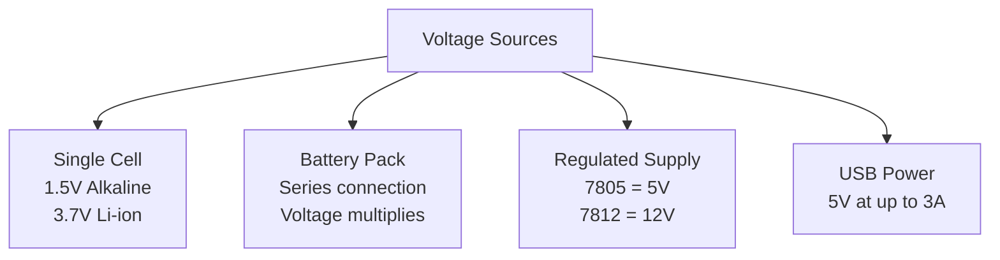
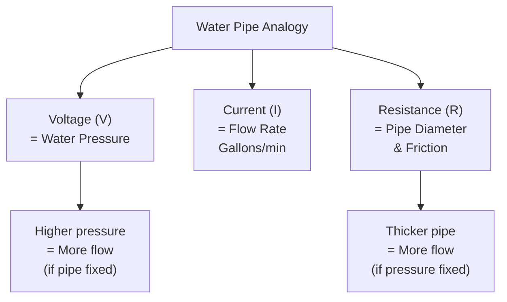

import { Callout } from 'fumadocs-ui/components/callout';
import { Tab, Tabs } from 'fumadocs-ui/components/tabs';
import { Accordion, Accordions } from 'fumadocs-ui/components/accordion';
import Image from 'next/image';

# Electricity Fundamentals

Electricity is the lifeblood of modern robotics. Every motor, sensor, and microcontroller relies on the flow of electrical energy. To design reliable robotic systems, you must understand three fundamental electrical concepts: current, voltage, and resistance.

## Voltage (V)

### What is Voltage?

**Definition:** Voltage is the electrical potential difference between two points. It's the "push" that drives electrons through a circuit.

```
Voltage (V) = Energy per unit charge
Unit: Volts (V)
```

**Physical Analogy:** Think of voltage like water pressure in a pipe - higher pressure pushes water harder through the pipe.

### Voltage in Robotics

| Voltage Level | Common Name | Applications | Notes |
|-----------|-----------|----------|---------|
| **1.5-3V** | Logic/Sensor voltage | Microcontroller I/O, sensors | Standard for many ICs |
| **5V** | Standard logic | Arduino, most sensors | Very common in robotics |
| **12V** | Common supply | Motors, LED arrays, solenoids | Good compromise |
| **24V** | Industrial | Heavy-duty motors, large robots | More power delivery |
| **48V+** | High power | Large robots, autonomous vehicles | Battery packs, electric vehicles |

### Voltage Sources



### Example: Battery Series Connection

Connect batteries in series to increase voltage:

```
2 × 3.7V Li-ion cells in series = 7.4V
3 × 3.7V Li-ion cells in series = 11.1V
4 × 3.7V Li-ion cells in series = 14.8V
```

<Image
  src="/docimg/xt60.jpg"
  alt="XT60 battery connector showing series battery connection"
  width={400}
  height={300}
  className="rounded-lg shadow-md"
/>

**Figure: XT60 connectors commonly used for battery connections in robotics**

---

## Current (I)

### What is Current?

**Definition:** Current is the flow of electrical charge through a conductor. It measures how many electrons pass through a point per second.

```
Current (I) = Charge per unit time
Unit: Amperes (A)
1 Ampere = 1 Coulomb per second
```

**Physical Analogy:** Current is like the amount of water flowing through a pipe - measured in gallons per minute.

### Current Direction Conventions

Two conventions exist:

| Convention | Direction | Used In |
|-----------|-----------|----------|
| **Conventional** | Positive to Negative | Circuit theory, most engineering |
| **Electron Flow** | Negative to Positive | Physics (actual electron movement) |

For robotics, we use **conventional current** (positive to negative).

### Current in Robotics

**Typical current draws:**

| Component | Current Draw | Voltage | Power |
|-----------|-------------|---------|-------|
| **LED** | 20 mA | 5V | 0.1 W |
| **Microcontroller** | 50-100 mA | 5V | 0.25-0.5 W |
| **Small servo** | 200-500 mA | 5-6V | 1-3 W |
| **DC motor (small)** | 500-2000 mA | 6-12V | 3-24 W |
| **Large motor** | 5-20 A | 12-24V | 60-480 W |
| **Entire mobile robot** | 2-10 A | 12V | 24-120 W |

### Ammeter Measurement

To measure current, use an **ammeter** connected **in series** with the circuit:

```
[+] Battery --> [Ammeter] --> [Load] --> [-] Battery
```

<Callout type="warn" title="Never measure current in parallel">
Connecting an ammeter in parallel creates a short circuit and damages the meter!
</Callout>

---

## Resistance (R)

### What is Resistance?

**Definition:** Resistance is the opposition to current flow in a circuit. It's caused by collisions between electrons and atoms in the conductor.

```
Resistance (R) = Opposition to current flow
Unit: Ohms (Ω)
```

**Physical Analogy:** Resistance is like friction in a pipe - it opposes water flow.

### Resistivity and Resistance

For a conductor:

```
R = ρ × (L / A)
```

Where:
- **ρ** (rho) = resistivity of material (Ω·m)
- **L** = length of conductor (m)
- **A** = cross-sectional area (m²)

**Key insight:** Longer wires have more resistance; thicker wires have less resistance.

### Wire Gauge and Resistance

Thicker wires (lower AWG number) have lower resistance:

| AWG | Diameter (mm) | Resistance/100m | Use Case |
|-----|-------------|-----------------|----------|
| **28** | 0.32 | 215 mΩ | Small signals, IC pins |
| **24** | 0.51 | 85 mΩ | Sensor connections |
| **20** | 0.81 | 33 mΩ | Motors, low-current power |
| **18** | 1.02 | 21 mΩ | Battery connections |
| **16** | 1.29 | 13 mΩ | High-current power |
| **14** | 1.63 | 8 mΩ | Very high current (>10A) |

<Image
  src="/docimg/jumper.jpg"
  alt="Different wire gauges used in robotics - from thin signal wires to thick power cables"
  width={400}
  height={300}
  className="rounded-lg shadow-md"
/>

**Figure: Wire gauge comparison - thicker wires for power, thinner for signals**

### Resistor Types in Robotics

<Accordions>
<Accordion title="Fixed Resistors">
Resistors with set resistance values:

**Types:**
- **Carbon film:** Cheap, common in prototyping
- **Metal film:** More accurate (0.1% tolerance)
- **Wirewound:** Low resistance, high power handling

**Common uses:**
- Pull-up/pull-down resistors for sensors
- LED current limiting
- Voltage dividers for analog sensors
- Timing circuits with capacitors

**Example:** 10kΩ pull-up resistor pulls a digital input high when not driven low.
</Accordion>

<Accordion title="Variable Resistors (Potentiometers)">
Resistors whose value can be changed manually or electronically.

**Types:**
- **Potentiometer:** Manual knob adjustment (user control)
- **Rheostat:** High-power variable resistor
- **Photoresistor (LDR):** Resistance changes with light
- **Thermistor:** Resistance changes with temperature

**Robotics application:** Potentiometer for robot arm joint position feedback.
</Accordion>

<Accordion title="Special Resistors">
**Thermistor:** Temperature-dependent

```
Used for: Temperature compensation, thermal shutdown
```

**Photoresistor (LDR):** Light-dependent

```
Used for: Line-following robots, light detection
```

**Varistor (MOV):** Voltage-dependent, used for surge protection

```
Used for: Battery protection, noise filtering
```
</Accordion>
</Accordions>

---

## The Water Pipe Analogy

Understanding voltage, current, and resistance is easier with an analogy:



---

## Energy and Power from V, I, R

### Relationships

```
Power (P) = Voltage × Current
P = V × I

Power in resistor:
P = I² × R
P = V² / R
```

**Example: 12V battery with 5A motor**

```
P = 12V × 5A = 60 W
```

### Energy Consumption

**Energy = Power × Time**

```
E = P × t
E = V × I × t (Wh - Watt-hours)
```

**Example: 60W motor running for 2 hours**

```
E = 60 W × 2 hours = 120 Wh
```

---

## Summary

**Key Relationships:**

- ✓ **Voltage** = Electrical potential difference (pushes electrons)
- ✓ **Current** = Flow of electrical charge (electrons moving)
- ✓ **Resistance** = Opposition to current flow (friction-like effect)
- ✓ **Power** = V × I (wattage consumed)
- ✓ **Energy** = Power × Time (total consumption)

**Practical Tips:**

1. Understand typical voltage levels (5V, 12V most common)
2. Calculate current draw before designing power system
3. Choose proper wire gauge for current capacity
4. Use proper resistors for protection and control
5. Account for voltage drop in long wires