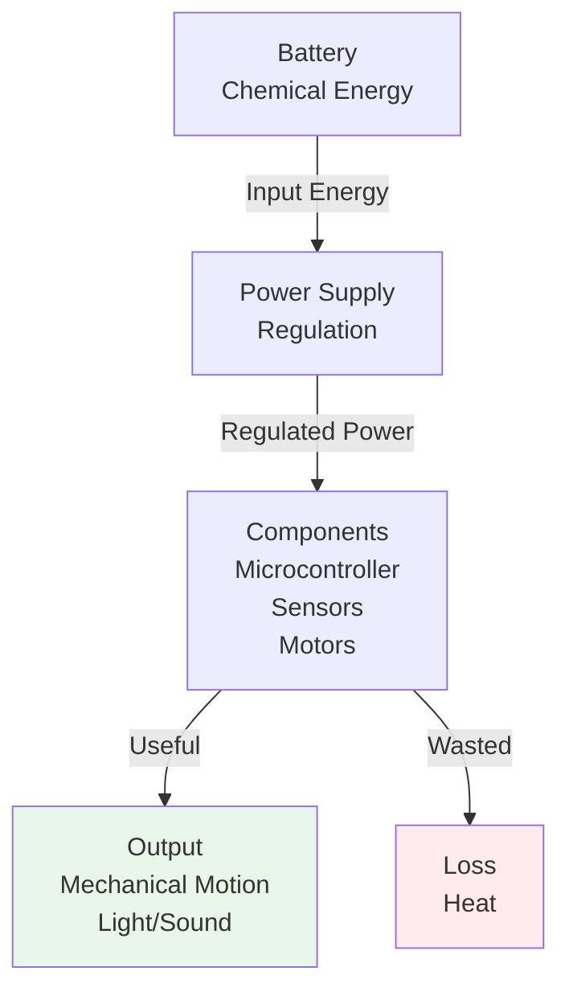

import { Callout } from 'fumadocs-ui/components/callout';
import { Tab, Tabs } from 'fumadocs-ui/components/tabs';
import { Accordion, Accordions } from 'fumadocs-ui/components/accordion';
import { Step, Steps } from 'fumadocs-ui/components/steps';

# Energy Efficiency in Robotic Systems

Energy efficiency is critical in robotics - batteries are expensive, heavy, and limit operation time. Every watt wasted is a watt not available for useful work. Understanding where energy goes and how to optimize it separates excellent robot designs from mediocre ones.

## Energy Flow in Robots

### Energy Path



### Energy Balance

```
Total Energy Input = Useful Energy Output + Heat Loss + Other Losses

100% = Useful % + Heat % + Parasitic %
```

**Typical breakdown for mobile robot:**
- Motors (useful work): 40-50%
- Motor heat losses: 10-15%
- Power regulation: 2-5%
- Microcontroller/sensors: 5-10%
- Other parasitic: 20-30%

---

## Power Dissipation and Heat

### Heat Generation

All resistance converts electrical energy to heat:

```
P_heat = I² × R
```

### Components That Generate Significant Heat

<Accordions>
<Accordion title="Motors">
**Heat generation:**
- DC motors: 15-20% of input power becomes heat
- Stepper motors: 20-30% heat (lower efficiency)
- Servo motors: 15-25% heat

**Heat sources:**
1. Coil resistance (I²R losses)
2. Friction in bearings
3. Eddy currents in iron core

**Thermal management:**
- Aluminum motors (better heat dissipation than plastic)
- Good bearing quality reduces friction
- Air cooling for continuous operation
</Accordion>

<Accordion title="Power Regulators">
**Heat generation:**
- Linear regulators: Can be very hot
  
  ```
  P_heat = (V_in - V_out) × I_out
  
  Example: 12V → 5V at 1A
  P_heat = (12-5) × 1 = 7W (significant!)
  ```

- Switching regulators: More efficient

  ```
  P_heat ≈ 3-5% of output power
  Same example: 7W × 0.05 = 0.35W (much better!)
  ```

**Practical:**
- Use switching regulators (buck converters)
- Linear regulators only for low-power, noise-sensitive circuits
- Add heatsinks if regulator gets hot
</Accordion>

<Accordion title="Resistors">
**Heat generation:**
- Resistors always convert power to heat (that's their job)
- P = V² / R or P = I² × R

**Example: 1kΩ resistor with 5mA:**
```
P = I² × R = (0.005)² × 1000 = 0.025W = 25mW

Tiny but adds up if you have many resistors!
```

**Management:**
- Use proper resistor wattage ratings
- Series resistors waste power (prefer PWM for motors)
</Accordion>

<Accordion title="Microcontroller/Logic">
**Heat generation:**
- Typically 5-15% of system in active mode
- Modern MCUs: 0.5-2W at full speed
- Sleep modes: 0.1-1mW (huge difference!)

**Heat sources:**
1. Switching currents (clocking)
2. Internal logic transitions

**Example consumption:**
- Arduino at full speed: 0.5W
- Arduino in sleep: 0.001W (500× reduction!)
</Accordion>
</Accordions>

### Heat Dissipation Methods

| Method | Effectiveness | Cost | Complexity |
|--------|----------|------|------------|
| **Free air** | Low (passive) | None | None |
| **Heatsink** | Medium | Low | Low |
| **Heatsink + Fan** | High | Medium | Medium |
| **Liquid cooling** | Very high | High | High |

**For most robotics:**
- Use heatsinks for hot components (regulators, motors)
- Ensure adequate ventilation
- Aluminum frame helps dissipate heat

---

## Efficiency in Different Systems

<Tabs items={['Power Supply', 'Motor & Gearing', 'Overall System']}>
<Tab value="Power Supply">
### Battery to Component Efficiency

**Simple linear regulator (12V → 5V, 1A):**

```
V_drop = 12V - 5V = 7V
I = 1A
P_heat = 7V × 1A = 7W
P_out = 5V × 1A = 5W

Efficiency = 5W / 12W = 41.7%
```

**Switching buck converter (12V → 5V, 1A):**

```
Input power ≈ 5W / 0.95 = 5.26W
Heat = 5.26W - 5W = 0.26W

Efficiency ≈ 95%
```

**Impact on 2-hour operation:**
- Linear: 12W × 2h = 24 Wh wasted as heat
- Switching: 0.26W × 2h = 0.52 Wh (46× less!)

</Tab>

<Tab value="Motor & Gearing">
### Motor Output Efficiency

**Motor alone:**
```
Motor input: 100W (12V × 8.3A)
Mechanical output: 85W (modern good motor)
Heat: 15W
Efficiency: 85%
```

**Through gearbox:**
```
Spur gear 95% efficiency
Mechanical output: 85W × 0.95 = 80.75W
Heat: 4.25W additional
Overall: 80.75W / 100W = 80.75%
```

**Full motor + gearbox + bearings:**
```
85% × 95% × 97% = 78.2% overall

Example chain:
Motor: DC brushless 88%
Gearbox: Spur 96%
Bearings: Sealed 98%
Output shaft efficiency: 88% × 96% × 98% = 82.6%

100W input → 82.6W mechanical output
```

</Tab>

<Tab value="Overall System">
### Complete Robot Energy Budget

**Example: 20kg mobile robot, 2-hour mission**

```
Power requirements:
- Main computer: 5W (continuous)
- Sensors: 3W (continuous)
- Motors (drive): 40W average (varies with terrain)
- Wireless: 2W (periodic)

Average power: 50W
Peak power: 70W (all components at once)

For 2-hour mission at average:
E = 50W × 2h = 100 Wh needed

With 20% safety margin:
Battery: 100 Wh / 0.8 = 125 Wh

At 12V: 125 Wh / 12V = 10.4 Ah
Choose: 12V 15Ah battery (plenty of margin)
```

</Tab>
</Tabs>

---

## Optimizing Energy Efficiency

<Steps>
<Step>
### 1. Select Efficient Components

**Motor selection:**
- Brushless DC (BLDC): 85-92% efficient
- Good quality DC brushed: 75-85% efficient
- Stepper motors: 50-70% (generally lower)
- Servo motors: 75-85%

**Power supply:**
- Switching buck/boost converters: 90-98% efficient
- Linear regulators: 40-70% efficient
- Choose switching whenever possible
</Step>

<Step>
### 2. Optimize Power Distribution

**Use appropriate voltage levels:**
```
High voltage for high current (motors):
12V/24V for high power reduces I²R losses
Example: 100W
- At 5V: I = 20A, V_drop in 1m wire = 20A × 0.01Ω = 0.2V (4%)
- At 12V: I = 8.3A, V_drop = 0.083V (0.7%)
- At 24V: I = 4.2A, V_drop = 0.042V (0.2%)
```

Higher voltage = lower current = less wire heating!

**Separate power rails:**
- Digital logic: 5V (noise sensitive)
- Motors: 12V or 24V (high current)
- Keeps clean signals and efficient power delivery
</Step>

<Step>
### 3. Reduce Parasitic Power Draw

**Sleep modes:**
- Microcontroller: Active 5W → Sleep 5mW (1000× reduction)
- Sensors: Many have sleep modes

**Power gating:**
- Turn off unused subsystems
- Wireless module: Off when not communicating
- Sensors: Off when not needed

**Example savings:**
```
Standard operation:
CPU active: 5W
Sensors: 3W
Wireless: 2W
Total: 10W

Optimized:
CPU sleep 90% of time: 0.5W
Sensors on-demand: 0.5W
Wireless duty-cycled: 0.2W
Total: 1.2W (91% reduction!)
```
</Step>

<Step>
### 4. Minimize Mechanical Losses

**Friction reduction:**
- Quality bearings: 98% efficiency
- Proper lubrication
- Aligned shafts

**Gear selection:**
- Spur gears 95-98% (best for low-moderate speed)
- Bevel gears 85-92% (good compromise)
- Worm gears 30-90% (very inefficient, avoid if possible)

**Belt/chain tension:**
- Not too tight (bearing friction)
- Not too loose (slippage)

</Step>

<Step>
### 5. Thermal Management

**Prevent thermal runaway:**
```
If circuit gets hot:
→ Resistance increases
→ More power dissipation
→ Gets hotter (positive feedback!)
```

**Management:**
- Heatsinks on hot components
- Ensure air circulation
- Ambient temperature consideration
- Thermal throttling in microcontroller

</Step>
</Steps>

---

## Battery Chemistry and Efficiency

Different battery types have different efficiencies:

| Battery Type | Charge Efficiency | Self-Discharge | Best For |
|-----------|----------|---------|----------|
| **Li-ion** | 95-99% | 2-3%/month | Modern robotics |
| **LiPo** | 95-99% | 2-3%/month | Drones, high-power |
| **NiMH** | 90-95% | 15-20%/month | Older robots |
| **Lead-acid** | 80-90% | 3-6%/month | Large systems |
| **Alkaline** | ~80% | Varies widely | Emergency backup |

**Practical:** Li-ion and LiPo batteries are most efficient for modern robotics.

---

## Measuring and Monitoring Efficiency

### Power Measurement Tools

**1. Multimeter (basic):**
```
Measure voltage and current separately
Calculate P = V × I
Limited to DC, discrete measurements
```

**2. Inline power meter:**
```
USB Power Meter: $10-30
Shows real-time V, I, P, energy
Good for development
```

**3. Bench power supply:**
```
Many have built-in metering
Shows actual draw while testing
Professional approach
```

### Example Measurement

**Testing a robot's power consumption:**

```
Motor disabled: 2.0A @ 12V = 24W (baseline)
Motor 50% speed: 4.5A @ 12V = 54W
Motor 100% speed: 8.3A @ 12V = 100W

Battery: 12V 10Ah = 120 Wh
At 50% speed: 120Wh / 54W ≈ 2.2 hours
```

---

## Summary

**Efficiency Hierarchy:**

- ✓ **Component selection** impacts efficiency 20-30%
- ✓ **Power distribution** (voltage level) affects efficiency 5-10%
- ✓ **Software optimization** (sleep modes) can save 30-50%
- ✓ **Thermal management** prevents efficiency loss under load
- ✓ **Battery selection** provides foundation for overall efficiency

**Design Checklist:**

- [ ] Choose efficient motors (BLDC preferred)
- [ ] Use switching power supplies (not linear)
- [ ] Separate power rails (high/low current)
- [ ] Implement sleep modes in microcontroller
- [ ] Optimize mechanical system (good bearings)
- [ ] Monitor power consumption during development
- [ ] Plan for thermal management
- [ ] Include safety margin in battery capacity (20-30%)

**Expected Improvements:**

- Baseline system: 100W
- Efficient design: 70W (30% savings)
- Over 2-hour mission: 60 Wh saved = battery size reduction!
