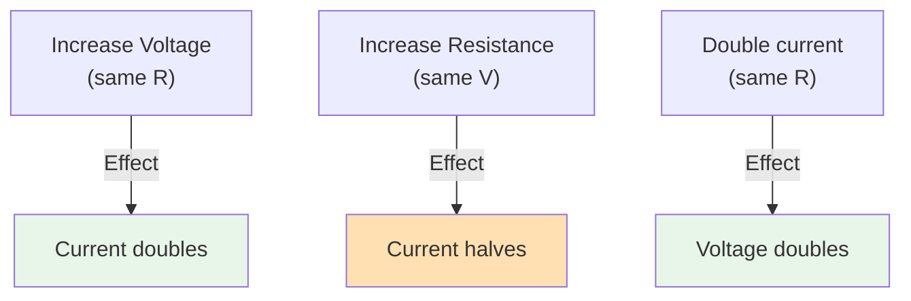

import { Callout } from 'fumadocs-ui/components/callout';
import { Tab, Tabs } from 'fumadocs-ui/components/tabs';

# Ohm's Law and Power Equations

Ohm's Law is the foundation of electrical engineering. Combined with power equations, it allows you to design and troubleshoot robotic electrical systems. Mastering these relationships is essential for any roboticist.

## Ohm's Law

### The Fundamental Equation

**Definition:** The current through a conductor is directly proportional to the voltage across it and inversely proportional to its resistance.

```
V = I × R
```

**Rearrangements:**

```
I = V / R    (Current = Voltage / Resistance)
R = V / I    (Resistance = Voltage / Current)
```

### The Ohm's Law Triangle

Visual memory aid:

```
      V
    -----
    I × R

Cover what you want to find:
- Cover V: V = I × R
- Cover I: I = V / R
- Cover R: R = V / I
```

### Understanding the Relationships



---

## Practical Applications of Ohm's Law

### Example 1: LED Protection Resistor

**Problem:** An LED needs 2V at 20mA. Power supply is 5V. What resistor is needed?

```
Voltage drop needed = 5V - 2V = 3V
Required current = 20 mA = 0.02 A

Using Ohm's Law:
R = V / I
R = 3V / 0.02A
R = 150 Ω

Use a standard 150Ω or 180Ω resistor.
```

### Example 2: Motor Current Calculation

**Problem:** 12V motor with 4Ω internal resistance. What current draws?

```
I = V / R
I = 12V / 4Ω
I = 3 A
```

### Example 3: Wire Gauge Selection

**Problem:** Motor requires 10A max at 12V. Wire is 5 meters long. What gauge?

```
Using copper wire resistance table:
16 AWG: 13 mΩ per 100m
= 13 mΩ × 50m / 100m = 6.5 mΩ total

Voltage drop:
V_drop = I × R = 10A × 0.0065Ω = 0.065V = 65 mV

Acceptable (< 5% of 12V = 600 mV) ✓
```

---

## Power Equations

### Basic Power Formula

```
P = V × I
```

Where:
- **P** = Power in Watts (W)
- **V** = Voltage in Volts (V)
- **I** = Current in Amperes (A)

### Power in Terms of Resistance

Substituting Ohm's Law into P = V × I:

```
P = I² × R    (when you know current)
P = V² / R    (when you know voltage)
```

### The Power Triangle

Like Ohm's Law, power has a triangle for quick calculations:

```
      P
    -----
    V × I

Also valid:
      P
    -----
    I² × R

      P
    -----
    V² / R
```

---

## Power in Different Scenarios

<Tabs items={['Motor Power', 'Resistive Load', 'Battery Power']}>
<Tab value="Motor Power">
### Power Consumed by Motors

**Simple calculation:**
```
P = V × I
```

**Example: 12V motor drawing 5A**
```
P = 12V × 5A = 60 W
```

**Important:** Motors don't waste all this power as heat. They convert it to:
- Mechanical work (~80-90% in good motors)
- Heat (~10-20%)

**Practical example: Robot arm motor**
- Input power: 24V × 2A = 48W
- Mechanical output: 48W × 0.85 efficiency = 40.8W
- Heat loss: 48W × 0.15 = 7.2W

</Tab>

<Tab value="Resistive Load">
### Power in Pure Resistance

Resistors convert all power to heat.

**Two useful forms:**

```
P = I² × R

Example: 5A through 10Ω resistor
P = 5² × 10 = 25 × 10 = 250W
(Don't try this without heavy cooling!)
```

```
P = V² / R

Example: 12V across 10Ω resistor
P = 12² / 10 = 144 / 10 = 14.4W
```

**Which formula to use:**
- Use I² × R if you know current
- Use V² / R if you know voltage
- Both give the same answer!

</Tab>

<Tab value="Battery Power">
### Energy from Batteries

**Capacity × Voltage = Total Energy**

```
E = Capacity × Voltage
E_Wh = Capacity_Ah × Voltage_V
```

**Example: 2000 mAh at 12V**
```
Capacity: 2000 mAh = 2 Ah
Energy: 2 Ah × 12V = 24 Wh
```

**Runtime calculation:**
```
Runtime (hours) = Total Energy / Average Power Consumption
Runtime = 24 Wh / 12W = 2 hours
```

</Tab>
</Tabs>

---

## Power Equations - Summary Table

| Know | Want | Formula |
|------|------|---------|
| V, I | P | P = V × I |
| I, R | P | P = I² × R |
| V, R | P | P = V² / R |
| V, P | I | I = P / V |
| P, I | V | V = P / I |
| P, R | I | I = √(P / R) |
| V, P | R | R = V² / P |
| I, P | R | R = P / I² |

---

## Practical Design Examples

### Example 1: LED Array Design

**Requirement:** 10 red LEDs (2V, 20mA each), powered by 12V battery

**Solution:**

Series connection (2V × 5 = 10V):
```
Groups: 5 LEDs in series
Voltage drop: 5 × 2V = 10V
Remaining: 12V - 10V = 2V
For 20mA: R = 2V / 0.02A = 100Ω

Can make 2 strings of 5 LEDs:
Each string: 12V - [5×2V] = 2V across 100Ω resistor
Current per string: 2V / 100Ω = 20mA
Total power: 12V × 40mA = 0.48W ✓ Reasonable
```

### Example 2: Motor Speed Control

**Requirement:** 12V motor, normally draws 5A. Want to reduce speed to 50%.

**Option 1: Voltage Reduction (PWM)**
```
50% PWM gives average voltage: 12V × 0.5 = 6V
Average current: 6V / R ≈ 2.5A (assuming resistance stays same)
Average power: 6V × 2.5A = 15W
```

**Option 2: Series Resistor (wasteful)**
```
Want 6V across motor (half power):
Need 6V drop across resistor
R = 6V / 5A = 1.2Ω

Power wasted in resistor: 5² × 1.2 = 30W
Power in motor: 30W
Efficiency: 50% (terrible!)
```

**Conclusion:** Use PWM (electronic control), not resistors!

### Example 3: Battery Selection

**Robot power budget:**
- Microcontroller: 100mA @ 5V = 0.5W
- Sensor modules: 200mA @ 5V = 1W
- 2 × Motors: 4A each @ 12V = 96W (total 48W for pair)
- Wireless module: 300mA @ 5V = 1.5W

**Total power (approximate):**
```
At 12V: 0.5W + 1W + 48W + 1.5W ≈ 50W average
Peak (short bursts): 70W

For 2-hour operation:
E = 50W × 2 hours = 100 Wh

Battery needed: 
100 Wh / 12V = 8.3 Ah

Choose: 12V 10Ah battery (provides margin)
```

---

## Power Efficiency

### Efficiency Definition

```
Efficiency = Output Power / Input Power
η = P_out / P_in

(Often expressed as percentage: η × 100%)
```

### Example: Motor Efficiency

**Motor draws 100W, outputs 85W mechanical power:**

```
Efficiency = 85W / 100W = 0.85 = 85%
Heat generated: 100W - 85W = 15W
```

### Efficiency in Power Chains

Each component adds loss. Total efficiency multiplies:

```
System efficiency = η_motor × η_gears × η_bearings × ...
```

**Example:**
```
Motor: 85%
Gearbox: 95%
Bearings: 98%

Total: 0.85 × 0.95 × 0.98 = 0.79 = 79%

100W input → 79W output
21W wasted as heat!
```

---

## Summary

**Key Equations:**

- ✓ **Ohm's Law:** V = I × R (three forms: I = V/R, R = V/I)
- ✓ **Power:** P = V × I = I²R = V²/R
- ✓ **Energy:** E = P × t
- ✓ **Efficiency:** η = P_out / P_in

**Practical Design Tips:**

1. Always calculate current draw before component selection
2. Use Ohm's Law to verify circuit assumptions
3. Choose appropriate wire gauge from current requirements
4. Use PWM for motor control (more efficient than resistors)
5. Account for efficiency losses in power chains
6. Include 20-30% power margin in battery selection