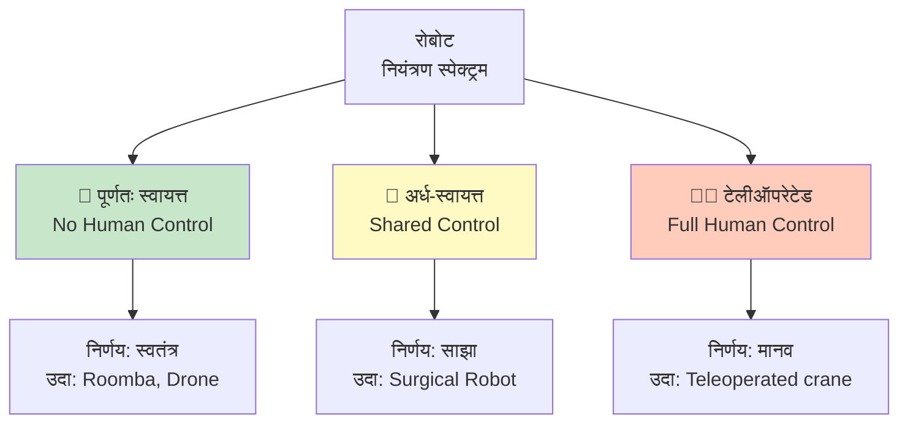
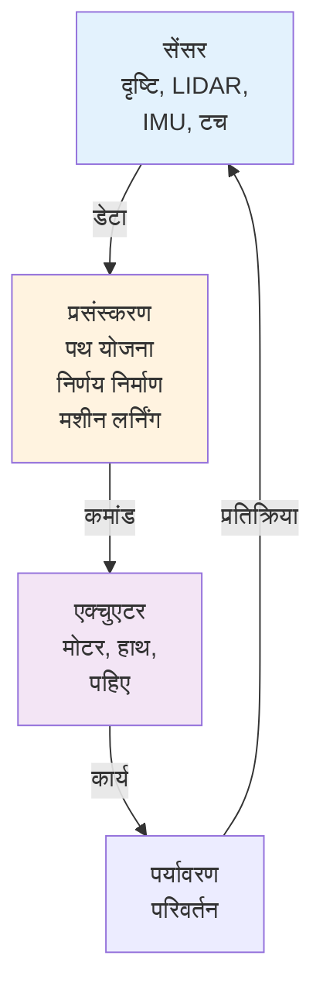
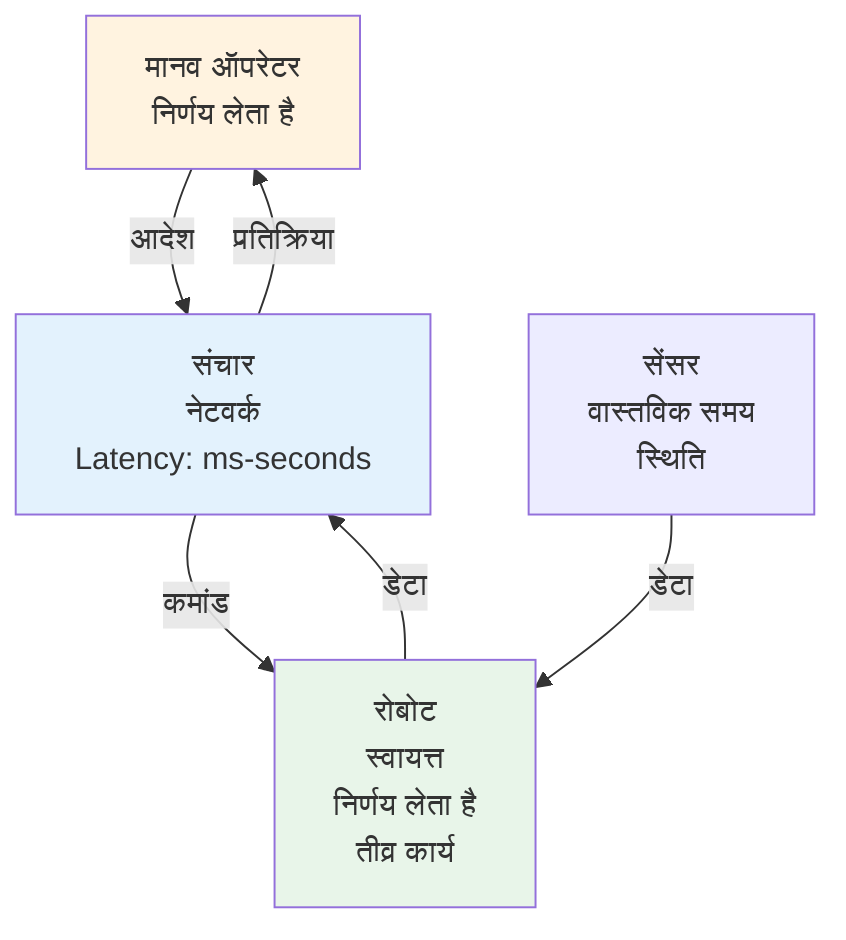
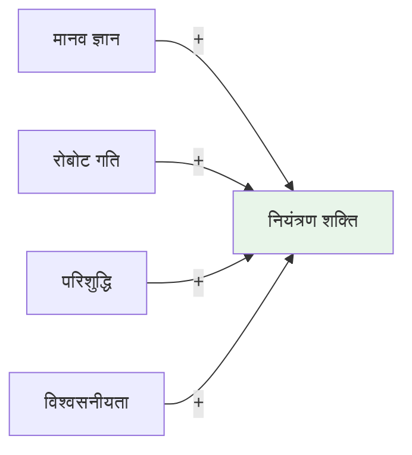
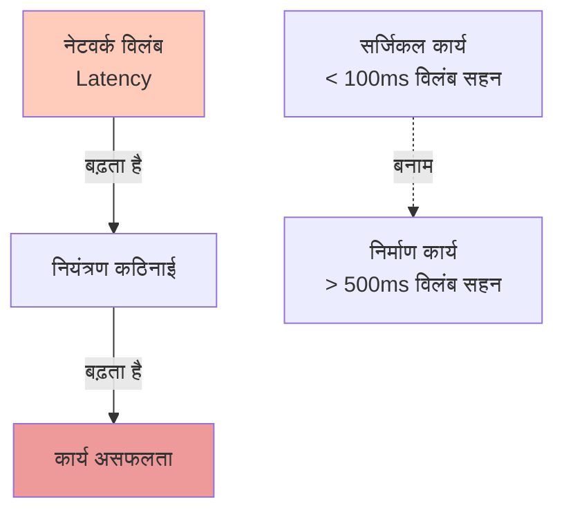
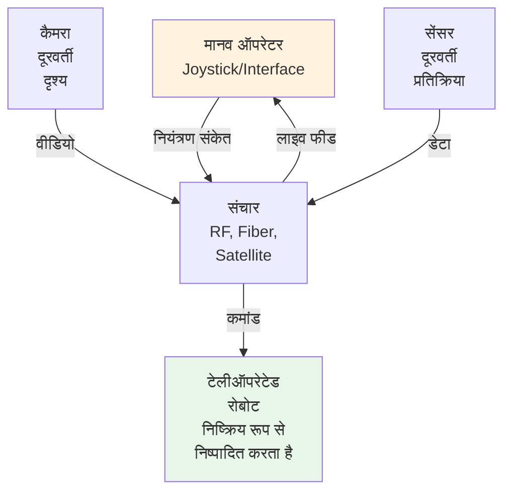
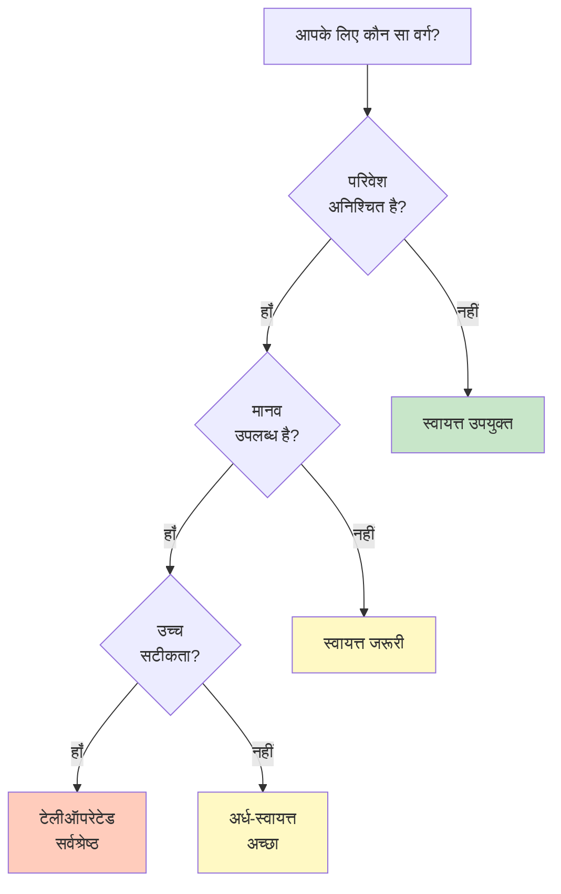

import { Callout } from 'fumadocs-ui/components/callout';
import { Tab, Tabs } from 'fumadocs-ui/components/tabs';

# रोबोट का वर्गीकरण

रोबोट को कई तरीकों से वर्गीकृत किया जा सकता है - उनके आकार, कार्य, या सबसे महत्वपूर्ण रूप से **मानव नियंत्रण की डिग्री** के आधार पर।

## तीन मुख्य वर्गीकरण



---

## 1. पूर्णतः स्वायत्त रोबोट

**परिभाषा:** मानव हस्तक्षेप के बिना पूर्ण रूप से स्वतंत्र रूप से काम करते हैं।

### विशेषताएं

**निर्णय निर्माण:**
- रोबोट सभी निर्णय लेता है
- पूर्वनिर्धारित निर्देशों का पालन करता है
- पर्यावरण का जवाब देता है

**आर्किटेक्चर:**



**उदाहरण:**

| रोबोट | विवरण |
|-------|--------|
| **iRobot Roomba** | स्वचालित वैक्यूम, पूरे कमरे को साफ करता है |
| **Autonomous Drones** | बिना पायलट के उड़ते हैं, कार्यक्रम अनुसार |
| **Self-driving Cars** | मानव चालक के बिना ड्राइव करते हैं |
| **Warehouse Robots** | गोदाम में माल स्वचालित रूप से छांटते हैं |

### लाभ

✅ मानव प्रयास न्यूनतम
✅ 24/7 ऑपरेशन संभव
✅ बड़े पैमाने पर तैनाती संभव
✅ अनुमानित लागत कम

### सीमाएं

❌ पूर्ण स्वतंत्रता असंभव (अभी भी मानव पर्यवेक्षण)
❌ अप्रत्याशित स्थितियों को संभालना कठिन
❌ विफलता का जोखिम अधिक
❌ जिम्मेदारी का सवाल

---

## 2. अर्ध-स्वायत्त रोबोट

**परिभाषा:** मानव और रोबोट साझा नियंत्रण साझा करते हैं, स्थिति के आधार पर स्विच करते हैं।

### विशेषताएं

**नियंत्रण मोड:**
- **स्वायत्त मोड:** ज्ञात कार्य में आंतरिक नियंत्रण
- **सहायक मोड:** कठिन निर्णयों के लिए मानव हस्तक्षेप
- **मैनुअल ओवरराइड:** आपातकाल में तुरंत नियंत्रण

### संचार आर्किटेक्चर



### उदाहरण

| प्रणाली | विवरण |
|--------|--------|
| **सर्जिकल रोबोट** | सर्जन का हाथ दिशा देता है, रोबोट स्थिरता प्रदान करता है |
| **टेलीऑपरेटेड ड्रोन** | पायलट दिशा देता है, ड्रोन स्वयं को संतुलित रखता है |
| **सहयोगी रोबोट** | मानव + रोबोट बग़ल में काम करते हैं |
| **संचालित वाहन** | ड्राइवर दिशा, गाड़ी स्वचालन सुरक्षा |

### नियंत्रण शक्ति का पहिया



### लाभ

✅ मानव विশेषज्ञता + रोबोट दक्षता
✅ अनिश्चितता को संभाल सकता है
✅ सुरक्षित (मानव नियंत्रण संभव)
✅ उच्च-मूल्य कार्यों के लिए उपयुक्त

### सीमाएं

❌ संचार विलंब समस्या हो सकता है
❌ अधिक जटिल प्रणाली
❌ प्रशिक्षित ऑपरेटर आवश्यक
❌ उच्च लागत

### विलंब के प्रभाव



---

## 3. टेलीऑपरेटेड रोबोट

**परिभाषा:** मानव ऑपरेटर सभी निर्णय लेता है, रोबोट केवल आदेश निष्पादित करता है।

### विशेषताएं

**नियंत्रण:**
- सभी निर्णय दूरवर्ती मानव द्वारा
- कम या कोई आंतरिक स्वायत्तता नहीं
- प्रत्यक्ष मानव-मशीन लिंक

### संचार आर्किटेक्चर



### उदाहरण

| प्रणाली | विवरण |
|--------|--------|
| **रिमोट कंट्रोल कार** | व्यक्ति जॉयस्टिक नियंत्रित करता है |
| **शल्य चिकित्सा के तहत क्रेन** | नीचे रोबोट, ऊपर ऑपरेटर देखता है |
| **पनडुब्बी ड्रोन** | समुद्र की गहराई में जांच, सतह से संचालित |
| **विस्फोटक निपटान** | EOD रोबोट, दूर से विस्फोटक हटाता है |
| **अंतरिक्ष रोबोट** | चंद्रमा/मंगल रोबोट, पृथ्वी से नियंत्रित |

### संचार तरीके

**लाइव संचार:**
- RF (रेडियो आवृत्ति): 100m तक
- Fiber Optic: केबल द्वारा सीमित
- Wireless 5G: उच्च गति, कम विलंब

**विलंबित संचार:**
- सैटेलाइट: मंगल, चंद्रमा (मिनट का विलंब!)
- समुद्र अन्वेषण: ऑप्टिकल फाइबर केबल

**विलंब समस्या:**

```
अंतरिक्ष दूरी:
- Earth to Moon: 1.3 light-seconds → 2.6s round-trip
- Earth to Mars: 3-22 light-minutes → 6-44 मिनट round-trip

परिणाम: रोबोट को वास्तविक समय नियंत्रण नहीं मिल सकता
समाधान: रोबोट स्वायत्त निर्णय लेता है (अर्ध-स्वायत्त बन जाता है)
```

### लाभ

✅ पूर्ण मानव नियंत्रण
✅ कोई अप्रत्याशित कार्य नहीं
✅ उच्च जिम्मेदारी स्पष्ट है
✅ कम रोबोट बुद्धिमत्ता आवश्यक

### सीमाएं

❌ मानव निरंतर निगरानी आवश्यक
❌ विलंब समस्या अंतरिक्ष/गहराई में
❌ बड़े पैमाने पर तैनाती असंभव
❌ उच्च मानव प्रयास

---

## तुलनात्मक विश्लेषण

| विशेषता | स्वायत्त | अर्ध-स्वायत्त | टेलीऑपरेटेड |
|---------|----------|-------------|------------|
| **मानव प्रयास** | न्यूनतम | मध्यम | अधिकतम |
| **लागत** | उच्च (AI) | बहुत अधिक | मध्यम |
| **विश्वसनीयता** | मध्यम | अधिक | अधिकतम |
| **जटिलता** | अधिक (सॉफ्टवेयर) | अधिक | कम |
| **मापनीयता** | उत्कृष्ट | अच्छा | कठिन |
| **अनिश्चितता** | कमजोर | अच्छा | उत्कृष्ट |
| **सुरक्षा** | जोखिम | अच्छा | उत्कृष्ट |
| **संभावनाएं** | सीमित | व्यापक | असीम |

---

## निर्णय: कौन सा चुनें?



### अनुप्रयोग के उदाहरण

**स्वायत्त सर्वश्रेष्ठ:**
- घरेलू सफाई (Roomba)
- स्वचालित डिलीवरी ड्रोन
- गोदाम स्वचालन
- 24/7 निगरानी

**अर्ध-स्वायत्त सर्वश्रेष्ठ:**
- सर्जिकल सहायता
- औद्योगिक सहयोगी
- स्वायत्त कार (वास्तविकता में यह!)
- जटिल माइनिंग

**टेलीऑपरेटेड सर्वश्रेष्ठ:**
- विस्फोटक निपटान
- समुद्र अन्वेषण
- खोज और बचाव
- अंतरिक्ष जांच
- खतरनाक वातावरण

---

## भविष्य का रुझान

**अगले दशक में:**
1. अर्ध-स्वायत्त सबसे आम होगा
2. अर्ध-स्वायत्त → अधिक स्वायत्त प्रवास
3. संचार विलंब कम होगा (5G+)
4. मानव-रोबोट सहजीवन मानदंड बनेगा

<Callout type="success" title="भविष्य की संरचना">
आदर्श रोबोट भविष्य में अपनी क्षमताएं स्विच कर सकेगा:
- कार्य की जटिलता = अधिक स्वायत्ता
- कार्य का जोखिम = अधिक मानव नियंत्रण
- समय की गंभीरता = तेजी से स्वायत्त

यह अनुकूली नियंत्रण भविष्य है।
</Callout>

---

**आगे की पढ़ाई:**
- "सेंसर्स एंड सेंसर सिस्टम्स फॉर ऑटोनोमस रोबोट्स"
- "टेलीऑपरेशन एंड टेलीप्रेजेंस प्रिंसिपल्स"
- "कोलाबोरेटिव रोबोटिक्स इन इंडस्ट्री 4.0"