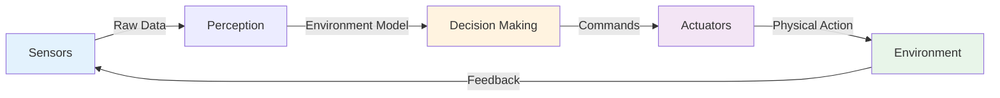
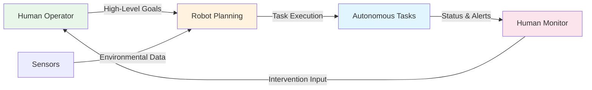
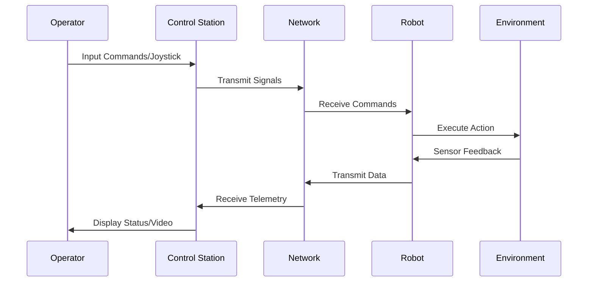

import { Callout } from 'fumadocs-ui/components/callout';
import { Tab, Tabs } from 'fumadocs-ui/components/tabs';
import { Accordion, Accordions } from 'fumadocs-ui/components/accordion';

# Classification of Robots

Robots can be classified based on their level of autonomy and the degree of human involvement required in their operation. This classification helps understand capabilities, limitations, and appropriate applications for different robotic systems.

## Three Main Classifications

<Tabs items={['Autonomous', 'Semi-Autonomous', 'Teleoperated']}>
<Tab value="Autonomous">
## Autonomous Robots

Autonomous robots operate independently without direct human control, making decisions based on sensor data and pre-programmed algorithms or learned behaviors.

### Defining Characteristics

- **Complete independence** from human operators in execution
- **Real-time decision making** using AI and machine learning algorithms
- **Advanced sensor fusion** combining multiple sensor inputs
- **Perception systems** that understand and model the environment
- **Adaptive behavior** that changes based on environmental conditions
- **Self-correction** and error recovery capabilities

### System Architecture

### Real-World Examples

**Transportation:**
- Self-driving cars (Waymo, Tesla Autopilot, Cruise)
- Autonomous drones for delivery
- Self-piloted aircraft and helicopters
- Autonomous ships for cargo transport

**Industrial:**
- Warehouse robots (Amazon Robotics, Kiva Systems)
- Autonomous mobile manipulators
- Factory floor navigation robots

**Consumer:**
- Robotic vacuum cleaners (Roomba, Neato)
- Lawn mowing robots
- Pool cleaning robots
- Window cleaning robots

**Exploration:**
- Mars rovers (Perseverance, Curiosity, Ingenuity)
- Deep-sea exploration vehicles (AUVs)
- Volcanic monitoring robots
- Archaeological exploration drones

**Service:**
- Hotel delivery robots
- Hospital transport robots
- Security patrol robots
- Disinfection robots (COVID-19 era)

### Advantages of Autonomous Robots

<Callout type="success" title="Key Advantages">
✅ **No human operator required** - reduces labor costs and fatigue
✅ **Fast response times** - millisecond-level decision making
✅ **24/7 operation capability** - no shift changes or rest periods
✅ **Consistent performance** - repeatability and reliability
✅ **Work in hazardous environments** - radiation, extreme temperatures
✅ **Scalability** - can deploy multiple units simultaneously
</Callout>

### Limitations and Challenges

<Callout type="warn" title="Key Limitations">
❌ **Limited to pre-programmed scenarios** - struggles with novel situations
❌ **Difficulty handling edge cases** - unexpected environmental conditions
❌ **Safety concerns** - operating in unpredictable human environments
❌ **High initial development cost** - extensive testing and validation required
❌ **Liability issues** - responsibility for autonomous actions unclear
❌ **Public acceptance** - concerns about job displacement and AI control
</Callout>

### Autonomy Levels

The Society of Automotive Engineers defines 5 levels of autonomy:

| Level | Name | Description | Control |
|-------|------|-------------|---------|
| 0 | No Automation | Human performs all driving | Human |
| 1 | Driver Assistance | System helps with steering or acceleration | Human + System |
| 2 | Partial Automation | System controls steering and acceleration | Human + System |
| 3 | Conditional Automation | System can manage most driving, human ready to intervene | System |
| 4 | High Automation | System drives in most conditions, no human intervention | System |
| 5 | Full Automation | System drives in all conditions | System |
</Tab>

<Tab value="Semi-Autonomous">
## Semi-Autonomous Robots

Semi-autonomous robots blend automated functions with human supervision and intervention capabilities, creating a shared control model where human judgment and machine efficiency combine.

### Defining Characteristics

- **Perform routine tasks automatically** without human input
- **Request human input** for complex or ambiguous decisions
- **Safety systems** that allow immediate human override
- **Shared control** between human and machine
- **Human-in-the-loop** operation model
- **Adaptive to human guidance** and feedback

### Control Architecture

### Real-World Examples

**Collaborative Manufacturing:**
- Cobots working alongside humans on assembly lines
- Shared workspace robots with force-limiting technology
- Pick-and-place assistance systems
- Quality inspection with human verification

**Medical & Surgical:**
- da Vinci Surgical System with surgeon control
- Robotic rehabilitation systems (patient-guided)
- Diagnostic assistance robots
- Physical therapy robots

**Military & Law Enforcement:**
- Military drones with human oversight (not fire-and-forget)
- Bomb disposal robots with remote operators
- Search and rescue robots with handler control
- Surveillance drones with human monitoring

**Transportation:**
- Advanced Driver Assistance Systems (ADAS)
- Lane keeping and adaptive cruise control
- Warehouse forklifts with autonomous navigation
- Semi-autonomous parking systems

**Service & Hospitality:**
- Room delivery robots that stop for human assistance
- Guide robots in museums requiring human intervention
- Reception robots with human backup
- Elderly care robots with caregiver interaction

### Advantages of Semi-Autonomous Systems

<Callout type="success" title="Key Advantages">
✅ **Combines human judgment with automation** - best of both worlds
✅ **Safer in unpredictable environments** - human ready to intervene
✅ **Flexible problem-solving** - humans handle novel situations
✅ **Shared workload** - reduces human fatigue and errors
✅ **Better user acceptance** - humans maintain control perception
✅ **Faster task completion** - automation handles routine parts
</Callout>

### Limitations and Challenges

<Callout type="warn" title="Key Limitations">
❌ **Requires trained operators** - expertise and attention needed
❌ **Response time slower** than fully autonomous systems
❌ **Dependency on human availability** - cannot operate continuously unattended
❌ **Communication latency** - problematic for remote operation
❌ **Operator workload** - can become cognitively demanding
❌ **Reduced efficiency** - slower than pure automation
</Callout>

### Level of Autonomy Control Spectrum

### Application: Cobots (Collaborative Robots)

Cobots represent the most common semi-autonomous systems in modern industry:

**Key Features:**
- Force-limiting technology for safety
- Power and force limiting (25N force limit)
- Speed limiting in shared workspaces
- Intuitive programming by demonstration
- Easy integration with human workflows

**Safety Standards:**
- ISO/TS 15066 for collaborative robots
- Compliant control and passive compliance
- Redundant safety systems
- Real-time monitoring and feedback
</Tab>

<Tab value="Teleoperated">
## Teleoperated Robots

Teleoperated robots are directly controlled by human operators, often from a distance, functioning as remote extensions of human capability and presence.

### Defining Characteristics

- **Direct human control** in real-time via control interface
- **Operated from a distance** - local or geographically remote
- **Minimal autonomous decision-making** capability
- **High precision** for specialized, complex tasks
- **Master-slave control architecture**
- **Real-time feedback** from remote location to operator
- **Extension of human capabilities** to dangerous or inaccessible environments

### Communication Architecture

### Real-World Examples

**Military & Law Enforcement:**
- Bomb disposal robots (PackBot, REMOTEC)
- Military reconnaissance drones with pilot control
- Search and rescue robots in disaster zones
- SWAT team deployment robots
- Mine clearance robots

**Exploration:**
- Deep-sea ROVs (Remotely Operated Vehicles) for oceanography
- Mars rovers (early models)
- Nuclear facility inspection robots
- Underwater pipeline inspection
- Cave and confined space exploration

**Medical & Hazmat:**
- Surgical robots in remote locations (telesurgery)
- Nuclear plant inspection and maintenance
- Chemical hazard assessment robots
- Biological threat investigation
- Industrial accident response

**Industrial & Maintenance:**
- Crane operation (remote control)
- Heavy equipment operation
- High-voltage power line maintenance
- Underwater cable repair
- Gutter and roof cleaning

**Space:**
- International Space Station robotic arms
- Satellite servicing robots
- Lunar exploration rovers (future)
- Deep space probe deployment

### Advantages of Teleoperated Systems

<Callout type="success" title="Key Advantages">
✅ **Maximum precision and control** - operator expertise applied directly
✅ **Handles unexpected situations** - human flexibility and judgment
✅ **Can apply human expertise** - surgeons, specialists operate systems
✅ **Immediate response** - operator reacts to environmental changes
✅ **Proven safety** - clear accountability and control
✅ **Flexible task changes** - adapt to new requirements quickly
</Callout>

### Limitations and Challenges

<Callout type="warn" title="Key Limitations">
❌ **Requires constant operator attention** - cannot operate unattended
❌ **Network latency affects performance** - distance causes delays
❌ **High operational cost** - trained personnel required continuously
❌ **Limited by communication bandwidth** - restricted data transmission
❌ **Operator fatigue** - mental and physical exhaustion in long operations
❌ **Scalability issues** - one operator per robot typically
❌ **Lost time opportunities** - human reaction time limitations
</Callout>

### Latency Impact on Teleoperation

A critical factor in remote operation is communication delay:

**Mars Rover Challenge:**
- Distance: 140-225 million miles
- Signal delay: 3-22 minutes one-way
- Solution: Autonomous operation with human oversight
- Operators must pre-plan sequences rather than real-time control

**Underwater ROV:**
- Depth: Up to 6000 meters
- Communication: Fiber-optic tether (real-time)
- Advantage: Instant feedback to operator
- Disadvantage: Limited mobility due to tether

**Drone Operation:**
- Distance: Up to 50+ miles (FPV racing)
- Latency: Milliseconds
- Solution: High-speed wireless or line-of-sight
- Allows fast, responsive control

### Teleopresence Factor

Modern teleoperated systems emphasize "teleopresence" - making the operator feel physically present:

**Technologies:**
- Immersive VR headsets for operator
- Multi-camera systems for 360° view
- Force feedback (haptic feedback) systems
- 3D spatial audio
- Real-time sensor data visualization
</Tab>
</Tabs>

<Callout type="info" title="Boundary Blurring">
Modern robots often incorporate elements from all three classifications, switching between modes based on task requirements and context. For example:
- A surgical robot might operate semi-autonomously for routine positioning but allow teleoperation for critical incisions
- An autonomous vehicle might require teleoperated intervention in edge cases
- A warehouse robot might operate autonomously but accept human route adjustments
</Callout>

## Comparison Matrix

| Aspect | Autonomous | Semi-Autonomous | Teleoperated |
|--------|-----------|-----------------|-------------|
| **Human Control** | Minimal | Moderate | Complete |
| **Decision Making** | Automated | Shared | Human |
| **Response Time** | Fast (ms) | Medium (s) | Operator Dependent |
| **Cost** | High (dev), Low (ops) | Medium | High (continuous ops) |
| **Flexibility** | Limited | Good | Excellent |
| **Safety** | Algorithmic | Layered | Operator Responsibility |
| **Latency Tolerance** | Low impact | Moderate impact | Critical factor |
| **Failure Mode** | Fallback to safe state | Human intervention | Loss of control |

## Selection Guide

**Choose Autonomous When:**
- Tasks are well-defined and repetitive
- Environment is predictable
- Cost of development amortized over many units
- 24/7 operation is required
- Human safety is paramount

**Choose Semi-Autonomous When:**
- Human judgment needed for some decisions
- Working in shared human environments
- Complex variable tasks
- User acceptance is important
- Cost balance needed

**Choose Teleoperated When:**
- Maximum precision required
- Unpredictable situations likely
- Expert human control needed
- Specialized knowledge applied
- One-off or rare tasks

---

**Further Reading:**
- "Autonomous Robots: From Biological Inspiration to Implementation and Control" by Pugh et al.
- ISO/IEC 22989 - Robots and robotic devices - Information model for service robots
- SAE J3016: Levels of Driving Automation