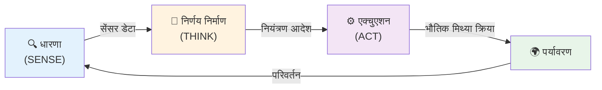
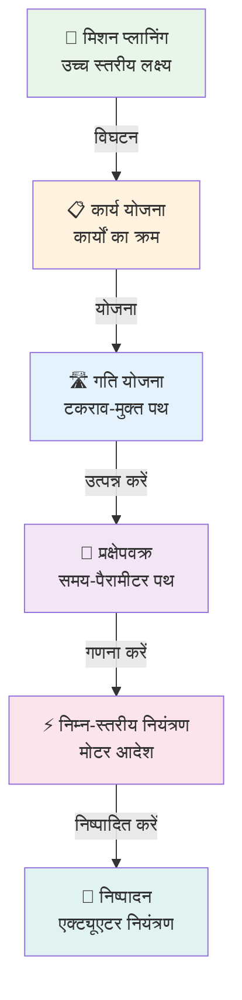
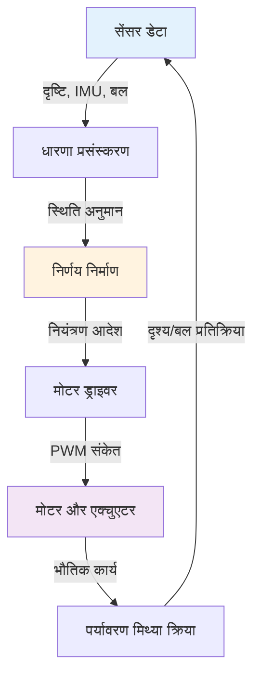

import { Callout } from 'fumadocs-ui/components/callout';
import { Step, Steps } from 'fumadocs-ui/components/steps';
import { Tab, Tabs } from 'fumadocs-ui/components/tabs';

# रोबोटिक्स में मुख्य अवधारणाएं

हर रोबोटिक सिस्टम, चाहे वह किसी भी प्रकार या डोमेन का हो, तीन मौलिक अवधारणाओं पर निर्भर करता है जो एक सतत चक्र में एक साथ काम करती हैं: धारणा (Perception), निर्णय-निर्माण (Decision-Making), और एक्चुएशन (Actuation)।

## सेंस-थिंक-एक्ट प्रतिमान



यह बंद लूप चक्र रोबोट को अनुमति देता है:
- अपनी दुनिया को समझना
- बुद्धिमान निर्णय लेना
- सार्थक कार्य करना
- परिणामों से सीखना
- परिवर्तन के अनुकूल होना

---

## 1. धारणा (सेंसिंग)

धारणा रोबोट की सेंसर और प्रसंस्करण प्रणाली के माध्यम से अपने पर्यावरण और आंतरिक स्थिति के बारे में जानकारी एकत्र करने की क्षमता है।

### सेंसर श्रेणियां

<Tabs items={['प्रोप्रियोसेप्टिव', 'एक्सटेरोसेप्टिव', 'सक्रिय बनाम निष्क्रिय']}>
<Tab value="प्रोप्रियोसेप्टिव">
### प्रोप्रियोसेप्टिव सेंसर

ये सेंसर रोबोट की आंतरिक स्थिति और स्थिति की निगरानी करते हैं।

**एन्कोडर:**
- जोड़ कोण और स्थिति मापते हैं
- रोटरी: रोटेशन राशि और दिशा ट्रैक करते हैं
- रैखिक: रैखिक विस्थापन मापते हैं
- संकल्प: 0.01° से माइक्रोमीटर स्तर
- अनुप्रयोग: सभी रोबोटिक बाहु, पहिएदार रोबोट

**जड़त्व माप इकाइयां (IMU):**
- त्वरणमापी: त्वरण मापते हैं (आमतौर पर 3-अक्ष)
- जाइरोस्कोप: घूर्णी वेग मापते हैं
- चुंबकत्वमापी: चुंबकीय क्षेत्र मापते हैं (कम्पास)
- संयुक्त IMU: 9-अक्ष प्रणाली (3 एक्सल + 3 जाइरो + 3 मैग)
- अनुप्रयोग: ह्यूमनॉइड रोबोट, ड्रोन, मोबाइल रोबोट

**बल/टॉर्क सेंसर:**
- बल और मुहूर्त मापते हैं
- 6-अक्ष प्रणाली: सभी बल और मुहूर्त
- सटीकता: 0.01N से उच्च सटीकता
- अनुप्रयोग: हेरफेर, असेंबली, हैप्टिक प्रतिक्रिया

**अन्य प्रोप्रियोसेप्टिव:**
- मोटर करंट सेंसर (टॉर्क संकेत)
- तापमान सेंसर
- दबाव सेंसर
- कंपन सेंसर
</Tab>

<Tab value="एक्सटेरोसेप्टिव">
### एक्सटेरोसेप्टिव सेंसर

ये सेंसर बाहरी पर्यावरण को मापते हैं।

**दृष्टि प्रणाली:**
- **RGB कैमरे:** मानक रंग इमेजिंग
- **गहराई कैमरे:** वस्तुओं के लिए दूरी मापते हैं (ToF, संरचित प्रकाश, स्टीरियो)
- **थर्मल कैमरे:** अवरक्त इमेजिंग
- **हाइपरस्पेक्ट्रल:** सामग्री पहचान के लिए कई तरंग दैर्ध्य
- **औद्योगिक कैमरे:** 30 MP से 8K संकल्प

**रेंज फाइंडर:**
- **LiDAR:** 3D मानचित्रण के लिए लेजर स्कैनिंग
  - 2D: एकल समतल स्कैनिंग
  - 3D: बहु-परत पॉइंट क्लाउड (16, 32, 64+ चैनल)
  - रेंज: 10-200+ मीटर
  - संकल्प: दूरी पर 1-10cm
- **अल्ट्रासोनिक:** ध्वनि-आधारित दूरी माप
  - रेंज: 2cm से 4+ मीटर
  - लागत: बहुत सस्ता
  - अनुप्रयोग: निकटता पहचान
- **अवरक्त निकटता:** LED-आधारित दूरी
  - छोटी रेंज (30cm विशिष्ट)
  - तेज प्रतिक्रिया
  - टकराव से बचाव के लिए अच्छा

**स्पर्श सेंसर:**
- दबाव सरणी: संपर्क पैटर्न का पता लगाते हैं
- बल-संवेदन त्वचा: वितरित दबाव
- स्लिप सेंसर: वस्तु आंदोलन का पता लगाते हैं
- तापमान: संपर्क तापमान माप
- अनुप्रयोग: पकड़ना, हेरफेर, असेंबली

**ऑडियो सेंसर:**
- माइक्रोफोन सरणी: दिशात्मक ध्वनि
- ध्वनिक पहचान: ध्वनि घटना मान्यता
- भाषण मान्यता: आवाज आदेश
- अनुप्रयोग: मानव बातचीत, ऑडियो-आधारित पहचान
</Tab>

<Tab value="सक्रिय बनाम निष्क्रिय">
### सक्रिय बनाम निष्क्रिय सेंसिंग

**सक्रिय सेंसर:**
- **पर्यावरण में ऊर्जा उत्सर्जित करते हैं**
- **प्रतिक्रिया को मापते हैं** वस्तुओं का पता लगाने के लिए
- उदाहरण:
  - LiDAR (लेजर प्रकाश)
  - संरचित प्रकाश (पैटर्न प्रक्षेपण)
  - सोनार (ध्वनि तरंगें)
  - रडार (रेडियो तरंगें)
- लाभ: अंधकार में काम करता है, अच्छी तरह से परिभाषित माप
- नुकसान: अन्य सेंसर के साथ हस्तक्षेप कर सकता है, शक्ति की आवश्यकता

**निष्क्रिय सेंसर:**
- **परिवेश ऊर्जा का पता लगाते हैं** (प्रकाश, गर्मी, ध्वनि)
- **कोई उत्सर्जन** आवश्यक नहीं
- उदाहरण:
  - RGB कैमरे
  - थर्मल कैमरे
  - माइक्रोफोन
- लाभ: कम शक्ति, कोई हस्तक्षेप नहीं, प्राकृतिक
- नुकसान: प्रकाश पर निर्भर, कम सटीक रेंज

</Tab>
</Tabs>

### सेंसर फ्यूजन

<Callout type="success" title="सेंसर फ्यूजन लाभ">
कई सेंसरों को संयोजित करने से किसी भी एक सेंसर से अधिक मजबूत धारणा बनती है:
- **सटीकता:** कई मापों का औसत
- **अनावश्यकता:** यदि एक सेंसर विफल हो तो जारी रहें
- **पूरक जानकारी:** विभिन्न सेंसर विभिन्न गुण मापते हैं
- **शोर में कमी:** सांख्यिकीय औसत
- **कम्प्यूटेशनल दक्षता:** तेजी से, सस्ते सेंसर को एक साथ उपयोग करें
</Callout>

**फ्यूजन तकनीकें:**
- कलमन फिल्टर: रैखिक सिस्टम के लिए इष्टतम अनुमान
- विस्तारित कलमन फिल्टर (EKF): गैर-रैखिक सिस्टम
- कण फिल्टर: बहु-परिकल्पना ट्रैकिंग
- कारक रेखांकन: जटिल संभाव्य मॉडल
- गहन शिक्षा: बहु-सेंसर डेटा से अंत-से-अंत सीखना

### उदाहरण: रोबोट स्थानीयकरण

एक मोबाइल रोबोट निम्नलिखित से डेटा फ्यूज कर सकता है:
- **व्हील ओडोमेट्री** (तेज लेकिन बहती है)
- **LiDAR** (सटीक लेकिन गणनात्मक रूप से महंगा)
- **GPS** (वैश्विक संदर्भ लेकिन शोर)
- **IMU** (उच्च आवृत्ति लेकिन बहती है)
- **दृश्य ओडोमेट्री** (मजबूत लेकिन प्रोसेसर गहन)

परिणाम: सटीक, निरंतर स्थिति अनुमान

---

## 2. निर्णय-निर्माण (थिंकिंग)

निर्णय-निर्माण संवेदी जानकारी को कार्रवाई योग्य आदेशों में परिवर्तित करता है एल्गोरिदम, शिक्षा और तर्क के माध्यम से।

### निर्णय-निर्माण पदानुक्रम स्तर



### निर्णय-निर्माण घटक

<Tabs items={['योजना', 'नियंत्रण', 'शिक्षा', 'तर्क']}>
<Tab value="योजना">
### पथ और गति योजना

**पथ योजना:**
- प्रारंभ से लक्ष्य तक टकराव-मुक्त मार्ग खोजें
- एल्गोरिदम:
  - A* खोज: ग्रिड विश्व के लिए इष्टतम
  - तेजी से खोजपूर्ण यादृच्छिक पेड़ (RRT): उच्च-आयामी रिक्त स्थान के लिए
  - डिजकस्ट्रा एल्गोरिदम: सबसे छोटा पथ
  - संभावित क्षेत्र: ढ़ाल-आधारित दृष्टिकोण
  - संभाव्य रोडमैप (PRM): पूर्व-गणित ग्राफ

**गति योजना:**
- चिकनी प्रक्षेपवक्र उत्पन्न करें
- गतिशीलता और बाधाओं पर विचार करें
- कई जोड़/एक्चुएटर को समन्वयित करें
- समय अनुकूलन
- तरीके:
  - प्रक्षेपवक्र इंटरपोलेशन
  - इष्टतम नियंत्रण सिद्धांत
  - स्पलाइन-आधारित वक्र
  - न्यूनतम ऊर्जा पथ

**उदाहरण:**
एक 6-अक्ष रोबोट बिंदु A से B तक पहुंचना:
1. व्युत्क्रम गतिकी: जोड़ कोण की गणना करें
2. टकराव जांच: सत्यापित करें कोई बाधा नहीं
3. प्रक्षेपवक्र योजना: चिकनी जोड़-स्थान पथ
4. समय पैरामीटरकरण: समय जानकारी जोड़ें
5. निष्पादन: मोटर को आदेश भेजें
</Tab>

<Tab value="नियंत्रण">
### नियंत्रण प्रणाली

**प्रतिक्रिया नियंत्रण:**
- वास्तविक प्रदर्शन की निगरानी करें
- वांछित प्रदर्शन से तुलना करें
- त्रुटि के आधार पर कार्यों को समायोजित करें
- क्लासिक: PID (आनुपातिक-अभिन्न-व्युत्पन्न)

**नियंत्रण लूप उदाहरण:**
```
लक्ष्य: स्थिति बाहु को X समन्वय = 50 सेमी पर रखें
वर्तमान: X = 45 सेमी (त्रुटि = 5 सेमी)
कार्य: मोटर को आगे बढ़ाएं
माप: नया X = 49 सेमी (त्रुटि = 1 सेमी)
कार्य: मोटर गति को सूक्ष्मता से नियंत्रित करें
तब तक: त्रुटि शून्य तक पहुंचे
```

**नियंत्रण के प्रकार:**
- **स्थिति नियंत्रण:** विशिष्ट स्थान तक पहुंचें
- **वेग नियंत्रण:** गति बनाए रखें
- **बल नियंत्रण:** विशिष्ट बल लागू करें
- **प्रतिबाधा नियंत्रण:** वसंत जैसा व्यवहार
- **हाइब्रिड नियंत्रण:** मोड के बीच स्विच करें

**उन्नत नियंत्रण:**
- मॉडल भविष्य सूचक नियंत्रण (MPC): आगे देखें
- अनुकूली नियंत्रण: परिवर्तन करने की स्थितियों के लिए समायोजित करें
- मजबूत नियंत्रण: अनिश्चितता को संभालें
- इष्टतम नियंत्रण: लागत फ़ंक्शन को कम करें
</Tab>

<Tab value="शिक्षा">
### मशीन लर्निंग और अनुकूलन

**निरीक्षित शिक्षा:**
- लेबल के साथ उदाहरणों से प्रशिक्षण दें
- मानव प्रदर्शन से सीखें
- छवि वर्गीकरण: वस्तु पहचान
- भाषण मान्यता: आवाज आदेश

**सुदृढ़ीकरण सीखना:**
- परीक्षण और त्रुटि से सीखें
- अच्छी कार्रवाई के लिए पुरस्कार
- नीति अनुकूलन
- AlphaGo, रोबोट हेरफेर सीखना

**अनुपर्यवेक्षित शिक्षा:**
- डेटा में पैटर्न खोजें
- समान स्थितियां क्लस्टर करें
- विशेषता निष्कर्षण
- विसंगति पहचान

**स्थानांतरण शिक्षा:**
- एक कार्य से दूसरे के लिए ज्ञान का उपयोग करें
- पूर्व-प्रशिक्षित मॉडल (ImageNet, GPT)
- डोमेन अनुकूलन
- नमूना-कुशल शिक्षा

**गहन शिक्षा:**
- जटिल पैटर्न के लिए तंत्रिका नेटवर्क
- दृष्टि के लिए CNN
- क्रम के लिए RNN
- बड़े पैमाने पर सीखने के लिए ट्रांसफॉर्मर
</Tab>

<Tab value="तर्क">
### तर्क और ज्ञान

**प्रतीकात्मक तर्क:**
- तर्क और नियम
- यदि-तब कथन
- ज्ञान रेखांकन
- ऑन्टोलॉजी

**सामान्य तर्क प्रकार:**
- **निगमनात्मक:** सामान्य नियम → विशिष्ट मामला
- **आगमनात्मक:** विशिष्ट मामले → सामान्य नियम
- **अपहरण:** प्रेक्षण → सबसे संभावित व्याख्या
- **सादृश्य:** समान स्थिति → ज्ञात समाधान लागू करें

**अनिश्चितता हैंडलिंग:**
- संभाव्य तर्क
- बेयेसियन नेटवर्क
- मार्कोव निर्णय प्रक्रियाएं
- फजी लॉजिक

**उदाहरण:**
वस्तु पकड़ने के लिए रोबोट तर्क:
1. अवलोकन करें: लाल, बेलनाकार वस्तु
2. याद करें: सिलेंडर समानांतर पकड़ के साथ सर्वश्रेष्ठ पकड़े जाते हैं
3. योजना: समानांतर पकड़ के साथ शीर्ष से दृष्टिकोण
4. निष्पादित करें: पकड़ को कम करें और पकड़ें
5. सीखें: सफल पकड़ पैटर्न सहेजें
</Tab>
</Tabs>

### निर्णय-निर्माण आर्किटेक्चर

**प्रतिक्रियाशील सिस्टम:**
- सीधी उत्तेजना-प्रतिक्रिया
- तेज प्रतिक्रिया समय
- सीमित योजना
- उपयुक्त: कम-स्तरीय नियंत्रण, प्रतिवर्ती कार्य

**विवेचनात्मक सिस्टम:**
- कार्य से पहले योजना बनाएं
- भविष्य के परिणामों पर विचार करें
- धीमा लेकिन अधिक बुद्धिमान
- उपयुक्त: रणनीतिक कार्य, जटिल समस्याएं

**संकर आर्किटेक्चर:**
- प्रतिक्रियाशील और विवेचनात्मक को संयोजित करें
- तेज प्रतिवर्त रणनीतिक योजना के साथ
- अधिकांश वास्तविक दुनिया के रोबोट
- उदाहरण: स्वायत्त वाहन (प्रतिक्रियाशील बाधा परिहार + विवेचनात्मक मार्ग योजना)

---

## 3. एक्चुएशन (अभिनय)

एक्चुएशन मोटर, एक्चुएटर और अंत-प्रभावकारी के माध्यम से नियंत्रण आदेशों को भौतिक गति और बल में रूपांतरण है।

### एक्चुएटर प्रकार और सिद्धांत

<Steps>
<Step>
### विद्युत एक्चुएटर

सटीकता और नियंत्रण के कारण रोबोटिक्स में सबसे आम।

**DC मोटर:**
- सरल नियंत्रण (वोल्टेज → गति)
- ब्रश डिजाइन (विद्युत संपर्क)
- ब्रशलेस डिजाइन (अधिक कुशल, इलेक्ट्रॉनिक कम्यूटेशन)
- अनुप्रयोग: पहिए, सरल जोड़, ड्रिल
- नियंत्रण: PWM (पल्स चौड़ाई मॉड्यूलेशन)

**स्टेपर मोटर:**
- सटीक स्थिति (ज्ञात कदम कोण)
- कोई प्रतिक्रिया आवश्यक नहीं
- विशिष्ट: 200-400 कदम प्रति क्रांति
- अनुप्रयोग: 3D प्रिंटर, CNC मशीनें
- सीमा: अतिभार के तहत कदम छोड़ सकते हैं

**सर्वो मोटर:**
- उच्च सटीकता (प्रतिक्रिया नियंत्रण)
- बंद-लूप ऑपरेशन
- तेज त्वरण और मंदी
- अनुप्रयोग: रोबोट जोड़, सटीकता बाहु
- सामान्य: एनालॉग, डिजिटल, सीरीयल सर्वो सिस्टम

**रैखिक एक्चुएटर:**
- रोटेशन को रैखिक गति में परिवर्तित करें
- बॉल पेंच, लीड पेंच
- अनुप्रयोग: प्रिस्मेटिक जोड़, रैखिक चरण
- सटीकता: सबमाइक्रोन संभव

**स्टेपर बनाम सर्वो:**

| संपत्ति | स्टेपर | सर्वो |
|----------|---------|-------|
| **सटीकता** | निश्चित कदम | सेट करने योग्य |
| **प्रतिक्रिया** | कोई नहीं | एन्कोडर |
| **लागत** | $ | $$$ |
| **गति** | मध्यम | तेज |
| **टॉर्क** | स्थिर | परिवर्तनशील |
| **अनुप्रयोग** | स्थिति | सटीकता नियंत्रण |
</Step>

<Step>
### न्यूमेटिक एक्चुएटर

संपीड़ित हवा द्वारा संचालित, विशिष्ट अनुप्रयोगों के लिए उपयोगी।

**एयर सिलिंडर:**
- सरल डिजाइन
- त्वरित ऑपरेशन
- ऑन/ऑफ या आनुपातिक नियंत्रण
- अनुप्रयोग: ग्रिपर, प्रेस, वाल्व

**न्यूमेटिक मांसपेशियां:**
- जैविक मांसपेशी की तरह अनुबंध करें
- वजन के लिए शक्तिशाली
- अनुकूल व्यवहार
- अनुप्रयोग: नरम रोबोटिक्स, एक्सोस्केलेटन

**लाभ:**
- स्वच्छ ऑपरेशन (कोई विद्युत खतरा नहीं)
- ज्वलनशीलता के आसपास सुरक्षित
- सरल यांत्रिकी
- उच्च शक्ति-से-वजन

**नुकसान:**
- कंप्रेसर आवश्यक
- कम सटीक
- एयर आपूर्ति लाइनें
- ऊर्जा दक्षता कम
</Step>

<Step>
### हाइड्रोलिक एक्चुएटर

उच्च-बल अनुप्रयोग और औद्योगिक सेटिंग।

**हाइड्रोलिक सिलिंडर:**
- विशाल बल क्षमता
- कॉम्पैक्ट आकार
- सटीक नियंत्रण
- अनुप्रयोग: भारी मशीनरी, खोदने वाली मशीनें

**हाइड्रोलिक मोटर:**
- निरंतर घूर्णन
- उच्च टॉर्क
- चिकनी ऑपरेशन
- अनुप्रयोग: मोबाइल उपकरण, प्रेस

**लाभ:**
- विशाल बल
- चिकनी ऑपरेशन
- टिकाऊ

**नुकसान:**
- जटिल सिस्टम
- रखरखाव गहन
- पर्यावरणीय चिंताएं (रिसाव)
- शोरगुल
- भारी
</Step>

<Step>
### विशेष एक्चुएटर

विशिष्ट रोबोटिक अनुप्रयोगों के लिए।

**आकार स्मृति मिश्र धातु (SMA):**
- धातु जो तापमान के साथ आकार बदलता है
- अनुप्रयोग: सूक्ष्म-एक्चुएटर, उपन्यास तंत्र
- लाभ: सरल, कॉम्पैक्ट
- नुकसान: धीमा, सीमित बल

**पीजो इलेक्ट्रिक:**
- विद्युत क्षेत्र → यांत्रिक विस्थापन
- उच्च सटीकता, बहुत तेज
- अनुप्रयोग: MEMS, सटीकता उपकरण
- सीमा: छोटा विस्थापन

**चुंबकीय एक्चुएटर:**
- गैर-संपर्क बल
- अनुप्रयोग: संपर्क रहित सिस्टम
- चुनौतियां: जटिल नियंत्रण

**विद्युत रिओलॉजिकल/मैग्नेटोरिओलॉजिकल:**
- तरल जो विद्युत रूप से चिपचिपापन बदलते हैं
- परिवर्तनीय नमी
- अनुप्रयोग: निलंबन प्रणाली, dampers
</Step>

<Step>
### अंत प्रभावकारी

कार्य निष्पादन के लिए रोबोटिक बाहु के अंत पर उपकरण।

**ग्रिपर:**
- **समानांतर ग्रिपर:** दो-उंगली पकड़, सरल, मजबूत
- **कोणीय ग्रिपर:** बहुमुखिता के लिए घूर्णन उंगलियां
- **वैक्यूम ग्रिपर:** सपाट वस्तुओं के लिए आकर्षण-आधारित
- **नरम ग्रिपर:** अनुकूल डिजाइन, सुरक्षित
- **निपुण हाथ:** कई उंगलियां, जटिल नियंत्रण

**विशेष उपकरण:**
- **वेल्डिंग मशाल:** चाप/लेजर/प्रतिरोध वेल्डिंग
- **पेंट स्प्रेयर:** कोटिंग आवेदन
- **उपकरण चेंजर:** उपकरण के बीच त्वरित परिवर्तन
- **कटिंग उपकरण:** आरी, कैंची, लेजर
- **मापने की जांच:** गुणवत्ता निरीक्षण

**सर्जिकल उपकरण:**
- स्कैलपेल, संदंश, आकांक्षा
- निष्फलीकरणीय सामग्री
- कॉम्पैक्ट डिजाइन
- उच्च सटीकता
</Step>
</Steps>

### मोटर नियंत्रण

**गति नियंत्रण:**
- PWM (पल्स चौड़ाई मॉड्यूलेशन): ड्यूटी चक्र नियंत्रण वोल्टेज
- आवृत्ति चयन: उच्च आवृत्ति = चिकनी नियंत्रण
- शक्ति इलेक्ट्रॉनिक्स: H-bridges, MOSFETs, ड्राइवर

**दिशा नियंत्रण:**
- ध्रुवीयता उलटा: वोल्टेज ध्रुवीयता बदलें
- H-bridge सर्किट: सभी चार स्विच संयोजन सक्षम करें
- सुरक्षा: लघु सर्किट को रोकें

**टॉर्क नियंत्रण:**
- मोटर करंट की निगरानी करें
- बल सीमा लागू करें
- सहयोगी रोबोट इसकी आवश्यकता है
- ISO/TS 15066: बल/टॉर्क सीमाएं

**स्थिति प्रतिक्रिया:**
- एन्कोडर: वास्तविक स्थिति मापते हैं
- सर्वो नियंत्रण: PID लूप वांछित स्थिति बनाए रखता है
- बंद-लूप: निरंतर सुधार

---

## एकीकरण: बंद-लूप सिस्टम



<Callout type="success" title="प्रभावी एकीकरण">
सर्वोत्तम रोबोटिक सिस्टम सभी तीन अवधारणाओं को सहजता से एकीकृत करते हैं। धारणा में देरी खराब निर्णय-निर्माण का कारण बनता है। कमजोर एक्चुएशन अच्छी योजनाओं को निष्पादित नहीं कर सकता। बुद्धिमान रोबोटिक व्यवहार के लिए सभी तीनों में सामंजस्य होना चाहिए।
</Callout>

---

**आगे की पढ़ाई:**
- "रोबोटिक्स: दृष्टि और नियंत्रण" पीटर कॉर्क द्वारा
- "स्वायत्त मोबाइल रोबोट का परिचय" सिगवार्ट और नूरबाखश द्वारा
- "पायथन का उपयोग करके रोबोटिक्स सीखना" आरोन मार्टिनेज़ द्वारा
- ROS (रोबोट ऑपरेटिंग सिस्टम) दस्तावेज़ और ट्यूटोरियल