import { Callout } from 'fumadocs-ui/components/callout';
import { Step, Steps } from 'fumadocs-ui/components/steps';
import { Tab, Tabs } from 'fumadocs-ui/components/tabs';

# Key Concepts in Robotics

Every robotic system, regardless of type or domain, relies on three fundamental concepts that work together in a continuous cycle: Perception, Decision-Making, and Actuation.

## The Sense-Think-Act Paradigm

```mermaid
flowchart LR
    A["🔍 Perception<br/>(SENSE)"] -->|Sensor Data| B["🧠 Decision Making<br/>(THINK)"]
    B -->|Control Commands| C["⚙️ Actuation<br/>(ACT)"]
    C -->|Physical Interaction| D["🌍 Environment"]
    D -->|Changes| A
    
    style A fill:#e3f2fd
    style B fill:#fff3e0
    style C fill:#f3e5f5
    style D fill:#e8f5e9
```



This closed-loop cycle is what allows robots to:
- Understand their world
- Make intelligent decisions
- Take meaningful actions
- Learn from results
- Adapt to changes

---

## 1. Perception (Sensing)

Perception is the robot's ability to gather information about its environment and internal state through sensors and processing systems.

### Sensor Categories

<Tabs items={['Proprioceptive', 'Exteroceptive', 'Active vs Passive']}>
<Tab value="Proprioceptive">
### Proprioceptive Sensors

These sensors monitor the robot's internal state and position.

**Encoders:**
- Measure joint angles and positions
- Rotary: Track rotation amount and direction
- Linear: Measure linear displacement
- Resolution: 0.01° to sub-micrometer level
- Applications: All robotic arms, wheeled robots

**Inertial Measurement Units (IMU):**
- Accelerometers: Measure acceleration (3-axis typically)
- Gyroscopes: Measure rotational velocity
- Magnetometers: Measure magnetic field (compass)
- Combined IMU: 9-axis systems (3 accel + 3 gyro + 3 mag)
- Applications: Humanoid robots, drones, mobile robots

**Force/Torque Sensors:**
- Measure forces and moments
- 6-axis systems: All forces and moments
- Precision: 0.01N to high accuracy
- Applications: Manipulation, assembly, haptic feedback

**Other Proprioceptive:**
- Motor current sensors (torque indication)
- Temperature sensors
- Pressure sensors
- Vibration sensors
</Tab>

<Tab value="Exteroceptive">
### Exteroceptive Sensors

These sensors measure the external environment.

**Vision Systems:**
- **RGB Cameras:** Standard color imaging
- **Depth Cameras:** Measure distance to objects (ToF, structured light, stereo)
- **Thermal Cameras:** Infrared imaging
- **Hyperspectral:** Multiple wavelengths for material identification
- **Industrial Cameras:** 30 MP to 8K resolution

**Range Finders:**
- **LiDAR:** Laser scanning for 3D mapping
  - 2D: Single plane scanning
  - 3D: Multi-layer point clouds (16, 32, 64+ channels)
  - Range: 10-200+ meters
  - Resolution: 1-10cm at distance
- **Ultrasonic:** Sound-based distance measurement
  - Range: 2cm to 4+ meters
  - Cost: Very inexpensive
  - Applications: Proximity detection
- **Infrared Proximity:** LED-based distance
  - Short range (30cm typical)
  - Fast response
  - Good for collision avoidance

**Tactile Sensors:**
- Pressure arrays: Detect contact patterns
- Force-sensing skin: Distributed pressure
- Slip sensors: Detect object movement
- Temperature: Contact temperature measurement
- Applications: Grasping, manipulation, assembly

**Audio Sensors:**
- Microphone arrays: Directional sound
- Acoustic detection: Sound event recognition
- Speech recognition: Voice commands
- Applications: Human interaction, audio-based detection
</Tab>

<Tab value="Active vs Passive">
### Active vs Passive Sensing

**Active Sensors:**
- **Emit energy** into the environment
- **Measure response** to detect objects
- Examples:
  - LiDAR (laser light)
  - Structured light (pattern projection)
  - Sonar (sound waves)
  - Radar (radio waves)
- Advantages: Works in darkness, well-defined measurement
- Disadvantages: Can interfere with other sensors, requires power

**Passive Sensors:**
- **Detect ambient energy** (light, heat, sound)
- **No emission** required
- Examples:
  - RGB cameras
  - Thermal cameras
  - Microphones
- Advantages: Low power, no interference, natural
- Disadvantages: Lighting dependent, less precise range

</Tab>
</Tabs>

### Sensor Fusion

<Callout type="success" title="Sensor Fusion Benefits">
Combining multiple sensors creates more robust perception than any single sensor:
- **Accuracy:** Average multiple measurements
- **Redundancy:** Continue if one sensor fails
- **Complementary Info:** Different sensors measure different properties
- **Noise Reduction:** Statistical averaging
- **Computational Efficiency:** Use faster, cheaper sensors together
</Callout>

**Fusion Techniques:**
- Kalman Filter: Optimal estimation for linear systems
- Extended Kalman Filter (EKF): Non-linear systems
- Particle Filter: Multi-hypothesis tracking
- Factor graphs: Complex probabilistic models
- Deep learning: End-to-end learning from multi-sensor data

### Example: Robot Localization

A mobile robot might fuse data from:
- **Wheel odometry** (quick but drifts)
- **LiDAR** (accurate but computationally expensive)
- **GPS** (global reference but noisy)
- **IMU** (high frequency but drifts)
- **Visual odometry** (robust but processor intensive)

Result: Accurate, continuous position estimate

---

## 2. Decision-Making (Thinking)

Decision-making transforms sensory information into actionable commands through algorithms, learning, and reasoning.

### Levels of Decision-Making Hierarchy

```mermaid
graph TD
    A["🎯 Mission Planning<br/>High-Level Goals"] -->|Decompose| B["📋 Task Planning<br/>Sequence of Tasks"]
    B -->|Plan| C["🛣️ Motion Planning<br/>Collision-Free Path"]
    C -->|Generate| D["📐 Trajectory<br/>Time-Parameterized Path"]
    D -->|Compute| E["⚡ Low-Level Control<br/>Motor Commands"]
    E -->|Execute| F["🤖 Execution<br/>Actuator Control"]
    
    style A fill:#e8f5e9
    style B fill:#fff3e0
    style C fill:#e3f2fd
    style D fill:#f3e5f5
    style E fill:#fce4ec
    style F fill:#e0f2f1
```



### Decision-Making Components

<Tabs items={['Planning', 'Control', 'Learning', 'Reasoning']}>
<Tab value="Planning">
### Path & Motion Planning

**Path Planning:**
- Find collision-free route from start to goal
- Algorithms:
  - A* Search: Optimal for grid worlds
  - Rapidly-exploring Random Trees (RRT): For high-dimensional spaces
  - Dijkstra's Algorithm: Shortest path
  - Potential Field: Gradient-based approach
  - Probabilistic Roadmap (PRM): Pre-computed graph

**Motion Planning:**
- Generate smooth trajectories
- Consider dynamics and constraints
- Coordinate multiple joints/actuators
- Time optimization
- Methods:
  - Trajectory interpolation
  - Optimal control theory
  - Spline-based curves
  - Minimum energy paths

**Example:**
A 6-axis robot reaching from point A to point B:
1. Inverse kinematics: Calculate joint angles
2. Collision checking: Verify no obstacles
3. Trajectory planning: Smooth joint-space path
4. Time parameterization: Add timing information
5. Execution: Send commands to motors
</Tab>

<Tab value="Control">
### Control Systems

**Feedback Control:**
- Monitor actual performance
- Compare to desired performance
- Adjust actions based on error
- Classic: PID (Proportional-Integral-Derivative)

**Control Loop Example:**
```
Goal: Position arm at X coordinate = 50 cm
Current: X = 45 cm (error = 5 cm)
Action: Move motor forward
Measure: New X = 49 cm (error = 1 cm)
Action: Fine-tune motor speed
Until: Error approaches zero
```

**Types of Control:**
- **Position Control:** Reach specific location
- **Velocity Control:** Maintain speed
- **Force Control:** Apply specific force
- **Impedance Control:** Spring-like behavior
- **Hybrid Control:** Switch between modes

**Advanced Control:**
- Model Predictive Control (MPC): Look ahead
- Adaptive Control: Adjust to changing conditions
- Robust Control: Handle uncertainty
- Optimal Control: Minimize cost function
</Tab>

<Tab value="Learning">
### Machine Learning & Adaptation

**Supervised Learning:**
- Train from examples with labels
- Learn from human demonstrations
- Image classification: Object identification
- Speech recognition: Voice commands

**Reinforcement Learning:**
- Learn by trial and error
- Reward for good actions
- Policy optimization
- AlphaGo, robot manipulation learning

**Unsupervised Learning:**
- Find patterns in data
- Clustering similar situations
- Feature extraction
- Anomaly detection

**Transfer Learning:**
- Use knowledge from one task for another
- Pre-trained models (ImageNet, GPT)
- Domain adaptation
- Sample-efficient learning

**Deep Learning:**
- Neural networks for complex patterns
- CNNs for vision
- RNNs for sequences
- Transformers for large-scale learning
</Tab>

<Tab value="Reasoning">
### Reasoning & Knowledge

**Symbolic Reasoning:**
- Logic and rules
- If-then statements
- Knowledge graphs
- Ontologies

**Common Reasoning Types:**
- **Deductive:** General rule → specific case
- **Inductive:** Specific cases → general rule
- **Abductive:** Observations → most likely explanation
- **Analogical:** Similar situation → apply known solution

**Uncertainty Handling:**
- Probabilistic reasoning
- Bayesian networks
- Markov decision processes
- Fuzzy logic

**Example:**
Robot reasoning for object grasping:
1. Observe: Red, cylindrical object
2. Recall: Cylinders best grasped with parallel gripper
3. Plan: Approach from top with parallel gripper
4. Execute: Lower gripper and grasp
5. Learn: Save successful grasp pattern
</Tab>
</Tabs>

### Decision-Making Architectures

**Reactive Systems:**
- Direct stimulus-response
- Fast response time
- Limited planning
- Suitable for: Low-level control, reflexive actions

**Deliberative Systems:**
- Plan before acting
- Consider future consequences
- Slower but more intelligent
- Suitable for: Strategic tasks, complex problems

**Hybrid Architectures:**
- Combine reactive and deliberative
- Fast reflexes with strategic planning
- Most real-world robots
- Example: Autonomous vehicles (reactive obstacle avoidance + deliberative route planning)

---

## 3. Actuation (Acting)

Actuation is the conversion of control commands into physical motion and force through motors, actuators, and end-effectors.

### Actuator Types and Principles

<Steps>
<Step>
### Electric Actuators

Most common in robotics due to precision and control.

**DC Motors:**
- Simple control (voltage → speed)
- Brushed design (electrical contacts)
- Brushless design (more efficient, electronic commutation)
- Applications: Wheels, simple joints, drills
- Control: PWM (Pulse Width Modulation)

**Stepper Motors:**
- Precise positioning (known step angle)
- No feedback required
- Typical: 200-400 steps per revolution
- Applications: 3D printers, CNC machines
- Limitation: Can skip steps under overload

**Servo Motors:**
- High precision (feedback control)
- Closed-loop operation
- Fast acceleration and deceleration
- Applications: Robot joints, precision arms
- Common: Analog, digital, serial servo systems

**Linear Actuators:**
- Convert rotation to linear motion
- Ball screws, lead screws
- Applications: Prismatic joints, linear stages
- Precision: Submicron possible

**Stepper vs Servo:**

| Property | Stepper | Servo |
|----------|---------|-------|
| **Precision** | Fixed step | Settable |
| **Feedback** | None | Encoder |
| **Cost** | $ | $$$ |
| **Speed** | Medium | Fast |
| **Torque** | Constant | Variable |
| **Applications** | Positioning | Precision control |
</Step>

<Step>
### Pneumatic Actuators

Powered by compressed air, useful for specific applications.

**Air Cylinders:**
- Simple design
- Quick operation
- On/off or proportional control
- Applications: Grippers, presses, valves

**Pneumatic Muscles:**
- Contract like biological muscle
- Powerful for weight
- Compliant behavior
- Applications: Soft robotics, exoskeletons

**Advantages:**
- Clean operation (no electrical hazard)
- Safe around flammables
- Simple mechanics
- High power-to-weight

**Disadvantages:**
- Compressor required
- Less precise
- Air supply lines
- Energy efficiency lower
</Step>

<Step>
### Hydraulic Actuators

High-force applications and industrial settings.

**Hydraulic Cylinders:**
- Enormous force capability
- Compact size
- Precise control
- Applications: Heavy machinery, excavators

**Hydraulic Motors:**
- Continuous rotation
- High torque
- Smooth operation
- Applications: Mobile equipment, presses

**Advantages:**
- Massive force
- Smooth operation
- Durable

**Disadvantages:**
- Complex systems
- Maintenance intensive
- Environmental concerns (leaks)
- Noisy
- Heavy
</Step>

<Step>
### Specialized Actuators

For specific robotic applications.

**Shape Memory Alloys (SMA):**
- Metal that changes shape with temperature
- Applications: Micro-actuators, novel mechanisms
- Advantages: Simple, compact
- Disadvantages: Slow, limited force

**Piezoelectric:**
- Electric field → mechanical displacement
- High precision, very fast
- Applications: MEMS, precision instruments
- Limitations: Small displacement

**Magnetic Actuators:**
- Non-contact force
- Applications: Contactless systems
- Challenges: Complex control

**Electrorheological/Magnetorheological:**
- Fluids that change viscosity electrically
- Variable damping
- Applications: Suspension systems, dampers
</Step>

<Step>
### End-Effectors

Tools at the end of robotic arms for task execution.

**Grippers:**
- **Parallel Gripper:** Two-finger grasp, simple, robust
- **Angular Gripper:** Rotating fingers for versatility
- **Vacuum Gripper:** Suction-based for flat objects
- **Soft Gripper:** Compliant design, safe
- **Dexterous Hands:** Multiple fingers, complex control

**Specialized Tools:**
- **Welding Torch:** Arc/laser/resistance welding
- **Paint Sprayer:** Coating application
- **Tool Changer:** Quick-change between tools
- **Cutting Tools:** Saws, scissors, lasers
- **Measuring Probes:** Quality inspection

**Surgical Instruments:**
- Scalpels, forceps, suction
- Sterilizable materials
- Compact design
- High precision
</Step>
</Steps>

### Motor Control

**Speed Control:**
- PWM (Pulse Width Modulation): Duty cycle controls voltage
- Frequency selection: Higher frequency = smoother control
- Power electronics: H-bridges, MOSFETs, drivers

**Direction Control:**
- Polarity reversal: Change voltage polarity
- H-bridge circuit: Enable all four switch combinations
- Safety: Prevent short circuits

**Torque Control:**
- Monitor motor current
- Apply force limiting
- Collaborative robots require this
- ISO/TS 15066: Force/torque limits

**Position Feedback:**
- Encoders: Measure actual position
- Servo control: PID loop maintains desired position
- Closed-loop: Continuous correction

---

## Integration: Closed-Loop System


<Callout type="success" title="Effective Integration">
The best robotic systems seamlessly integrate all three concepts. A delay in perception causes poor decision-making. Weak actuation can't execute good plans. All three must work in harmony for intelligent robotic behavior.
</Callout>

---

**Further Reading:**
- "Robotics: Vision and Control" by Peter Corke
- "Introduction to Autonomous Mobile Robots" by Siegwart & Nourbakhsh
- "Learning Robotics Using Python" by Aaron Martinez
- ROS (Robot Operating System) documentation and tutorials