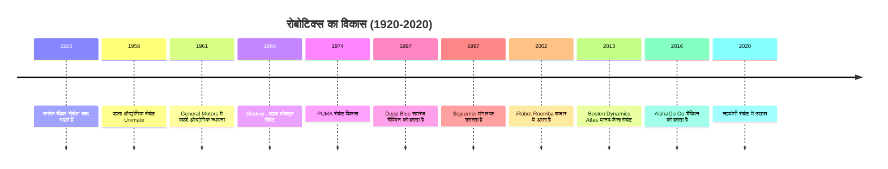
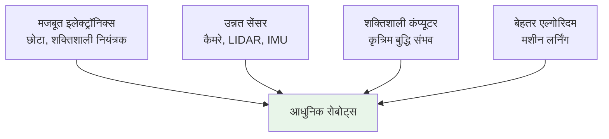

import { Callout } from 'fumadocs-ui/components/callout';
import { Tab, Tabs } from 'fumadocs-ui/components/tabs';

# रोबोटिक्स की परिभाषा और इतिहास

## रोबोट क्या है?

**रोबोट** एक स्वचालित यांत्रिक डिवाइस है जो भौतिक कार्यों को निष्पादित करने के लिए निर्देशों का पालन करता है। अधिक सटीक रूप से:

<Callout type="info" title="रोबोट की परिभाषा">
एक रोबोट एक पुनः-प्रोग्राम योग्य, बहुक्रियात्मक हेराफेरी उपकरण है जिसे निर्दिष्ट कार्यों को निष्पादित करने और मानवीय प्रयास को कम करने के लिए डिजाइन किया गया है - ISO 8373 (अंतर्राष्ट्रीय मानकीकरण संगठन)
</Callout>

### रोबोट की मुख्य विशेषताएं

**1. संवेदन (Sensing)**
- सेंसर के माध्यम से अपने चारों ओर की दुनिया को समझना
- दूरी, तापमान, दबाव, आदि मापना
- आंतरिक स्थिति के बारे में जागरूकता (स्थिति, गति, ऊर्जा)

**2. प्रसंस्करण (Processing)**
- संवेदी जानकारी का विश्लेषण करना
- निर्णय लेना कि क्या करना है
- विभिन्न परिस्थितियों के अनुकूल होना

**3. एक्चुएशन (Actuation)**
- निर्णयों को भौतिक कार्यों में बदलना
- मोटर, पिस्टन, वाल्व को नियंत्रित करना
- भौतिक दुनिया को प्रभावित करना

**4. प्रोग्रामेबिलिटा (Programmability)**
- विभिन्न कार्यों के लिए पुनः-प्रोग्राम किया जा सकता है
- एक बार निर्मित, हजारों कार्य कर सकता है
- अनुकूल निर्देश सेट

**5. स्वायत्तता (Autonomy)**
- मानव हस्तक्षेप के बिना काम करना
- मानवीय निर्देशों के बिना निर्णय लेना
- पूर्ण स्वायत्ता या आंशिक स्वायत्ता हो सकती है

---

## रोबोटिक्स का ऐतिहासिक विकास

रोबोटिक्स 20वीं शताब्दी के दौरान विकसित हुआ, विभिन्न तकनीकी क्षेत्रों के अभिसरण के साथ:

### 1920-1960: निर्माण का युग

**प्रारंभिक सोच:**
- कल्पना: "द्वितीय विश्व युद्ध" (1920) कहानी में रोबोट शब्द पहली बार दिखाई दिया (कारेल चैपेक द्वारा)
- दर्शन: मानव-जैसी मशीनें बनाने की इच्छा

**तकनीकी विकास:**
- 1956: जॉर्ज डिवोल और जोसेफ एनगेलबर्गर ने पहला औद्योगिक रोबोट (यूनिमेट) बनाया
- मूल्य: टेलीविजन न्यूज़ में दिखाया गया
- विशेषताएं: जलाशय में संग्रहीत निर्देश, दोहराए जाने वाली गतिविधियां

**अनुप्रयोग:**
- ऑटोमोबाइल फैक्ट्रियां: वेल्डिंग, संभालना
- पहली रोबोट इंस्टॉलेशन: 1961, General Motors में

**सीमाएं:**
- कोई संवेदन नहीं - पूर्वनिर्धारित पथ का पालन
- कोई अनुकूलन नहीं
- बहुत महंगा, विशाल आकार

### 1960-1980: विकास का युग

**तकनीकी प्रगति:**
- 1966: Shakey the Robot (Stanford): पहला मोबाइल रोबोट, दृष्टि और तर्क के साथ
- 1974: PUMA रोबोट (Programmable Universal Machine for Assembly)
- माइक्रोप्रोसेसर का विकास: नियंत्रण को छोटा और शक्तिशाली बनाया

**अग्रिम:**
- संवेदन: पहले कैमरे और सेंसर एकीकृत
- नियंत्रण: डिजिटल नियंत्रण, बेहतर सटीकता
- बेहतर एल्गोरिदम: पथ योजना, बाधा परिहार

**बाजार का विकास:**
- रोबोट उद्योग वास्तविक व्यावसायिक बल बन गया
- जापान अनुसंधान में नेतृत्व करने लगा
- अनुप्रयोग: असेंबली, पेंटिंग, वेल्डिंग

**सीमाएं:**
- अभी भी काफी हद तक दोहराव
- बाहरी परिस्थितियों के प्रति संवेदनशील
- आर्टिफिशियल इंटेलिजेंस अभी भी आदिम

### 1980-2000: विविधीकरण का युग

**कीमत में कमी:**
- रोबोट अधिक किफायती हो गए
- छोटी फैक्ट्रियां स्वचालन बर्दाश्त कर सकती हैं
- व्यक्तिगत कंप्यूटर नियंत्रकों में क्रांति लाई

**नई अनुप्रयोग:**
- चिकित्सा (शल्य चिकित्सा सहायता)
- कृषि (दोहन, फसल संग्रह)
- अंतरिक्ष अन्वेषण (Sojourner rover, 1997)
- समुद्र अन्वेषण (समुद्र तल से रोबोट)

**उन्नत विशेषताएं:**
- बेहतर दृष्टि प्रणाली
- बहु-सेंसर संलयन
- पहली सहयोगी रोबोट अवधारणाएं

**प्रसिद्ध उदाहरण:**
- 1997: Deep Blue शतरंज में कोल्पा को हराता है
- 1998: सोनी एआईबीओ (कुत्ते-जैसा रोबोट)
- 2002: iRobot Roomba (वैक्यूम रोबोट)

### 2000-2020: वैद्यकिकी और बुद्धि का युग

**Artificial Intelligence का विस्फोट:**
- मशीन लर्निंग एल्गोरिदम में सुधार
- गहन तंत्रिका नेटवर्क (2010s)
- बड़े डेटा और कंप्यूटिंग शक्ति

**मानव-रोबोट मिथ्या क्रिया:**
- सहयोगी रोबोट (कॉबॉट) विकास
- सुरक्षा विशेषताएं: बल सीमा, टक्कर पहचान
- सहजता और प्राकृतिकता में सुधार

**उन्नत गतिविधि:**
- Boston Dynamics: मानव-जैसे रोबोट (Atlas, 2013)
- अमानवीय हाथ: बहु-संवेदनशील, 20+ डिग्री स्वतंत्रता
- 2016: AlphaGo Go में मानव विश्व चैंपियन को हराता है

**प्रमुख प्रवृत्तियां:**
- सॉफ्ट रोबोटिक्स: नरम सामग्री, मानव सुरक्षित
- बायो-रोबोटिक्स: प्रकृति से प्रेरित डिजाइन
- विविध डोमेन: खनन, निर्माण, पुरातत्व

### 2020 और उससे आगे: स्वायत्त और कनेक्टेड युग

**वर्तमान ट्रेंड:**
- 5G कनेक्टिविटी: दूर से नियंत्रण बेहतर
- क्लाउड रोबोटिक्स: साझा कृत्रिम बुद्धि
- स्वायत्त डिलीवरी रोबोट (Waymo, Cruise)
- मानवीय सहानुभूति के साथ रोबोट

**भविष्य की दिशा:**
- सामान्य प्रयोजन रोबोट
- अधिक मानव जैसी बातचीत
- नैतिक और सामाजिक एकीकरण
- जलवायु और पर्यावरण समाधान

---

## रोबोटिक्स का टाइमलाइन

---

## विकास के प्रमुख कारक

### तकनीकी प्रगति

### आर्थिक कारक

**लागत में कमी:**
- इलेक्ट्रॉनिक्स सस्ता: 1970 में $1000 का नियंत्रक अब $10
- उत्पादन बढ़ गया: पैमाने की अर्थव्यवस्था
- अधिक अनुप्रयोग संभव

**ROI (निवेश पर रिटर्न):**
- 1970: रोबोट कभी भुगतान नहीं करता था
- 1990: 3-5 साल में रिटर्न
- 2020: 1-2 साल में रिटर्न (कई अनुप्रयोगों में)

### सामाजिक कारक

**स्वीकृति में वृद्धि:**
- प्रारंभ में: रोबोट नौकरियां चोरी करेंगे (डर)
- अब: रोबोट गायब नौकरियां भरते हैं (वास्तविकता)
- भविष्य: सहयोगी सहजीवन

**सांस्कृतिक प्रभाव:**
- विज्ञान कथा ने विकास को प्रेरित किया
- लोकप्रिय संस्कृति ने जनता को तैयार किया
- शिक्षा कार्यक्रम (LEGO Robotics, आदि)

---

## निर्माण से बुद्धिमत्ता तक

रोबोटिक्स का विकास मोटे तौर पर इस प्रक्षेपवक्र का अनुसरण करता है:

**चरण 1: निर्माण (1920-1960)**
- फोकस: भौतिक रूप से डिवाइस बनाएं
- चुनौती: यांत्रिकी, सामग्री, शक्ति
- परिणाम: कुछ दोहराए जाने वाले कार्य

**चरण 2: विद्युतीकरण (1960-1980)**
- फोकस: बेहतर नियंत्रण, सेंसर जोड़ें
- चुनौती: डिजिटल नियंत्रण, सॉफ्टवेयर
- परिणाम: अनुकूल बहु-कार्य रोबोट

**चरण 3: एकीकरण (1980-2000)**
- फोकस: कई तकनीकें एकीकृत करें
- चुनौती: जटिलता, नेटवर्किंग
- परिणाम: विविध डोमेन में रोबोट

**चरण 4: स्वायत्तता (2000-2015)**
- फोकस: स्वतंत्र निर्णय निर्माण
- चुनौती: कृत्रिम बुद्धि, गहन संवेदन
- परिणाम: कुछ स्वायत्त रोबोट

**चरण 5: बुद्धिमत्ता (2015+)**
- फोकस: मानव-स्तर की सोच
- चुनौती: सामान्य प्रयोजन, सहानुभूति
- परिणाम: वास्तविक सहायक रोबोट

---

## आधुनिक चुनौतियां और भविष्य

### बनी हुई चुनौतियां

**तकनीकी:**
- सामान्य प्रयोजन दक्षता (विशेषज्ञ से बेहतर)
- प्राकृतिक मानव-रोबोट मिथ्या क्रिया
- अनिश्चित वातावरण में काम करना

**आर्थिक:**
- उच्च प्रारंभिक लागत
- कुशल योग्य व्यक्तियों की कमी
- रखरखाव और समर्थन लागत

**सामाजिक:**
- नौकरी विस्थापन चिंताएं
- सुरक्षा और देयता मुद्दे
- नैतिक प्रश्न (स्वायत्त हथियार, आदि)

### भविष्य की संभावनाएं

**ऐतिहासिक पथ में यदि हम देखें:**
- विकास समय अनुबंधित हो गया है
- प्रौद्योगिकी अभिसरण तेजी से हो गया है
- अगली सीमा: सामान्य प्रयोजन, सहानुभूति वाले रोबोट

**2030 की ओर:**
- औद्योगिक रोबोट अधिक मानव-जैसे
- सेवा रोबोट सामान्य (होटल, स्कूल, अस्पताल)
- उपभोक्ता रोबोट उच्च गुणवत्ता के
- अंतरिक्ष और सागर अन्वेषण में वृद्धि

---

## संक्षेप में

रोबोट का एक शताब्दी का विकास भौतिकी, इलेक्ट्रॉनिक्स, कंप्यूटर विज्ञान और कृत्रिम बुद्धि में विकास की कहानी है। शुरुआत से कठोर, निर्दिष्ट डिवाइस से लेकर आज के लचीले, अनुकूल सिस्टम तक यात्रा दशकों की नवीन सोच का प्रमाण है।

जैसा कि हम भविष्य की ओर देखते हैं, अधिक दिलचस्प संभावनाएं सामने आती हैं। रोबोट्स मानवता के भविष्य को आकार देंगे जैसे कि कुछ और प्रौद्योगिकियां कर सकती हैं।

---

**आगे की पढ़ाई:**
- "ए हिस्ट्री ऑफ रोबोटिक्स" - एडविन स्किकला (1988)
- "रोबोट्स एनलिमिटेड" - डेनिस हॉलिडे (2007)
- "द बिजनेस ऑफ रोबोटिक्स" - आलोप्रभ रे (2018)