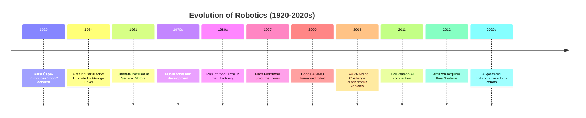

import { Callout } from 'fumadocs-ui/components/callout';
import { Tab, Tabs } from 'fumadocs-ui/components/tabs';

# Definition and History of Robotics

## What is a Robot?

A robot is a programmable machine capable of carrying out a series of actions automatically or with minimal human intervention. The term "robot" derives from the Czech word "robota," meaning forced labor, first introduced by Karel Čapek in his 1920 play "R.U.R. (Rossum's Universal Robots)."

### Key Characteristics of Robots

Every robot, regardless of its specific application, must possess certain fundamental characteristics:

- **Sensing**: Ability to perceive the environment through sensors (cameras, LiDAR, ultrasonic, etc.)
- **Processing**: Computational capability to make decisions based on sensory input
- **Actuation**: Mechanical components to perform physical actions (motors, actuators, hydraulics)
- **Programmability**: Can be instructed to perform different tasks through software or algorithms
- **Autonomy**: Varying degrees of independence from human control, from fully autonomous to teleoperated

<Callout type="info" title="Robot Definition Across Fields">
Different fields define robots differently:
- **Manufacturing**: Programmable manipulators that perform repetitive tasks
- **AI/CS**: Autonomous agents that perceive and act in environments
- **Mechanics**: Electromechanical systems that perform work
- **Service Industry**: Machines that assist humans in various tasks
</Callout>

## Historical Evolution of Robotics

The history of robotics spans over a century, from conceptual ideas to today's sophisticated AI-driven systems.

### Timeline of Major Milestones

### Era 1: The Conceptual Age (1920-1950s)

**The Birth of an Idea:**
- 1920: Karel Čapek's play "R.U.R." introduces the term "robot"
- Initially, robots were purely fictional concepts in science fiction
- Early thinkers imagined machines that could perform human work
- No practical implementation existed yet

**Key Figures:**
- Karel Čapek: Popularized the concept through literature
- Isaac Asimov: Developed "Three Laws of Robotics" in science fiction stories

<Callout type="success" title="Asimov's Three Laws of Robotics">
Though fictional, these laws influenced robotics ethics:
1. A robot may not injure a human or allow a human to come to harm
2. A robot must obey human orders except where it conflicts with Law 1
3. A robot must protect its own existence unless it conflicts with Laws 1 or 2
</Callout>

### Era 2: Industrial Revolution (1954-1980s)

**The First Real Robot:**
- **1954**: George Devol patents the first industrial robot, Unimate
- **1961**: Unimate is installed at General Motors for die-casting work
- This marks the beginning of modern robotics
- Unimate performed dangerous, repetitive tasks, improving workplace safety

**Key Developments:**
- 1970s: Development of the PUMA (Programmable Universal Machine for Assembly) robot
- Rapid adoption across automotive and electronics industries
- Integration of computers with robotic arms
- Development of robot programming languages

**Impact:**
- Revolutionized manufacturing efficiency
- Enabled mass production of complex products
- Reduced workplace injuries and deaths
- Set foundation for modern industrial automation

### Era 3: Advanced Automation (1980s-1990s)

**Expansion and Sophistication:**
- Multiple robot arms working in coordinated cells
- Integration with computer vision systems
- Development of more dexterous manipulators
- Introduction of collaborative concepts

**Notable Achievements:**
- 1997: Mars Pathfinder Sojourner rover - first mobile robot on another planet
- Growing use of robots in consumer electronics manufacturing
- Development of robot sensors and feedback systems

### Era 4: Humanoid and Service Robots (2000s-2010s)

**Human-like Robots:**
- **2000**: Honda introduces ASIMO, a humanoid robot capable of walking and basic interaction
- **2005**: Boston Dynamics founded, pushing boundaries of robot locomotion
- Development of bipedal walking robots
- Focus on human-robot interaction

**Service Applications:**
- 2009: Robot vacuum cleaners (Roomba) become mainstream consumer products
- Medical robotics: da Vinci Surgical System
- Growing interest in healthcare and service robotics

**Logistics and Delivery:**
- 2012: Amazon acquires Kiva Systems for warehouse automation
- 2014: Drones become mainstream for aerial photography and delivery
- Automated guided vehicles (AGVs) in logistics

### Era 5: AI and Autonomy (2015-Present)

**Artificial Intelligence Integration:**
- 2016: AlphaGo defeats world champion Lee Sedol in Go
- Deep learning enables better perception and decision-making
- Computer vision achieves superhuman performance in many tasks
- Natural language processing for human-robot interaction

**Current Trends (2020s):**
- AI-powered autonomous vehicles reaching deployment
- Collaborative robots (cobots) designed for human environments
- Humanoid robots with advanced AI capabilities
- Swarm robotics for coordinated multi-robot tasks
- Robots in healthcare, hospitality, and service industries
- Edge computing bringing AI to smaller robots

<Callout type="success" title="Modern Robotics Milestone">
As of 2024, robots are no longer just in factories. They drive cars, perform surgeries, explore other planets, deliver packages, and work alongside humans in collaborative settings. The integration of AI, machine learning, and advanced sensors has transformed robotics from automation to intelligent systems.
</Callout>

## The Journey: From Manufacturing to Intelligence

### Manufacturing Era (1954-2000)

**Characteristics:**
- Robots perform highly repetitive, dangerous tasks
- Pre-programmed movements with little decision-making
- Confined to factory floors in safe enclosures
- Required expert programming
- High initial cost, justified by productivity gains

**Examples:**
- Spot welding in automotive
- Material handling and palletizing
- Machine tending
- Assembly line operations

**Impact:**
- Improved product quality and consistency
- Increased production speed
- Reduced workplace injuries
- Lower labor costs for repetitive work
- Established robotics as crucial technology

### Autonomy Era (2000-2015)

**Key Shift:**
- Robots begin operating outside controlled factory environments
- Increased use of sensors and perception systems
- Growing autonomous capabilities
- Introduction of robot learning and adaptation

**Landmark Applications:**
- Mars rovers (2004 onwards)
- Robotic vacuum cleaners (2002)
- Surgical robots becoming mainstream
- Early autonomous vehicle research (DARPA Grand Challenge 2004)

**Challenges Addressed:**
- Navigation in unstructured environments
- Obstacle avoidance and path planning
- Environmental perception and interpretation
- Human detection and interaction safety

### Intelligence Era (2015-Present)

**Revolutionary Changes:**
- Deep learning and neural networks enable complex perception
- Robots can understand and learn from their environments
- Natural human-robot interaction becomes practical
- Deployment in diverse real-world scenarios
- Edge computing brings AI to robots

**Current Capabilities:**
- Autonomous vehicles on public roads
- Robots working alongside humans safely (cobots)
- Medical robots assisting in complex surgeries
- Robots understanding natural language commands
- Swarms of robots coordinating complex tasks
- Robots learning from demonstration and reinforcement

**Future Directions:**
- General-purpose humanoid robots
- Advanced manipulation and dexterity
- Better human-robot teaming
- Ethical AI and robotics
- Sustainable and eco-friendly robots

---

## Key Insights

<Callout type="info" title="Evolution of Robotics">
The evolution of robotics mirrors the evolution of computing. From massive machines performing single tasks, to programmable systems, to intelligent autonomous agents. The next phase will likely see robots becoming even more integrated into daily life, working seamlessly with humans.
</Callout>

### Timeline Summary

| Era | Period | Focus | Technology |
|-----|--------|-------|-----------|
| Conceptual | 1920-1950s | Imagination & Theory | Science Fiction |
| Industrial | 1954-1980s | Manufacturing | Mechanical Arms |
| Advanced | 1980s-1990s | Sophistication | Computer Vision |
| Humanoid/Service | 2000s-2010s | Human Interaction | Sensors & Control |
| AI/Autonomy | 2015+ | Intelligence | AI & ML |

---

**Further Reading:**
- "A Brief History of Robots" - various IEEE publications
- "The Quest for Artificial Intelligence" by Nilsson
- DARPA Robotics Challenge documentation
- Mars Rover mission records and analyses