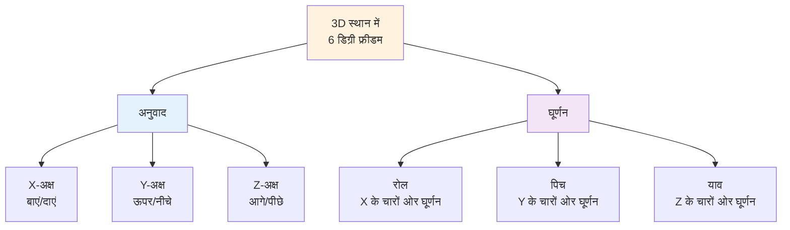
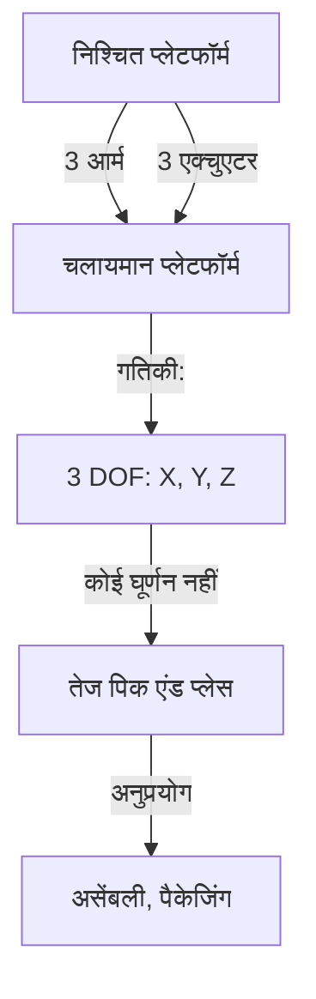
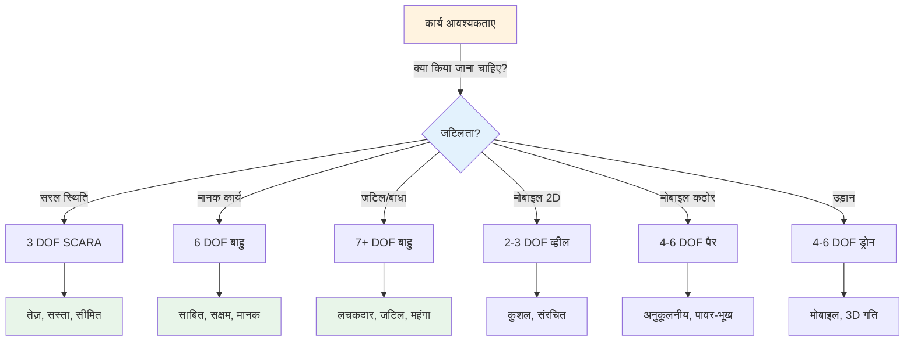

import { Callout } from 'fumadocs-ui/components/callout';
import { Tab, Tabs } from 'fumadocs-ui/components/tabs';
import { Step, Steps } from 'fumadocs-ui/components/steps';

# रोबोटिक्स में स्वतंत्रता की डिग्री

स्वतंत्रता की डिग्री (DOF) स्वतंत्र चर की संख्या का प्रतिनिधित्व करती है जो रोबोटिक सिस्टम की स्थिति और अभिविन्यास को पूरी तरह से वर्णित करने के लिए आवश्यक है। DOF को समझना रोबोट डिजाइन, नियंत्रण और क्षमता विश्लेषण के लिए मौलिक है।

## 3D स्थान में स्वतंत्रता की डिग्री

3D स्थान में हर कठोर निकाय के पास 6 संभावित स्वतंत्रता की डिग्री हैं:



### 3 अनुवाद DOF

**3D स्थान में स्थिति:**
- **X-अक्ष:** क्षैतिज विस्थापन (बाएं/दाएं)
- **Y-अक्ष:** ऊर्ध्वाधर विस्थापन (ऊपर/नीचे)
- **Z-अक्ष:** गहराई विस्थापन (आगे/पीछे)

वे एक साथ कार्तीय निर्देशांक को परिभाषित करते हैं: (X, Y, Z)

**उदाहरण:** एक रोबोट बाहु की अंत-प्रभावकारी स्थिति (2.5m, 1.8m, 0.9m)

### 3 घूर्णन DOF

**3D स्थान में अभिविन्यास:**
- **रोल:** X-अक्ष के बारे में घूर्णन (कताई गति)
- **पिच:** Y-अक्ष के बारे में घूर्णन (झुकाव गति)
- **याव:** Z-अक्ष के बारे में घूर्णन (मोड़ना गति)

वे एक साथ अभिविन्यास को परिभाषित करते हैं:
- यूलर कोण: (रोल, पिच, याव)
- घूर्णन मेट्रिक्स: 3×3 गणित प्रतिनिधित्व
- क्वाटर्नियन: 4D प्रतिनिधित्व (कुशल, विलक्षणता-मुक्त)

**उदाहरण:** ग्रास अभिविन्यास - वस्तु को सीधा, सपाट या बग़ल में रखें

---

## मोबाइल रोबोट DOF

मोबाइल रोबोट विभिन्न पर्यावरण में संचालित होते हैं जिनमें विभिन्न DOF आवश्यकताएं हैं:

### जमीन के रोबोट

<Tabs items={['2 DOF प्लानर', '3 DOF व्हील्ड', '4-6 DOF लेग्ड']}>
<Tab value="2 DOF प्लानर">
### 2 DOF प्लानर गति

**विन्यास:**
- X स्थिति (जमीन पर बाएं/दाएं)
- Y स्थिति (जमीन पर आगे/पीछे)
- कोई ऊर्ध्वाधर आंदोलन या घूर्णन की आवश्यकता नहीं

**उदाहरण:** कारखाने की मंजिल ग्रिड सिस्टम में रोबोट

**सीमाएं:**
- जगह में घूम नहीं सकता
- विशेष बारी तंत्र की आवश्यकता
- सीमित लचीलापन

**अनुप्रयोग:**
- स्वचालित गोदाम (संरचित वातावरण)
- असेंबली लाइन अनुयायी
- सरल पथ-अनुसरण करने वाले रोबोट
</Tab>

<Tab value="3 DOF व्हील्ड">
### 3 DOF व्हीलड लोकोमोशन

**विन्यास:**
- X स्थिति (क्षैतिज)
- Y स्थिति (क्षैतिज)
- θ (थीटा) - अभिविन्यास/शीर्षक कोण

**सबसे सामान्य:** अंतर-ड्राइव और सर्वदिशात्मक व्हीलड रोबोट

**अंतर ड्राइव:**
- दो चालित पहिए + निष्क्रिय कास्टर
- नियंत्रण: बाएं और दाएं पहिया गति
- जगह में घूम सकता है
- सीमाएं: होलोनोमिक बाधाएं (बग़ल में नहीं जा सकता)

**सर्वदिशात्मक ड्राइव:**
- तीन या चार पहिए स्वतंत्र नियंत्रण के साथ
- मेकेनम या ओमनीव्हील
- किसी भी दिशा में अनुवाद कर सकते हैं
- कोई घूर्णन बाधा नहीं (होलोनोमिक)

**उन्नत स्टीयरिंग:**
- अकरमैन स्टीयरिंग (कार जैसी): स्टीयरिंग + ड्राइव पहिए
- स्किड स्टीयरिंग: सभी पहिए संचालित, स्वतंत्र नियंत्रण
- जोड़ा हुआ: ट्रैक्टर-ट्रेलर विन्यास
</Tab>

<Tab value="4-6 DOF लेग्ड">
### 4-6 DOF लेग्ड लोकोमोशन

**चतुष्पद (4-पैर वाला):**
- शरीर स्थिति: (X, Y, Z)
- शरीर अभिविन्यास: 3 कोण
- प्रत्येक पैर रुख/स्विंग के लिए अधिक DOF जोड़ता है
- उदाहरण: बोस्टन डायनामिक्स स्पॉट, ANYmal

**हेक्सापोडल (6-पैर वाला):**
- स्वाभाविक रूप से स्थिर ट्रिपॉड गति
- कठोर भूभाग पर बेहतर
- गतिशीलता के लिए अधिक DOF
- उदाहरण: मंटिस रोबोट, निरीक्षण रोबोट

**लाभ:**
- अनियमित इलाके को नेविगेट करें
- बाधाओं को पार करें
- उच्च अनुकूलन क्षमता
- प्राकृतिक दिखने वाली गति

**नुकसान:**
- जटिल नियंत्रण
- ऊर्जा गहन
- कई एक्चुएटर
- विश्लेषण करना कठिन
</Tab>
</Tabs>

### ड्रोन DOF

**क्वाड्रोटर (सबसे सामान्य):**
- हवा में 4 DOF: X, Y, Z, याव
- पिच और रोल को एक साथ नियंत्रित किया जाता है
- कुल 6 DOF (घूर्णन सहित)
- नियंत्रण: प्रोपेलर गति गति निर्धारित करता है

**हेक्साकॉप्टर/ऑक्टोकॉप्टर:**
- अधिक रोटर = अधिक नियंत्रण प्राधिकार
- भारी पेलोड उठा सकते हैं
- हवा में अधिक स्थिर

---

## रोबोटिक बाहु DOF

यह वह जगह है जहां DOF डिजाइन और क्षमता के लिए महत्वपूर्ण हो जाता है:

### सीरीज़ बाहु विन्यास

<Tabs items={['3 DOF Scara', '6 DOF आर्टिकुलेटेड', '7+ रीडंडेंट', 'कार्टेसियन']}>
<Tab value="3 DOF Scara">
### 3 DOF SCARA रोबोट

**SCARA = चयनात्मक अनुरूप संयुक्त रोबोट बाहु**

**विन्यास:**
- जोड़ 1 (θ₁): कंधे का घूर्णन (क्षैतिज तल)
- जोड़ 2 (θ₂): कोहनी घूर्णन (क्षैतिज तल)
- जोड़ 3 (Z): ऊर्ध्वाधर ऊंचाई समायोजन

**कार्य लिफाफा:**
- गोलाकार कार्यक्षेत्र
- सीमित अभिविन्यास
- उच्च गति
- सटीकता: ±0.03mm विशिष्ट

**अनुप्रयोग:**
- पिक एंड प्लेस ऑपरेशन
- असेंबली कार्य
- मशीन लोडिंग/अनलोडिंग
- PCB असेंबली

**लाभ:**
- तेज़ क्षैतिज गति
- कॉम्पैक्ट डिजाइन
- उच्च दोहराव योग्यता
- लागत प्रभावी

**सीमाएं:**
- केवल 3 डिग्री स्वतंत्रता कुल
- स्वतंत्रता से स्थिति और अभिविन्यास नहीं हो सकता
- 2D प्लानर कार्य के लिए सर्वश्रेष्ठ ऊंचाई के साथ

**गतिकी:**
```
X = L₁·cos(θ₁) + L₂·cos(θ₁ + θ₂)
Y = L₁·sin(θ₁) + L₂·sin(θ₁ + θ₂)
Z = Z (सीधा नियंत्रण)

जहां L₁, L₂ लिंक लंबाई हैं
```
</Tab>

<Tab value="6 DOF आर्टिकुलेटेड">
### 6 DOF आर्टिकुलेटेड रोबोट बाहु

**सबसे सामान्य औद्योगिक डिजाइन**

**विन्यास:**
- जोड़ 1 (θ₁): कमर घूर्णन
- जोड़ 2 (θ₂): कंधे पिच
- जोड़ 3 (θ₃): कोहनी पिच
- जोड़ 4 (θ₄): कलाई घूर्णन (रोल)
- जोड़ 5 (θ₅): कलाई पिच
- जोड़ 6 (θ₆): कलाई याव (टूल रोटेट)

**कार्य लिफाफा:**
- जटिल 3D कार्यक्षेत्र
- पूर्ण अभिविन्यास क्षमता
- बाधाओं के चारों ओर पहुंच सकते हैं
- सटीकता: ±0.03mm से ±0.1mm

**अनुप्रयोग:**
- वेल्डिंग
- सामग्री प्रबंधन
- मशीन ध्यान
- असेंबली
- पेंटिंग
- पैलेटाइजिंग

**लाभ:**
- पूर्ण 6 डिग्री स्वतंत्रता क्षमता
- बाधाओं के चारों ओर पहुंचें
- पूर्ण अभिविन्यास स्वतंत्रता
- प्रमाणित तकनीक
- अच्छी तरह से समझी गई गतिकी

**नुकसान:**
- SCARA की तुलना में धीमा
- अधिक नियंत्रण जटिलता
- बड़ा कार्यक्षेत्र पदचिन्ह
- उच्च लागत

**गतिकी:**
6 DOF बाहु डेनवित-हार्टेनबर्ग (DH) पैरामीटर का उपयोग करते हैं:
- प्रत्येक संयुक्त 4 पैरामीटर जोड़ता है
- कुल: पूर्ण विवरण के लिए 24 पैरामीटर
- फॉरवर्ड गतिकी: संयुक्त कोण से स्थिति/अभिविन्यास की गणना करें
- व्युत्क्रम गतिकी: वांछित स्थिति/अभिविन्यास से संयुक्त कोण की गणना करें (अक्सर कई समाधान)
</Tab>

<Tab value="7+ रीडंडेंट">
### 7+ DOF अतिरिक्त बाहु

**विन्यास:**
- 7 DOF विशिष्ट (6 न्यूनतम के बाहर अतिरिक्त 1 संयुक्त)
- अनुसंधान प्रणाली में 10+ DOF तक

**उदाहरण:**
- KUKA LBR iiwa (7 DOF)
- फ्रांका एमिका पांडा (7 DOF)
- शैडो हैंड (20+ DOF)

**लाभ:**
- एक ही बिंदु पर कई विन्यास तक पहुंच सकते हैं
- अंत-प्रभावकारी मुद्रा बनाए रखते हुए बाधाएं से बचें
- बेहतर बल वितरण
- अधिक मानवीय गति
- अशक्ति-स्थान हेरफेर कर सकते हैं
- आत्म-टकराव परिहार

**अतिरेक का शोषण:**

| उपयोग कस्टम | रणनीति |
|----------|----------|
| **बाधा परिहार** | अशक्ति-स्थान गति का उपयोग करके बाधा के चारों ओर झुकें |
| **विलक्षणता से बचें** | विलक्षणताओं से बचने के लिए अतिरिक्त संयुक्त को हिलाएं |
| **बल अनुकूलन** | कई समाधानों पर बल वितरित करें |
| **मानव जैसी गति** | प्राकृतिक संयुक्त झुकाव पैटर्न की नकल करें |
| **पेलोड अनुकूलन** | सर्वोत्तम लोड वितरण के साथ विन्यास चुनें |

**नुकसान:**
- अधिक जटिल नियंत्रण
- व्युत्क्रम गतिकी में अनंत समाधान
- गणनात्मक रूप से गहन
- अधिक जोड़ = अधिक संभावित विफलता बिंदु
- महंगा

**व्यावहारिक अनुप्रयोग:**
मान लीजिए हम चाहते हैं:
1. बिंदु (X, Y, Z) तक पहुंचें
2. ग्रिपर अभिविन्यास नीचे की ओर
3. कार्यक्षेत्र बाधा से बचें

6 DOF के साथ: समस्या - पहुंच और अभिविन्यास बनाए रखते हुए बाधा से बच नहीं सकते
7 DOF के साथ: समाधान! ग्रिप अभिविन्यास बनाए रखते हुए बाधा से बचने के लिए 7वें संयुक्त को झुका सकते हैं
</Tab>

<Tab value="कार्टेसियन">
### कार्टेसियन (रैखिक) रोबोट बाहु

**विन्यास:**
- 3 प्रिस्मेटिक (रैखिक) जोड़
- X-अक्ष रैखिक एक्चुएटर
- Y-अक्ष रैखिक एक्चुएटर
- Z-अक्ष रैखिक एक्चुएटर
- वैकल्पिक: उपकरण पर 3 घूर्णन जोड़

**कार्य लिफाफा:**
- आयताकार कार्यक्षेत्र
- एक्चुएटर स्ट्रोक लंबाई द्वारा निर्धारित
- दृश्य और प्रोग्राम करने में आसान

**अनुप्रयोग:**
- पिक एंड प्लेस
- मशीन ध्यान
- असेंबली (ऊर्ध्वाधर)
- पैकेजिंग
- 3D प्रिंटिंग

**लाभ:**
- सरल गतिकी (कार्तीय निर्देशांक सीधे)
- आसान प्रोग्रामिंग
- सटीक रैखिक गति
- कम लागत एक्चुएटर
- अच्छा पेलोड/आकार अनुपात

**नुकसान:**
- आयताकार कार्यक्षेत्र पहुंच सीमित करता है
- सीमित बाधा परिहार
- बड़े पदचिन्ह की आवश्यकता हो सकती है
- अतिरिक्त के बिना उपकरण को घुमा नहीं सकता

**गतिकी:**
```
X = मोटर₁ स्थिति
Y = मोटर₂ स्थिति
Z = मोटर₃ स्थिति

फॉरवर्ड गतिकी: तुच्छ
व्युत्क्रम गतिकी: तुच्छ
कोई विलक्षणता नहीं!
```
</Tab>
</Tabs>

---

## समानांतर रोबोट (विभिन्न टोपोलॉजी)

सभी रोबोट सीरीज़ बाहु का उपयोग नहीं करते। समानांतर विन्यास में विभिन्न DOF विशेषताएं होती हैं:

### डेल्टा रोबोट



**विशेषताएं:**
- निश्चित से चलायमान प्लेटफॉर्म को जोड़ने वाली 3 बाहु
- 3 DOF: X, Y, Z केवल
- तेज गति (उच्च त्वरण)
- सटीक स्थिति निर्धारण
- सीमित घूर्णन

**गतिकी:**
- जटिल फॉरवर्ड गतिकी (संख्यात्मक समाधान की आवश्यकता)
- सरल व्युत्क्रम गतिकी
- सामान्य कार्यक्षेत्र में कोई विलक्षणता नहीं

### स्टीवर्ट प्लेटफॉर्म

**विन्यास:**
- 6 रैखिक एक्चुएटर
- 6 DOF: पूर्ण स्थिति + अभिविन्यास

**अनुप्रयोग:**
- गति सिमुलेशन
- सटीकता स्थिति निर्धारण
- कैमरा गिम्बल
- फ्लाइट सिम्युलेटर

---

## DOF चयन गाइड



### निर्णय मानदंड

<Tabs items={['कार्यक्षेत्र', 'गति', 'सटीकता', 'लागत', 'पर्यावरण']}>
<Tab value="कार्यक्षेत्र">
### कार्यक्षेत्र आवश्यकताएं

**प्रश्न:** रोबोट को किस मात्रा तक पहुंचना चाहिए?

**विकल्प:**
- **छोटा/प्लानर:** 2-3 DOF व्हीलड या SCARA
- **मध्यम/3D:** 6 DOF बाहु
- **बड़ा/जटिल:** मोबाइल बेस के साथ 7+ DOF बाहु
- **असंरचित भूभाग:** लेग्ड रोबोट

**गणना:**
पहुंचने योग्य कार्यक्षेत्र मात्रा ≈ π × पहुंच² × ऊंचाई
1.5m बाहु के लिए 6 DOF: ~ 10-15 m³ विशिष्ट
</Tab>

<Tab value="गति">
### गति आवश्यकताएं

**तेज़ क्षैतिज (< 2 सेकंड):** SCARA या 3 DOF
**मध्यम (2-5 सेकंड):** 6 DOF बाहु
**सटीक/धीमा:** 7+ DOF या सहयोगी रोबोट

**गति सूत्र:**
अधिकतम गति ≈ संयुक्त गति × लिंक लंबाई
(अंत प्रभावकारी के पास तेजी से जोड़ = उच्च टिप गति)
</Tab>

<Tab value="सटीकता">
### सटीकता आवश्यकताएं

**ढीला (±5mm):** मोबाइल रोबोट, लेग्ड
**मध्यम (±1mm):** मानक 6 DOF बाहु
**टाइट (±0.1mm):** सटीकता बाहु, कार्टेसियन सिस्टम
**अल्ट्रा-टाइट (±0.01mm):** विशेष माइक्रोस्केल सिस्टम

**कारक:**
- यांत्रिक सहनशीलता
- सेंसर सटीकता
- मोटर संकल्प
- नियंत्रण एल्गोरिदम गुणवत्ता
</Tab>

<Tab value="लागत">
### लागत व्यापार

| सिस्टम | लागत | गति | सटीकता | लचीलापन |
|--------|------|-------|-----------|---------|
| **SCARA** | $ | ⭐⭐⭐⭐⭐ | ⭐⭐⭐⭐ | ⭐⭐ |
| **6 DOF** | $$ | ⭐⭐⭐ | ⭐⭐⭐⭐ | ⭐⭐⭐⭐ |
| **7 DOF** | $$$ | ⭐⭐⭐ | ⭐⭐⭐⭐ | ⭐⭐⭐⭐⭐ |
| **मोबाइल बेस** | $$$ | ⭐⭐⭐ | ⭐⭐ | ⭐⭐⭐⭐⭐ |

**बजट आवंटन:**
- रोबोट (40-50%)
- अंत-प्रभावकारी/ग्रिपर (10-20%)
- नियंत्रण/सॉफ़्टवेयर (20-30%)
- स्थापना/एकीकरण (10-20%)
</Tab>

<Tab value="पर्यावरण">
### पर्यावरणीय कारक

**कारखाने की मंजिल:**
- संरचित, नियंत्रित
- 6 DOF बाहु पर्याप्त है
- जलवायु नियंत्रित
- बिजली उपलब्ध

**गोदाम:**
- मोबाइल बेस की आवश्यकता
- गतिशील बाधाएं
- वास्तविक समय अनुकूलन
- 3 DOF व्हीलड रोबोट विशिष्ट

**बाहर/कठोर भूभाग:**
- लेग्ड रोबोट बेहतर
- प्रति पैर 4-6 DOF
- टिकाऊ एक्चुएटर
- उच्च बिजली खपत

**सहयोगी (मनुष्य उपस्थित):**
- सुरक्षा महत्वपूर्ण
- बल सीमा (DOF के साथ टॉर्क नियंत्रण की आवश्यकता)
- अनुपालन महत्वपूर्ण
- 6-7 DOF विशिष्ट
</Tab>
</Tabs>

---

## व्यावहारिक DOF गणना

### उदाहरण: 6-अक्ष रोबोट

**दिया गया:**
- 6 घूर्णन जोड़
- प्रत्येक संयुक्त अपनी धुरी के बारे में घूमता है
- निश्चित आधार से शुरू

**फॉरवर्ड गतिकी:**
```
स्थिति(X,Y,Z) = f(θ₁, θ₂, θ₃, θ₄, θ₅, θ₆)
अभिविन्यास(R,P,Y) = g(θ₁, θ₂, θ₃, θ₄, θ₅, θ₆)
```

**DOF गणना:**
- 3 DOF स्थिति के लिए (X, Y, Z)
- 3 DOF अभिविन्यास के लिए (रोल, पिच, याव)
- कुल: 6 DOF प्राप्ति

**बाधा जांच:**
- कोई ज्यामितीय बाधा नहीं: ✓ पूर्ण 6 DOF
- कुछ जोड़ अतिरिक्त: ✓ अभी भी न्यूनतम 6 DOF
- कार्यक्षेत्र बाधा: ⚠️ कुछ क्षेत्रों में सभी 6 DOF एक साथ नहीं हो सकते

---

## उन्नत विषय

### अतिरेक संकल्प

जब DOF > आवश्यक आयाम, सर्वश्रेष्ठ समाधान चुनें:
- न्यूनतम ऊर्जा/टॉर्क
- सुरक्षा मार्जिन बनाए रखें
- बाधाओं से बचें
- विलक्षणता से दूर रहें

### व्युत्क्रम गतिकी बहुलता

**6 DOF के लिए:** आमतौर पर एक ही बिंदु के लिए 1-8 समाधान
**7+ DOF के लिए:** अनंत समाधान मौजूद
**चयन:** के आधार पर सर्वश्रेष्ठ चुनें:
- कार्यक्षेत्र निकटता
- विलक्षणता दूरी
- बाधा क्लीयरेंस
- ऊर्जा दक्षता

### मोबाइल हेरफेर

**मोबाइल बेस पर बाहु:**
- संयुक्त DOF: 3 (बेस) + 6 (बाहु) = 9 DOF
- बड़ा कार्यक्षेत्र
- कार्य लचीलापन
- जटिल समन्वय आवश्यक

---

**मुख्य बातें:**
1. **6 डिग्री स्वतंत्रता मानक** लचीले रोबोटिक हेरफेर के लिए (3 स्थिति + 3 अभिविन्यास)
2. **कम DOF = तेज़, सस्ता**, लेकिन अधिक सीमित
3. **अधिक DOF = अधिक लचकदार**, लेकिन जटिल और महंगा
4. **अपनी कार्य आवश्यकताओं को समझें** रोबोट DOF चुनने से पहले
5. **कार्यक्षेत्र और विलक्षणता** सैद्धांतिक रूप से उपलब्ध होने पर भी व्यावहारिक DOF सीमित करें

**आगे की पढ़ाई:**
- "रोबोट मैनिपुलेटर: गणित, प्रोग्रामिंग और नियंत्रण" रिचर्ड पॉल द्वारा
- "रोबोटिक्स का परिचय: यांत्रिकी और नियंत्रण" क्रेग द्वारा
- डेनवित-हार्टेनबर्ग सम्मेलन पत्र
- व्युत्क्रम गतिकी एल्गोरिदम (FABRIK, संख्यात्मक तरीके)