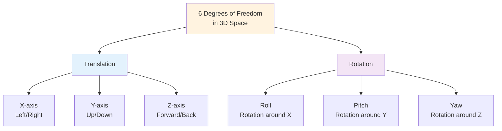
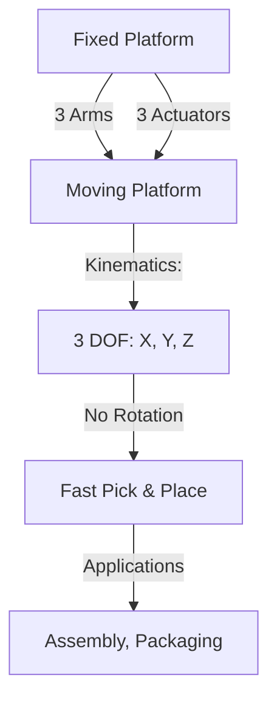
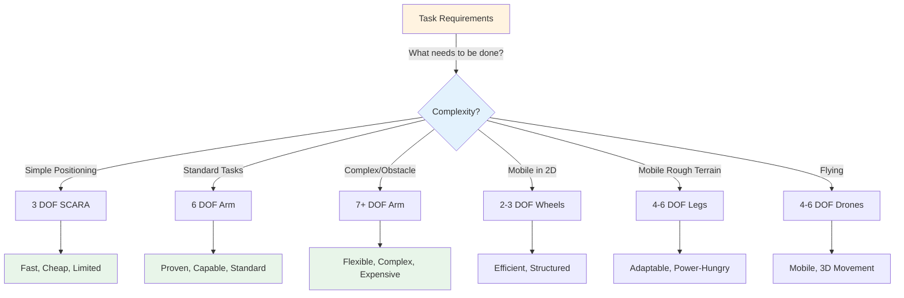
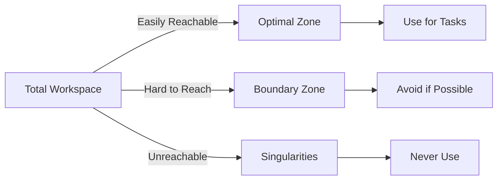

import { Callout } from 'fumadocs-ui/components/callout';
import { Tab, Tabs } from 'fumadocs-ui/components/tabs';
import { Step, Steps } from 'fumadocs-ui/components/steps';

# Degrees of Freedom in Robotics

Degrees of Freedom (DOF) represent the number of independent variables required to fully describe the position and orientation of a robotic system. Understanding DOF is fundamental to robot design, control, and capability analysis.

## Spatial Degrees of Freedom

Every rigid body in 3D space has 6 possible degrees of freedom:



### 3 Translational DOF

**Position in 3D Space:**
- **X-axis:** Horizontal displacement (left/right)
- **Y-axis:** Vertical displacement (up/down)
- **Z-axis:** Depth displacement (forward/backward)

Together they define the Cartesian coordinates: (X, Y, Z)

**Example:** A robot arm's end-effector position (2.5m, 1.8m, 0.9m)

### 3 Rotational DOF

**Orientation in 3D Space:**
- **Roll:** Rotation about X-axis (spinning motion)
- **Pitch:** Rotation about Y-axis (tilting motion)
- **Yaw:** Rotation about Z-axis (turning motion)

Together they define orientation using:
- Euler angles: (Roll, Pitch, Yaw)
- Rotation matrices: 3×3 math representation
- Quaternions: 4D representation (efficient, singularity-free)

**Example:** Grasp orientation - place object upright, flat, or sideways

---

## Mobile Robot DOF

Mobile robots operate in specific environments with different DOF requirements:

### Ground Robots

<Tabs items={['2 DOF Planar', '3 DOF Wheeled', '4-6 DOF Legged']}>
<Tab value="2 DOF Planar">
### 2 DOF Planar Motion

**Configuration:**
- X position (left/right on ground)
- Y position (forward/backward on ground)
- No vertical movement or rotation needed

**Example:** Robot in a factory floor grid system

**Limitations:**
- Cannot rotate in place
- Requires special turning mechanisms
- Limited flexibility

**Applications:**
- Automated warehouses (structured environment)
- Assembly line followers
- Simple path-following robots
</Tab>

<Tab value="3 DOF Wheeled">
### 3 DOF Wheeled Locomotion

**Configuration:**
- X position (horizontal)
- Y position (horizontal)
- θ (theta) - orientation/heading angle

**Most Common:** Differential-drive and omnidirectional wheeled robots

**Differential Drive:**
- Two driven wheels + passive caster
- Control: Left and right wheel speeds
- Can rotate in place
- Limitations: Holonomic constraints (cannot move sideways)

**Omnidirectional Drive:**
- Three or four wheels with independent control
- Mecanum or omniwheels
- Can translate in any direction
- No rotation constraint (holonomic)

**Advanced Steering:**
- Ackermann steering (car-like): Steering + drive wheels
- Skid steering: All wheels powered, independent control
- Articulated: Tractor-trailer configuration
</Tab>

<Tab value="4-6 DOF Legged">
### 4-6 DOF Legged Locomotion

**Quadrupedal (4-legged):**
- Body position: (X, Y, Z)
- Body orientation: 3 angles
- Each leg adds more DOF for stance/swing
- Examples: Boston Dynamics Spot, ANYmal

**Hexapedal (6-legged):**
- Naturally stable tripod gait
- Better on rough terrain
- More DOF for mobility
- Examples: Mantis robots, inspection robots

**Advantages:**
- Navigate irregular terrain
- Cross obstacles
- Higher adaptability
- Natural appearing motion

**Disadvantages:**
- Complex control
- Energy intensive
- Many actuators
- Harder to analyze
</Tab>
</Tabs>

### Drone DOF

**Quadrotor (Most Common):**
- 4 DOF in air: X, Y, Z, Yaw
- Pitch and Roll are controlled together
- Total 6 DOF (including rotations)
- Control: Propeller speeds determine motion

**Hexacopter/Octocopter:**
- More rotors = more control authority
- Can lift heavier payloads
- More stable in wind

---

## Robotic Arm DOF

This is where DOF becomes critical to design and capability:

### Serial Arm Configurations

<Tabs items={['3 DOF Scara', '6 DOF Articulated', '7+ Redundant', 'Cartesian']}>
<Tab value="3 DOF Scara">
### 3 DOF SCARA Robot

**SCARA = Selective Compliant Articulated Robot Arm**

**Configuration:**
- Joint 1 (θ₁): Shoulder rotation (horizontal plane)
- Joint 2 (θ₂): Elbow rotation (horizontal plane)
- Joint 3 (Z): Vertical height adjustment

**Work Envelope:**
- Circular workspace
- Limited orientation
- High speed
- Precision: ±0.03mm typical

**Applications:**
- Pick and place operations
- Assembly tasks
- Machine loading/unloading
- PCB assembly

**Advantages:**
- Fast horizontal movement
- Compact design
- High repeatability
- Cost-effective

**Limitations:**
- Only 3 DOF total
- Cannot position and orient freely
- Best for 2D planar tasks with height

**Kinematics:**
```
X = L₁·cos(θ₁) + L₂·cos(θ₁ + θ₂)
Y = L₁·sin(θ₁) + L₂·sin(θ₁ + θ₂)
Z = Z (direct control)

Where L₁, L₂ are link lengths
```
</Tab>

<Tab value="6 DOF Articulated">
### 6 DOF Articulated Robot Arm

**Most Common Industrial Design**

**Configuration:**
- Joint 1 (θ₁): Waist rotation
- Joint 2 (θ₂): Shoulder pitch
- Joint 3 (θ₃): Elbow pitch
- Joint 4 (θ₄): Wrist rotation (roll)
- Joint 5 (θ₅): Wrist pitch
- Joint 6 (θ₆): Wrist yaw (tool rotate)

**Work Envelope:**
- Complex 3D workspace
- Full orientation capability
- Can reach around obstacles
- Precision: ±0.03mm to ±0.1mm

**Applications:**
- Welding
- Material handling
- Machine tending
- Assembly
- Painting
- Palletizing

**Advantages:**
- Full 6 DOF capability
- Reach around obstacles
- Complete orientation freedom
- Proven technology
- Well-understood kinematics

**Disadvantages:**
- Slower than SCARA
- More control complexity
- Larger workspace footprint
- Higher cost

**Kinematics:**
6 DOF arms use Denavit-Hartenberg (DH) parameters:
- Each joint adds 4 parameters
- Total: 24 parameters for full description
- Forward kinematics: Calculate position/orientation from joint angles
- Inverse kinematics: Calculate joint angles from desired position/orientation (often multiple solutions)
</Tab>

<Tab value="7+ Redundant">
### 7+ DOF Redundant Arms

**Configuration:**
- 7 DOF typical (extra 1 joint beyond 6 minimum)
- Up to 10+ DOF in research systems

**Examples:**
- KUKA LBR iiwa (7 DOF)
- Franka Emika Panda (7 DOF)
- Shadow Hand (20+ DOF)

**Advantages:**
- Can reach multiple configurations to same point
- Avoid obstacles while maintaining end-effector pose
- Better force distribution
- More human-like motion
- Can perform null-space manipulation
- Self-collision avoidance

**Redundancy Exploitation:**

| Use Case | Strategy |
|----------|----------|
| **Obstacle Avoidance** | Use null-space motion to bend around obstacle |
| **Singularity Escape** | Move redundant joint to avoid singularities |
| **Force Optimization** | Distribute forces across multiple solutions |
| **Human-like Motion** | Mimic natural joint bending patterns |
| **Payload Optimization** | Choose configuration with best load distribution |

**Disadvantages:**
- More complex control
- Inverse kinematics has infinite solutions
- Computationally intensive
- More joints = more potential failure points
- Expensive

**Practical Application:**
Suppose we want to:
1. Reach point (X, Y, Z)
2. Orient gripper pointing down
3. Avoid workspace obstacle

With 6 DOF: Problem - cannot avoid obstacle while maintaining reach and orientation
With 7 DOF: Solution! Can bend 7th joint to avoid obstacle while maintaining grip orientation
</Tab>

<Tab value="Cartesian">
### Cartesian (Linear) Robot Arms

**Configuration:**
- 3 Prismatic (linear) joints
- X-axis linear actuator
- Y-axis linear actuator
- Z-axis linear actuator
- Optional: 3 rotational joints at tool

**Work Envelope:**
- Rectangular workspace
- Determined by actuator stroke lengths
- Easy to visualize and program

**Applications:**
- Pick and place
- Machine tending
- Assembly (vertical)
- Packaging
- 3D printing

**Advantages:**
- Simple kinematics (Cartesian coordinates directly)
- Easy programming
- Precise linear movements
- Low cost actuators
- Good payload/size ratio

**Disadvantages:**
- Rectangular workspace limits reach
- Limited obstacle avoidance
- May require larger footprint
- Cannot rotate tool without additions

**Kinematics:**
```
X = Motor₁ position
Y = Motor₂ position
Z = Motor₃ position

Forward kinematics: Trivial
Inverse kinematics: Trivial
No singularities!
```
</Tab>
</Tabs>

---

## Parallel Robots (Different Topology)

Not all robots use serial arms. Parallel configurations have different DOF characteristics:

### Delta Robot



**Characteristics:**
- 3 arms connecting fixed to moving platform
- 3 DOF: X, Y, Z only
- Fast speed (high acceleration)
- Precise positioning
- Limited rotation

**Kinematics:**
- Complex forward kinematics (need numerical solving)
- Simpler inverse kinematics
- No singularities in normal workspace

### Stewart Platform

**Configuration:**
- 6 linear actuators
- 6 DOF: Full position + orientation

**Applications:**
- Motion simulation
- Precision positioning
- Camera gimbals
- Flight simulators

---

## DOF Selection Guide



### Decision Criteria

<Tabs items={['Workspace', 'Speed', 'Precision', 'Cost', 'Environment']}>
<Tab value="Workspace">
### Workspace Requirements

**Question:** What volume must the robot reach?

**Options:**
- **Small/Planar:** 2-3 DOF wheeled or SCARA
- **Medium/3D:** 6 DOF arm
- **Large/Complex:** 7+ DOF arm with mobile base
- **Unstructured Terrain:** Legged robots

**Calculation:**
Reachable workspace volume ≈ π × reach² × height
For 6 DOF 1.5m arm: ~10-15 m³ typical
</Tab>

<Tab value="Speed">
### Speed Requirements

**Fast Horizontal (< 2 sec):** SCARA or 3 DOF
**Medium (2-5 sec):** 6 DOF arm
**Precise/Slow:** 7+ DOF or collaborative robots

**Speed Formula:**
Max speed ≈ Joint speed × Link length
(Faster joints near end effector = higher tip speed)
</Tab>

<Tab value="Precision">
### Precision Requirements

**Loose (±5mm):** Mobile robots, legged
**Moderate (±1mm):** Standard 6 DOF arms
**Tight (±0.1mm):** Precision arms, Cartesian systems
**Ultra-tight (±0.01mm):** Specialized microscale systems

**Factors:**
- Mechanical tolerance
- Sensor accuracy
- Motor resolution
- Control algorithm quality
</Tab>

<Tab value="Cost">
### Cost Trade-offs

| System | Cost | Speed | Precision | Flexibility |
|--------|------|-------|-----------|------------|
| **SCARA** | $ | ⭐⭐⭐⭐⭐ | ⭐⭐⭐⭐ | ⭐⭐ |
| **6 DOF** | $$ | ⭐⭐⭐ | ⭐⭐⭐⭐ | ⭐⭐⭐⭐ |
| **7 DOF** | $$$ | ⭐⭐⭐ | ⭐⭐⭐⭐ | ⭐⭐⭐⭐⭐ |
| **Mobile Base** | $$$ | ⭐⭐⭐ | ⭐⭐ | ⭐⭐⭐⭐⭐ |

**Budget Allocation:**
- Robot (40-50%)
- End-effector/gripper (10-20%)
- Controls/software (20-30%)
- Installation/integration (10-20%)
</Tab>

<Tab value="Environment">
### Environmental Factors

**Factory Floor:**
- Structured, controlled
- 6 DOF arm sufficient
- Climate controlled
- Power available

**Warehouse:**
- Mobile base needed
- Dynamic obstacles
- Real-time adaptation
- 3 DOF wheeled robot typical

**Outdoor/Rough Terrain:**
- Legged robots better
- 4-6 DOF per leg
- Rugged actuators
- Higher power consumption

**Collaborative (Humans Present):**
- Safety critical
- Force limiting (requires DOF with torque control)
- Compliance important
- 6-7 DOF typical
</Tab>
</Tabs>

---

## Singularities and Workspace Limitations

<Callout type="warn" title="Singularities">
Certain joint configurations result in loss of DOF, making some motion directions impossible. Understanding and avoiding singularities is crucial for robot operation.
</Callout>

### Types of Singularities

**Wrist Singularity:**
- Last 3 joints align
- Cannot rotate around certain axes
- Example: 6 DOF arm with joints 4, 5, 6 aligned

**Elbow Singularity:**
- Arm fully extended or fully retracted
- Cannot reach points in certain directions

**Shoulder Singularity:**
- Rare in standard designs
- Occurs at workspace boundary

### Workspace Zones



---

## Practical DOF Calculation

### Example: 6-Axis Robot

**Given:**
- 6 rotational joints
- Each joint rotates about its axis
- Starting from fixed base

**Forward Kinematics:**
```
Position(X,Y,Z) = f(θ₁, θ₂, θ₃, θ₄, θ₅, θ₆)
Orientation(R,P,Y) = g(θ₁, θ₂, θ₃, θ₄, θ₅, θ₆)
```

**DOF Count:**
- 3 DOF for position (X, Y, Z)
- 3 DOF for orientation (Roll, Pitch, Yaw)
- Total: 6 DOF achievable

**Constraint Check:**
- No geometric constraints: ✓ Full 6 DOF
- Some joints redundant: ✓ Still 6 DOF minimum
- Workspace obstacles: ⚠️ May not reach all 6 DOF simultaneously in some regions

---

## Advanced Topics

### Redundancy Resolution

When DOF > required dimensions, choose best solution:
- Minimize energy/torque
- Maintain safety margins
- Avoid obstacles
- Stay away from singularities

### Inverse Kinematics Multiplicity

**For 6 DOF:** Typically 1-8 solutions for same point
**For 7+ DOF:** Infinite solutions exist
**Selection:** Choose best based on:
- Workspace proximity
- Singularity distance
- Obstacle clearance
- Energy efficiency

### Mobile Manipulation

**Arm on Mobile Base:**
- Combined DOF: 3 (base) + 6 (arm) = 9 DOF
- Larger workspace
- Task flexibility
- Complex coordination required

---

**Key Takeaways:**
1. **6 DOF is standard** for flexible robotic manipulation (3 position + 3 orientation)
2. **Fewer DOF = faster, cheaper**, but more limited
3. **More DOF = more flexible**, but complex and expensive
4. **Understand your task requirements** before selecting robot DOF
5. **Workspace and singularities** limit practical DOF even when theoretically available

**Further Reading:**
- "Robot Manipulators: Mathematics, Programming, and Control" by Richard Paul
- "Introduction to Robotics: Mechanics and Control" by Craig
- Denavit-Hartenberg convention papers
- Inverse kinematics algorithms (FABRIK, numerical methods)