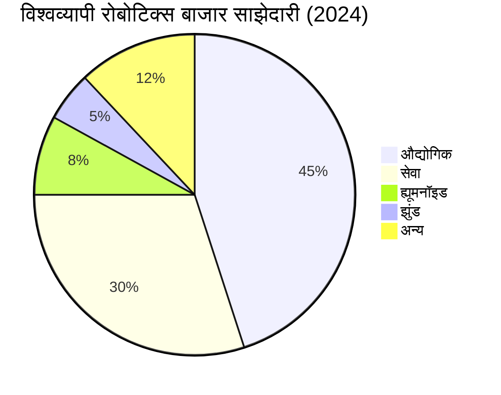
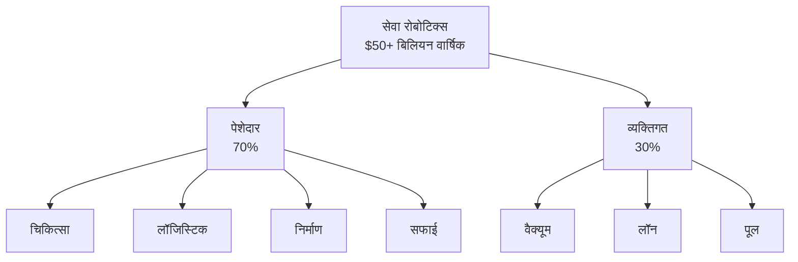
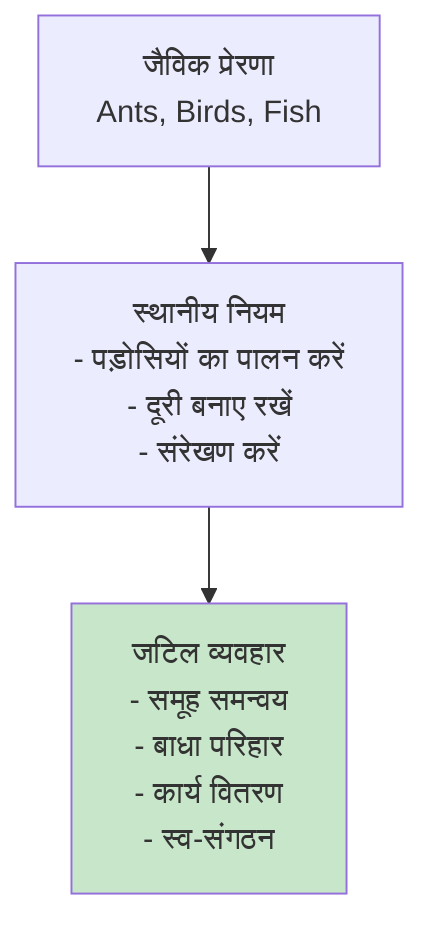
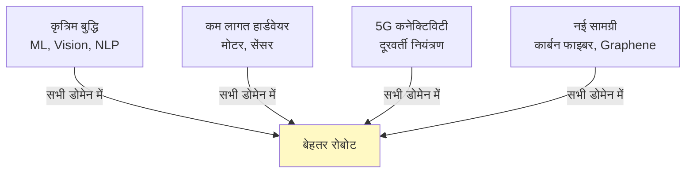

import { Callout } from 'fumadocs-ui/components/callout';
import { Accordion, Accordions } from 'fumadocs-ui/components/accordion';

# रोबोटिक्स के डोमेन

रोबोट अब विभिन्न क्षेत्रों में विविध कार्य करते हैं। आइए विभिन्न डोमेन और उनके विशिष्ट अनुप्रयोगों को समझें।

## रोबोटिक्स डोमेन का सारांश



---

## 1. औद्योगिक रोबोटिक्स

**बाजार:** सबसे परिपक्व और सबसे बड़ा क्षेत्र

### मुख्य प्रकार

<Accordions>
<Accordion title="SCARA रोबोट">
### SCARA: चयनात्मक अनुरूप संयुक्त रोबोट बाहु

**विशेषताएं:**
- 3 DOF (बहुत दक्षता के लिए अनुकूलित)
- उच्च गति, उच्च सटीकता
- क्षैतिज कार्यक्षेत्र के लिए आदर्श
- 5-500 kg पेलोड तक

**अनुप्रयोग:**
- PCB असेंबली
- पिक एंड प्लेस
- मशीन ध्यान
- लाइट असेंबली

**विशिष्ट मॉडल:**
- ABB IRB 910SCARA
- FANUC M-10iD/12
- Stäubli TX2-90

**प्रदर्शन:**
- गति: 400-1000 mm/s
- सटीकता: ±0.05-0.1 mm
- पुनरावृत्ति: ±0.03 mm
</Accordion>

<Accordion title="डेल्टा रोबोट">
### डेल्टा: तीव्र पिक-एंड-प्लेस

**विशेषताएं:**
- समानांतर कार्य
- बहुत तेज़ (200 पिक्स/मिनट तक)
- गोलाकार कार्यक्षेत्र
- 3-10 kg पेलोड

**अनुप्रयोग:**
- खाद्य उद्योग (डिब्बाबंदी, मीठा)
- फार्मास्यूटिकल छंटाई
- पैकेजिंग
- बेकिंग उद्योग

**प्रदर्शन:**
- गति: 300-500 ppm (पिक्स प्रति मिनट)
- सटीकता: ±1-2 mm
- ऊंचाई: 1-1.5 m कार्यक्षेत्र
</Accordion>

<Accordion title="कार्टेसियन (गैंट्री)">
### कार्टेसियन: सरल और सस्ता

**विशेषताएं:**
- 3 रैखिक अक्ष
- सबसे सरल प्रोग्रामिंग
- बहुत टिकाऊ
- 50-1000 kg पेलोड

**अनुप्रयोग:**
- पैलेटाइजिंग
- 3D प्रिंटिंग
- CNC मशीन लोडिंग
- सामग्री हस्तांतरण

**लाभ:**
- कम रखरखाव
- आसान सेटअप
- विश्वसनीय
- किफायती
</Accordion>

<Accordion title="6-अक्ष आर्टिकुलेटेड">
### 6-अक्ष: सबसे बहुमुखी

**विशेषताएं:**
- पूर्ण 6 DOF
- जटिल कार्य संभव
- बड़ा कार्यक्षेत्र
- 20-300 kg पेलोड

**अनुप्रयोग:**
- वेल्डिंग (ऑटोमोटिव)
- पेंटिंग
- सामग्री हैंडलिंग
- असेंबली

**प्रसिद्ध मॉडल:**
- ABB IRB 6700
- FANUC M-900
- KUKA KR 500

**औद्योगिक विचार:**
- पेलोड बढ़ाएं → आकार बढ़ाएं
- सटीकता: ±0.1-0.3 mm विशिष्ट
- जीवनकाल: 10-15 साल
- ROI: 1.5-3 साल
</Accordion>

<Accordion title="सहयोगी (Cobot)">
### सहयोगी: मानव सुरक्षा

**विशेषताएं:**
- बल-सीमित संचालन
- टकराव पहचान
- मानव सहायक के रूप में कार्य
- आसान प्रोग्रामिंग

**सुरक्षा मानक:**
- ISO/TS 15066: बल/टॉर्क सीमाएं
- संपर्क सीमा: सिर > हाथ > हाथ
- तातक समय: 15-20 ms

**अनुप्रयोग:**
- असेंबली (मानव के साथ)
- मशीन ध्यान
- वेल्डिंग (सहायता)
- सामग्री प्रबंधन

**प्रसिद्ध कॉबॉट:**
- Universal Robots UR3/UR10
- Rethink Robotics Baxter
- ABB YuMi

**बाजार:**
- सबसे तेजी से बढ़ने वाला खंड
- 2024 में 15% CAGR
- छोटी फैक्ट्रियों में स्वीकृति बढ़ी
</Accordion>
</Accordions>

### औद्योगिक रोबोटिक्स में तकनीकी चुनौतियां

```mermaid
graph LR
    A["सटीकता"] -->|+ विनिर्माण| B["उत्पाद गुणवत्ता"]
    C["गति"] -->|+ उत्पादकता| B
    D["विश्वसनीयता"] -->|+ पूरे समय| B
    E["लचीलापन"] -->|+ अनुप्रयोग] B
    
    F["लागत"] -.->|विरोध| B
    
    style B fill:#c8e6c9
```

---

## 2. सेवा रोबोटिक्स

**बाजार:** तेजी से बढ़ता क्षेत्र, सामाजिक प्रभाव अधिक

### सेवा रोबोट की श्रेणियां

<Accordions>
<Accordion title="चिकित्सा और स्वास्थ्यसेवा">
### चिकित्सा रोबोटिक्स

**सर्जिकल रोबोट:**
- दा विंची: सबसे व्यापक (लैपरोस्कोपिक सर्जरी)
- सटीकता: ±1 mm से बेहतर
- विशेषता: सर्जन के हाथ की कंपन हटाना
- अनुप्रयोग: हृदय, गायनेकोलॉजी, यूरोलॉजी

**पुनर्वास रोबोट:**
- प्रोस्थेटिक्स सहायता
- व्यायाम सहायक
- वॉकिंग प्रशिक्षण

**सहायक रोबोट:**
- व्हीलचेयर
- सीढ़ियां चढ़ने में मदद
- दवा वितरण

**नर्सिंग रोबोट:**
- रोगी मनोबल बढ़ाता है
- मानव नर्सों के साथ साथ काम करता है
- निरीक्षण कार्य
</Accordion>

<Accordion title="होटल और आतिथ्य">
### आतिथ्य रोबोट

**फ्रंट डेस्क:**
- Pepper (SoftBank): वार्तालाप और निर्देशन
- चेक-इन सहायता
- भाषा अनुवाद

**कक्ष सेवा:**
- सफाई रोबोट
- व्यंजन वितरण
- लॉन्ड्री सॉर्टिंग

**रेस्तरां:**
- डिलीवरी ड्रोन
- टेबल सेवा (चीन में लोकप्रिय)
- रसोई सहायता

**मूल्य प्रस्ताव:**
- श्रम लागत में कमी
- 24/7 उपलब्धता
- ब्रांड विभेदीकरण
- पर्यटकों का आकर्षण
</Accordion>

<Accordion title="पर्यावरण और कृषि">
### कृषि रोबोटिक्स

**फसल प्रबंधन:**
- फसल की निगरानी ड्रोन
- खरपतवार को पहचानना और हटाना (AI + रोबोट)
- सटीक सिंचाई
- ड्रोन से कीटनाशक छिड़काव

**फसल कटाई:**
- स्ट्रॉबेरी बीनने रोबोट (डेनमार्क में)
- सेब के पेड़ की कटाई
- दाख की बारी की कटाई
- टमाटर की तुलाई

**पशुधन:**
- सुअर/गाय की निगरानी रोबोट
- स्वचालित दुहने की प्रणाली
- पशु स्वास्थ्य ट्रैकिंग

**पर्यावरणीय लाभ:**
- सटीक रसायन उपयोग
- कम अपशिष्ट
- मिट्टी संरक्षण
</Accordion>

<Accordion title="शिक्षा और अनुसंधान">
### शैक्षिक रोबोट

**प्रारंभिक शिक्षा:**
- LEGO Robotics
- Bee-Bot (पूर्वस्कूल कोडिंग)
- NAO (सामाजिक इंटरैक्शन)

**उच्च शिक्षा:**
- शोध प्रोटोटाइप
- कक्षा में व्यावहारिक सीखना
- उद्योग-शैक्षणिक परियोजनाएं

**विकलांग छात्र:**
- सहायक रोबोट
- संचार सहायता
- गतिशीलता सहायता

**लाभ:**
- STEM रुचि बढ़ाएं
- व्यावहारिक कौशल
- समस्या-समाधान क्षमता
</Accordion>

<Accordion title="खोज और बचाव">
### आपातकालीन सेवा रोबोट

**आपातकालीन प्रतिक्रिया:**
- भूकंप बचाव ड्रोन
- जंगल की आग अग्रिम खुफिया
- खोज और बचाव कैनाइन
- विस्फोटक निपटान

**लाभ:**
- मानव अग्निशामकों को खतरे से बचाएं
- तेजी से अनुसंधान
- कम संसाधन
- बेहतर परिणाम

**तकनीकें:**
- AI छवि पहचान
- गंध संवेदना (सेंसर)
- जीपीएस + संचार
- संरचनात्मक विश्लेषण (AI)
</Accordion>
</Accordions>

### सेवा रोबोटिक्स बाजार (2024)



---

## 3. ह्यूमनॉइड रोबोटिक्स

**बाजार:** तकनीकी रूप से सबसे चुनौतीपूर्ण, भविष्य की संभावना अधिक

### ह्यूमनॉइड रोबोट के अग्रदूत

<Accordions>
<Accordion title="बॉस्टन डायनामिक्स एटलस">
### Atlas: अमानवीय गतिशीलता

**विशेषताएं:**
- ऊंचाई: 1.5 m
- वजन: 80 kg
- 28 DOF (प्रति पैर 10, धड़ 6, बाहु 2)
- बैटरी: 24 घंटे

**क्षमताएं:**
- भूकंपीय इलाके पर दौड़ना
- सीढ़ियां चढ़ना
- अलग-अलग ऊंचाई के ऑब्जेक्ट पकड़ना
- गिरने से स्वयं को बचाना

**मानव-जैसी विशेषताएं:**
- द्विपादीय चलना
- बैलेंस रिकवरी
- पल्सेटाइल बल
- गतिविधि समन्वय

**सीमाएं:**
- अभी भी असंरचित अंतराल में कमजोर
- बहुत महंगा (अनुमानित $2M)
- एक बार चार्ज में सीमित समय
</Accordion>

<Accordion title="टोयोटा T-HR3">
### T-HR3: टेलीऑपरेशन केंद्रित

**विशेषताएं:**
- ऊंचाई: 1.5 m
- प्रस्तुति टेलीऑपरेटेड
- दूरवर्ती ऑपरेटर का अनुकरण करता है
- 32 DOF (अति-विस्तारित हाथ)

**अनुप्रयोग:**
- बिल्डर अमीन (असंभव) काम
- चिकित्सा सहायता (दूर से)
- खतरनाक परिवेश
- आपातकालीन सेवा

**निर्माण दर्शन:**
- मानव हस्तक्षेप बनाएं
- मानव-रोबोट मिरर
- बेहतर सुरक्षा
</Accordion>

<Accordion title="सोफिया और अन्य सामाजिक रोबोट">
### सामाजिक इंटरैक्शन रोबोट

**विशेषताएं:**
- मानव-जैसी सीमा (चेहरे)
- भाषा समझ (NLP)
- भावनात्मक जवाब
- सांस्कृतिक जागरूकता

**अनुप्रयोग:**
- ग्राहक सेवा
- शैक्षिक सहायक
- वृद्ध देखभाल
- सामाजिक अनुसंधान

**चुनौतियां:**
- भावनात्मक कनेक्शन अभी भी "ढोंग"
- प्राकृतिक भाषा अभी भी सीमित
- सांस्कृतिक संवेदनशीलता जटिल है
- ग्राहक उम्मीदें अक्सर बहुत अधिक
</Accordion>
</Accordions>

### ह्यूमनॉइड डिजाइन के कारण

**क्यों मानव का आकार?**
1. **पर्यावरण:** मानव-निर्मित दुनिया मानव आकार के लिए डिजाइन की गई
2. **संचार:** मानव समझ सकते हैं चेहरा, हाथ इशारे
3. **कौशल स्थानांतरण:** मानव कार्य से सीखना आसान
4. **मनोविज्ञान:** हम ऐसी चीजें पसंद करते हैं जो हमारे जैसे दिखें (अमानवीय घाटी छोड़ो)

**चुनौतियां:**
- बहुत जटिल (1000+ अनुमानित मांसपेशियां)
- शारीरिक रूप से अक्षम (विशिष्ट उद्देश्य के लिए)
- ऊर्जा अक्षम
- नियंत्रण शिक्षण वक्र खड़ी

---

## 4. झुंड रोबोटिक्स

**अवधारणा:** कई सरल रोबोट एक साथ जटिल व्यवहार प्रदर्शन करते हैं

### झुंड सिद्धांत



### वास्तविक अनुप्रयोग

<Accordions>
<Accordion title="सैन्य और रक्षा">
### सैन्य झुंड अनुप्रयोग

**टोही:**
- ड्रोन झुंड निगरानी के लिए
- समन्वित खोज और नक्शा
- दुश्मन ठिकानों का पता लगाना
- विरोध के साथ निरीक्षण

**लड़ाकू क्षमताएं:**
- समन्वित हमले (नैतिक मुद्दे!)
- रक्षा प्रणाली
- संपत्ति संरक्षण
- बुद्धि जमा करना

**विभिन्न:** विभिन्न सेंसर टाइप बेड़े में विविध दृष्टिकोण प्रदान करते हैं
</Accordion>

<Accordion title="खोज और बचाव">
### आपातकालीन सेवा झुंड

**भूकंप अनुप्रयोग:**
- ड्रोन बेड़े को मलबा स्कैन करता है
- पीड़ितों का पता लगाने के लिए सेंसर (थर्मल + तुरही)
- संचार रिले
- रास्तों का नक्शा खतरनाक क्षेत्र में

**जंगल की आग:**
- फायर लाइन मानचित्र
- तापमान निगरानी
- मानव फायरफाइटर को निर्देशित करें
- बदलती परिस्थितियों में अनुकूल

**लाभ:**
- मानव जोखिम कम करें
- तेजी से कवरेज
- प्रत्यावर्तन (एक ड्रोन विफल होता है, बाकी कार्य जारी)
</Accordion>

<Accordion title="पर्यावरण निगरानी">
### ईकोलॉजिकल अध्ययन

**वन्यजीव ट्रैकिंग:**
- झुंड के रूप में जानवरों का अनुसरण करें
- न्यूनतम व्यवधान
- आवास मानचित्र
- जनसंख्या डेटा

**पारिस्थितिकी तंत्र स्वास्थ्य:**
- मृत्यु दर लॉगिंग क्षेत्र में
- जलीय पारिस्थितिकी तंत्र की निगरानी
- मिट्टी परीक्षण (ग्राउंड रोबोट)
- संदूषण मानचित्र

**जलवायु अनुसंधान:**
- ग्लेशियर विकास
- बर्फ शीट गतिशीलता
- महासागर तापमान प्रोफाइल (पानी के नीचे ड्रोन)
</Accordion>

<Accordion title="गोदाम और लॉजिस्टिक">
### वाणिज्यिक झुंड

**Kiva (अब Amazon Robotics):**
- सेल्फ-ड्राइविंग पॉड
- सेल्फ-संगठनकारी नेटवर्क
- 500K+ रोबोट अमेजन गोदाम में
- आंखों के अदृश्य पहचान के साथ

**फायदे:**
- श्रम लागत 55% तक कम
- सही समय पर सही आइटम
- 4x तेजी से पूरा
- कर्मचारी की दुर्घटना में कमी

**अन्य अनुप्रयोग:**
- डिलीवरी ड्रोन बेड़े
- कृषि सफाई झुंड (सरल)
- सेंसर नेटवर्क (तकनीकी रूप से रोबोट नहीं है)
</Accordion>
</Accordions>

---

## 5. अन्य उभरते डोमेन

### अंतरिक्ष रोबोटिक्स

**चंद्रमा अन्वेषण:**
- Chang'e (चीन): चंद्र सतह नमूनाकरण
- Jadé (USA): वापसी के लिए नमूना संग्रह

**मंगल खोज:**
- Perseverance rover
- उड़ने वाली ड्रोन (Ingenuity)
- नमूना विश्लेषण
- मानव मिशन की तैयारी

**चुनौतियां:**
- विलंब संचार (सेकंड से मिनट)
- अत्यधिक तापमान (-150°C मंगल पर)
- रेत/धूल क्षति
- विकिरण प्रतिरोध

### समुद्र अन्वेषण

**गहराई में रोबोट:**
- 11,000 m गहराई तक (Mariana Trench)
- कार्बन फाइबर सुरक्षा
- दबाव प्रतिरोध
- विशेष तरल
- जीवन विज्ञान नमूनाकरण

**पारिस्थितिकी तंत्र:**
- हाइड्रोथर्मल वेंट अन्वेषण
- ज्वालामुखी गतिविधि
- समुद्र तल जैव विविधता

### सूक्ष्म रोबोटिक्स

**मेडिकल:**
- कण चिकित्सा वितरण
- स्पष्ट शल्य चिकित्सा
- ऊतक मरम्मत नैनो-स्तर पर

**औद्योगिक:**
- सूक्ष्म संयोजन
- पीसीबी निरीक्षण
- क्वांटम उपकरण निर्माण

---

## क्रॉस-डोमेन प्रौद्योगिकी



---

## भविष्य की दृष्टि

### 2030 का अनुमान

| डोमेन | 2024 | 2030 | वृद्धि |
|-------|------|------|--------|
| **औद्योगिक** | $45B | $75B | 67% |
| **सेवा** | $30B | $120B | 300% |
| **ह्यूमनॉइड** | $3B | $25B | 733% |
| **झुंड** | $2B | $10B | 400% |

### प्रमुख रुझान

<Callout type="success" title="भविष्य की दिशा">
1. **सहयोग:** मानव-रोबोट सहजीवन मानदंड बन जाएगा
2. **स्वायत्तता:** अधिक रोबोट सर्वोच्च व्यायाम में स्वायत्त होंगे
3. **नैतिकता:** सामाजिक स्वीकृति सबसे बड़ी चुनौती बन जाएगी
4. **दक्षता:** ऊर्जा कुशलता और पुनर्चक्रण महत्वपूर्ण होंगे
5. **विविधता:** नई डोमेन (कृषि, पर्यावरण) सेवा से अधिक बढ़ेंगे
</Callout>

---

**आगे की पढ़ाई:**
- "रोबोटिक्स: विजन टू कोबोटिक्स" - Siciliano & Khatib
- "इंडस्ट्रियल रोबोटिक्स" - Niku (3rd Edition)
- "स्वार्म रोबोटिक्स" - Şahin & Spears (2018)