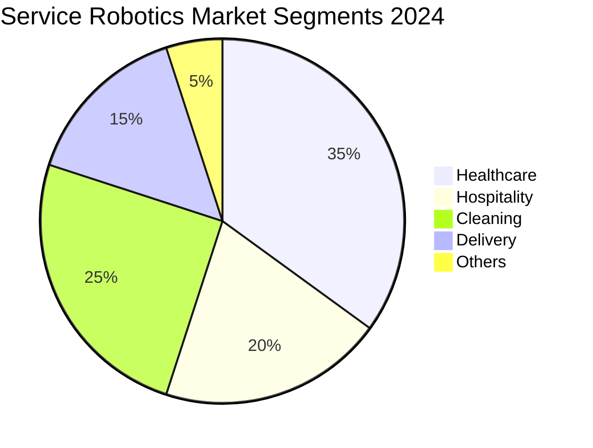
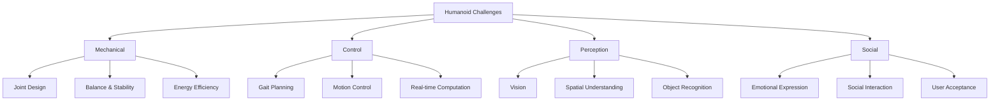
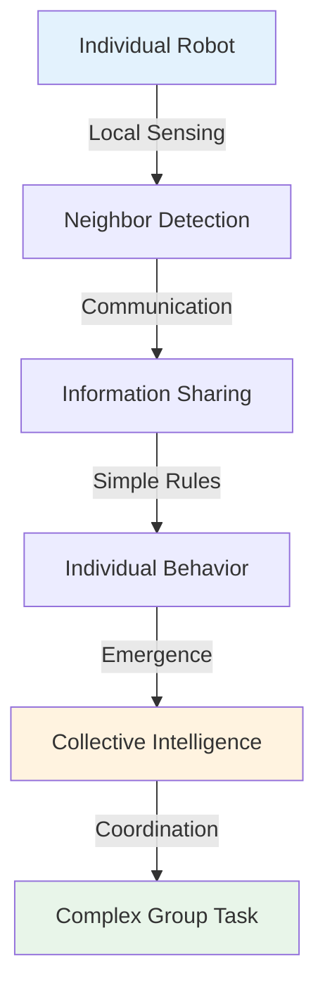

import { Callout } from 'fumadocs-ui/components/callout';
import { Accordion, Accordions } from 'fumadocs-ui/components/accordion';
import { Tab, Tabs } from 'fumadocs-ui/components/tabs';

# Domains of Robotics

Robotics applications span diverse domains, each with unique requirements, challenges, and technical specifications. Understanding these domains helps identify appropriate robotic solutions for different problems.

## Five Major Domains

<Accordions>
<Accordion title="Industrial Robotics">
Industrial robots revolutionized manufacturing by providing precision, consistency, and safety improvements in production environments.

### Overview

Industrial robots are designed for manufacturing and production environments, emphasizing:
- Extreme precision and repeatability
- High speed and throughput
- Reliability and durability
- Harsh environment tolerance
- Integration with production systems

### Key Applications

**Assembly Operations:**
- Electronic assembly (PCB, components)
- Automotive assembly (body, engine, chassis)
- Appliance assembly (motors, panels)
- Consumer product assembly

**Material Handling:**
- Palletizing and depalletizing
- Material stacking
- Part transfer between machines
- Heavy load movement (500+ kg)

**Processing:**
- Welding (spot, arc, laser)
- Painting and coating
- Grinding and finishing
- Cutting and trimming
- CNC machine tending

**Quality Control:**
- Visual inspection
- Dimensional measurement
- Defect detection
- Product testing
- Traceability verification

### Common Robot Types

**Articulated Robots (6-axis arms):**
- Most versatile configuration
- Resembles human arm with 6 joints
- Can reach around obstacles
- Typical payload: 50-300 kg
- Accuracy: ±0.05mm

**SCARA Robots:**
- Selective Compliance Assembly Robot Arm
- 4 axes (2 rotational, 1 prismatic, 1 rotational)
- Fast, high-precision assembly
- Compact workspace
- Ideal for small electronics assembly

**Delta Robots (Parallel Robots):**
- 3 parallel arms
- Very fast movement
- Lightweight design
- Ideal for pick-and-place operations
- Food, pharmaceutical, electronics

**Cartesian Robots (Gantry):**
- Linear motion on X, Y, Z axes
- Large workspace
- Good for repetitive operations
- Material handling and machine tending
- Sawing, drilling, welding lines

**Collaborative Robots (Cobots):**
- Designed to work alongside humans
- Force-limiting technology
- Safe interaction
- Flexible programming
- Smaller payloads (3-20 kg)

### Industrial Robot Specifications

**Precision:**
- Repeatability: ±0.03-0.1mm
- Accuracy: ±0.5-2mm
- Resolution: 0.01mm

**Performance:**
- Speed: 50-300+ movements per minute
- Payload: 1-500+ kg
- Reach: 0.5-3+ meters
- Cycle time: 1-60+ seconds

**Reliability:**
- MTBF (Mean Time Between Failures): 40,000+ hours
- Uptime: 95%+ availability
- Service life: 10-15+ years
- Maintenance cycles: 1,000-10,000 hours

### Economic Impact

<Callout type="success" title="Industrial Robotics Benefits">
- **Productivity:** 20-50% production increase
- **Quality:** 99%+ defect reduction
- **Safety:** 50%+ injury reduction
- **ROI:** Payback in 2-5 years typically
- **Global Market:** Over $50 billion annually
</Callout>

### Challenges

- High capital investment
- Complex integration and programming
- Requires trained technicians
- Job displacement concerns
- Adaptation to product changes
- Safety training and protocols

</Accordion>

<Accordion title="Service Robotics">
Service robots work in human-centric environments, assisting with tasks ranging from cleaning to healthcare support.

### Overview

Service robots operate in non-manufacturing settings, designed for:
- Human interaction and proximity
- Dynamic, unstructured environments
- Variety of tasks
- Accessibility and ease of use
- Safety around people

### Robot Categories

**Personal Service Robots:**
- Robotic vacuum cleaners (Roomba, Neato)
- Lawn mowing robots
- Window cleaning robots
- Pool cleaning robots
- Gutter cleaning robots

**Professional Service Robots:**
- Delivery robots (Fetch & Carry, Waymo delivery)
- Security and patrol robots
- Hospitality robots (reception, concierge)
- Cleaning service robots (commercial)
- Inspection robots (infrastructure)

**Medical Service Robots:**
- Telepresence robots for remote consultations
- Disinfection robots (UV, electrostatic)
- Rehabilitation robots
- Wheelchair assistive robots
- Hospital transport robots (autonomous)
- Elderly care companion robots

### Key Applications

**Healthcare:**
- Medication delivery
- Patient monitoring
- Rehabilitation therapy
- Elderly companionship
- Surgery assistance (teleoperated)
- Hospital logistics

**Hospitality & Retail:**
- Room delivery and service
- Restaurant ordering and delivery
- Hotel concierge services
- Retail inventory checking
- Customer service assistance

**Logistics & Delivery:**
- Last-mile package delivery
- Warehouse sorting and transport
- Restaurant food delivery
- Medical supply distribution
- E-commerce fulfillment

**Cleaning & Maintenance:**
- Office and mall cleaning
- Window and building maintenance
- Street cleaning
- Solar panel cleaning
- Gutter and roof maintenance

**Entertainment & Education:**
- Social robots for children
- Museum tour guides
- Educational assistants
- Entertainment companions
- Theme park interactions

### Market Growth

### Challenges

- Safety around unpredictable humans
- Robust perception in varied environments
- Natural human-robot interaction
- Cost reduction for consumer market
- Regulatory compliance and liability
- Social acceptance and ethics
- Power and battery management

<Callout type="info" title="Service Robotics Growth">
The service robotics market is growing 15-20% annually, outpacing industrial robotics. By 2030, service robots are expected to exceed industrial robots in economic value.
</Callout>

</Accordion>

<Accordion title="Humanoid Robotics">
Humanoid robots mimic human form and movement, designed to operate naturally in human environments.

### Overview

Humanoid robots feature:
- Bipedal locomotion (two-legged walking)
- Anthropomorphic body structure
- Two arms with multi-jointed hands
- Head with human-like features
- Human-scale workspace
- Natural interaction modalities

### Design Philosophy

**Why Humanoid Form?**
- Operate in human-designed environments
- Use same tools and infrastructure
- Natural human-robot interaction
- Intuitive communication
- Psychological comfort

**Challenges of Humanoid Design:**
- Balance and dynamic stability
- Energy efficiency (walking is expensive)
- Complex control algorithms
- Dexterous manipulation
- Social acceptance

### Notable Humanoid Robots

**Boston Dynamics' Atlas:**
- Advanced mobility (parkour, climbing)
- High-speed locomotion
- Research and development platform
- ~2 hours battery life
- Industrial application focus

**Honda's ASIMO:**
- First humanoid with natural walking
- Stair climbing capability
- Social interaction
- Healthcare and hospitality roles
- Discontinued, but pioneering achievement

**SoftBank's Pepper:**
- Social and emotional robot
- Emotion recognition
- Conversational abilities
- Retail and hospitality use
- 12-hour battery life

**Tesla's Optimus:**
- General-purpose humanoid
- AI-powered decision making
- Manual dexterity improvements
- Mass production goals
- Future manufacturing assistant

**Figure AI's Figure 01:**
- Industrial-focused humanoid
- Warehouse and manufacturing tasks
- 5-6 foot height
- High load capacity
- Commercial deployment aim

### Applications

**Industrial:**
- Assembly and manufacturing
- Handling tasks in human workspaces
- Equipment tending
- Material processing

**Service:**
- Healthcare and elderly care
- Hospital assistant tasks
- Reception and customer service
- Hotel concierge duties

**Hazardous Environment:**
- Nuclear facility inspection
- Disaster response
- Fire rescue operations
- Chemical facility management

**Research & Development:**
- Robotics advancement
- AI algorithm testing
- Human-robot interaction studies
- Motion capture and biomimetics

### Technical Challenges

### Future of Humanoid Robots

- More dexterous manipulation
- Improved energy efficiency
- Better social interaction
- Mass production and cost reduction
- Widespread deployment by 2030s
- Integration into human society

</Accordion>

<Accordion title="Swarm Robotics">
Swarm robotics uses large numbers of simple robots with coordinated behavior to accomplish complex tasks.

### Overview

Swarm robotics principles:
- Decentralized control (no central authority)
- Local communication (robot-to-neighbor)
- Simple individual rules
- Emergent complex behavior
- Scalability and robustness
- Nature-inspired coordination

### Biological Inspiration

**Ant Colonies:**
- Pheromone-based communication
- Foraging optimization
- Cooperative nest building
- Self-organization

**Bee Swarms:**
- Waggle dance communication
- Collective decision making
- Efficient resource discovery
- Distributed problem solving

**Bird Flocks:**
- Flocking algorithms
- Collision avoidance
- Group navigation
- Predator evasion

### Key Principles

**1. Decentralization:**
- No central command
- Each robot follows local rules
- Resilient to individual failures

**2. Simplicity:**
- Individual robots are simple
- Limited sensors and computation
- Easy to manufacture and deploy

**3. Communication:**
- Local, short-range communication
- Message passing (direct)
- Stigmergy (environmental modification)

**4. Emergence:**
- Complex behavior emerges from simple rules
- No explicit programming of group behavior
- Self-organization

### Applications

**Environmental Monitoring:**
- Swarms for sensing coverage
- Pollution detection
- Forest fire monitoring
- Air quality mapping

**Search & Rescue:**
- Disaster zone exploration
- Missing person search
- Rapid area coverage
- Coordinated mapping

**Agriculture:**
- Crop monitoring and spraying
- Precision agriculture
- Field mapping
- Pest control

**Construction:**
- Collective assembly
- Collective transportation
- Structural building
- Reconfigurable structures

**Warehouse & Logistics:**
- Multi-robot coordination
- Path optimization
- Distributed storage retrieval
- Dynamic reorganization

### Advantages

- **Robustness:** Single robot failure doesn't affect swarm
- **Scalability:** Add/remove robots as needed
- **Flexibility:** Adapt to different environments
- **Cost:** Individual robots are cheap
- **Fault tolerance:** Inherent redundancy

### Current Challenges

- Coordination complexity
- Emergent behavior unpredictability
- Communication overhead
- Difficult performance guarantees
- Limited real-world deployment

<Callout type="success" title="Swarm Future">
Swarm robotics is transitioning from research to practical applications. Companies like Amazon exploring warehouse swarms and startups developing agricultural swarms show commercial viability.
</Callout>

</Accordion>

<Accordion title="Mobile Robotics">
Mobile robots navigate and move through environments to accomplish tasks across ground, air, water, and space domains.

### Ground Robots

**Wheeled Robots:**
- Differential drive (two independent wheels)
- Ackermann steering (car-like front wheels)
- Mecanum wheels (omni-directional)
- Tracked systems (tank-like)
- Advantages: Speed, efficiency on flat surfaces
- Disadvantages: Limited on terrain

**Legged Robots:**
- Bipedal: Walking like humans
- Quadrupedal: Four-legged locomotion
- Hexapodal: Six-legged systems
- Advantages: Excellent terrain adaptability
- Disadvantages: Complex control, energy intensive

**Hybrid Systems:**
- Wheels + legs combination
- Adaptive to varied terrain
- Better stability and flexibility

### Aerial Robots

**Fixed-Wing Drones:**
- Long endurance (4+ hours)
- High speed (80+ mph)
- Fuel or battery powered
- Applications: Mapping, surveillance, delivery
- Challenges: Limited loitering, takeoff/landing

**Multi-Rotor Drones:**
- Quadcopters (4 rotors) - most common
- Hexacopters (6 rotors) - heavier loads
- Octocopters (8 rotors) - professional grade
- Advantages: Vertical takeoff, agility
- Disadvantages: Limited flight time (20-45 min)

**Hybrid VTOL:**
- Vertical takeoff capability
- Fixed-wing efficiency
- Long range + loitering
- Emerging technology

**Lighter-Than-Air:**
- Blimps and balloons
- Extended flight time
- Stable platforms
- Limited maneuverability

### Aquatic Robots

**Autonomous Underwater Vehicles (AUVs):**
- Pre-programmed missions
- No real-time communication
- Scientific research
- Extended underwater time (hours)

**Remotely Operated Vehicles (ROVs):**
- Tethered umbilical cord
- Real-time control
- Deep-sea exploration
- High precision operation

**Surface Vessels (ASVs):**
- Autonomous surface ships
- Long-distance missions
- Oceanographic research
- Cargo transport potential

### Space Robots

**Planetary Rovers:**
- Mars: Perseverance, Curiosity
- Navigation on alien terrain
- Scientific sample collection
- Semi-autonomous due to communication latency

**Satellite Servicing:**
- On-orbit maintenance
- Space station resupply
- Debris removal
- Future infrastructure

### Applications Across Domains

| Domain | Robot Type | Primary Use |
|--------|-----------|------------|
| **Military** | Aerial, Ground | Reconnaissance, EOD |
| **Agriculture** | Ground, Aerial | Crop monitoring, spraying |
| **Search & Rescue** | All types | Disaster response |
| **Scientific** | All types | Research & exploration |
| **Commercial** | Ground, Aerial | Delivery, logistics |
| **Inspection** | All types | Infrastructure monitoring |

### Technical Challenges

**Navigation:**
- Localization and mapping (SLAM)
- GPS denied environments
- Real-time path planning
- Obstacle avoidance

**Perception:**
- Diverse sensor integration
- Environmental understanding
- Object detection and tracking
- Decision making in real-time

**Control:**
- Dynamic balance and stability
- Energy efficiency
- Coordinated multi-robot systems
- Adaptive behaviors

**Communication:**
- Range limitations
- Latency issues
- Bandwidth constraints
- Network robustness

</Accordion>
</Accordions>

## Cross-Domain Technologies

Several technologies span multiple robot domains:

**Common Enablers:**
- Computer vision and image processing
- SLAM (Simultaneous Localization and Mapping)
- Motion planning algorithms
- Machine learning and AI
- ROS (Robot Operating System)
- Sensor fusion techniques

## Future Domains

Emerging robotics domains include:

**Soft Robotics:**
- Compliant materials
- Safe human interaction
- Adaptable structures
- Biomimetic designs

**Biomedical Robotics:**
- Implantable robots
- Nanorobots
- Targeted drug delivery
- Surgical micro-assistants

**Quantum Robotics:**
- Future computing substrate
- Quantum-enhanced perception
- Novel control algorithms

---

**Further Reading:**
- "Robotics: Vision and Control" by Peter Corke
- IEEE Robotics and Automation Society publications
- Domain-specific journals: Int'l Journal of Industrial Robotics, Service Robotics, Autonomous Robots