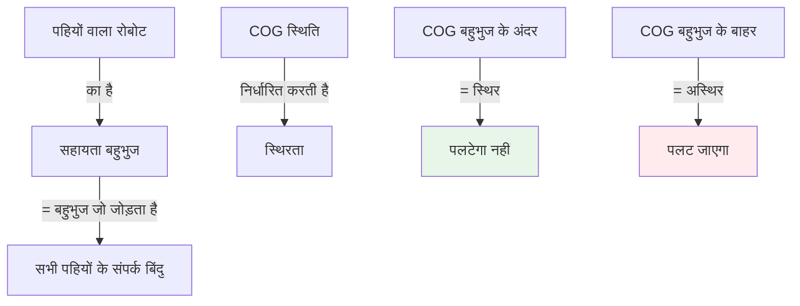
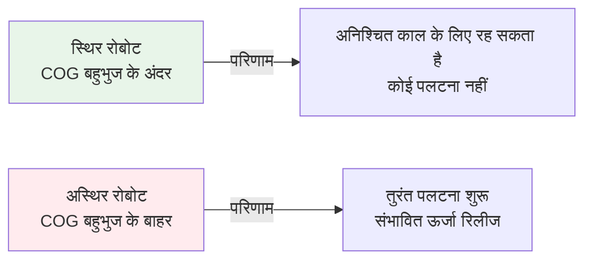

import { Callout } from 'fumadocs-ui/components/callout';
import { Tab, Tabs } from 'fumadocs-ui/components/tabs';
import { Accordion, Accordions } from 'fumadocs-ui/components/accordion';
import { Step, Steps } from 'fumadocs-ui/components/steps';

# गुरुत्व केंद्र और स्थिरता

गुरुत्व केंद्र (COG), जिसे द्रव्यमान का केंद्र भी कहा जाता है, वह बिंदु है जहां किसी वस्तु का संपूर्ण वजन कार्य करता है माना जा सकता है। रोबोट के लिए, COG की स्थिति स्थिरता, संतुलन और प्रदर्शन के लिए महत्वपूर्ण है। COG को समझना और अनुकूलित करना ऐसे रोबोट डिजाइन करने के लिए आवश्यक है जो पलट न जाएं और विश्वसनीय तरीके से काम करें।

## गुरुत्व केंद्र को समझना

### गुरुत्व केंद्र क्या है?

**परिभाषा:** वह बिंदु जो किसी वस्तु में सभी द्रव्यमान की औसत स्थिति को दर्शाता है, प्रत्येक तत्व के द्रव्यमान के अनुसार भारित।

**भौतिक अर्थ:**
- यदि आप रोबोट को एक एकल बिंदु पर संतुलित कर सकते हैं, तो वह बिंदु COG होगा
- गुरुत्वाकर्षण इस एकल बिंदु पर कार्य करता है
- सभी वजन गणनाएं इस बिंदु का उपयोग कर सकती हैं

### COG स्थिति की गणना

**2D गणना:**

```
X_cog = Σ(m_i × x_i) / Σ(m_i) = Σ(m_i × x_i) / M_total
Y_cog = Σ(m_i × y_i) / Σ(m_i) = Σ(m_i × y_i) / M_total
```

**3D गणना:**

बस Z निर्देशांक जोड़ें:
```
Z_cog = Σ(m_i × z_i) / M_total
```

### व्यावहारिक उदाहरण

एक सरल रोबोट का COG calculate करें:

| घटक | द्रव्यमान (किग्रा) | X (मी) | Y (मी) |
|-----------|----------|-------|-------|
| चैसिस | 8.0 | 0.25 | 0.10 |
| बैटरी | 3.0 | 0.25 | 0.05 |
| मोटर 1 | 0.5 | 0.10 | 0.15 |
| मोटर 2 | 0.5 | 0.40 | 0.15 |
| इलेक्ट्रॉनिक्स | 0.5 | 0.25 | 0.20 |
| **कुल** | **12.5** | - | - |

**गणना:**

```
X_cog = (8.0×0.25 + 3.0×0.25 + 0.5×0.10 + 0.5×0.40 + 0.5×0.25) / 12.5
      = (2.0 + 0.75 + 0.05 + 0.20 + 0.125) / 12.5
      = 3.125 / 12.5
      = 0.25 मी

Y_cog = (8.0×0.10 + 3.0×0.05 + 0.5×0.15 + 0.5×0.15 + 0.5×0.20) / 12.5
      = (0.80 + 0.15 + 0.075 + 0.075 + 0.10) / 12.5
      = 1.2 / 12.5
      = 0.096 मी ≈ 0.1 मी
```

**परिणाम:** COG (0.25 मी, 0.10 मी) पर है - केंद्र X, बहुत कम Y (स्थिरता के लिए अच्छा!)

---

## स्थिरता सिद्धांत

स्थिरता COG की स्थिति और रोबोट के सहायता आधार के बीच संबंध पर निर्भर करती है।

### सहायता बहुभुज



**विभिन्न रोबोट के लिए सहायता बहुभुज:**

| रोबोट प्रकार | सहायता बहुभुज | विशिष्ट मार्जिन |
|----------|-----------------|-----------------|
| **2-पहिया (संतुलित)** | लाइन (पहियों के बीच) | 0% (कोई मार्जिन नहीं) |
| **3-पहिया** | त्रिकोण | 10-30% विशिष्ट |
| **4-पहिया (कार)** | आयत | 20-40% विशिष्ट |
| **चतुर्पद** | त्रिकोण (3 पैर मुद्रा) | 15-25% विशिष्ट |
| **षट्पद** | बहुभुज (3+ पैर) | 25-40% विशिष्ट |

### स्थैतिक स्थिरता

**स्थैतिक स्थिरता की शर्त:**

COG का ऊर्ध्वाधर प्रक्षेपण सहायता बहुभुज के अंदर (या बहुत करीब) होना चाहिए।



**स्थिरता मार्जिन:**

```
मार्जिन = COG प्रक्षेपण से बहुभुज किनारे तक न्यूनतम दूरी
```

**विशिष्ट सुरक्षा मार्जिन:**
- औद्योगिक रोबोट: आधार चौड़ाई का 20-25%
- प्रतियोगिता रोबोट: 10-15% (अधिक आक्रामक)
- पैरों वाले रोबोट: 15-30% चाल के अनुसार

<Callout type="warn" title="शून्य मार्जिन = अस्थिर">
शून्य स्थिरता मार्जिन वाला रोबोट पलटने की सीमा पर है। कोई भी छोटा विक्षोभ पलटना का कारण बनता है। हमेशा सुरक्षा मार्जिन के साथ डिजाइन करें।
</Callout>

### त्वरण के दौरान गतिशील स्थिरता

जब कोई रोबोट त्वरित होता है, तो जड़ता प्रभावी COG को स्थानांतरित करती है:

```
COG_प्रभावी = COG_वास्तविक + (a × h) / g
```

जहां:
- **a** = रैखिक त्वरण (m/s²)
- **h** = जमीन के ऊपर COG की ऊंचाई (m)
- **g** = गुरुत्वाकर्षण (9.81 m/s²)

**उदाहरण: रोबोट ब्रेकिंग**

0.3 मी ऊंचाई वाला रोबोट 5 m/s² पर गति कम कर रहा है:

```
आगे की ओर बदलाव = (5 × 0.3) / 9.81 = 0.153 मी

प्रभावी COG 15 सेमी आगे की ओर स्थानांतरित होता है!
```

यदि रोबोट के पास पीछे की ओर केवल 10 सेमी स्थिरता मार्जिन है, तो यह तेजी से ब्रेक करते समय पीछे की ओर पलट जाएगा!

### मोड़ते समय स्थिरता

जब मुड़ते समय, अभिकेंद्र बल प्रभावी COG को स्थानांतरित करते हैं:

**महत्वपूर्ण मोड़ने की गति:**

```
v_महत्वपूर्ण = √((g × w) / (2 × d_cog_बाहरी_पहिया))
```

जहां:
- **g** = गुरुत्वाकर्षण (9.81 m/s²)
- **w** = पहियों के बीच की चौड़ाई (m)
- **d_cog_बाहरी_पहिया** = COG से बाहरी पहिया तक की दूरी (m)

**उदाहरण: रोबोट मोड़ना**

- पहियों की चौड़ाई: 0.4 मी
- COG से बाहरी पहिया: 0.2 मी (केंद्रित)
- COG की ऊंचाई: 0.2 मी

```
v_महत्वपूर्ण = √((9.81 × 0.4) / (2 × 0.2))
            = √((3.924) / (0.4))
            = √9.81
            = 3.13 m/s

3.13 m/s से ऊपर की गति पर, यह रोबोट मोड़ते समय पलट जाएगा!
```

**मोड़ने की गति बढ़ाने के लिए:**
1. COG ऊंचाई कम करें (घूर्णन प्रभाव कम करता है)
2. पहियों की चौड़ाई बढ़ाएं (बड़ा सहायता बहुभुज)
3. मोड़ की त्रिज्या कम करें (कम अभिकेंद्र बल)

---

## COG अनुकूलन रणनीतियां

<Accordions>
<Accordion title="COG को कम करना">
### कम क्यों बेहतर है

**कम COG के लाभ:**
- स्थैतिक स्थिरता मार्जिन में वृद्धि
- उच्च अनुमत मोड़ने की गति
- असमान इलाके पर पलटने का बेहतर प्रतिरोध
- बेहतर गति की चिकनाई
- टकराव में कम जोखिम

**COG ऊंचाई के प्रभाव:**

| COG ऊंचाई | स्थिरता | अधिकतम मोड़ गति | टिप्पणियां |
|-----------|-----------|----------------|----------|
| बहुत कम (0.1m) | उत्कृष्ट | उच्च | स्थिर लेकिन सीमित कार्य क्षेत्र |
| कम (0.2m) | अच्छा | मध्य-उच्च | मोबाइल रोबोट के लिए सामान्य |
| मध्यम (0.4m) | मध्यम | माध्यम | मानवीय/लंबे रोबोट |
| उच्च (0.6m+) | खराब | कम | अस्थिर, पलटने का जोखिम |

### COG को कम करने की विधियां

**1. भारी घटकों को निचले स्तर पर माउंट करें:**
- बैटरी को आधार में रखें, ऊपर नहीं
- मोटर को जमीन के करीब स्थित करें
- पेलोड क्षेत्र को चैसिस केंद्र के करीब रखें

**उदाहरण प्रभाव:**

मूल डिजाइन:
- कुल द्रव्यमान: 20 किग्रा
- बैटरी (5 किग्रा) 0.4 मी ऊंचाई पर
- अन्य घटक औसत ऊंचाई: 0.2 मी
- COG_मूल = (5×0.4 + 15×0.2) / 20 = 0.25 मी

बैटरी को नीचे (0.05 मी) स्थानांतरित करें:
```
COG_नया = (5×0.05 + 15×0.2) / 20 = 0.1625 मी
सुधार: 35% कम COG!
```

**2. निम्न-प्रोफाइल डिजाइन का उपयोग करें:**
- कुल ऊंचाई छोटी
- ऊंचाई के अनुपात में चौड़ा आधार
- वितरित वजन

**3. शीर्ष-भारी कॉन्फ़िगरेशन से बचें:**
- ऊपर कैमरा मास्ट: स्थिरता के लिए बुरा
- लंबा एंटीना: बुरा
- ऊपर माउंट किया गया पेलोड: बुरा

**4. सैंडविच आर्किटेक्चर:**
```
┌─────────────────┐
│ सेंसर/संचार   │ ← हल्का, ऊंचा होना ठीक है
├─────────────────┤
│ इलेक्ट्रॉनिक्स | ← माध्यम वजन, मध्य स्तर
├─────────────────┤
│ मोटर, पहिए  │ ← भारी घटक, कम
└─────────────────┘
```
</Accordion>

<Accordion title="COG को केंद्रित करना">
### संतुलित वजन वितरण

**केंद्रित COG के लाभ:**
- सममित हैंडलिंग विशेषताएं
- संतुलित मोड़ (दोनों दिशाओं में समान त्रिज्या)
- कम अंतर टायर पहनना
- सभी पहियों पर बेहतर वजन
- सरलीकृत नियंत्रण

### संतुलन की जांच

**पहियों वाले रोबोट के लिए, प्रत्येक पहिये पर वजन मापें:**

```
बाएं पहिये का वजन ≈ दाएं पहिये का वजन (5-10% के भीतर)
सामने के पहिये का वजन ≈ पिछले पहिये का वजन (4-पहिया के लिए)
```

**विधि: बाथरूम स्केल दृष्टिकोण**

1. सभी पहियों को बाएं स्केल पर रखें
2. प्रत्येक रीडिंग रिकॉर्ड करें
3. पिछले पहियों के लिए दोहराएं
4. कुल की तुलना करें

**यदि असंतुलित है:**
- बैटरी या इलेक्ट्रॉनिक्स को बाएं/दाएं स्थानांतरित करें
- घटक माउंटिंग को पुनर्वितरित करें
- भारी पक्ष में काउंटर वेट जोड़ें

### उदाहरण संतुलन जांच

4-पहिया रोबोट:

| माप | वजन |
|-------------|--------|
| आगे-बाएं पहिया | 3.1 किग्रा |
| आगे-दाएं पहिया | 3.0 किग्रा |
| पीछे-बाएं पहिया | 3.2 किग्रा |
| पीछे-दाएं पहिया | 3.0 किग्रा |
| **कुल** | **12.3 किग्रा** |

विश्लेषण:
- बाएं कुल: 6.3 किग्रा, दाएं कुल: 6.0 किग्रा (95% संतुलित) ✓
- आगे कुल: 6.1 किग्रा, पीछे कुल: 6.2 किग्रा (99% संतुलित) ✓
- अच्छा संतुलन! सममित हैंडलिंग प्रत्याशित ✓
</Accordion>

<Accordion title="गतिशील COG प्रबंधन">
### रोबोटिक मैनिपुलेटर के लिए

जैसे-जैसे भुजा विस्तारित होती है, सिस्टम COG नाटकीय रूप से स्थानांतरित होता है:

```
COG_प्रणाली = (m_आधार × COG_आधार + m_भुजा × COG_भुजा + m_पेलोड × COG_पेलोड) / M_कुल
```

**समस्या: विस्तारित भुजा मोबाइल आधार को पलटती है**

```
भुजा पूरी तरह से खींची गई: सहायता बहुभुज के भीतर COG ✓
भुजा क्षैतिज रूप से विस्तारित: COG आगे की ओर बदलता है
भुजा पूरी तरह से विस्तारित + पेलोड: COG बहुत आगे → पलटने का जोखिम! ✗
```

### क्षतिपूर्ति रणनीतियां

**1. मोबाइल आधार को पुनर्स्थापित करें:**
- जैसे भुजा विस्तारित होती है, आधार को स्वचालित रूप से पीछे की ओर ले जाएं
- सिस्टम COG को सहायता बहुभुज के भीतर रखता है
- रीयल-टाइम COG गणना की आवश्यकता है

**2. काउंटरवेट सिस्टम:**
- विस्तारित भुजा को संतुलित करने वाले पीछे माउंट किए गए वजन
- निष्क्रिय: हमेशा चालू (ऊर्जा बर्बाद करता है)
- सक्रिय: आवश्यकतानुसार चालू/बंद करें

**3. सक्रिय स्थिरीकरण:**
- आंतरिक द्रव्यमान स्थानांतरित करें (जैसे बिल्ली संतुलन)
- जटिल तंत्र, ऊर्जा गहन
- उन्नत प्रणालियों में उपयोग किया जाता है

**4. भुजा विस्तार सीमित करना:**
- वर्तमान पेलोड के लिए अधिकतम पहुंच की गणना करें
- जैसे-जैसे भुजा विस्तारित होती है गति कम करें (गतिशील सीमा)
- सुरक्षा सॉफ्टवेयर पलटने वाली कॉन्फ़िगरेशन को रोकता है

**विशिष्ट सीमाएं:**

| भुजा विस्तार | अधिकतम पेलोड | गति में कमी |
|-------------|-------------|-----------------|
| 0-50% पहुंच | पूरी रेट की गई | 100% |
| 50-70% पहुंच | 75% रेट की गई | 75% |
| 70-85% पहुंच | 50% रेट की गई | 50% |
| >85% पहुंच | 25% रेट की गई | 25% |

### पेलोड ले जाने वाले मोबाइल रोबोट के लिए

**ऑफ-सेंटर पेलोड = स्थिरता जोखिम:**

सेंटरलाइन से 0.3 मी की ओर पेलोड के लिए:

```
COG_ऑफसेट = (पेलोड_द्रव्यमान × ऑफसेट_दूरी) / कुल_द्रव्यमान
```

**शमन:**
- गति कम करें (अधिक स्थिर हैंडलिंग)
- ड्राइविंग शैली को समायोजित करें (हल्के मोड़)
- विपरीत पक्ष पर गिट्टी जोड़ें
- भार को सममित रूप से वितरित करें
</Accordion>

<Accordion title="बहु-विधि कॉन्फ़िगरेशन">
### अनुकूली डिजाइन

कुछ उन्नत रोबोट विभिन्न कार्यों के लिए कॉन्फ़िगरेशन बदलते हैं:

**उदाहरण: कैंची लिफ्ट रोबोट**

**निचली स्थिति (परिवहन):**
- COG ऊंचाई: 0.3 मी
- स्थिरता मार्जिन: 30%
- अधिकतम गति: 2.0 m/s
- अधिकतम मोड़ गति: 1.5 m/s

**ऊंची स्थिति (कार्य):**
- COG ऊंचाई: 1.5 मी
- स्थिरता मार्जिन: 5%
- अधिकतम गति: 0.5 m/s (स्वचालित सीमा)
- अधिकतम मोड़ गति: 0.3 m/s

**स्वचालित नियंत्रण:**
```
यदि कैंची_विस्तारित:
  अधिकतम_गति = 0.5 m/s सेट करें
  अधिकतम_मोड़_गति = 0.3 m/s सेट करें
  स्थिरता_निगरानी सक्षम करें
अन्यथा:
  अधिकतम_गति = 2.0 m/s सेट करें
  अधिकतम_मोड़_गति = 1.5 m/s सेट करें
```

### पुनर्कॉन्फ़िगरेबल रोबोट

कुछ रोबोट शारीरिक रूप से पुनः कॉन्फ़िगरेशन करते हैं:

**परिदृश्य: चढ़ाई रोबोट**
- क्षैतिज मोड: चौड़ा आधार, कम COG, तेज
- लंबवत चढ़ाई मोड: कॉम्पैक्ट, उच्च COG स्वीकार्य (यांत्रिक पकड़ के कारण)
- इलाके का पता लगाने के आधार पर संक्रमण
</Accordion>
</Accordions>

---

## व्यावहारिक COG निर्धारण विधियां

<Tabs items={['CAD गणना', 'भौतिक वजन', 'निलंबन विधि']}>
<Tab value="CAD गणना">
### CAD-आधारित विश्लेषण

**आधुनिक CAD सॉफ्टवेयर का उपयोग करते हुए:**

1. **सभी घटकों को मॉडल करें** सटीक आयामों के साथ
2. **सामग्री गुणों को असाइन करें** (घनत्व) प्रत्येक भाग को
3. **सॉफ्टवेयर स्वचालित रूप से COG गणना करता है**

**लाभ:**
- तेज और सटीक
- कई कॉन्फ़िगरेशन जल्दी से परीक्षण कर सकते हैं
- जटिल आकार आसानी से शामिल करता है
- विनिर्माण भिन्नताओं के लिए खाता है

**नुकसान:**
- विस्तृत CAD मॉडल की आवश्यकता है
- सामग्री घनत्व सटीक होना चाहिए
- आंतरिक घटकों (तारों, आदि) के लिए खाता नहीं है

### मैनुअल गणना विधि

सभी घटकों के साथ स्प्रेडशीट बनाएं:

| भाग | द्रव्यमान (किग्रा) | X (मी) | Y (मी) | Z (मी) | m×X | m×Y | m×Z |
|------|----------|-------|-------|-------|-----|-----|-----|
| चैसिस | 5.0 | 0.25 | 0.10 | 0.15 | 1.25 | 0.50 | 0.75 |
| बैटरी | 2.0 | 0.25 | 0.05 | 0.08 | 0.50 | 0.10 | 0.16 |
| मोटर | 0.8 | 0.20 | 0.15 | 0.10 | 0.16 | 0.12 | 0.08 |
| ... | ... | ... | ... | ... | ... | ... | ... |
| **कुल** | **12.5** | - | - | - | **3.12** | **1.22** | **1.50** |

```
COG_X = 3.12 / 12.5 = 0.250 मी
COG_Y = 1.22 / 12.5 = 0.098 मी ≈ 0.10 मी
COG_Z = 1.50 / 12.5 = 0.120 मी
```

</Tab>

<Tab value="भौतिक वजन">
### निर्मित रोबोट पर COG को मापना

**आवश्यक उपकरण:**
- डिजिटल स्केल (या 2 स्केल)
- समतल सतह
- पूरी तरह से इकट्ठा किया गया रोबोट

**2-स्केल विधि (सबसे सटीक):**

1. सभी पहियों को बाएं स्केल पर रखें
2. वजन रिकॉर्ड करें: W_बाएं
3. सभी पहियों को दाएं स्केल पर रखें
4. वजन रिकॉर्ड करें: W_दाएं
5. कुल: W_कुल = W_बाएं + W_दाएं

**क्षैतिज COG की गणना करें:**

व्हील बेस L के लिए:
```
बाएं पहिये से COG तक की दूरी = (W_दाएं × L) / W_कुल
```

**उदाहरण:**

- व्हील बेस: 0.5 मी
- बाएं पहियों पर वजन: 4.5 किग्रा
- दाएं पहियों पर वजन: 5.5 किग्रा
- कुल: 10 किग्रा

```
COG_दूरी = (5.5 × 0.5) / 10 = 0.275 मी बाएं पहियों से
या 0.225 मी दाएं पहियों से (0.5 - 0.275)
```

**ऊर्ध्वाधर COG (झुकाव विधि):**

1. रोबोट को ऊंचाई h से आगे की ओर झुकाएं
2. कोण θ को मापें
3. COG ऊंचाई की गणना करें

```
COG_ऊंचाई = (h × cos(θ)) / sin(θ)
```

या लंबाई L और ऊंचाई परिवर्तन h का उपयोग करते हुए:
```
COG_ऊंचाई = (W_नया × L) / (W_मूल × h_झुकाव)
```

**लाभ:**
- वास्तविक निर्मित रोबोट को मापता है
- सभी घटकों और वायरिंग शामिल करता है
- विनिर्माण भिन्नताओं के लिए खाता है
- वास्तविक दुनिया की सटीकता

**नुकसान:**
- विनाशकारी हो सकता है (रोबोट झुकाने की जरूरत)
- अधिक समय लगता है
- CAD से कम सटीक
- माप उपकरण की आवश्यकता है
</Tab>

<Tab value="निलंबन विधि">
### साहुल रेखा विधि

**छोटे रोबोट के लिए (< 20 किग्रा):**

**प्रक्रिया:**

1. **ज्ञात बिंदु A से रोबोट को निलंबित करें** (उदा. शीर्ष कोने)
   - स्ट्रिंग या रस्सी का उपयोग करें
   - रोबोट स्वतंत्र रूप से लटकता है
   
2. **उसी बिंदु से साहुल रेखा लटकाएं**
   - ऊर्ध्वाधर संदर्भ को चिह्नित करता है
   - रोबोट पर इस लाइन को टेप से चिह्नित करें
   
3. **विभिन्न बिंदु B से निलंबित करें** (उदा. विपरीत कोने)
   - साहुल रेखा के साथ दोहराएं
   - दूसरी ऊर्ध्वाधर लाइन को चिह्नित करें
   
4. **चौराहा खोजें**
   - रोबोट पर दोनों लाइनें खींचें
   - चौराहा = COG स्थिति!

**3D सत्यापन के लिए:**

3D निर्देशांक की पुष्टि करने के लिए अलग ऊंचाई से 3rd बिंदु से निलंबित करें।

**लाभ:**
- सरल, बुनियादी उपकरणों का उपयोग करता है
- जटिल आकार के लिए काम करता है
- शारीरिक रूप से सहज
- गणनाओं को मान्य कर सकता है

**नुकसान:**
- केवल अपेक्षाकृत छोटे रोबोट के लिए काम करता है
- बड़े/भारी रोबोट के लिए उपयुक्त नहीं
- समय लेने वाला
- श्रम-गहन
</Tab>
</Tabs>

---

## स्थिर रोबोट के लिए COG चेकलिस्ट

<Callout type="success" title="स्थिरता डिजाइन चेकलिस्ट">

**रोबोट डिजाइन के दौरान:**
- ✓ लक्ष्य COG स्थिति की गणना करें (निर्माण से पहले!)
- ✓ कम COG के लिए घटक प्लेसमेंट की योजना बनाएं
- ✓ अपेक्षित COG के सापेक्ष सहायता बहुभुज को स्केच करें
- ✓ लक्ष्य स्थिरता मार्जिन दस्तावेज़ करें (20% विशिष्ट)

**असेंबली के बाद:**
- ✓ वास्तविक COG स्थिति को मापें
- ✓ डिजाइन लक्ष्य से तुलना करें (± 5% सहनशीलता)
- ✓ भौतिक परीक्षण के साथ स्थिरता की पुष्टि करें
- ✓ नियंत्रण एल्गोरिदम के लिए अंतिम COG दस्तावेज़ करें

**संचालन के लिए:**
- ✓ विभिन्न कॉन्फ़िगरेशन के दौरान COG स्थिति जानें
- ✓ गति योजना में गतिशील COG ऑफसेट लागू करें
- ✓ पेलोड प्रभाव पर COG की निगरानी करें
- ✓ उच्च-COG कॉन्फ़िगरेशन के लिए गति कम करें
- ✓ आवश्यकता पड़ने पर विरोधी झुकाव तंत्र शामिल करें

**विशेष शर्तें:**
- ✓ झुकानों पर परीक्षण करें (विशेषकर भुजा विस्तारित के साथ)
- ✓ अधिकतम गति पर मोड़ने की स्थिरता सत्यापित करें
- ✓ ब्रेकिंग/त्वरण व्यवहार की जांच करें
- ✓ केंद्र से हटे हुए भार के साथ सत्यापित करें

</Callout>

---

## सारांश

**गुरुत्व केंद्र रोबोट स्थिरता निर्धारित करता है:**

✓ कम COG = अधिक स्थिर, तेजी से मोड़ना, बेहतर ऑफ-रोड प्रदर्शन
✓ केंद्रित COG = संतुलित हैंडलिंग, सममित विशेषताएं
✓ गतिशील COG बदलाव = त्वरण और विस्तार के लिए खाता है
✓ स्थिरता मार्जिन > 20% = सुरक्षित, अनुमानित संचालन
✓ अपने COG को जानें = स्थिर, विश्वसनीय रोबोट डिजाइन करें

**त्वरित डिजाइन प्रक्रिया:**

1. आवश्यक स्थिरता मार्जिन की गणना करें (20-30%)
2. सहायता बहुभुज पर्याप्त आकार के साथ डिजाइन करें
3. कम, केंद्रित COG के लिए घटक प्लेसमेंट की योजना बनाएं
4. गणना या माप के माध्यम से सत्यापित करें
5. पेलोड और गतिशील बदलाव के लिए खाता है
6. तैनाती से पहले लक्ष्य इलाके पर परीक्षण करें