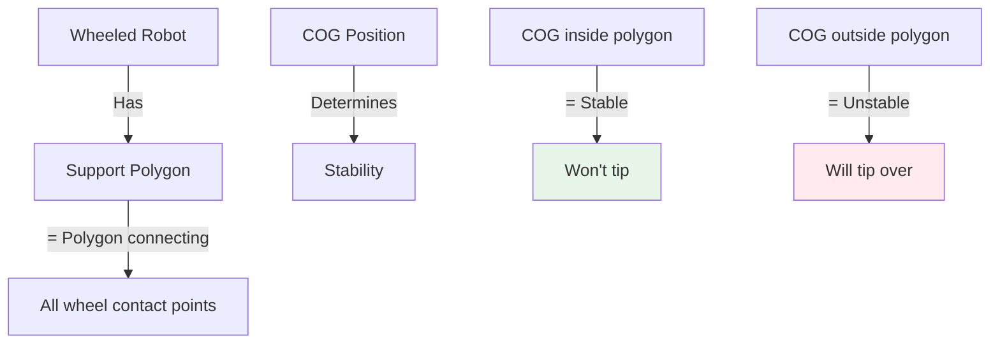
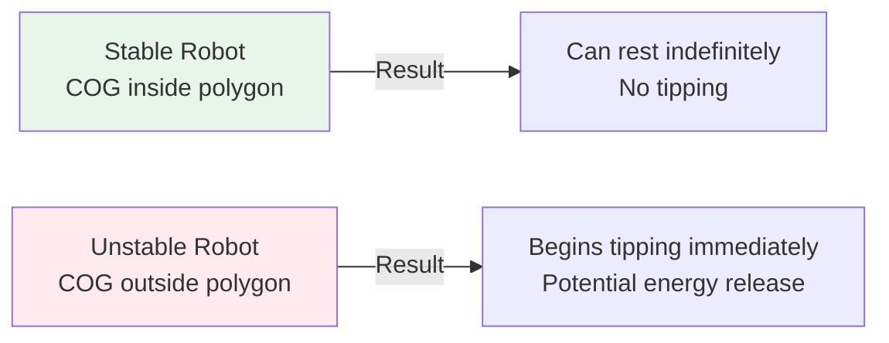

import { Callout } from 'fumadocs-ui/components/callout';
import { Tab, Tabs } from 'fumadocs-ui/components/tabs';
import { Accordion, Accordions } from 'fumadocs-ui/components/accordion';
import { Step, Steps } from 'fumadocs-ui/components/steps';

# Center of Gravity and Stability

The Center of Gravity (COG), also called Center of Mass, is the point where the entire weight of an object can be considered to act. For robots, COG position is critical to stability, balance, and performance. Understanding and optimizing COG is essential for designing robots that won't tip over and perform reliably.

## Understanding Center of Gravity

### What is Center of Gravity?

**Definition:** The point representing the average position of all mass in an object, weighted by the mass of each element.

**Physical Meaning:**
- If you could balance the robot on a single point, that point would be the COG
- Gravity appears to act on this single point
- All weight calculations can use this point

### Calculating COG Position

**2D Calculation:**

```
X_cog = Σ(m_i × x_i) / Σ(m_i) = Σ(m_i × x_i) / M_total
Y_cog = Σ(m_i × y_i) / Σ(m_i) = Σ(m_i × y_i) / M_total
```

**3D Calculation:**

Simply add Z coordinate:
```
Z_cog = Σ(m_i × z_i) / M_total
```

### Practical Example

Calculate COG of a simple robot:

| Component | Mass (kg) | X (m) | Y (m) |
|-----------|----------|-------|-------|
| Chassis | 8.0 | 0.25 | 0.10 |
| Battery | 3.0 | 0.25 | 0.05 |
| Motor 1 | 0.5 | 0.10 | 0.15 |
| Motor 2 | 0.5 | 0.40 | 0.15 |
| Electronics | 0.5 | 0.25 | 0.20 |
| **Total** | **12.5** | - | - |

**Calculation:**

```
X_cog = (8.0×0.25 + 3.0×0.25 + 0.5×0.10 + 0.5×0.40 + 0.5×0.25) / 12.5
      = (2.0 + 0.75 + 0.05 + 0.20 + 0.125) / 12.5
      = 3.125 / 12.5
      = 0.25 m

Y_cog = (8.0×0.10 + 3.0×0.05 + 0.5×0.15 + 0.5×0.15 + 0.5×0.20) / 12.5
      = (0.80 + 0.15 + 0.075 + 0.075 + 0.10) / 12.5
      = 1.2 / 12.5
      = 0.096 m ≈ 0.1 m
```

**Result:** COG is at (0.25 m, 0.10 m) - center X, very low Y (good for stability!)

---

## Stability Principles

Stability depends on the relationship between COG position and the robot's support base.

### Support Polygon



**Support Polygons for Different Robots:**

| Robot Type | Support Polygon | Typical Margin |
|----------|-----------------|-----------------|
| **2-wheel (balanced)** | Line between wheels | 0% (no margin) |
| **3-wheel** | Triangle | 10-30% typical |
| **4-wheel (car)** | Rectangle | 20-40% typical |
| **Quadruped** | Triangle (3 legs stance) | 15-25% typical |
| **Hexapod** | Polygon (3+ legs) | 25-40% typical |

### Static Stability

**Condition for Static Stability:**

The vertical projection of the COG must fall within (or very close to) the support polygon.



**Stability Margin:**

```
Margin = Minimum distance from COG projection to polygon edge
```

**Typical Safety Margins:**
- Industrial robots: 20-25% of base width
- Competition robots: 10-15% (more aggressive)
- Legged robots: 15-30% depending on gait

<Callout type="warn" title="Zero Margin = Unstable">
A robot with zero stability margin is at tipping threshold. Any small disturbance causes tipping. Always design with safety margin.
</Callout>

### Dynamic Stability During Acceleration

When a robot accelerates, inertia shifts the effective COG:

```
COG_effective = COG_actual + (a × h) / g
```

Where:
- **a** = Linear acceleration (m/s²)
- **h** = COG height above ground (m)
- **g** = Gravity (9.81 m/s²)

**Example: Robot Braking**

A robot with COG at 0.3 m height decelerating at 5 m/s²:

```
Forward shift = (5 × 0.3) / 9.81 = 0.153 m

Effective COG shifts 15 cm forward!
```

If the robot only has 10 cm stability margin at the rear, it will tip backward when braking hard!

### Turning Stability

When turning, centrifugal effects shift the effective COG:

**Critical Turning Speed:**

```
v_critical = √((g × w) / (2 × d_cog_to_outer_wheel))
```

Where:
- **g** = Gravity (9.81 m/s²)
- **w** = Width between wheels (m)
- **d_cog_to_outer_wheel** = Distance from COG to outer wheel (m)

**Example: Robot Turning**

- Wheel width: 0.4 m
- COG to outer wheel: 0.2 m (centered)
- COG height: 0.2 m

```
v_critical = √((9.81 × 0.4) / (2 × 0.2))
           = √((3.924) / (0.4))
           = √9.81
           = 3.13 m/s

At speeds above 3.13 m/s, this robot will tip when turning!
```

**How to increase turning speed:**
1. Lower COG height (reduces rotation effect)
2. Increase wheel width (larger support polygon)
3. Reduce turn radius (less centrifugal force)

---

## COG Optimization Strategies

<Accordions>
<Accordion title="Lowering the COG">
### Why Lower is Better

**Benefits of lower COG:**
- Increased static stability margin
- Higher allowable turning speeds
- Better resistance to tipping on uneven terrain
- Improved motion smoothness
- Reduced risk in collisions

**Effects of COG Height:**

| COG Height | Stability | Max Turn Speed | Comments |
|-----------|-----------|----------------|----------|
| Very Low (0.1m) | Excellent | High | Stable but limited workspace reach |
| Low (0.2m) | Good | Medium-High | Common for mobile robots |
| Medium (0.4m) | Moderate | Medium | Humanoid/tall robots |
| High (0.6m+) | Poor | Low | Unstable, tip-over risk |

### Methods to Lower COG

**1. Mount heavy components low:**
- Put batteries in base, not top
- Position motors near ground
- Keep payload area near chassis center

**Example Impact:**

Original design:
- Total mass: 20 kg
- Battery (5 kg) at height 0.4 m
- Other components average height: 0.2 m
- COG_original = (5×0.4 + 15×0.2) / 20 = 0.25 m

Move battery to bottom (0.05 m):
```
COG_new = (5×0.05 + 15×0.2) / 20 = 0.1625 m
Improvement: 35% lower COG!
```

**2. Use low-profile designs:**
- Shorter overall height
- Wider base relative to height
- Distributed weight

**3. Avoid top-heavy configurations:**
- Camera masts at top: BAD for stability
- Tall antenna: BAD
- Top-mounted payload: BAD

**4. Sandwich architecture:**
```
┌─────────────────┐
│ Sensors/Comms   │ ← Lightweight, OK to be high
├─────────────────┤
│ Electronics     │ ← Medium weight, mid-level
├─────────────────┤
│ Motors, Wheels  │ ← Heavy components, LOW
└─────────────────┘
```
</Accordion>

<Accordion title="Centralizing the COG">
### Balanced Weight Distribution

**Benefits of centered COG:**
- Symmetrical handling characteristics
- Balanced turning (same radius both directions)
- Reduced differential tire wear
- Better weight on all wheels
- Simplified control

### Checking Balance

**For wheeled robots, measure weight on each wheel:**

```
Weight_left_wheels ≈ Weight_right_wheels (within 5-10%)
Weight_front_wheels ≈ Weight_rear_wheels (for 4-wheel)
```

**Method: Use bathroom scale approach**

1. Place front wheels on two scales
2. Record each reading
3. Repeat for rear wheels
4. Compare totals

**If unbalanced:**
- Shift battery or electronics left/right
- Redistribute component mounting
- Add counterweights to heavy side

### Example Balance Check

4-wheel robot:

| Measurement | Weight |
|-------------|--------|
| Front-Left wheel | 3.1 kg |
| Front-Right wheel | 3.0 kg |
| Rear-Left wheel | 3.2 kg |
| Rear-Right wheel | 3.0 kg |
| **Total** | **12.3 kg** |

Analysis:
- Left total: 6.3 kg, Right total: 6.0 kg (95% balanced) ✓
- Front total: 6.1 kg, Rear total: 6.2 kg (99% balanced) ✓
- Good balance! Symmetrical handling expected
</Accordion>

<Accordion title="Dynamic COG Management">
### For Robotic Manipulators

As the arm extends, the system COG shifts dramatically:

```
COG_system = (m_base × COG_base + m_arm × COG_arm + m_payload × COG_payload) / M_total
```

**Problem: Extended arm tips mobile base**

```
Arm fully retracted: COG within base polygon ✓
Arm extended horizontally: COG shifts forward
Arm fully extended + payload: COG way forward → TIP RISK! ✗
```

### Compensation Strategies

**1. Mobile base repositioning:**
- Automatically move base backward as arm extends
- Keeps system COG within support polygon
- Requires real-time COG calculation

**2. Counterweight systems:**
- Rear-mounted weights that balance extended arm
- Passive: Always on (wastes energy)
- Active: Switch on/off as needed

**3. Active stabilization:**
- Shift internal masses (like a cat balancing)
- Complex mechanisms, power-hungry
- Used in advanced systems

**4. Limiting arm extension:**
- Calculate maximum reach for current payload
- Reduce speed as arm extends (dynamic limiting)
- Safety software prevents tipping configurations

**Typical Limits:**

| Arm Extension | Max Payload | Speed Reduction |
|-------------|-------------|-----------------|
| 0-50% reach | Full rated | 100% |
| 50-70% reach | 75% rated | 75% |
| 70-85% reach | 50% rated | 50% |
| >85% reach | 25% rated | 25% |

### For Mobile Robots Carrying Loads

**Off-center payload = stability risk:**

For payload 0.3 m to the side of centerline:

```
COG_offset = (payload_mass × offset_distance) / total_mass
```

**Mitigation:**
- Reduce speed (more stable handling)
- Adjust driving style (gentler turns)
- Add ballast on opposite side
- Distribute load symmetrically
</Accordion>

<Accordion title="Multi-Mode Configurations">
### Adaptive Designs

Some advanced robots change configuration for different tasks:

**Example: Scissor Lift Robot**

**Lowered Mode (Transportation):**
- COG height: 0.3 m
- Stability margin: 30%
- Max speed: 2.0 m/s
- Max turn speed: 1.5 m/s

**Raised Mode (Working):**
- COG height: 1.5 m
- Stability margin: 5%
- Max speed: 0.5 m/s (automatic limit)
- Max turn speed: 0.3 m/s

**Automatic Control:**
```
IF scissors_extended:
  SET max_speed = 0.5 m/s
  SET max_turn_speed = 0.3 m/s
  ENABLE stability_monitoring
ELSE:
  SET max_speed = 2.0 m/s
  SET max_turn_speed = 1.5 m/s
```

### Reconfigurable Robots

Some robots physically reconfigure:

**Scenario: Climbing Robot**
- Horizontal mode: Wide base, low COG, fast
- Vertical climbing mode: Compact, high COG acceptable due to mechanical gripping
- Transitions based on terrain detection
</Accordion>
</Accordions>

---

## Practical COG Determination Methods

<Tabs items={['CAD Calculation', 'Physical Weighing', 'Suspension Method']}>
<Tab value="CAD Calculation">
### CAD-Based Analysis

**Using Modern CAD Software:**

1. **Model all components** with accurate dimensions
2. **Assign material properties** (density) to each part
3. **Software automatically computes** COG position

**Advantages:**
- Fast and accurate
- Can test multiple configurations quickly
- Includes complex shapes easily
- Accounts for manufacturing variations

**Disadvantages:**
- Requires detailed CAD model
- Material densities must be accurate
- Doesn't account for internal components (wires, etc.)

### Manual Calculation Method

Create spreadsheet with all components:

| Part | Mass (kg) | X (m) | Y (m) | Z (m) | m×X | m×Y | m×Z |
|------|----------|-------|-------|-------|-----|-----|-----|
| Chassis | 5.0 | 0.25 | 0.10 | 0.15 | 1.25 | 0.50 | 0.75 |
| Battery | 2.0 | 0.25 | 0.05 | 0.08 | 0.50 | 0.10 | 0.16 |
| Motor | 0.8 | 0.20 | 0.15 | 0.10 | 0.16 | 0.12 | 0.08 |
| ... | ... | ... | ... | ... | ... | ... | ... |
| **TOTAL** | **12.5** | - | - | - | **3.12** | **1.22** | **1.50** |

```
COG_X = 3.12 / 12.5 = 0.250 m
COG_Y = 1.22 / 12.5 = 0.098 m ≈ 0.10 m
COG_Z = 1.50 / 12.5 = 0.120 m
```

</Tab>

<Tab value="Physical Weighing">
### Measuring COG on Built Robot

**Equipment needed:**
- Digital scale (or 2 scales)
- Level surface
- Robot in complete assembled state

**2-Scale Method (most accurate):**

1. Place all wheels on left scale
2. Record weight: W_left
3. Place all wheels on right scale
4. Record weight: W_right
5. Total: W_total = W_left + W_right

**Calculate horizontal COG:**

For wheelbase L:
```
Distance from left wheel to COG = (W_right × L) / W_total
```

**Example:**

- Wheelbase: 0.5 m
- Weight on left wheels: 4.5 kg
- Weight on right wheels: 5.5 kg
- Total: 10 kg

```
COG_distance = (5.5 × 0.5) / 10 = 0.275 m from left wheels
OR 0.225 m from right wheels (0.5 - 0.275)
```

**Vertical COG (tilting method):**

1. Tilt robot forward by height h
2. Measure angle θ
3. Calculate COG height

```
COG_height = (h × cos(θ)) / sin(θ)
```

Or using length L and height change h:
```
COG_height = (W_new × L) / (W_original × h_tilt)
```

**Advantages:**
- Measures actual built robot
- Includes all components and wiring
- Accounts for manufacturing variations
- Real-world accuracy

**Disadvantages:**
- Destructive (may need to tilt robot)
- Takes more time
- Less precise than CAD
- Requires measurement equipment
</Tab>

<Tab value="Suspension Method">
### Plumb Line Method

**For small robots (< 20 kg):**

**Procedure:**

1. **Suspend robot** from known point A (e.g., top corner)
   - Use string or rope
   - Robot hangs freely
   
2. **Hang plumb line** from same point
   - Marks vertical reference
   - Mark this line on robot with tape
   
3. **Suspend from different point B** (e.g., opposite corner)
   - Repeat with plumb line
   - Mark second vertical line
   
4. **Find intersection**
   - Draw both lines on robot
   - Intersection = COG location!

**For 3D verification:**

Suspend from 3rd point at different height to confirm Z-coordinate.

**Advantages:**
- Simple, uses basic tools
- Works for complex shapes
- Physically intuitive
- Can validate calculations

**Disadvantages:**
- Only works for relatively small robots
- Not suitable for large/heavy robots
- Time-consuming
- Labor-intensive
</Tab>
</Tabs>

---

## COG Checklist for Stable Robots

<Callout type="success" title="Stability Design Checklist">

**During Robot Design:**
- ✓ Calculate target COG position (before building!)
- ✓ Plan component placement for low COG
- ✓ Sketch support polygon relative to expected COG
- ✓ Document target stability margin (20% typical)

**After Assembly:**
- ✓ Measure actual COG position
- ✓ Compare to design target (± 5% tolerance)
- ✓ Verify stability with physical test
- ✓ Document final COG for control algorithms

**For Operation:**
- ✓ Know COG position during different configurations
- ✓ Apply dynamic COG offsets in motion planning
- ✓ Monitor payload effects on COG
- ✓ Reduce speed for high-COG configurations
- ✓ Include anti-tip mechanisms if needed

**Special Conditions:**
- ✓ Test on inclines (especially with arm extended)
- ✓ Verify turning stability at max speed
- ✓ Check braking/acceleration behavior
- ✓ Validate with loads off-center

</Callout>

---

## Summary

**Center of Gravity determines robot stability:**

✓ Lower COG = More stable, faster turning, better off-road performance
✓ Centered COG = Balanced handling, symmetric characteristics
✓ Dynamic COG shifts = Account for accelerations and extensions
✓ Stability margin > 20% = Safe, predictable operation
✓ Know your COG = Design stable, reliable robots

**Quick Design Process:**

1. Calculate required stability margin (20-30%)
2. Design support polygon large enough
3. Plan component placement for low, centered COG
4. Verify through calculation or measurement
5. Account for payload and dynamic shifts
6. Test on target terrain before deployment