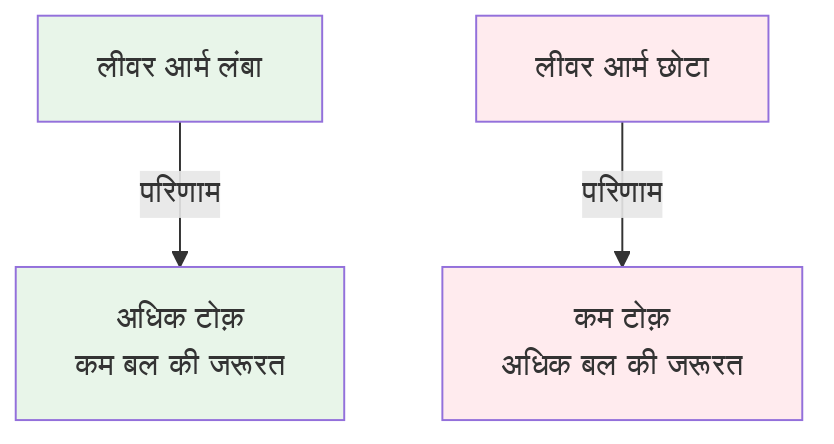
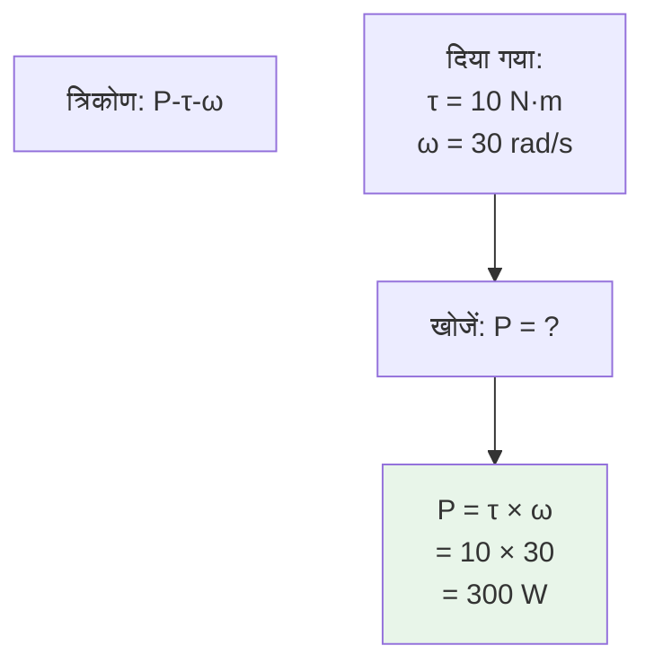

import { Callout } from 'fumadocs-ui/components/callout';
import { Tab, Tabs } from 'fumadocs-ui/components/tabs';

# बल, टोक़ और शक्ति

रोबोटिक्स में, बल, टोक़ और शक्ति अंतर्संबंधित अवधारणाएं हैं जो गति और प्रदर्शन निर्धारित करती हैं। इन तीनों को समझना स्थिर, शक्तिशाली रोबोट डिजाइन करने के लिए आवश्यक है।

## बल को समझना

### न्यूटन का दूसरा नियम

**परिभाषा:**

```
F = m × a
```

जहां:
- **F** = बल (न्यूटन, N में)
- **m** = द्रव्यमान (किग्रा, kg में)
- **a** = त्वरण (m/s² में)

**व्यावहारिक अर्थ:** किसी वस्तु को गति देने के लिए आवश्यक बल उसके द्रव्यमान के समानुपाती होता है।

### बल के प्रकार

रोबोट पर कार्य करने वाले मुख्य बल:

| बल प्रकार | सूत्र | विवरण | उदाहरण |
|-----------|--------|-------|---------|
| **लागू बल** | F = m × a | मोटर द्वारा लागू | पहिये को ड्राइव करना |
| **घर्षण** | F_friction = μ × N | गति का विरोध | जमीन पर प्रतिरोध |
| **सामान्य** | N = m × g (क्षैतिज) | सतह की प्रतिक्रिया | पहियों पर भार |
| **तनाव** | T | रस्सी/केबल में | भार उठाना |
| **गुरुत्वाकर्षण** | F_g = m × g | पृथ्वी का खिंचाव | 10 kg रोबोट पर 98 N |
| **अभिकेंद्र** | F_c = m × v² / r | वक्र गति में | मोड़ते समय अलग रहना |

### उदाहरण: मोबाइल रोबोट का त्वरण

एक 20 किग्रा रोबोट को 2 m/s² पर त्वरित करने के लिए आवश्यक बल:

```
F = 20 kg × 2 m/s² = 40 N
```

**व्यावहारिकता:** मोटर को इस बल को पहियों को 2 m/s² पर त्वरित करने के लिए पर्याप्त बल प्रदान करना होगा।

---

## टोक़: घूर्णन का बल

### टोक़ क्या है?

**परिभाषा:** टोक़ एक बल द्वारा किसी वस्तु को घुमाने की प्रवृत्ति है।

```
τ = r × F × sin(θ)
```

या सरल रूप (90° पर):

```
τ = r × F
```

जहां:
- **τ** (टाउ) = टोक़ (न्यूटन-मीटर, N·m में)
- **r** = धुरी से बल तक की दूरी (लीवर आर्म, मीटर में)
- **F** = लागू बल (न्यूटन में)

### लीवर आर्म का प्रभाव



**उदाहरण:** 0.1 मीटर की दूरी पर 100 N का बल

```
τ = 0.1 m × 100 N = 10 N·m
```

यदि दूरी दोगुनी हो जाए:
```
τ = 0.2 m × 100 N = 20 N·m (दोगुना!)
```

### रोबोटिक्स में टोक़ के अनुप्रयोग

<Tabs items={['संयुक्त मोटर', 'ग्रिपर', 'पहिया']}>
<Tab value="संयुक्त मोटर">
### रोबोटिक आर्म संयुक्त

**आवश्यकता:** कंधे के संयुक्त को 5 किग्रा भार के साथ क्षैतिज भुजा को पकड़ना

```
τ_आवश्यक = बल × दूरी
          = (5 kg × 9.81 m/s²) × 0.3 m (भुजा से भार तक की दूरी)
          = 49.05 N × 0.3 m
          = 14.7 N·m
```

**मोटर चयन:** अतिरिक्त मार्जिन (1.5×) के साथ कम से कम 22 N·m टोक़ मोटर आवश्यक है।

</Tab>

<Tab value="ग्रिपर">
### पैड ग्रिपर

**परिदृश्य:** 2 किग्रा वस्तु को पकड़ना, प्रत्येक पैड 0.05 मीटर से केंद्र तक

```
प्रत्येक पैड पर आवश्यक बल = 2 kg × 9.81 m/s² × 1.3 (स्लिप मार्जिन) / 2 पैड
                        = 12.8 N प्रत्येक पैड पर

τ_आवश्यक = 12.8 N × 0.05 m = 0.64 N·m (प्रत्येक ड्राइव)
```

</Tab>

<Tab value="पहिया">
### ड्राइव पहिया मोटर

**परिदृश्य:** 0.5 मीटर त्रिज्या पहिये पर 20 किग्रा रोबोट का वजन, 1 m/s² त्वरण

```
बल की आवश्यकता = m × a = 20 kg × 1 m/s² = 20 N
टोक़ = 20 N × 0.5 m = 10 N·m (प्रत्येक पहिये के लिए)

4 पहियों के साथ: 10 N·m ÷ 4 = 2.5 N·m प्रति पहिया
```

</Tab>
</Tabs>

---

## गियर में टोक़ संचरण

### गियर अनुपात

गियर मोटर की गति कम करते हैं लेकिन टोक़ को गुणा करते हैं।

```
τ_आउटपुट = τ_इनपुट × गियर_अनुपात × दक्षता
```

**उदाहरण: 50:1 गियर कमी**

- मोटर टोक़: 0.1 N·m पर 5000 RPM
- गियर अनुपात: 50:1
- दक्षता: 95% (0.95)

```
τ_आउटपुट = 0.1 N·m × 50 × 0.95 = 4.75 N·m
```

आउटपुट गति:
```
RPM_आउटपुट = 5000 RPM / 50 = 100 RPM
```

**परिणाम:** 5 किग्रा (50×) मजबूत लेकिन 50× धीमा!

---

## शक्ति: कार्य की दर

### शक्ति क्या है?

**परिभाषा:** शक्ति कार्य करने की दर है या ऊर्जा स्थानांतरित करने की दर है।

```
P = F × v (रैखिक गति के लिए)
P = τ × ω (घूर्णन के लिए)
```

जहां:
- **P** = शक्ति (वाट, W में, या किलोवाट, kW में)
- **F** = बल (न्यूटन में)
- **v** = वेग (m/s में)
- **τ** = टोक़ (N·m में)
- **ω** = कोणीय वेग (rad/s में)

### शक्ति-टोक़-गति त्रिकोण



**महत्वपूर्ण संबंध:**

| जानना | गणना करने के लिए |
|--------|---------------|
| τ और ω | P = τ × ω |
| P और τ | ω = P / τ |
| P और ω | τ = P / ω |

### उदाहरण: मोटर का चयन

**आवश्यकता:** 3000 RPM पर 5 N·m टोक़ प्रदान करने वाली मोटर

**चरण 1:** RPM को rad/s में रूपांतरित करें
```
ω = 3000 RPM × (2π / 60) = 314.2 rad/s
```

**चरण 2:** शक्ति की गणना करें
```
P = τ × ω = 5 N·m × 314.2 rad/s = 1571 W ≈ 1.57 kW
```

**निष्कर्ष:** कम से कम 1.57 kW मोटर आवश्यक है।

---

## व्यावहारिक अनुप्रयोग

### लिफ्टिंग शक्ति

**परिदृश्य:** 10 किग्रा भार को 0.5 m/s पर ऊपर उठाना

```
बल = 10 kg × 9.81 m/s² = 98.1 N
शक्ति = 98.1 N × 0.5 m/s = 49 W
```

**बैटरी जीवन:**
- 500 Wh बैटरी
- समय = 500 Wh / 49 W ≈ 10.2 घंटे (निरंतर)

### ड्राइविंग शक्ति

**परिदृश्य:** 20 किग्रा रोबोट को 1 m/s पर समतल सतह पर चलाना (0.1 घर्षण गुणांक)

```
घर्षण बल = 0.1 × 20 kg × 9.81 m/s² = 19.6 N
शक्ति = 19.6 N × 1 m/s = 19.6 W
```

बहुत कम शक्ति की आवश्यकता है!

### ड्रोन उड़ान शक्ति

**परिदृश्य:** 2 किग्रा ड्रोन 5 m/s पर क्षैतिज रूप से उड़ान भरना

वायु प्रतिरोध गणना (खींचना):
```
F_drag = 0.5 × ρ × v² × C_d × A
       = 0.5 × 1.225 × 5² × 0.1 × 0.2
       = 0.3 N (अनुमानित)

शक्ति = 0.3 N × 5 m/s = 1.5 W (क्षैतिज)

उड़ान: 2 kg × 9.81 m/s² = 19.6 N
         (पूर्ण शक्ति मुड़वाव से आती है)
```

---

## शक्ति की बेहतरी और संरक्षण

<Callout type="success" title="रोबोट डिजाइन के लिए शक्ति अनुकूलन">

**शक्ति की आवश्यकता कम करने के लिए:**

1. **द्रव्यमान कम करें** - हल्के सामग्री का उपयोग करें
2. **घर्षण कम करें** - असर का उपयोग करें, आकृति को सुव्यवस्थित करें
3. **दक्षता बढ़ाएं** - अच्छी गुणवत्ता की गियरिंग, सफाई
4. **गती कम करें** - धीमी गति अक्सर कम शक्ति की आवश्यकता है
5. **आंतरायिक शक्ति का उपयोग करें** - निरंतर अधिकतम से बचें

**शक्ति उपलब्ध:**
- बैटरी क्षमता को जानें (Wh)
- चोटी की शक्ति बनाम निरंतर शक्ति समझें
- बैटरी जीवन की अपेक्षा करें: समय = क्षमता / औसत शक्ति

</Callout>

---

## सारांश

**मुख्य संबंध:**

- ✓ बल = द्रव्यमान × त्वरण (F = m × a)
- ✓ टोक़ = बल × दूरी (τ = r × F)
- ✓ शक्ति = बल × वेग (P = F × v)
- ✓ शक्ति = टोक़ × कोणीय वेग (P = τ × ω)
- ✓ गियर अनुपात गति कम करते हैं लेकिन टोक़ गुणा करते हैं

**व्यावहारिक डिजाइन प्रक्रिया:**

1. आवश्यक बल की गणना करें (त्वरण से)
2. टोक़ की आवश्यकता निर्धारित करें (दूरी से)
3. वेग की आवश्यकता जानें
4. शक्ति आवश्यकता की गणना करें
5. बैटरी क्षमता चुनें
6. बैटरी जीवन का अनुमान लगाएं