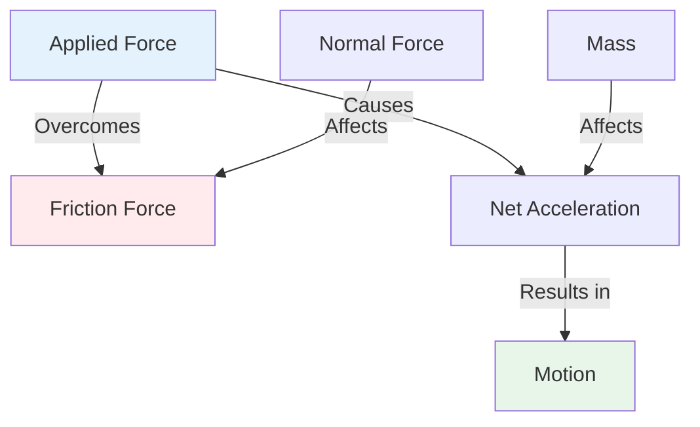
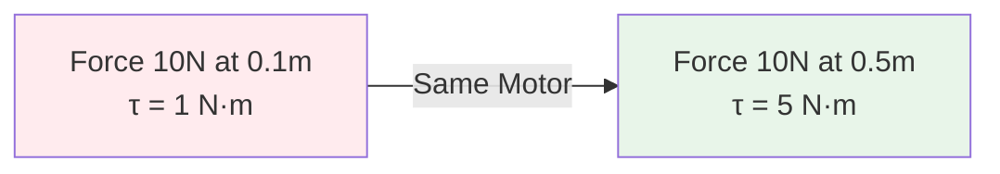
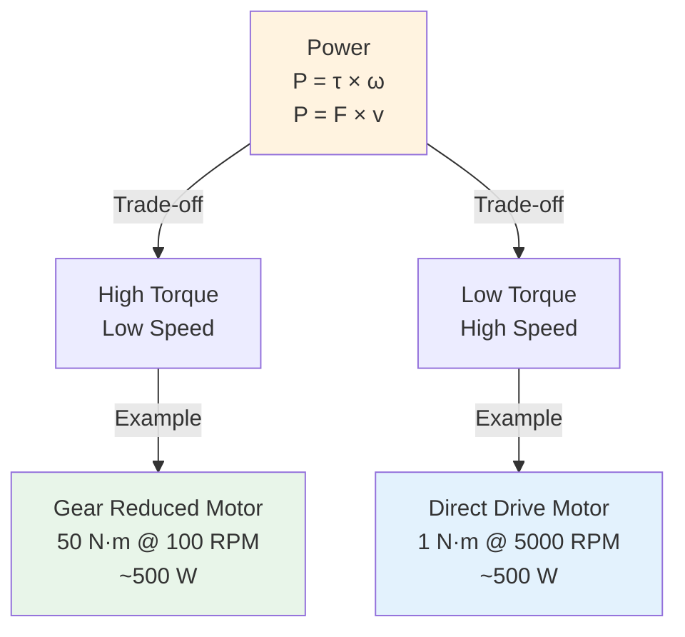
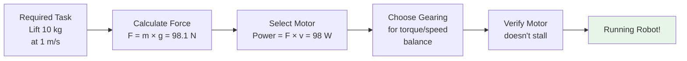

import { Callout } from 'fumadocs-ui/components/callout';
import { Tab, Tabs } from 'fumadocs-ui/components/tabs';

# Force, Torque, and Power

Force, torque, and power are the three fundamental quantities that drive all mechanical motion in robotic systems. Understanding their relationships is crucial for selecting appropriate motors, designing mechanisms, and controlling robot behavior.

## Force

Force is a push or pull acting upon an object, causing it to accelerate or deform.

### Newton's Second Law

```
F = m × a
```

Where:
- **F** = Force (Newtons, N)
- **m** = Mass (kilograms, kg)
- **a** = Acceleration (m/s²)

**Key Implications for Robotics:**
- Heavier robots require more force to accelerate at the same rate
- Acceleration is directly proportional to applied force
- Forces in opposite directions subtract from each other

### Types of Forces in Robotics

| Force Type | Description | Example in Robotics |
|------------|-------------|---------------------|
| **Applied Force** | External force on robot | Motor pushing wheel |
| **Friction Force** | Opposes motion | Wheel-ground interaction |
| **Normal Force** | Perpendicular to surface | Robot weight on ground |
| **Tension** | Force in cables/belts | Cable-driven mechanisms |
| **Gravitational** | Weight of robot | Lifting mechanisms |
| **Centripetal** | Keeps object in circular path | Turning robots |

### Force Diagram Example



**Example: Mobile Robot Acceleration**

A 10 kg robot experiences:
- Applied motor force: 50 N
- Friction force: 20 N
- Net force: 50 - 20 = 30 N

Acceleration:
```
a = F_net / m = 30 N / 10 kg = 3 m/s²
```

---

## Torque

Torque is the rotational equivalent of force. It causes objects to rotate around an axis and is essential for all rotating mechanisms in robots.

### Torque Formula

For perpendicular force application:
```
τ = r × F
```

General formula:
```
τ = r × F × sin(θ)
```

Where:
- **τ** (tau) = Torque (Newton-meters, N·m)
- **r** = Distance from axis (lever arm length, meters)
- **F** = Applied force (Newtons, N)
- **θ** = Angle between force and lever arm

### Key Principle: Lever Arm Effect

The same force applied farther from the pivot produces greater torque:



### Torque Applications in Robotics

<Tabs items={['Joint Motors', 'Gripper Design', 'Wheel Motors']}>
<Tab value="Joint Motors">
### Joint Motors in Robotic Arms

Each joint motor must provide sufficient torque to:

1. **Support the weight** of all links and payload below it
2. **Accelerate/decelerate** the arm segments
3. **Overcome friction** in bearings and joints

**Example: 6-axis Robot Arm**

Base joint torque calculation for lifting a 5 kg payload at 0.4 m distance:

```
Force needed = m × g = 5 kg × 9.81 m/s² = 49.05 N
Torque needed = r × F = 0.4 m × 49.05 N = 19.62 N·m
```

Plus additional torque for:
- Arm link weight: +5 N·m
- Acceleration reserve: +5 N·m
- Safety factor: 1.5-2.0×

Total required: ~50 N·m

Motor selection: Use motor rated for at least 50 N·m continuous torque
</Tab>

<Tab value="Gripper Design">
### Gripper Torque Requirements

Gripping force depends on:
- **Gripper finger length** from pivot
- **Friction coefficient** between gripper and object
- **Object weight** and geometry

**Gripper Torque Calculation:**

For a parallel gripper with fingers 0.05 m long gripping a 2 kg object:

```
Normal force on each finger = Object weight = ~9.81 N
Torque per finger = 0.05 m × 9.81 N = 0.49 N·m
Motor torque needed = ~0.5 N·m per finger
```

**Important:** Gripper motor must provide enough torque WITHOUT damaging delicate objects (friction-limited gripping)
</Tab>

<Tab value="Wheel Motors">
### Wheel Drive Motors

Wheel motors need torque to overcome:

1. **Static friction** (getting the robot moving)
2. **Rolling resistance** (maintaining motion)
3. **Climbing inclines** (overcoming gravity component)
4. **Acceleration** (speeding up)

**Example: Climbing an Incline**

For a 20 kg robot on a 30° incline:
```
Gravity component = m × g × sin(30°)
                  = 20 × 9.81 × 0.5
                  = 98.1 N

For 0.1 m radius wheels:
Torque needed = 98.1 N × 0.1 m = 9.81 N·m
```

Add friction losses and acceleration buffer → select 15+ N·m motor
</Tab>
</Tabs>

### Gear Reduction and Torque Multiplication

Gears allow us to trade speed for torque using the **gear ratio**:

```
Output Torque = Input Torque × Gear Ratio
Output Speed = Input Speed ÷ Gear Ratio
```

**Example: 50:1 Gearbox**

Motor specifications:
- Speed: 3000 RPM
- Torque: 2 N·m
- Power: ~630 W

After 50:1 gearbox:
- Speed: 3000 ÷ 50 = 60 RPM
- Torque: 2 × 50 = 100 N·m (assuming 90% efficiency)
- Power: ~590 W (slightly reduced due to friction)

<Callout type="success" title="Torque-Speed Trade-off">
Power remains approximately constant through gearing (minus losses). You can't get "more power" from gearing - you're just trading speed for torque or vice versa.

**For picking tasks:** Use high torque, lower speed (geared down)
**For fast movement:** Use lower torque, higher speed (geared up or direct drive)
</Callout>

---

## Power

Power is the rate at which energy is transferred or work is performed.

### Power Formulas

**Linear Motion:**
```
P = F × v
```

**Rotational Motion:**
```
P = τ × ω
```

Where:
- **P** = Power (Watts, W)
- **F** = Force (N)
- **v** = Velocity (m/s)
- **τ** = Torque (N·m)
- **ω** = Angular velocity (rad/s)

### Converting RPM to Angular Velocity

To use rotational power formula, convert RPM to rad/s:

```
ω (rad/s) = (RPM × 2π) / 60
```

**Example:**
```
3000 RPM = (3000 × 2π) / 60 = 314.16 rad/s
```

### Power Calculation Examples

<Tabs items={['Motor Power', 'Lifting Power', 'Driving Power']}>
<Tab value="Motor Power">
### Motor Power Calculation

A motor rated at 5 N·m torque spinning at 3000 RPM:

**Step 1:** Convert RPM to rad/s
```
ω = (3000 × 2π) / 60 = 314.16 rad/s
```

**Step 2:** Calculate power
```
P = τ × ω = 5 N·m × 314.16 rad/s = 1,570.8 W ≈ 1.57 kW
```

This motor consumes approximately 1.57 kilowatts of electrical power (before accounting for motor efficiency, typically 80-90%).
</Tab>

<Tab value="Lifting Power">
### Lifting Power

To lift a 100 kg payload vertically at 0.5 m/s:

**Force needed:**
```
F = m × g = 100 × 9.81 = 981 N
```

**Power required:**
```
P = F × v = 981 N × 0.5 m/s = 490.5 W
```

This means the motor must provide at least 490.5 W to lift the payload at this speed. In practice, add 20-30% for efficiency losses.

**Actual power needed:** ~600-640 W
</Tab>

<Tab value="Driving Power">
### Driving Power for Mobile Robot

A robot pushing forward against 50 N of resistance at 2 m/s:

**Power required:**
```
P = F × v = 50 N × 2 m/s = 100 W
```

**Battery life calculation:**

For a 1500 W·h battery (common large robot battery):
```
Runtime = 1500 W·h ÷ 100 W = 15 hours
```

**At higher speed (4 m/s) with same resistance:**
```
P = 50 N × 4 m/s = 200 W
Runtime = 1500 W·h ÷ 200 W = 7.5 hours (half!)
```

This shows why faster movement dramatically reduces battery life.
</Tab>
</Tabs>

### Power Relationship Triangle



<Callout type="warn" title="Power Dissipation">
When a motor stalls (torque applied but no motion), all electrical power is converted to heat! This can destroy motors instantly if stalled for too long.

**Stall current protection:**
- Electronic current limiting
- Thermal cutoff
- Mechanical overload release
- Torque limiting firmware
</Callout>

---

## Integration: Force, Torque, and Power

All three concepts work together:

1. **Force** causes linear acceleration
2. **Torque** causes rotational acceleration
3. **Power** limits how fast energy can be delivered

**System Design Process:**



---

**Key Formulas Summary:**

| Concept | Formula | Units |
|---------|---------|-------|
| **Force** | F = m × a | N = kg × m/s² |
| **Torque** | τ = r × F | N·m = m × N |
| **Linear Power** | P = F × v | W = N × m/s |
| **Rotational Power** | P = τ × ω | W = N·m × rad/s |
| **Gear Output** | τ_out = τ_in × ratio | N·m |

---

**Next Steps:**
- Learn about friction and traction in the next section
- Understand rotational motion and RPM
- Apply these concepts to your robot design