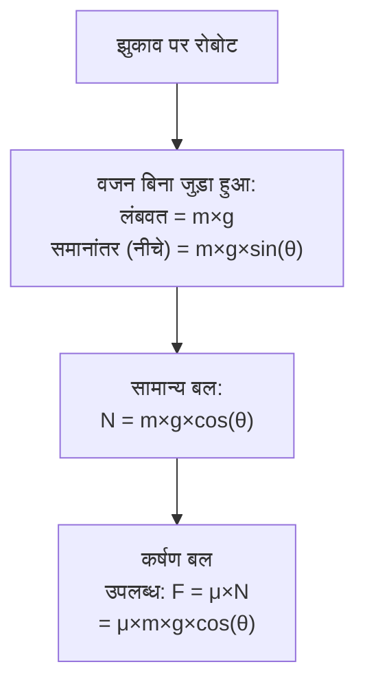

import { Callout } from 'fumadocs-ui/components/callout';
import { Tab, Tabs } from 'fumadocs-ui/components/tabs';
import { Accordion, Accordions } from 'fumadocs-ui/components/accordion';
import { Step, Steps } from 'fumadocs-ui/components/steps';

# घर्षण और कर्षण

घर्षण रोबोटिक्स में हर जगह है - यह गति को रोकता है, गर्मी उत्पन्न करता है, लेकिन यह भी ग्रिपिंग, ट्रैक्शन और संरचनात्मक स्थिरता प्रदान करता है। घर्षण को समझना और प्रबंधित करना सफल रोबोट डिजाइन की कुंजी है।

## घर्षण के प्रकार

<Accordions>
<Accordion title="स्थैतिक घर्षण">
### गति को रोकना

**परिभाषा:** दो सतहों के बीच का बल जो गति को रोकता है।

```
F_static_max = μ_s × N
```

जहां:
- **μ_s** = स्थैतिक घर्षण गुणांक
- **N** = सामान्य बल (सतह पर लंबवत)

### विशेषताएं

- तब तक कार्य करता है जब तक गति शुरू न हो
- लागू बल तक बढ़ता है या अधिकतम तक
- दो सतहों की सामग्री पर निर्भर करता है

### उदाहरण

10 किग्रा रोबोट (गुणांक 0.5) को सांप आदि पर स्थिर करने के लिए:

```
N = 10 kg × 9.81 m/s² = 98.1 N
F_static_max = 0.5 × 98.1 = 49 N (लगभग)

रोबोट को हिलाने के लिए 49 N से अधिक बल की आवश्यकता है।
```

</Accordion>

<Accordion title="गतिज घर्षण">
### गति के दौरान प्रतिरोध

**परिभाषा:** दो सतहों के बीच का बल जो गति के दौरान कार्य करता है।

```
F_kinetic = μ_k × N
```

जहां:
- **μ_k** = गतिज घर्षण गुणांक (आमतौर पर μ_s < μ_k)
- **N** = सामान्य बल

### विशेषताएं

- अपेक्षाकृत स्थिर (गति पर निर्भर नहीं, कम गति पर)
- ऊर्जा बर्बाद करता है
- गति की दिशा में विपरीत

### ऊर्जा हानि उदाहरण

100 मीटर खींचते समय 10 किग्रा वस्तु (μ_k = 0.1):

```
F_kinetic = 0.1 × 98.1 = 9.81 N
कार्य = 9.81 N × 100 m = 981 J

यह ऊर्जा गर्मी में बदल जाती है!
```

</Accordion>

<Accordion title="रोलिंग घर्षण">
### विनिर्माण द्वारा सबसे अच्छा

**परिभाषा:** एक पहिये को लुढ़कने में प्रतिरोध (स्लाइडिंग के विपरीत)।

```
F_rolling = C_r × N
```

जहां:
- **C_r** = रोलिंग प्रतिरोध गुणांक (आमतौर पर 0.001-0.1, स्लाइडिंग की तुलना में बहुत कम)

### मुख्य लाभ

रोलिंग स्लाइडिंग से **10-80 गुना अधिक कुशल** है!

### ऊर्जा तुलना

100 मीटर खींचते समय 10 किग्रा वस्तु:

**स्लाइडिंग (μ_k = 0.1):**
```
कार्य = 0.1 × 98.1 × 100 = 981 J
```

**रोलिंग (C_r = 0.01):**
```
कार्य = 0.01 × 98.1 × 100 = 98.1 J

94% बचत!
```

### रोलिंग घर्षण कम क्यों है?

पहिये केवल अपने केंद्र के चारों ओर घूमते हैं - उनके किनारे जमीन पर नहीं खिसकते। यह विकृति और ऊर्जा हानि को कम करता है।

</Accordion>

<Accordion title="द्रव घर्षण (खींचना)">
### हवा और तरल में प्रतिरोध

**परिभाषा:** किसी वस्तु को हवा या तरल के माध्यम से स्थानांतरित करने का प्रतिरोध।

```
F_drag = 0.5 × ρ × v² × C_d × A
```

जहां:
- **ρ** = तरल घनत्व (हवा ≈ 1.225 kg/m³)
- **v** = वेग (m/s)
- **C_d** = ड्रैग गुणांक (0.1-1.5 रोबोट के लिए)
- **A** = संदर्भ क्षेत्र (m²)

### महत्वपूर्ण: v² से संबंध

गति दोगुनी = ड्रैग 4 गुना!

```
2 m/s पर: F = 0.5 × 1.225 × 2² × 0.1 × 0.2 = 0.024 N
4 m/s पर: F = 0.5 × 1.225 × 4² × 0.1 × 0.2 = 0.098 N (4× अधिक)
```

### ड्रोन उदाहरण

ड्रोन 5 m/s पर क्षैतिज रूप से उड़ता है (C_d ≈ 0.1, A ≈ 0.1 m²):

```
F_drag = 0.5 × 1.225 × 5² × 0.1 × 0.1 = 0.015 N

लेकिन वजन 2 किग्रा है:
F_gravity = 2 × 9.81 = 19.62 N

ड्रैग नगण्य है - उड़ान शक्ति प्रोपेलर खींच से आती है!
```

</Accordion>
</Accordions>

---

## घर्षण गुणांक संदर्भ तालिका

विभिन्न सामग्री जोड़े के लिए विशिष्ट गुणांक:

| सामग्री 1 | सामग्री 2 | μ_s | μ_k | नोट्स |
|----------|----------|-----|-----|--------|
| **रबर** | **कंक्रीट** | 0.9-1.0 | 0.7-0.8 | अच्छा कर्षण |
| **रबर** | **बर्फ** | 0.15-0.25 | 0.1-0.2 | बहुत फिसलनदार |
| **धातु** | **धातु** | 0.4-0.6 | 0.3-0.5 | चिकना गियर |
| **धातु** | **लकड़ी** | 0.4-0.6 | 0.2-0.5 | परिवर्तनशील |
| **प्लास्टिक** | **प्लास्टिक** | 0.3-0.5 | 0.2-0.4 | कम-ड्रैग |
| **प्लास्टिक** | **धातु** | 0.3-0.5 | 0.2-0.3 | असर में सामान्य |
| **चमड़ा** | **कंक्रीट** | 0.6-0.8 | 0.4-0.6 | ग्रिपिंग पैड |
| **TPR/पॉलीयुरेथन** | **कंक्रीट** | 0.8-1.0 | 0.6-0.8 | रोबोट पहिये |

---

## कर्षण और झुकाव पर चढ़ाई

### कर्षण बल

**परिभाषा:** पहिये और जमीन के बीच अनुमत अधिकतम बल।

```
F_traction_max = μ × N
              = μ × m × g
```

### झुकाव पर चढ़ाई का विश्लेषण



### उदाहरण: 30° झुकाव पर 20 किग्रा रोबोट (μ = 0.7)

**लंबवत घटक (नीचे तक):**
```
F_down = 20 kg × 9.81 m/s² × sin(30°)
       = 20 × 9.81 × 0.5
       = 98.1 N
```

**सामान्य बल:**
```
N = 20 × 9.81 × cos(30°)
  = 20 × 9.81 × 0.866
  = 170 N
```

**अधिकतम कर्षण उपलब्ध:**
```
F_traction_max = 0.7 × 170 = 119 N
```

**क्या रोबोट चढ़ सकता है?**
```
F_traction_max (119 N) > F_down (98.1 N) ✓ हां!

मार्जिन = 119 - 98.1 = 20.9 N
```

### अधिकतम चढ़ने योग्य कोण

सूत्र:
```
θ_max = arctan(μ)
```

**उदाहरण (μ = 0.7):**
```
θ_max = arctan(0.7) = 35°

35° से अधिक कोण पर, रोबोट फिसल जाएगा।
```

### तालिका: विभिन्न सामग्रीयों के लिए अधिकतम कोण

| घर्षण गुणांक | अधिकतम कोण | कठिनाई |
|-------------|-----------|---------|
| 0.3 | 16.7° | बहुत खड़ी |
| 0.5 | 26.6° | खड़ी |
| 0.7 | 35.0° | मध्यम |
| 1.0 | 45.0° | चुनौतीपूर्ण |
| 1.5 | 56.3° | बहुत खड़ी |

---

## कर्षण अनुकूलन

<Steps>
<Step>
### सामान्य बल बढ़ाएं

अधिक वजन = अधिक कर्षण (लेकिन संभवतः धीमा)

**विधि:**
- पहियों के बीच दूरी बढ़ाएं
- गुरुत्व केंद्र को कम करें (वजन बेहतर वितरित)
- अतिरिक्त बैलेस्ट जोड़ें (उत्तरार्द्ध क्षेत्र में)

**परिणाम:** प्रत्येक N में 10% वृद्धि = 10% अधिक कर्षण
</Step>

<Step>
### घर्षण गुणांक बढ़ाएं

उच्च-ग्रिप सामग्री का उपयोग करें।

**विधि:**
- गुणवत्ता रबर पहिये (μ = 0.7-0.9)
- बनावट वाली सतहें जोड़ें
- स्व-लॉकिंग ट्रैड डिजाइन

**परिणाम:** μ = 0.5 से 0.8 = 60% अधिक कर्षण
</Step>

<Step>
### संपर्क क्षेत्र बढ़ाएं

अधिक सतह क्षेत्र अधिक सामग्री से संपर्क का अर्थ है।

**विधि:**
- व्यापक टायर सीमांत
- टायर की चौड़ाई बढ़ाएं
- नरम सामग्री का उपयोग (सतह के साथ बेहतर अनुकूलन)

**नोट:** संपर्क क्षेत्र मुख्य रूप से N (सामान्य बल) को प्रभावित नहीं करता है, लेकिन समग्र कर्षण गुणवत्ता में सुधार करता है।
</Step>

<Step>
### सक्रिय निलंबन

झुकी हुई सतहों पर वजन को गतिशील रूप से पुनर्वितरण करें।

**विधि:**
- प्रत्येक पहिये पर एक्सुएटर जोड़ें
- इलाके का पता लगाएं और N को समायोजित करें
- उर्ध्वाधर गति को नियंत्रित करें

**परिणाम:** व्यक्तिगत पहिये कर्षण तक 3× सुधार

**जटिलता:** उच्च (सेंसर, नियंत्रक आवश्यक)
</Step>
</Steps>

---

## संयुक्त में घर्षण: न्यूनतमकरण

### समस्या: असर घर्षण

रोबोटिक संयुक्त में घर्षण ऊर्जा बर्बाद करता है और गर्मी उत्पन्न करता है।

### समाधान

**1. बेहतर असर:**
- सादा असर: 70-90% ऊर्जा हानि
- बॉल असर: 5-15% ऊर्जा हानि (85-90% सुधार!)
- रोलर असर: 10-20% ऊर्जा हानि

**2. चिकनाई:**
- सूखे vs चिकनाई वाले असर: 10-50% में सुधार
- उचित सफाई (न तो बहुत कम, न बहुत अधिक)

**3. डिजाइन:**
- कम लोड कोण (0° सर्वोत्तम)
- उच्च गुणवत्ता का निर्माण (कम सहिष्णुता)
- उचित पूर्व-लोड

---

## ग्रिपिंग के लिए घर्षण: अधिकतमकरण

### ग्रिपर में समस्या

वस्तु को पकड़ना घर्षण पर निर्भर करता है - बहुत अधिक और यह क्षतिग्रस्त हो जाता है, बहुत कम और यह फिसल जाता है।

### समाधान

**1. अनुपालन पैड:**
- नरम रबर/पॉलीयुरेथन अवरोधन (μ = 0.8-1.0)
- वस्तु के आकार के अनुरूप विकृत
- बेहतर यांत्रिक लॉकिंग

**2. बनावट वाली सतहें:**
- रেखांकन या खांचे जोड़ें
- यांत्रिक अनुरोधन वृद्धि करता है
- 20-30% अधिक कर्षण

**3. सक्रिय नियंत्रण:**
- वस्तु को महसूस करने के लिए बल सेंसर जोड़ें
- आवश्यक न्यूनतम ग्रिप बल बनाए रखें
- ऊर्जा की बचत, क्षति में कमी

### उदाहरण: अंडे को पकड़ना

```
अंडे का वजन: 0.05 किग्रा
F_gravity = 0.05 × 9.81 = 0.49 N

न्यूनतम कर्षण (μ = 0.5):
F_grip_min = 0.49 / 0.5 = 0.98 N

सुरक्षा मार्जिन 2×:
F_grip_target = 2 × 0.98 = 1.96 N ≈ 2 N
```

---

## घर्षण क्षतिपूर्ति

### समस्या: घर्षण विरोध

कई संयुक्त में, घर्षण गति को रोकता है - गुरुत्व के विपरीत। यह मॉडलिंग को जटिल बनाता है।

### क्षतिपूर्ति तकनीकें

**1. स्थिर क्षतिपूर्ति:**
```
आवश्यक बल = लोड बल + घर्षण बल
            = m×g + f
```

**2. गतिशील क्षतिपूर्ति (अधिक सटीक):**
```
घर्षण बल वेग पर निर्भर करता है

f = b × v (चिकनी गति)
```

**3. मॉडल-आधारित क्षतिपूर्ति:**
- पहले से ही घर्षण मापें
- नियंत्रक में मॉडल जोड़ें
- वास्तविक समय समायोजन

---

## सारांश

**मुख्य बिंदु:**

✓ **स्थिर घर्षण** - गति शुरू करने से रोकता है (μ_s × N)
✓ **गतिज घर्षण** - गति के दौरान ऊर्जा बर्बाद करता है (μ_k × N)
✓ **रोलिंग** - 10-80× कुशल स्लाइडिंग की तुलना में
✓ **द्रव ड्रैग** - गति के साथ 2nd पार्टी बढ़ता है (v²)
✓ **कर्षण** - अधिकतम अनुमत बल = μ × m × g × cos(θ)
✓ **अधिकतम कोण** - θ_max = arctan(μ)

**व्यावहारिक डिजाइन:**

1. पहिये के लिए रबर सामग्री चुनें (μ = 0.7-0.9)
2. आवश्यक ग्रिप के लिए गुणांक की जांच करें
3. झुकाव कोण के साथ कर्षण समीकरण का प्रयोग करें
4. संयुक्त में घर्षण के लिए क्षतिपूर्ति करें
5. गर्मी को कम करने के लिए असर दक्षता का अनुकूलन करें