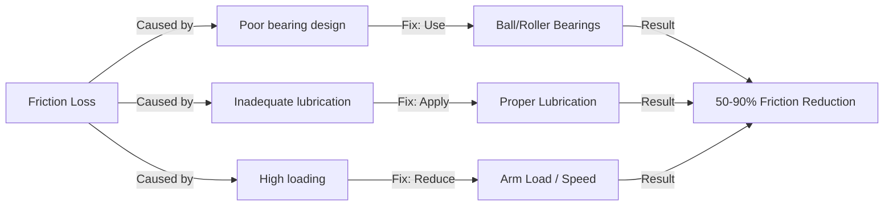
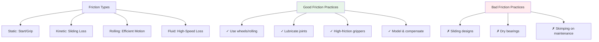

import { Callout } from 'fumadocs-ui/components/callout';
import { Accordion, Accordions } from 'fumadocs-ui/components/accordion';
import { Tab, Tabs } from 'fumadocs-ui/components/tabs';
import { Step, Steps } from 'fumadocs-ui/components/steps';

# Friction, Traction, and Stability

Friction plays a paradoxical role in robotics: it's essential for movement and control, yet it also causes energy loss and wear. Understanding and managing friction is crucial for designing efficient, reliable robots.

## Types of Friction

<Accordions>
<Accordion title="Static Friction">
### Static Friction

**Definition:** Friction that prevents motion between two surfaces that aren't moving relative to each other.

**Formula:**
```
F_s ≤ μ_s × N
```

Where:
- **F_s** = Static friction force (N)
- **μ_s** = Coefficient of static friction (dimensionless)
- **N** = Normal force (N)

**Key Characteristics:**
- Maximum value just before motion begins
- Always opposes potential motion direction
- Must be overcome to initiate movement
- Typically higher than kinetic friction (μ_s > μ_k)

**Robotics Applications:**
- **Starting motion:** Wheel must overcome static friction between tire and ground
- **Holding position:** Gripper relies on static friction to prevent object slipping
- **Braking:** Maximum deceleration limited by static friction between wheel and ground

**Example: Mobile Robot Starting**

A 10 kg robot with rubber wheels on concrete (μ_s ≈ 0.8):

```
Normal Force N = m × g = 10 × 9.81 = 98.1 N
Maximum Static Friction = 0.8 × 98.1 = 78.5 N

Motor must provide > 78.5 N force to start moving.
Below this force, wheels spin but don't move the robot.
```
</Accordion>

<Accordion title="Kinetic (Sliding) Friction">
### Kinetic Friction

**Definition:** Friction acting on objects in motion, opposing the direction of movement.

**Formula:**
```
F_k = μ_k × N
```

Where:
- **F_k** = Kinetic friction force (N)
- **μ_k** = Coefficient of kinetic friction
- **N** = Normal force (N)

**Key Characteristics:**
- Constant magnitude during motion
- Independent of velocity (approximately)
- Lower than static friction (μ_k < μ_s)
- Causes continuous energy loss

**Robotics Applications:**
- **Sliding gripper:** Friction during object sliding
- **Slipping wheel:** When wheel spin speed exceeds linear motion speed
- **Energy loss:** Converted to heat in joints and bearings

**Energy Loss Calculation:**

For a sliding gripper with 50 N clamping force on a 0.1 m diameter object moving 0.5 m:

```
Friction force: F_k = 0.3 × 50 = 15 N
Work done: W = F × d = 15 N × 0.5 m = 7.5 J
This energy becomes heat!
```
</Accordion>

<Accordion title="Rolling Friction">
### Rolling Friction

**Definition:** Friction when wheels or spheres roll on a surface, significantly lower than sliding friction.

**Formula:**
```
F_r = C_r × N
```

Where:
- **F_r** = Rolling friction force (N)
- **C_r** = Coefficient of rolling friction
- **N** = Normal force (N)

**Key Characteristics:**
- Much lower than sliding friction (typically 0.001-0.1)
- Enables efficient wheeled locomotion
- Increases with wheel deformation
- Temperature dependent

**Why Rolling is More Efficient:**

- Sliding friction: μ_k ≈ 0.3-0.8 (typical)
- Rolling friction: C_r ≈ 0.01-0.05 (typical)
- **Rolling is 10-80× more efficient than sliding!**

**Robotics Advantage:**
This is why wheeled robots are so common - rolling friction is minimal, allowing:
- Longer battery life
- Faster acceleration
- Less motor heating
- Reduced wear on components

**Practical Example:**

Compare 10 kg robot moving 100 m:

**Sliding (like a sled):**
```
F_friction = 0.5 × 98.1 = 49 N
Work = 49 N × 100 m = 4,900 J
```

**Rolling (wheeled robot):**
```
C_r = 0.03
F_friction = 0.03 × 98.1 = 2.94 N
Work = 2.94 N × 100 m = 294 J
```

**Wheeled robot uses 94% less energy!**
</Accordion>

<Accordion title="Fluid Friction (Drag)">
### Fluid Friction - Air and Water Resistance

**Formula:**
```
F_d = ½ × ρ × v² × C_d × A
```

Where:
- **F_d** = Drag force (N)
- **ρ** = Fluid density (kg/m³) [air ≈ 1.2, water ≈ 1000]
- **v** = Velocity (m/s)
- **C_d** = Drag coefficient (0.1-2.0 typical)
- **A** = Cross-sectional area (m²)

**Key Characteristic: Velocity-Squared Dependence**

Doubling speed quadruples drag! This is critical for:
- Aerial drones (major power consumer)
- High-speed mobile robots
- Underwater robots (water is 800× denser than air)

**Robotics Applications:**
- **Aerial drones:** Drag is primary energy consumer at speed
- **Underwater robots:** Must be streamlined to minimize drag
- **High-speed rovers:** Aerodynamics become important

**Example: Drone vs Speed**

Quadrotor drone (1 kg, 0.3 m² frontal area, C_d = 1.0, ρ_air = 1.2):

```
At 5 m/s: F_d = 0.5 × 1.2 × 25 × 1.0 × 0.3 = 4.5 N
At 10 m/s: F_d = 0.5 × 1.2 × 100 × 1.0 × 0.3 = 18 N (4× higher!)
At 15 m/s: F_d = 0.5 × 1.2 × 225 × 1.0 × 0.3 = 40.5 N (9× higher!)
```

This explains why drone battery life drops dramatically at higher speeds.
</Accordion>
</Accordions>

---

## Friction Coefficients: Reference Table

**Common Material Pairs:**

| Surface Pair | Static (μ_s) | Kinetic (μ_k) | Rolling (C_r) | Best Use |
|--------------|-------------|--------------|---------------|----------|
| **Rubber on Concrete** | 0.9-1.0 | 0.7-0.8 | 0.01-0.02 | Standard wheel |
| **Rubber on Ice** | 0.15-0.25 | 0.1-0.15 | 0.002-0.005 | Poor traction |
| **Metal on Metal** | 0.4-0.6 | 0.3-0.4 | - | Joint bearings |
| **Teflon on Steel** | 0.04-0.1 | 0.04-0.08 | - | Low-friction joints |
| **Wood on Wood** | 0.4-0.5 | 0.3-0.4 | - | Historical mechanisms |
| **Rubber on Sand** | 0.6-0.8 | 0.5-0.7 | 0.05-0.1 | Off-road wheels |
| **Cleats on Grass** | 1.2-1.5 | 0.8-1.0 | 0.03-0.05 | Terrain grip |

<Callout type="info" title="Finding Coefficients">
For materials not listed, you can:
1. Search scientific literature
2. Request from material suppliers
3. Measure experimentally using an inclined plane
4. Use approximate typical values (0.3-0.7 for most materials)
</Callout>

---

## Traction and Mobility

Traction is the friction force that enables movement without slipping - essential for robot locomotion.

### Maximum Traction Force

The maximum force a wheel can exert without slipping:

```
F_traction_max = μ × N = μ × m × g
```

Where:
- **μ** = Coefficient of friction (typically μ_s for starting)
- **m** = Robot mass
- **g** = Gravity (9.81 m/s²)

### Climbing Inclines

For a robot on a slope:

```mermaid
graph TD
    A["Robot on Incline"] -->|Weight creates| B["Component parallel to slope<br/>mg·sin(θ)"]
    A -->|Weight creates| C["Component perpendicular<br/>mg·cos(θ)"]
    
    C -->|Affects| D["Normal Force N"]
    D -->|Determines| E["Maximum Traction<br/>F_max = μ·N"]
    
    B -->|Must be overcome by| F["Wheel Traction Force"]
    
    F -->|If F > mg·sin(θ)| G["✓ Robot climbs"]
    F -->|If F < mg·sin(θ)| H["✗ Robot slips"]
```

**Example: 20 kg Robot on 30° Incline**

Given: μ_s = 0.8 (rubber on concrete)

```
Step 1: Component parallel to slope
F_parallel = m × g × sin(30°) = 20 × 9.81 × 0.5 = 98.1 N

Step 2: Normal force perpendicular to slope
N = m × g × cos(30°) = 20 × 9.81 × 0.866 = 169.5 N

Step 3: Maximum available traction
F_max_traction = 0.8 × 169.5 = 135.6 N

Step 4: Can it climb?
F_max_traction (135.6 N) > F_parallel (98.1 N) ✓ YES, robot can climb!

Margin: 135.6 - 98.1 = 37.5 N (allows acceleration too)
```

**Maximum Climbable Incline:**

At the steepest angle, friction just equals the component pulling down:

```
μ × m × g × cos(θ) = m × g × sin(θ)
μ × cos(θ) = sin(θ)
tan(θ) = μ
θ_max = arctan(μ)
```

For μ = 0.8:
```
θ_max = arctan(0.8) = 38.7°
```

A robot with μ = 0.8 traction can climb up to 38.7° incline at zero velocity.

---

## Traction Optimization Strategies

<Steps>
<Step>
### Increase Normal Force

**Method:** Increase robot weight/load on drive wheels

**Ways to do this:**
- Add ballast/weight to drive wheels
- Use weight distribution to bias wheels
- Increase overall robot mass (for off-road)
- Lower center of gravity

**Trade-off:** Heavier robots need more power to move, reducing efficiency and battery life

**Best practice:** Use minimum weight needed, concentrate it on drive wheels
</Step>

<Step>
### Increase Friction Coefficient

**Method:** Use higher friction materials

**High-friction wheel materials:**
- Rubber compounds (most common)
- Silicone (very high friction)
- Specialized track pads (extreme grip)

**Surface improvements:**
- Tread patterns (increase micro-grip)
- Textured surfaces (rubber dots)
- Compliant wheels (deform to fit surface)

**Trade-off:** Softer, grippier materials wear faster

**Best practice:** Match material to expected terrain
</Step>

<Step>
### Increase Contact Area

**Method:** Use larger or wider wheels

**Effects:**
- Wider wheels: Better weight distribution, reduced sinking
- Larger wheels: Better obstacle clearance, smoother motion
- Tracks: Maximum contact area, best traction on soft ground

**Trade-off:** Larger wheels are heavier and slower

**Best practice:** Balance size with speed requirements and weight budget
</Step>

<Step>
### Active Suspension

**Method:** Adjust weight distribution dynamically during motion

**Techniques:**
- Shift internal weight (CG redistribution)
- Active spring systems (adjust stiffness)
- Lean compensation (in turning)

**Advanced applications:**
- Terrain-adaptive suspension
- Dynamic load balancing
- Self-leveling platforms

**Trade-off:** Complex, heavy, power-consuming

**Best practice:** Use for demanding applications (rock crawlers, off-road competition)
</Step>
</Steps>

---

## Friction Management in Robots

### Minimizing Unwanted Friction

**In Joints and Bearings:**



**Specific Strategies:**

| Problem | Solution | Effect |
|---------|----------|--------|
| Sliding surfaces | Ball/roller bearings | 50-70% loss reduction |
| Dry surfaces | Lubrication (oil/grease) | 30-60% loss reduction |
| Worn surfaces | Surface treatment/coatings | 20-40% loss reduction |
| Contamination | Sealed bearings | Maintains low friction |

**Energy Savings Example:**

Robot arm with 50W friction loss:
- Reduce by 50%: 25W savings (4× longer battery life!)
- All-day operation vs. 1-hour operation

<Callout type="success" title="Lubrication Best Practices">
- Use recommended lubricant for each component
- Over-lubrication can increase drag (thick films)
- Under-lubrication causes rapid wear
- Sealed bearings: Don't need relubrication
- Open bearings: Relube every 50-100 operating hours
</Callout>

### Maximizing Useful Friction for Gripping

**Gripper Friction Requirements:**

```
Required Friction Force = (Object Mass × g) / Number of Gripper Fingers
```

**To prevent slipping of a 2 kg object with 2-finger gripper:**

```
F_required = (2 × 9.81) / 2 = 9.81 N per finger
```

**Strategies for Better Gripping:**

1. **High-friction materials:**
   - Rubber pads (μ ≈ 0.5-1.0)
   - Silicone (μ ≈ 0.8-1.5)
   - Specialized compounds (μ > 2.0)

2. **Textured surfaces:**
   - Bumpy patterns increase micro-contact
   - Can increase friction 20-50%

3. **Compliant pads:**
   - Soft materials conform to object shape
   - Increase contact area
   - Better for fragile objects

4. **Appropriate contact force:**
   - Too little: Object slips
   - Too much: Damage to object or motor stall
   - Typical: 1.5-2× minimum required force

---

## Friction Compensation in Control

Modern robots use sophisticated algorithms to handle friction:

### Friction Modeling

**Observed friction in robotics often follows:**

```
τ_friction = τ_coulomb + τ_viscous × ω + τ_static × sign(ω)
```

Where:
- **τ_coulomb** = Constant friction (Coulomb friction)
- **τ_viscous × ω** = Velocity-proportional friction (viscous drag)
- **τ_static** = Additional static friction at zero velocity

### Feedforward Compensation

Robot controllers measure these friction components and apply compensating torque:


**Benefits:**
- Smoother motion
- No jerky stick-slip behavior
- Better precision
- Reduced energy waste

**Trade-off:** Requires accurate friction model (which varies with temperature, wear, contamination)

---

## Summary: Friction in Practice



**Key Takeaways:**

✓ Rolling friction much less than sliding friction (use wheels!)
✓ Friction is essential for traction but wastes energy
✓ Lubrication reduces bearing friction 30-60%
✓ Higher friction materials improve gripping reliability
✓ Friction models enable precise motion control
✓ Maximum climbable incline = arctan(friction coefficient)