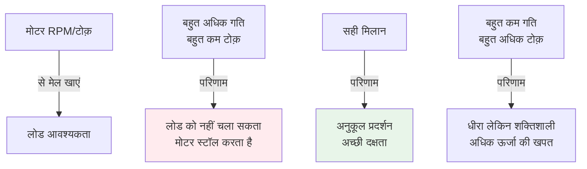

import { Callout } from 'fumadocs-ui/components/callout';
import { Tab, Tabs } from 'fumadocs-ui/components/tabs';

# घूर्णन और RPM

RPM (प्रति मिनट क्रांतियां) मोटर के प्रदर्शन को वर्णित करने के लिए सबसे सामान्य तरीका है। लेकिन घूर्णन गति को वास्तविक रैखिक गति और त्वरण में कैसे अनुवाद करते हैं? इस अनुभाग में हम घूर्णन गतिकी, घूर्णन गतिविज्ञान समीकरण, और गियरिंग प्रणालियों को कवर करते हैं।

## RPM को समझना

### RPM क्या है?

**परिभाषा:** प्रति मिनट क्रांतियां - एक मिनट में कितनी पूरी बार कुछ घूमता है।

```
1 क्रांति = 360° = 2π रेडियन
```

### RPM रूपांतरण

**RPM से rad/s (रेडियन प्रति सेकंड):**

```
ω (rad/s) = RPM × (2π / 60)
          = RPM × 0.10472
```

**उदाहरण:** 3000 RPM मोटर

```
ω = 3000 × (2π / 60) = 314.16 rad/s
```

**RPM से डिग्री प्रति सेकंड:**

```
ω (deg/s) = RPM × (360 / 60) = RPM × 6
```

उदाहरण: 3000 RPM = 18,000 deg/s

**RPM से Hertz (चक्र प्रति सेकंड):**

```
f (Hz) = RPM / 60
```

उदाहरण: 3000 RPM = 50 Hz

**रैखिक वेग (पहिये वाला):**

```
v (m/s) = RPM × D × π / 60

जहां D = पहिये का व्यास (मीटर में)
```

या त्रिज्या के साथ:
```
v = ω × r = RPM × (2π / 60) × r
```

---

## मोटर RPM रेंज

विभिन्न प्रकार की मोटरों के विशिष्ट RPM रेंज:

| मोटर प्रकार | विशिष्ट RPM | ऊर्जा | अनुप्रयोग |
|-----------|-----------|--------|----------|
| **DC ब्रश** | 5,000-20,000 | मध्यम | सामान्य रोबोट, पहिये |
| **BLDC (ब्रश रहित)** | 3,000-10,000 | उच्च | विद्युत ड्रोन, मुख्य अक्ष |
| **सर्वो** | 300-500 (नियंत्रित) | निम्न/मध्यम | संयुक्त कोण नियंत्रण |
| **स्टेपर** | 300-1000 (नियंत्रित) | निम्न | सटीक स्थिति |
| **रैखिक एक्सचुएटर** | 100-500 | निम्न | रैखिक गति |

### RPM उदाहरण

**उच्च RPM (5000+):**
- तेजी से लेकिन कम टोक़
- गियरिंग के साथ उपयोग किया जाता है
- लंबी बैटरी जीवन

**कम RPM (500-):**
- धीमा लेकिन अधिक टोक़
- सीधे उपयोग के लिए तैयार
- अधिक बिजली की खपत

---

## घूर्णन गतिविज्ञान समीकरण

### तीन मुख्य समीकरण

रैखिक गति के समान, लेकिन घूर्णन के लिए:

| पैरामीटर | रैखिक | घूर्णन | इकाई |
|----------|-------|---------|------|
| **स्थिति** | s | θ (थीटा) | m / rad |
| **वेग** | v = ds/dt | ω (ओमेगा) = dθ/dt | m/s / rad/s |
| **त्वरण** | a = dv/dt | α (अल्फा) = dω/dt | m/s² / rad/s² |

### तीन मुख्य समीकरण

**समीकरण 1: वेग बदलाव**

```
ω_f = ω_i + α × t
```

जहां:
- ω_f = अंतिम कोणीय वेग (rad/s)
- ω_i = प्रारंभिक कोणीय वेग (rad/s)
- α = कोणीय त्वरण (rad/s²)
- t = समय (s)

**समीकरण 2: विस्थापन**

```
θ = ω_i × t + 0.5 × α × t²
```

**समीकरण 3: वेग-विस्थापन**

```
ω_f² = ω_i² + 2 × α × θ
```

### उदाहरण: रोबोटिक आर्म जॉइंट

**परिदृश्या:** प्रारंभिक स्थिति 0 rad/s, अंतिम 20 rad/s, कुल 20 रेडियन (≈1150°) घूमना

**कोणीय त्वरण खोजें:**

समीकरण 3 का उपयोग करते हुए:
```
ω_f² = ω_i² + 2 × α × θ
20² = 0² + 2 × α × 20
400 = 40 × α
α = 10 rad/s²
```

**समय कितना है?**

समीकरण 1 का उपयोग करते हुए:
```
20 = 0 + 10 × t
t = 2 सेकंड
```

---

## रैखिक vs घूर्णन - सादृश्य तालिका

यह समझने में मदद करता है कि घूर्णन गति से कितना समान है:

| अवधारणा | रैखिक | घूर्णन | संबंध |
|---------|--------|---------|---------|
| **स्थिति** | s (मीटर) | θ (रेडियन) | s = r × θ |
| **वेग** | v (m/s) | ω (rad/s) | v = r × ω |
| **त्वरण** | a (m/s²) | α (rad/s²) | a = r × α |
| **बल/टोक़** | F (N) | τ (N·m) | τ = r × F |
| **द्रव्यमान/जड़ता** | m (kg) | I (kg·m²) | τ = I × α |
| **गतिज ऊर्जा** | KE = 0.5 × m × v² | KE = 0.5 × I × ω² | - |

---

## गियर अनुपात और प्रणाली

### सरल गियर अनुपात

मोटर की गति को कम किया जा सकता है लेकिन टोक़ गुणा किया जा सकता है:

```
अनुपात = ड्राइविंग गियर दांत / संचालित गियर दांत
       = N_1 / N_2
```

**उदाहरण: 20 दांत मोटर गियर, 100 दांत आउटपुट गियर**

```
अनुपात = 20 / 100 = 1:5 (या 5:1 कमी)

यदि मोटर 5000 RPM पर है:
आउटपुट = 5000 / 5 = 1000 RPM
```

### यौगिक गियर सिस्टम

कई गियर चरणों को जोड़ा जा सकता है:

**उदाहरण: 3-चरण 400:1 कमी**

```
चरण 1: 10:1
चरण 2: 8:1
चरण 3: 5:1

कुल = 10 × 8 × 5 = 400:1

मोटर 5000 RPM पर:
अंतिम आउटपुट = 5000 / 400 = 12.5 RPM
```

---

## दक्षता और ऊर्जा हानि

### गियर दक्षता

गियर सभी इनपुट शक्ति को आउटपुट में नहीं बदलते:

| गियर प्रकार | विशिष्ट दक्षता | ऊर्जा हानि |
|-----------|-----------|----------|
| **स्पर गियर** | 95-98% | 2-5% घर्षण/आवाज |
| **हेलिकल गियर** | 96-99% | 1-4% (स्मूथर) |
| **वर्म गियर** | 40-90% | 10-60% (उच्च बल) |
| **ग्रह गियर** | 95-97% | 3-5% |

### शक्ति हानि गणना

**परिदृश्य: 50:1 वर्म गियर, 1000 W इनपुट**

```
दक्षता = 50% (वर्म गियर विशिष्ट)
आउटपुट शक्ति = 1000 W × 0.50 = 500 W
हानि = 1000 - 500 = 500 W (गर्मी)
```

यह महत्वपूर्ण है - वर्म गियर गर्म हो जाते हैं!

---

## व्यावहारिक गणनाएं

### पहिये की रैखिक गति

**परिदृश्य:** 10 सेमी (0.1 मीटर) व्यास पहिया, 200 RPM

```
v = RPM × π × D / 60
  = 200 × π × 0.1 / 60
  = 200 × 0.314 / 60
  = 1.047 m/s
  ≈ 1.05 m/s (लगभग 3.8 km/h)
```

### पहिये की त्वरण

**परिदृश्या:** 0.05 मीटर त्रिज्या पहिया, 2 rad/s² कोणीय त्वरण

```
a = r × α
  = 0.05 m × 2 rad/s²
  = 0.1 m/s²
```

रैखिक गति त्वरण: 0.1 m/s²

---

## मोटर-लोड मिलान

रोबोट में, मोटर और लोड (गियर, पहिये, भार) को मेल खाना आवश्यक है:



### चरण-दर-चरण मिलान

1. **लोड बल की गणना करें**
   - गति के लिए: F = m × a
   - पहिये के लिए: F = μ × m × g + प्रतिरोध

2. **आवश्यक लोड टोक़**
   - τ = F × r (पहिये के लिए)

3. **मोटर टोक़ चुनें**
   - मोटर τ > 1.5 × लोड τ (सुरक्षा मार्जिन)

4. **गियर अनुपात सेट करें**
   - अनुपात = मोटर RPM / आवश्यक RPM

5. **अंतिम गति जांचें**
   - RPM_आउटपुट = RPM_मोटर / अनुपात

---

## सारांश

**मुख्य सूत्र:**

- ✓ RPM को rad/s में: ω = RPM × (2π / 60)
- ✓ रैखिक से घूर्णन: v = r × ω, a = r × α
- ✓ घूर्णन समीकरण: ω_f = ω_i + α × t
- ✓ विस्थापन: θ = ω_i × t + 0.5 × α × t²
- ✓ गियर अनुपात: अनुपात = RPM_इनपुट / RPM_आउटपुट

**व्यावहारिक डिजाइन:**

1. अपनी गति आवश्यकता जानें (RPM या m/s)
2. अपनी टोक़ आवश्यकता जानें
3. एक मोटर चुनें जो इसे प्रदान कर सके
4. गियरिंग चुनें जो यह मेल करे
5. दक्षता बनाम गति/टोक़ का संतुलन करें