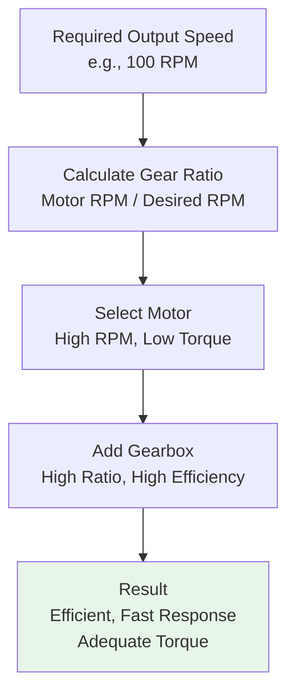
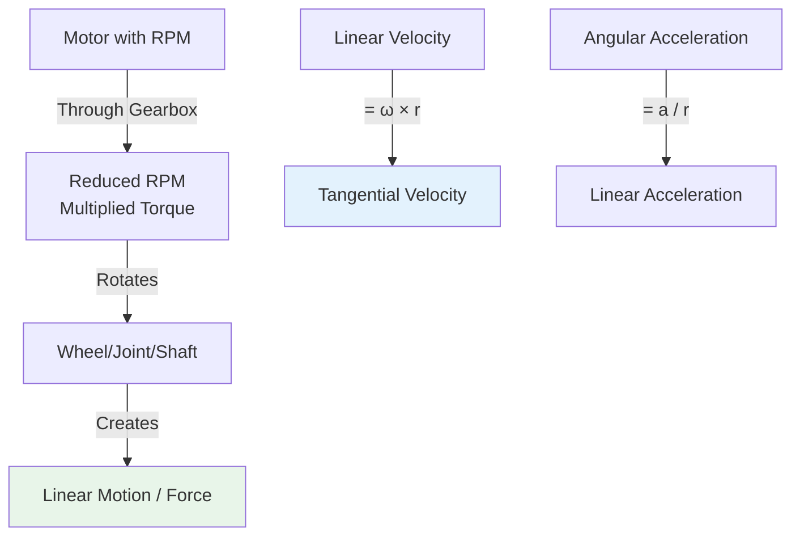

import { Callout } from 'fumadocs-ui/components/callout';
import { Tab, Tabs } from 'fumadocs-ui/components/tabs';

# Rotational Motion and RPM

Understanding rotational motion is essential for motor selection, gear design, velocity control, and predicting robot performance. This section covers the physics and practical applications of rotational motion in robotics.

## Revolutions Per Minute (RPM)

RPM is the most common way to specify motor speed. It represents the number of complete 360° rotations an object makes in one minute.

### Key Conversions

Converting between different rotational speed units:

| From | To | Formula |
|------|-----|---------|
| **RPM** | rad/s | ω (rad/s) = (RPM × 2π) / 60 |
| **rad/s** | RPM | RPM = (ω × 60) / (2π) |
| **RPM** | deg/s | deg/s = RPM × 6 |
| **RPM** | Hz (rev/s) | Hz = RPM / 60 |
| **Linear speed** | RPM | RPM = (v × 60) / (2πr) |
| **RPM** | Linear speed | v = (RPM × 2πr) / 60 |

### Practical RPM Ranges in Robotics

| Motor Type | Typical RPM | Common Applications |
|------------|------------|---------------------|
| **DC Motor** | 5,000-20,000 | Direct drive wheels, small robots |
| **Brushless Motor** | 3,000-10,000 | Drones, precision systems |
| **Stepper Motor** | 1,000-2,000 (typical) | 3D printers, CNC |
| **Servo Motor** | 300-500 (loaded) | Robot arms, controlled motion |
| **Gear-reduced DC** | 10-300 (typical) | Wheel drive, heavy lifting |

<Callout type="info" title="Why Gear Reduction?">
Raw motors are too fast and weak for most robotic tasks. Gearboxes reduce speed by a known ratio while multiplying torque by the same ratio.

Example: 3000 RPM motor + 50:1 gearbox = 60 RPM output with 50× more torque
</Callout>

---

## Rotational Kinematics

Just as linear motion has kinematic equations, rotational motion has parallel equations that describe angular position, velocity, and acceleration.

### Rotational Motion Equations

<Tabs items={['Basic', 'Comparison', 'Derivations']}>
<Tab value="Basic">
### Fundamental Rotational Equations

**1. Angular Velocity:**
```
ω = ω₀ + αt
```

**2. Angular Displacement:**
```
θ = ω₀t + ½αt²
```

**3. Velocity-Displacement:**
```
ω² = ω₀² + 2αθ
```

Where:
- **ω** = Final angular velocity (rad/s)
- **ω₀** = Initial angular velocity (rad/s)
- **α** = Angular acceleration (rad/s²)
- **t** = Time (seconds)
- **θ** = Angular displacement (radians)

**Converting degrees to radians:**
```
θ (radians) = θ (degrees) × π / 180
```
</Tab>

<Tab value="Comparison">
### Linear vs Rotational Analogy

Understanding the direct correspondence helps apply familiar linear concepts to rotation:

| Linear Motion | Rotational Motion | Conversion |
|---------------|-------------------|-----------|
| Position: x (m) | Angular Position: θ (rad) | x = θ × r |
| Velocity: v (m/s) | Angular Velocity: ω (rad/s) | v = ω × r |
| Acceleration: a (m/s²) | Angular Acceleration: α (rad/s²) | a = α × r |
| Mass: m (kg) | Moment of Inertia: I (kg·m²) | - |
| Force: F (N) | Torque: τ (N·m) | F = τ / r |
| **Linear Equations** | **Rotational Equations** | - |
| v = v₀ + at | ω = ω₀ + αt | |
| x = v₀t + ½at² | θ = ω₀t + ½αt² | |
| v² = v₀² + 2ax | ω² = ω₀² + 2αθ | |

**Key Insight:** The relationship x = θ × r applies to all motion variables when proper units are used (radians for angles, meters for radius).
</Tab>

<Tab value="Derivations">
### Deriving the Equations

**Starting from angular acceleration:**
```
α = dω/dt
```

**Integrating to get velocity:**
```
ω = ∫α dt = α·t + C

With initial condition ω(0) = ω₀:
ω = ω₀ + αt
```

**Integrating again for displacement:**
```
θ = ∫ω dt = ∫(ω₀ + αt) dt = ω₀t + ½αt² + C

With initial condition θ(0) = 0:
θ = ω₀t + ½αt²
```

**For velocity-displacement (eliminating time):**

From ω = ω₀ + αt, solve for time: t = (ω - ω₀)/α

Substitute into θ = ω₀t + ½αt²:
```
θ = ω₀(ω - ω₀)/α + ½α[(ω - ω₀)/α]²
θ = (ω₀ω - ω₀²)/α + (ω² - 2ωω₀ + ω₀²)/(2α)
θ = (ω² - ω₀²)/(2α)

Rearranging:
ω² = ω₀² + 2αθ
```
</Tab>
</Tabs>

### Practical Examples

**Example 1: Robot Arm Joint Acceleration**

A robot arm joint accelerates from rest (ω₀ = 0) with angular acceleration α = 10 rad/s² for 2 seconds.

Find final angular velocity and displacement:

```
ω = ω₀ + αt = 0 + 10 × 2 = 20 rad/s

θ = ω₀t + ½αt² = 0 + ½ × 10 × 2² = 20 radians

Converting to degrees: 20 × 180/π = 1146° ≈ 3.2 full rotations
```

**Example 2: Spinning Up a Wheel**

A wheel with angular velocity of 50 rad/s must stop in exactly 1 rotation (2π radians) with constant deceleration.

Find the required deceleration:

```
Using ω² = ω₀² + 2αθ:
0² = 50² + 2 × α × 2π
0 = 2500 + 4πα
α = -2500/(4π) = -198.9 rad/s²

Time to stop:
ω = ω₀ + αt
0 = 50 + (-198.9) × t
t = 0.251 seconds
```

---

## Gear Ratios and Speed Reduction

Gears are the primary method to trade motor speed for usable torque and to match motor characteristics to load requirements.

### Understanding Gear Ratios

**Simple Gear Ratio:**
```
Gear Ratio = Number of Teeth on Driven Gear / Number of Teeth on Drive Gear
Gear Ratio = Output Speed / Input Speed
```

**Example: Two Gears**

Driver gear: 20 teeth, spinning at 300 RPM
Driven gear: 100 teeth

```
Gear Ratio = 100 / 20 = 5:1

Output Speed = 300 RPM / 5 = 60 RPM
Output Torque = Input Torque × 5
```

### Compound Gear Systems

For larger speed reductions (like 50:1 or 100:1), multiple gear stages are used:

```
Total Ratio = Ratio₁ × Ratio₂ × Ratio₃ × ...
```

**Example: 3-Stage Gearbox**

- Stage 1: 10:1 (20 teeth → 200 teeth)
- Stage 2: 8:1 (25 teeth → 200 teeth)  
- Stage 3: 5:1 (20 teeth → 100 teeth)

```
Total Ratio = 10 × 8 × 5 = 400:1

5000 RPM motor → 5000/400 = 12.5 RPM output
1 N·m input → 1 × 400 × 0.95 ≈ 380 N·m output (95% efficiency)
```

### Efficiency in Gearboxes

Real gearboxes lose energy to friction:

```
Output Power = Input Power × Efficiency
Output Torque = Input Torque × Gear Ratio × Efficiency
```

**Typical Gearbox Efficiencies:**

| Type | Efficiency |
|------|-----------|
| Spur Gear (single stage) | 95-98% |
| Helical Gear (single stage) | 96-99% |
| Worm Gear (single stage) | 40-90% |
| Planetary Gear | 90-96% |
| Multi-stage gearbox | 75-95% (cumulative) |

<Callout type="warn" title="Worm Gears">
While worm gears provide very high ratios in compact form, they have poor efficiency (~70-80% per stage) and generate considerable heat. Use only when space is critical and power loss is acceptable.
</Callout>

### Motor-Load Matching

Proper gear selection ensures the motor operates in its efficient range:



**Example: Mobile Robot Wheel Motor**

Requirements:
- Desired wheel speed: 2 m/s
- Wheel radius: 0.1 m
- Required wheel RPM: (2 × 60) / (2π × 0.1) ≈ 191 RPM

Motor selection:
- Use 5000 RPM motor with 26:1 gearbox
- Output: 5000 / 26 ≈ 192 RPM ✓
- Motor runs at ~96% of max (efficient)
- Good acceleration response

---

## Angular Motion in Robot Mechanics



### Velocity Conversion: RPM to Linear Speed

For a rotating wheel or drum:

```
v = (RPM × 2πr) / 60
```

Where:
- v = Linear velocity (m/s)
- RPM = Motor/wheel speed
- r = Wheel/drum radius (meters)

**Example: Drive Wheel**

3000 RPM motor with:
- 50:1 gearbox: Output = 60 RPM
- 0.1 m wheel radius

```
v = (60 × 2π × 0.1) / 60 = 0.628 m/s ≈ 0.63 m/s or 2.3 km/h
```

### Acceleration Conversion

Angular acceleration translates to linear acceleration at the wheel edge:

```
a = α × r
```

Where:
- a = Linear acceleration (m/s²)
- α = Angular acceleration (rad/s²)
- r = Radius (m)

---

## Practical Considerations

<Callout type="success" title="Motor Specifications">
When selecting a motor, you'll see:

1. **No-load RPM:** Maximum speed with no load (useful for calculation)
2. **Stall Torque:** Maximum torque when motor can't spin (brief, not continuous)
3. **Continuous Torque/Current:** Safe long-term operation point
4. **Peak Torque/Current:** Short-term maximum (seconds only)

**Always design for continuous ratings, not peak or stall values.**
</Callout>

### Selecting RPM for Your Robot

**For Speed Priority:**
- Use higher RPM motor (3000+ RPM)
- Lower gear ratio (5:1 to 20:1)
- Fast acceleration
- Example: Racing robot, delivery robot

**For Torque Priority:**
- Use lower RPM motor (500-1500 RPM)
- Higher gear ratio (50:1 to 100:1)
- Strong climbing/lifting
- Slower response
- Example: Heavy loader, climbing robot

**For Balance:**
- Use medium RPM (1500-3000 RPM)
- Medium gear ratio (20:1 to 50:1)
- Good acceleration and torque
- Example: Most general-purpose robots

---

**Key Takeaways:**

✓ RPM describes motor speed, but gearing transforms it to useful speed/torque combinations
✓ Rotational kinematics follows the same principles as linear kinematics with analogous variables
✓ Gear ratios multiply torque and divide speed (or vice versa) through the mechanical advantage
✓ Efficiency matters - multi-stage gearboxes lose significant power
✓ Match motor RPM and gearing to your actual application requirements