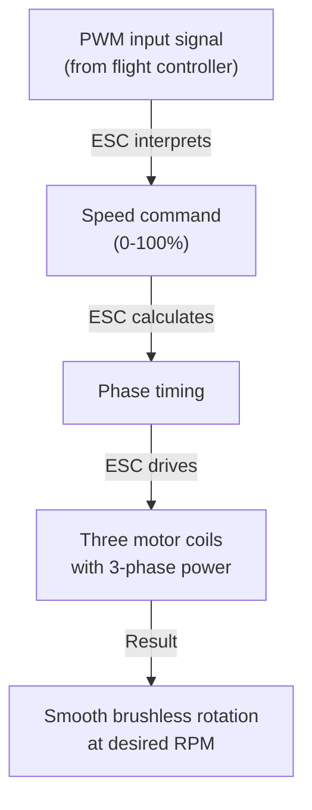

import { Callout } from 'fumadocs-ui/components/callout';
import { Tab, Tabs } from 'fumadocs-ui/components/tabs';

# Electronic Speed Controllers (ESCs)

An ESC is the "brain" controlling a brushless motor. It takes a simple PWM signal and outputs sophisticated three-phase power to spin the motor at any desired speed.

## What ESCs Do

### ESC Functions



### Why Not Direct Battery?

```
Direct battery connection: Motor spins full RPM (no control)
ESC connection: Fine-grained control over entire RPM range
Plus: Built-in protection, current limiting, safety features
```

---

## ESC Specifications

### Key Ratings

**Current rating:**
```
ESC 30A specification means:
- Can handle 30A continuous current
- Peak: Usually 50-100A for short bursts
```

**Voltage range:**
```
ESC rated "2-6S" means:
- 2S LiPo: 7.4V minimum
- 6S LiPo: 22.2V maximum
```

**Firmware types:**
- **BLHELI** (most common)
- **SimonK** (good for racing)
- **DShot** (latest, digital communication)

### Example Specifications: 40A ESC

```
Continuous current:     40A
Burst current:          60A
Voltage range:          2-6S LiPo (7.4-22.2V)
BEC output:             5V / 2A (for receiver)
Firmware:               BLHELI
Switchable frequency:   8 kHz or 16 kHz
Weight:                 28g
```

---

## Motor Compatibility

### Matching ESC to Motor

```
Motor KV rating (RPM per volt):
Motor KV 920 at 12V = 920 × 12 = 11,040 RPM max

ESC must handle this RPM:
Most ESCs: 200,000 ERPMs (electronic RPM)
Some racing ESCs: 400,000+ ERPMs

Check: Motor RPM < ESC max RPM (with margin)
```

### Power Calculation

```
Power (W) = Voltage (V) × Current (A)

Example: 12V 30A ESC
Maximum power = 12V × 30A = 360W
```

---

## ESC Connections

### Standard Wiring

```
From battery:
  Red wire    → Battery positive
  Black wire  → Battery negative/GND

To motor:
  Three wires → Three motor coils (order can be reversed for direction)

From controller:
  Signal (white/yellow)   → PWM input
  Power (red)            → 5V from BEC
  Ground (black)         → Common ground
```

### Three-Phase Motor Wires

```
ESC outputs: A, B, C phases
Motor coils: Phase A, B, C (color coded)

Connection: ESC A → Motor coil A, B → B, C → C
Reverse: Swap any two wires (e.g., A ↔ B) to reverse direction
```

### BEC (Battery Elimination Circuit)

ESC supplies 5V regulated power to receiver/controller:

```
Battery → ESC
          ├─ Powers motor (high current)
          └─ BEC outputs 5V (2A typical)
                └─ Powers flight controller

Advantage: Only one battery needed
Disadvantage: ESC failure = no control
```

---

## ESC Calibration

### Why Calibration?

ESCs need to know PWM input range:
- Minimum signal (motor off)
- Maximum signal (full throttle)

### Calibration Steps

<Tabs items={['Basic Calibration', 'Advanced Setup', 'Reversing Motor']}>
<Tab value="Basic Calibration">
### Standard Throttle Calibration

1. **Connect battery** (but not to ESC yet)
2. **Set transmitter/controller to maximum throttle**
3. **Connect battery to ESC** (beep sequence indicates calibration mode)
4. **Set transmitter to minimum throttle** (beep confirms)
5. **Motor is now calibrated**

Alternatively:
1. Send maximum PWM (2000 µs)
2. Send minimum PWM (1000 µs)
3. Send neutral PWM (1500 µs)

Done!

</Tab>

<Tab value="Advanced Setup">
### Program Settings

Many ESCs allow programming (via transmitter clicks or PC):

- **Rotation direction:** CW or CCW
- **Brake strength:** 0% to 100%
- **Cut-off voltage:** Low voltage protection
- **Frequency:** 8kHz or 16kHz switching
- **BEC voltage:** 5.2V or 6.0V

Use manufacturer software or transmitter commands.

</Tab>

<Tab value="Reversing Motor">
### Reverse Motor Direction

Three methods (in order of preference):

**1. Swap any two wires:**
```
Original: Motor A → ESC A, B → B, C → C (CCW)
Swap A↔B: Motor A → ESC B, B → A, C → C (CW)
```

**2. Software setting:**
Most ESCs can reverse via programming

**3. ESC menu (if available):**
Menu option: Direction → Reverse

</Tab>
</Tabs>

---

## ESC Protection Features

### Built-in Protections

```
1. Over-current protection
   └─ If current exceeds rating, throttle reduces
   
2. Low voltage cutoff (LVC)
   └─ Stops motor before battery dies completely
   
3. Over-temperature
   └─ Reduces current if ESC gets too hot
   
4. Stall protection
   └─ If motor can't spin, reduces power to prevent damage
```

### Example: 40A ESC with 30A sustained

```
Motor jams (locked): Wants to draw 100A
ESC 40A limit: Throttles back to 40A
Over-current protection: Reduces to 30A after 5 seconds
Result: Motor protected, system doesn't burn out
```

---

## ESC Troubleshooting

| Problem | Cause | Solution |
|---------|-------|----------|
| **Motor won't spin** | Not calibrated | Recalibrate ESC |
| | No signal | Check PWM connection |
| | Low voltage | Check battery |
| **Motor spins slowly** | Calibration off | Recalibrate with full range |
| | PWM frequency wrong | Check controller frequency |
| **Motor stutters/jerks** | Bad connection | Reflow solder on wires |
| | Firmware issue | Update BLHELI |
| **Excessive heat** | Continuous overload | Reduce load or use larger ESC |
| | Poor connections | Check solder joints |
| **Beeping patterns** | Various codes | Check manual (armed/disarmed) |

---

## Advanced ESC Features

### DShot Protocol

Newest ESC standard using digital communication (not PWM):

```
Advantages:
✓ Precise control (11-bit resolution vs 8-bit PWM)
✓ Low latency (~25 µs vs 1000+ µs)
✓ Can read ESC telemetry (temperature, current)
✓ CRC error checking

Requirements:
- DShot-compatible flight controller
- DShot-compatible ESC
- Special cabling

Example: BLHeli_32 with DShot600
```

### Telemetry

Some advanced ESCs send back data:

```
Data available:
- Actual RPM
- Current draw (amps)
- Temperature
- Voltage

Usage:
- Monitor motor health
- Detect problems early
- Adjust control in real-time
```

### Programmable Features

Many ESCs allow adjustment via programming:

| Feature | Default | Range | Effect |
|---------|---------|-------|--------|
| **Brake** | On | 0-100% | Motor braking force |
| **LVC** | 6.0V | 4.5-8.0V | Low voltage cutoff |
| **Start Force** | 100% | 50-150% | Startup power |
| **PWM Frequency** | 8kHz | 8/16 kHz | Switching frequency |

---

## Practical Example: Quadcopter ESC Setup

```
Battery: 4S LiPo (14.8V nominal)
Motors: 4× 920KV (11,040 RPM max at 14.8V)
ESCs: 4× 40A rated

Wiring:
Battery → Power Distribution Board (PDB)
PDB → ESC 1, 2, 3, 4 (power)
ESC 1,2,3,4 → Motors 1,2,3,4 (three-phase wires)

Signal:
Flight controller → ESC 1,2,3,4 (PWM on pins 1,2,3,4)

Calibration:
1. Max throttle on transmitter
2. Connect battery
3. Min throttle on transmitter (calibration complete)
```

---

## Common ESC Models

| Model | Current | Voltage | Type | Price | Use |
|-------|---------|---------|------|-------|-----|
| **Turnigy Plush** | 40A | 2-6S | Analog | $ | Multirotor |
| **BLHeli_32** | 30-50A | 2-6S | BLHELI | $$ | Racing |
| **KISS ESC** | 24A | 2-6S | Ultra-fast | $$$ | FPV Racing |
| **DJI ESC** | 40A | 2-6S | DShot | $$$ | Phantom |
| **Littlebee** | 20A | 1-3S | Tiny | $ | Micro drones |

---

## Summary

**ESC Essentials:**

✓ ESC turns simple PWM into three-phase motor control
✓ Match ESC current rating to motor requirements
✓ Calibration ensures full throttle range works
✓ Built-in protections prevent damage
✓ Reverse motor by swapping two wires

**Selection Guide:**

1. Calculate motor current at full power
2. Choose ESC rated 20-30% higher
3. Verify voltage range matches battery
4. Check firmware (BLHELI, DShot, etc.)
5. Calibrate before first use

**For Different Applications:**

- **Multirotor:** Standard BLHELI 40-80A ESCs
- **Racing:** DShot, ultra-fast ESCs
- **Robotics arm:** 10-20A smooth torque ESC
- **Rover:** 60+ A high-current ESC