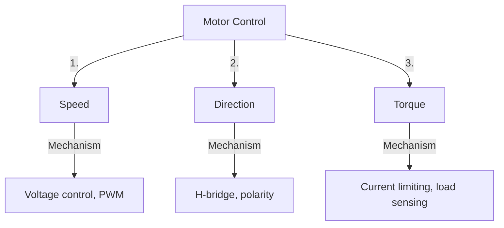
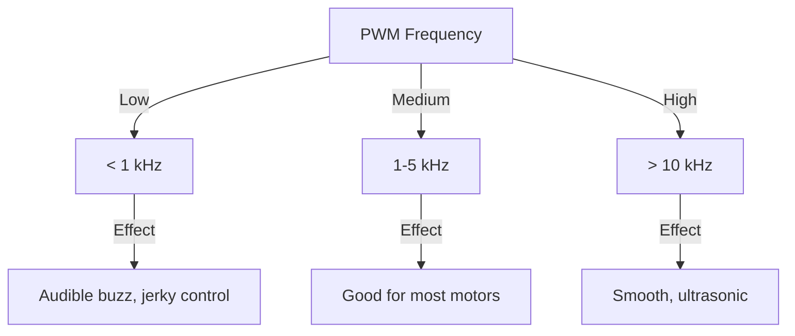

import { Callout } from 'fumadocs-ui/components/callout';
import { Tab, Tabs } from 'fumadocs-ui/components/tabs';
import { Accordion, Accordions } from 'fumadocs-ui/components/accordion';

# Motor Control Strategies

Controlling motors is fundamental to robotics. Whether you need variable speed, reverse direction, or precise torque, understanding control methods is essential.

## Motor Control Parameters

### The Three Core Controls



---

## Speed Control

### Method 1: Voltage Control

Reduce the voltage applied to the motor to reduce speed:

```
Full voltage (12V) → Full speed (5000 RPM)
Half voltage (6V) → Half speed (~2500 RPM)
```

**Advantages:**
✓ Simple
✓ No electrical noise

**Disadvantages:**
✗ Torque decreases significantly
✗ Inefficient (waste as heat)
✗ Hard to implement precisely with DC supplies

### Method 2: PWM (Pulse-Width Modulation)

The industry standard for motor control:

```
Motor sees average voltage = (ON time / Total time) × Supply voltage

100% PWM (always on):    Motor at full speed
75% PWM (3/4 on, 1/4 off): Motor at 75% speed
50% PWM (1/2 on, 1/2 off): Motor at 50% speed
```

**Example timing:**
```
Total cycle: 20 ms (50 Hz)

100% duty: ON 20ms, OFF 0ms      → 12V average
75% duty:  ON 15ms, OFF 5ms      → 9V average
50% duty:  ON 10ms, OFF 10ms     → 6V average
25% duty:  ON 5ms, OFF 15ms      → 3V average
```

**Advantages:**
✓ Efficient (little wasted as heat)
✓ Maintains torque well
✓ Digital, precise control
✓ No noise

**Disadvantages:**
✗ Requires fast switching
✗ Slight acoustic noise (high frequency)
✗ More complex than voltage control

### PWM Frequency Impact



**Typical PWM frequencies:**
- Arduino: 490-980 Hz (too low for servos)
- Motor controllers: 5-20 kHz (good)
- Servo motors: 50 Hz (fixed)
- High-speed ESCs: 32 kHz (racing)

---

## Direction Control

### Method 1: Mechanical Relay

Switch wires using electromagnetic relay:

```
Motor forward: Relay coil de-energized
               Wires connected: +12V to pin 1, GND to pin 2

Motor backward: Relay coil energized
                Wires swapped: GND to pin 1, +12V to pin 2
```

**Disadvantages:**
✗ Slow (~50ms to switch)
✗ Mechanical wear
✗ Audible click
✗ Power draw

### Method 2: H-Bridge (Electronic)

Four transistors create bidirectional current control:

```
       +12V
        │
    ┌───┴───┐
    │Q1  Q2│
    │   │   │
Motor← ← → →Motor
    │   │   │
    │Q3  Q4│
    └───┬───┘
        │
       GND

Forward: Q1 and Q4 ON  → +12V to left, GND to right
Backward: Q2 and Q3 ON → GND to left, +12V to right
Stop: All OFF          → Motor coasts (unpowered)
```

**H-Bridge Truth Table:**

| Q1 | Q2 | Q3 | Q4 | Result |
|----|----|----|----|----|
| OFF | OFF | OFF | OFF | Coast (unpowered) |
| ON | OFF | OFF | ON | Forward |
| OFF | ON | ON | OFF | Backward |
| ON | ON | OFF | OFF | **Shoot-through** (SHORT!) ❌ |

**Never turn on Q1 and Q2 together** → Short circuit!

### Method 3: MOSFET H-Bridge with PWM

Combine H-bridge with PWM for variable speed control:

```
Forward at 50%: Q1 PWM 50%, Q4 ON
Backward at 75%: Q2 ON, Q3 PWM 75%
```

---

## Torque Control

### Understanding Motor Torque

```
Torque = proportional to current

High torque = High current
Low torque = Low current
```

### Method 1: Current Limiting

Sense motor current and limit maximum:

```
Motor draws: 20A (jamming)
Limit set to: 10A
Response: Reduce PWM to stay at 10A
Result: Motor can't jam, protected
```

**Implementation:**
- Shunt resistor measures current
- ADC samples voltage drop
- Feedback loop adjusts PWM

### Method 2: Torque Feedback from Load

Use encoder or strain gauge to measure actual torque:

```
Target torque: 10 N·m
Measured: 8 N·m (load light)
Action: Increase current to reach 10 N·m

Measured: 10 N·m (load heavy)
Action: Reduce current, motor will slip controlled
```

### Method 3: Stall Protection

Prevent motor from drawing excessive current at startup:

```
Soft-start: Gradually increase from 0 to 100% over 0.5 seconds
Result: Smooth acceleration instead of massive spike
```

---

## Motor Control Algorithms

### Open-Loop Control (Simple)

Just set PWM and hope for best:

```
Command: "Set speed to 50%"
Action: Set PWM to 50%
Reality: Might be 48% if load changes (no feedback)
```

**Used in:** Toys, simple robots
**Problem:** No correction for external disturbances

### Closed-Loop Control (PID)

Sense actual speed and correct:

```
Target speed: 1000 RPM
Measured speed: 950 RPM
Error: 50 RPM difference

PID controller:
P (Proportional): Increase PWM by 5%
I (Integral): Remember past errors, add correction
D (Derivative): Predict overshoot, add damping

New PWM: Smoothly reaches 1000 RPM
```

**Used in:** Robots, quadcopters, industrial motors
**Advantage:** Maintains speed despite load changes

### Acceleration Ramping

Prevent sudden current spikes:

```
Command: Go to full speed
Linear ramp: 0 → 100% over 1 second (100%/sec)

Quadratic ramp: S-curve for smoother

Result: Smooth startup, less mechanical stress
```

---

## Motor Control IC Comparison

| Feature | L298N | L293D | BTS7960 | DRV8833 |
|---------|-------|-------|---------|---------|
| **Max Current** | 2A | 600mA | 43A | 2A |
| **Voltage** | 5-35V | 4.5-36V | 5-27V | 2.7-10.8V |
| **PWM support** | Yes | Yes | Yes | Yes |
| **Cost** | $ | $ | $$ | $ |
| **H-bridge** | Yes | Yes | Yes | Yes |
| **Best for** | Medium motors | Small motors | Large motors | Micro motors |

---

## Practical Examples

### Example 1: Robot with Two Motors

```
Left motor control:
  Pin EN1 (PWM) → Speed 0-255 (PWM duty)
  Pin IN1/IN2 (Digital) → Direction (fwd/back)

Right motor control:
  Pin EN2 (PWM) → Speed 0-255
  Pin IN3/IN4 (Digital) → Direction

Code:
  Forward: EN1=150, IN1=HIGH, EN2=150, IN2=LOW
  Turn left: EN1=100, IN2=150
  Backward: EN1=150, IN1=LOW, EN2=150, IN2=HIGH
```

### Example 2: Servo Motor

Servos are pre-controlled with internal electronics:

```
Just send PWM signal: 50 Hz frequency
Pulse width determines angle:
  1.0 ms → 0°
  1.5 ms → 90°
  2.0 ms → 180°

No need for full H-bridge, just single PWM line!
```

---

## Common Problems and Solutions

| Problem | Cause | Solution |
|---------|-------|----------|
| **Motor doesn't start** | Dead zone in PWM | Increase minimum PWM (15-20%) |
| **Jerky motion** | PWM too low frequency | Increase to 5+ kHz |
| **Excessive current** | No current limiting | Add shunt resistor, limit in software |
| **Motor gets hot** | Continuous high torque | Reduce duty cycle or load |
| **Uncontrolled spin** | No feedback | Add encoder, implement PID |
| **Oscillation** | PID gains too high | Tune P/I/D gains |

---

## Summary

**Speed Control:**
✓ PWM is the standard method
✓ Efficient, precise, smooth
✓ Use 5+ kHz frequency for audible noise control

**Direction Control:**
✓ H-bridge circuit required
✓ Electronic (MOSFET) > mechanical (relay)
✓ Never shoot through (short circuit)

**Torque Control:**
✓ Measure current, limit if needed
✓ Soft-start prevents spikes
✓ Stall protection saves motor

**Control Algorithm:**
✓ Open-loop simple but imprecise
✓ Closed-loop PID for stability
✓ Ramping for smooth acceleration

**Implementation:**
✓ Choose IC based on current/voltage needs
✓ Add feedback for critical applications
✓ Test thoroughly before deployment