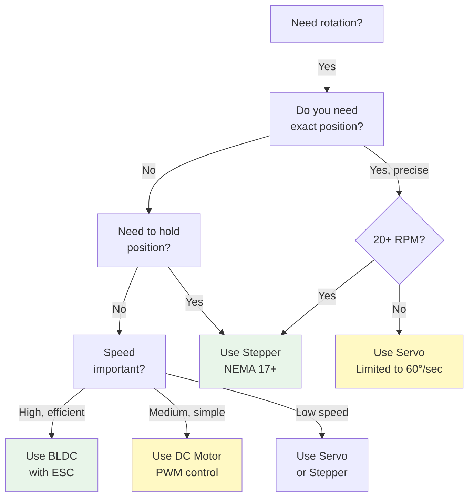

import { Callout } from 'fumadocs-ui/components/callout';
import { Tab, Tabs } from 'fumadocs-ui/components/tabs';
import { Accordion, Accordions } from 'fumadocs-ui/components/accordion';

# Motor Types and Characteristics

Motors are the actuators of robotics - they convert electrical energy into mechanical motion. Different motor types have vastly different characteristics, control requirements, and applications. Choosing the right motor is critical for successful robot design.

## Motor Comparison Overview

| Motor Type | Voltage | Speed (RPM) | Torque | Control | Best For |
|-----------|---------|-----------|--------|---------|----------|
| **DC Brushed** | 3-24V | 5K-20K | Medium | Voltage/PWM | Mobile robots, wheels |
| **DC Brushless (BLDC)** | 3-48V | 1K-10K | Medium-High | PWM/3-phase | Drones, efficient systems |
| **Servo** | 4.8-7.2V | 300-500 (controlled) | Medium | PWM pulse | Arm joints, steering |
| **Stepper** | 12-24V | 100-1000 (stepped) | Low-Medium | Step pulses | Positioning, printing |

---

## DC Brushed Motors

### How It Works

**Components:**
- **Stator:** Permanent magnets
- **Rotor (Armature):** Rotating coil
- **Commutator:** Split ring conducts current
- **Brushes:** Carbon contacts for current switching
- **Shaft:** Output rotation

**Operation:**
```
Voltage applied → Current through coil → Magnetic field interaction 
→ Rotation → Commutator switches current direction → Continuous rotation
```

### Characteristics

**Advantages:**
- Simple control (just apply voltage)
- Cheap
- High starting torque
- Wide voltage range
- Robust and forgiving

**Disadvantages:**
- Brush wear (limited life 1000-2000 hours)
- Electrical noise
- Less efficient (70-80%)
- Magnetic interference
- Heat generation

### Specifications

**Typical ratings for robotics:**

| Size | Voltage | Speed | Torque | Current | Use |
|------|---------|-------|--------|---------|-----|
| **Micro** | 3-6V | 10K RPM | 0.1 N·m | 100-500mA | Small wheels |
| **Small** | 6-12V | 5K RPM | 0.5 N·m | 1-3A | Medium robot |
| **Large** | 12-24V | 3K RPM | 5-10 N·m | 5-20A | Mobile base |

### Control Method

**Simple:** Apply voltage between motor terminals

```
Motor 0V → Stopped
Motor 6V → Medium speed
Motor 12V → Full speed
Motor -12V → Reverse direction

Using PWM:
0% PWM = 0V effective
50% PWM = 6V effective (assuming 12V input)
100% PWM = 12V effective
```

### Example Application: Mobile Robot Wheel

**Requirements:** 12V robot wheel motor

```
Specifications found:
- Rated: 12V, 200 RPM, 5 N·m
- Free-running: 500mA
- Stalled: 8A

Wheel diameter: 0.1m (0.314m circumference)

Speed:
v = RPM × circumference / 60
  = 200 × 0.314 / 60
  = 1.05 m/s

Torque:
5 N·m at wheel → Force = 5 / 0.05 (radius) = 100 N
Max pull force: 100 N (≈ 10 kg climbing horizontally)
```

---

## Servo Motors

### How It Works

**Internal components:**
- DC motor (usually)
- Gearbox (high reduction, 50:1 to 300:1)
- Position feedback (potentiometer)
- Control circuit (compares desired vs actual position)

**Operation:**
```
PWM signal (1-2 ms pulse) → Control circuit → Adjusts motor power
→ Gearbox drives output shaft → Feedback resistor measures position
→ If not at target: motor adjusts → Once at position: holds
```

### Characteristics

**Advantages:**
- Position feedback (knows where it is)
- Holds position even when load applied
- Easy PWM control
- Compact
- Good precision

**Disadvantages:**
- Cannot do continuous rotation (standard servos)
- Limited speed (low RPM due to gearbox)
- Limited power (soft gears)
- More expensive than DC motors
- Torque drops as speed increases

### PWM Control Signal

**Standard servo control:**

```
Pulse width determines position:
1 ms pulse = -90° (full left)
1.5 ms pulse = 0° (center)
2 ms pulse = +90° (full right)

Pulse must repeat at 50 Hz (every 20 ms)
```

### Specifications

**Common sizes:**

| Size | Weight | Torque | Speed | Voltage | Cost |
|------|--------|--------|-------|---------|------|
| **Micro (SG90)** | 9g | 1.6 kg·cm | 60°/0.1s | 4.8-6V | $3 |
| **Standard** | 35g | 10 kg·cm | 60°/0.2s | 4.8-6V | $5 |
| **Heavy-duty** | 60g | 25 kg·cm | 60°/0.15s | 6-7.2V | $15 |

### Example Application: Robot Arm Joint

**5-joint arm with servo control:**

```
For each joint:
- Use standard 10 kg·cm servo
- Mount servo in joint housing
- Attach link via servo horn
- Control with PWM from microcontroller

Position command:
uint8_t angle = 90;  // 0-180 degrees
pulse_width = 1000 + (angle * 5.56);  // microseconds
```

---

## Stepper Motors

### How It Works

**Structure:**
- Stator coils (4 usually)
- Rotor with permanent magnet teeth
- Each coil step = small rotation (1.8° typical for NEMA 17)

**Operation:**
```
Pulse sequence on coil 1 → Rotor rotates 1.8°
Pulse sequence on coil 2 → Rotor rotates next 1.8°
(Continue for full rotation)

Step 0°, 1.8°, 3.6°, 5.4°, ...
```

### Characteristics

**Advantages:**
- Exact positioning without feedback
- Can hold position indefinitely
- Precise angular control
- No drift
- Works at very low speeds

**Disadvantages:**
- Complex control circuit required
- Cannot go very fast
- Must have driver IC
- Can miss steps if overloaded
- Cogging (not smooth rotation)
- Heat generation at idle (holding current)

### Specifications

**Common stepper motors for robotics:**

| Type | Step Angle | Steps/Rev | Torque | Voltage | Current |
|------|-----------|-----------|--------|---------|---------|
| **NEMA 11** | 1.8° | 200 | 0.2 N·m | 12V | 0.4A |
| **NEMA 17** | 1.8° | 200 | 0.4 N·m | 12-24V | 1.2-2A |
| **NEMA 23** | 1.8° | 200 | 1.9 N·m | 24-48V | 3A |
| **NEMA 34** | 1.8° | 200 | 8.6 N·m | 48V | 6A |

### Control Signals

**Two approaches:**

**1. Simple direction/speed:**
```
DIR pin: 0 = clockwise, 1 = counter-clockwise
STEP pin: Pulse = one step
Frequency determines speed

Example: 1000 Hz = 1000 steps/sec
For NEMA 17: 1000/200 = 5 revolutions/sec = 300 RPM
```

**2. Micro-stepping:**
```
Divides each step into smaller steps (1/2, 1/4, 1/8, 1/16)
Results in: 
- Smoother motion
- Less cogging
- More precise positioning
- Takes more processing power
```

### Example Application: 3D Printer Axis

**X-axis stepper with 200 steps/rev and 5mm pitch leadscrew:**

```
Each step moves: 5mm / 200 = 0.025 mm = 25 micrometers
Very precise!

With 1/16 micro-stepping:
25 micrometers / 16 = 1.56 micrometers per sub-step!
```

---

## BLDC (Brushless DC) Motors

### How It Works

**Components:**
- Stator coils (fixed)
- Rotor permanent magnets
- Hall effect sensors
- Electronic commutation

**Operation:**
```
Hall sensors detect magnet position → Drive electronics
→ Energize appropriate stator coil → Magnetic repulsion/attraction
→ Smooth continuous rotation (not stepped like stepper)
```

### Characteristics

**Advantages:**
- High efficiency (85-92%)
- Long life (no brushes, 10K+ hours)
- Smooth operation
- High speed possible
- Less electrical noise
- Compact for power

**Disadvantages:**
- Complex drive circuit required (ESC)
- More expensive
- Harder to control precisely
- Requires Hall sensors or back-EMF detection

### Motor Classes

**Outrunner (hollow can):**
- Can spins with rotor magnets
- Stator inside
- High torque, lower RPM
- Used in drones, direct drives

**Inrunner:**
- Rotor spins inside stator
- Higher RPM, lower torque
- Needs gearbox
- Smaller package

### Specifications

**Typical BLDC for robotics:**

| Type | KV | Voltage | RPM | Torque | Current | Use |
|------|-----|---------|-----|--------|---------|-----|
| **Micro drone** | 2300 KV | 3.7-11.1V | Varies with V | Low | 2-10A | Quadcopter |
| **Medium** | 1000 KV | 12V | 12K | Medium | 5-15A | Robot drive |
| **Large** | 500 KV | 24V | 12K | High | 20-40A | Large robot |

**KV rating:** RPM per volt (unloaded)
```
1000 KV at 12V = 12,000 RPM no-load
Actual RPM = (Voltage - Back_EMF) × KV
```

---

## Motor Selection Flowchart



---

## Summary

**DC Brushed Motors:**
- ✓ Simplest control, cheapest
- ✓ Good for wheels and constant rotation
- ✓ Limited life due to brush wear

**Servo Motors:**
- ✓ Position feedback, holds position
- ✓ Perfect for arm joints and steering
- ✓ Limited to ±90° range (usually)

**Stepper Motors:**
- ✓ Exact positioning without feedback
- ✓ Great for 3D printers, CNC
- ✓ Needs complex driver circuit

**BLDC Motors:**
- ✓ High efficiency and long life
- ✓ Smooth high-speed operation
- ✓ Needs ESC (more expensive)

**Practical Recommendation:**
- Starting robot: DC motors for wheels + servos for joints
- High-performance: BLDC motors with proper driver
- Precise positioning: Stepper motors with microstepping