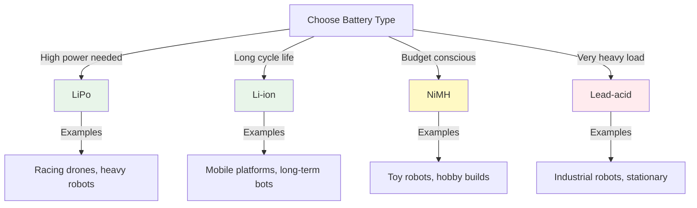

import { Callout } from 'fumadocs-ui/components/callout';
import { Tab, Tabs } from 'fumadocs-ui/components/tabs';
import { Accordion, Accordions } from 'fumadocs-ui/components/accordion';

# Batteries and Cells

Batteries are the lifeblood of mobile robots. Choosing the right battery type is critical for performance, runtime, weight, and safety. Understanding battery chemistry helps make informed decisions.

## Battery Chemistry Fundamentals

### How Batteries Work

A battery converts chemical energy into electrical energy through oxidation-reduction (redox) reactions:

```
Negative terminal (−): Oxidation (electrons released)
Electrolyte: Ions flow inside battery
Positive terminal (+): Reduction (electrons accepted)
External circuit: Electrons flow to power load
```

### Key Parameters

| Parameter | Unit | Description |
|-----------|------|-------------|
| **Voltage (V)** | Volt | Electrical pressure |
| **Capacity (mAh/Ah)** | Amp-hour | Charge stored |
| **Energy (Wh)** | Watt-hour | Total usable energy |
| **C-rating** | Times | Discharge rate |
| **Self-discharge** | %/month | Charge loss over time |
| **Cycle life** | Cycles | How many times rechargeable |

### Example Battery Rating

```
12V 5000mAh 50C Li-ion

12V = Nominal voltage
5000mAh = 5 Amp-hour capacity
50C = Can discharge at 50 × 5A = 250A peak!
```

---

## Battery Chemistry Types

<Accordions>
<Accordion title="Lithium Polymer (LiPo)">
### Why LiPo for Robots?

LiPo dominates robotics due to high power density and customizable form factors.

### Characteristics

| Property | Value | Notes |
|----------|-------|-------|
| **Nominal voltage** | 3.7V/cell | 2S=7.4V, 3S=11.1V, 4S=14.8V |
| **Energy density** | 150-250 Wh/kg | Very high |
| **Power density** | High (50C typical) | Fast discharge available |
| **Cycle life** | 300-500 cycles | Moderate |
| **Cost** | Moderate | Competitive |
| **Self-discharge** | 2-3%/month | Low |
| **Temperature range** | −20 to 60°C | Good range |

### Advantages

✓ **High power output**: 50C means 250A from 5Ah battery
✓ **Lightweight**: Best energy per weight
✓ **Customizable**: Any cell count, any shape
✓ **Fast charging**: Can charge in 30 minutes
✓ **Temperature stable**: Good performance in cold

### Disadvantages

✗ **Expensive**: Most costly chemistry
✗ **Fire risk**: Flammable electrolyte if damaged
✗ **Care required**: Careful handling, storage, charging
✗ **Puffing**: Ages and swells over time
✗ **Shorter cycle life**: 300-500 cycles vs 1000+ for others

### LiPo Cell Variants

**1S LiPo cell** (3.7V nominal):
- Smallest unit
- Used in small racing drones
- Example: 1S 350mAh 75C

**Multi-cell packs** (2S, 3S, 4S, 6S):
- Series connection increases voltage
- Parallel cells increase capacity and current
- Example: 3S 5000mAh 50C (11.1V, 250A peak)

### Safety Considerations

⚠ **Fire hazard**: Puncture or short → thermal runaway
⚠ **Storage**: Keep at 40-60% charge in cool place
⚠ **Charging**: Use balanced charger only
⚠ **Disposal**: Recycle at electronics facility
⚠ **Transport**: Airline restrictions on LiPo batteries

### Example: Quadcopter LiPo

```
3S 5000mAh 50C
├─ 11.1V nominal voltage
├─ 5 Ah capacity
├─ 250 A peak current (50 × 5)
├─ ~55 Wh energy (11.1V × 5Ah)
└─ Runtime: ~20 minutes at 50% average power
```

</Accordion>

<Accordion title="Lithium-Ion (Li-ion)">
### Standard Rechargeable Battery

Li-ion is the chemistry of phones, laptops, power tools.

### Characteristics

| Property | Value | Notes |
|----------|-------|-------|
| **Nominal voltage** | 3.6-3.7V/cell | Varies by chemistry |
| **Energy density** | 150-250 Wh/kg | High |
| **Power density** | Medium (20-30C typical) | Lower than LiPo |
| **Cycle life** | 1000+ cycles | Much better than LiPo |
| **Cost** | Moderate | Cheaper per cycle |
| **Self-discharge** | 2-3%/month | Very low |
| **Temperature range** | 0 to 45°C | Narrower than LiPo |

### Cell Types

**18650 cells** (18mm diameter, 65mm height):
- 2000-3500 mAh typical
- 30-35A discharge capability
- Very common in robotics
- Example: 18650 with 20A max (ICR type), 35A max (IMR type)

**Larger cells** (21700, 26650):
- Higher capacity
- Better for demanding applications
- Less standardized

### Advantages

✓ **Longer cycle life**: 1000-2000 cycles typical
✓ **Safer**: Less flammable, more stable
✓ **Well-regulated**: Factory-tested cells
✓ **Standardized**: Easy to find
✓ **No puffing**: More stable over time

### Disadvantages

✗ **Moderate power**: Not for extreme peak currents
✗ **Fixed size/shape**: Less customizable than LiPo
✗ **Requires protection**: Built-in BMS often needed
✗ **Slower charge**: 2-3 hours typical

### Example: Mobile Manipulator

```
4× 18650 Li-ion (10A each, series)
├─ 14.8V nominal voltage (4 × 3.7V)
├─ ~10 Ah total capacity
├─ 40 A peak current (4 × 10A per cell)
└─ Runtime: ~1-2 hours at continuous load
```

</Accordion>

<Accordion title="Nickel-Metal Hydride (NiMH)">
### Older Technology, Still Useful

NiMH was the rechargeable standard before Li-ion. Still used in budget robotics.

### Characteristics

| Property | Value | Notes |
|----------|-------|-------|
| **Nominal voltage** | 1.2V/cell | 8× AA = 9.6V |
| **Energy density** | 40-60 Wh/kg | Low |
| **Power density** | Low (2-5C typical) | Slow discharge |
| **Cycle life** | 1000 cycles | Good |
| **Cost** | Low | Cheapest |
| **Self-discharge** | 15-20%/month | High (lost if not used) |
| **Temperature range** | −20 to 65°C | Good range |

### Advantages

✓ **Cheap**: Lowest cost chemistry
✓ **Safe**: No fire risk
✓ **Rugged**: Tolerates overcharge, short circuits
✓ **Cold-hardy**: Works well in cold
✓ **Available**: AA, AAA formats everywhere

### Disadvantages

✗ **Low energy density**: Heavy for same energy
✗ **Self-discharge**: Loses charge quickly
✗ **Memory effect**: Degrades if partially recharged repeatedly (can be reversed)
✗ **Low power**: Slow discharge rate
✗ **Poor performance**: Voltage drops during discharge

### Example: Budget Robot

```
8× NiMH AA cells (9.6V nominal)
├─ 2000 mAh typical per cell
├─ 2.0 Ah total capacity
├─ 16 A peak (2A per cell × 8)
└─ Runtime: ~1 hour at continuous load
```

### Memory Effect

**What it is:** NiMH "remembers" partial discharge cycles

**Symptoms:**
- Capacity decreases over time
- Voltage drops earlier in discharge

**Prevention:**
- Fully discharge occasionally (once per month)
- Charge fully before use
- Modern chargers can reverse memory effect

</Accordion>

<Accordion title="Lead-Acid">
### Traditional Battery Technology

Lead-acid is ancient (invented 1859) but still used in heavy vehicles and backup power.

### Characteristics

| Property | Value | Notes |
|----------|-------|-------|
| **Nominal voltage** | 2V/cell | 12V battery = 6 cells |
| **Energy density** | 30-40 Wh/kg | Very low |
| **Power density** | High (burst) | 1000+ A possible |
| **Cycle life** | 200-300 cycles | Low |
| **Cost** | Very low | Cheapest per energy |
| **Self-discharge** | 5%/month | Medium |
| **Temperature range** | −20 to 65°C | Good range |

### Advantages

✓ **Extremely rugged**: Can handle abuse
✓ **High burst current**: 1000+ A available
✓ **Very cheap**: Lowest cost per energy unit
✓ **Long history**: Well-understood technology

### Disadvantages

✗ **Very heavy**: Heaviest chemistry
✗ **Low cycle life**: 200-300 cycles only
✗ **Self-discharge**: Loses charge over weeks
✗ **Acid hazard**: Corrosive, dangerous
✗ **Maintenance**: Requires periodic water addition (wet type)

### When to Use

Lead-acid is rarely used in modern robotics due to weight, but still appears in:
- Heavy industrial robots
- Backup power systems
- Old robot designs

### Example: Heavy Lifting Robot

```
12V 100Ah lead-acid battery
├─ 12V nominal voltage
├─ 100 Ah capacity (1200 Wh)
├─ Very heavy (~30 kg for 12V 100Ah)
└─ Used for: Stationary or tracked heavy equipment
```

</Accordion>
</Accordions>

---

## Battery Comparison Chart



---

## Cell Configuration

### Series vs Parallel

**Series connection** (voltage addition):
```
+5V cell | +5V cell | +5V cell
         ↓ ↓
        +15V total

Capacity = single cell capacity
Current capability = single cell capability
```

**Parallel connection** (capacity addition):
```
+5V cell ┐
+5V cell ├→ +5V total
+5V cell ┘

Capacity = 3× single cell
Current capability = 3× single cell
```

### Example: 3S2P Battery Pack

```
3S = 3 cells in series (3 × 3.7V = 11.1V)
2P = 2 parallel groups

[Cell] ─ [Cell] ─ [Cell]
  ║       ║       ║
[Cell] ─ [Cell] ─ [Cell]
        ↓
      11.1V, 2× capacity, 2× current capability
```

---

## Summary

**Battery Chemistry Quick Reference:**

| Type | Voltage | Capacity | Power | Cost | Cycles | Best For |
|------|---------|----------|-------|------|--------|----------|
| **LiPo** | 3.7V/cell | High | Very High | High | 300-500 | Drones, racers |
| **Li-ion** | 3.6V/cell | High | Medium | Medium | 1000+ | Mobile robots |
| **NiMH** | 1.2V/cell | Medium | Low | Low | 1000 | Budget bots |
| **Lead-Acid** | 2V/cell | Medium | High | Very Low | 200-300 | Heavy stationary |

**Selection Guide:**

✓ Choose LiPo if: High power, light weight, accept fire risk
✓ Choose Li-ion if: Long runtime, safety important, can afford weight
✓ Choose NiMH if: Budget limited, casual use
✓ Choose Lead-Acid if: Very heavy loads, stationary application