import { Callout } from 'fumadocs-ui/components/callout';
import { Tab, Tabs } from 'fumadocs-ui/components/tabs';
import { Accordion, Accordions } from 'fumadocs-ui/components/accordion';

# Battery Protection and Balancing

Batteries are energy-dense and can fail catastrophically if mishandled. Understanding protection and balancing extends battery life and prevents fires.

## Battery Hazards

### Thermal Runaway

The most dangerous failure mode:

```mermaid
graph TD
    A["Battery damaged or overcharged"] -->|Heat generated| B["Temperature rises"]
    B -->|Chemical acceleration| C["More heat generated"]
    C -->|Exponential growth| D["Thermal runaway"]
    D -->|Electrolyte ignites| E["🔥 FIRE 🔥"]
    
    style E fill:#ffebee
```



### Short Circuit

Direct connection between positive and negative terminals:

```
Battery (+) ───[Short circuit]─── Battery (−)
                 ↓
            Massive current (1000+ A)
                 ↓
            Extreme heat → fire
```

### Overcharge

Exceeding maximum voltage per cell:

```
LiPo cell max: 4.2V
Overcharged to: 4.5V → Unstable, fire risk
```

### Over-Discharge

Draining below minimum voltage:

```
LiPo cell min: 3.0V
Overdischarged to: 2.0V → Permanent damage, fire risk on next charge
```

---

## Battery Management Systems (BMS)

### What BMS Does

A BMS is a small circuit protecting the battery:


### BMS Protection Functions

| Protection | Triggers at | Action |
|-----------|----------|--------|
| **Over-charge** | > 4.3V/cell | Stops charging |
| **Over-discharge** | < 2.75V/cell | Disconnects load |
| **Over-current** | > Max discharge | Cuts power |
| **Over-temperature** | > 60-70°C | Disconnects |
| **Cell balance** | > 0.1V difference | Rebalances |

### BMS Types

**Passive BMS:**
- Simple shunt resistors
- Dissipates excess charge as heat
- Cheap, no active components
- Slow balancing

**Active BMS:**
- Buck/boost converters
- Can move energy between cells
- Expensive, complex
- Fast, efficient balancing

---

## Cell Balancing

### Why Balancing Needed

In a multi-cell battery, cells age differently:

```
Initial state:
Cell 1: 4.2V
Cell 2: 4.2V
Cell 3: 4.2V

After 100 charges:
Cell 1: 4.15V (degraded faster)
Cell 2: 4.2V
Cell 3: 4.25V (charging faster)

Problem: Cell 3 at 4.25V might trigger over-voltage protection!
```

### Passive Balancing (Most Common)

Small resistors in parallel with each cell:

```
[Cell 1]──[Resistor 100kΩ]──┐
[Cell 2]──[Resistor 100kΩ]──┤
[Cell 3]──[Resistor 100kΩ]──┘

When one cell is high voltage:
- Resistor conducts slight current
- Discharges excess charge
- Slow process (over hours)
```

### Example: Passive Balancing in Action

```
Before: Cell 1=4.05V, Cell 2=4.20V, Cell 3=4.15V (imbalanced)

With balancing resistors:
Cell 2 > others → Resistor discharges Cell 2
After 1 hour: Cell 1=4.10V, Cell 2=4.15V, Cell 3=4.14V

After 2 hours: Cell 1=4.12V, Cell 2=4.13V, Cell 3=4.13V (balanced!)
```

### Active Balancing (Professional)

Uses switching circuits to transfer charge:

```
High cell → Switch → Low cell
         ↓ ↓
      (Buck-boost converter)

Transfer charge directly (fast)
More efficient than resistor heating
```

---

## Overcharge Protection

### Charger Cut-off

Smart chargers stop charging at correct voltage:

```
Target: 4.2V per cell (LiPo)

Charger monitors voltage:
0-90% charge: High current (fast)
90-100% charge: Reduced current (slow)
At 4.2V per cell: STOP (cut-off)
```

### Constant Current / Constant Voltage (CC/CV)

The most common charging profile:

```
    Current (A)
    │
100%├─────┐      ← Constant Current phase
    │     │ 
 50%├     └─────┐  ← Constant Voltage phase
    │           │
  0%├───────────┴─────
    └─────────────────
      Time →

CC phase: Draw set current until voltage reaches limit
CV phase: Hold voltage constant while current tapers to zero
```

**Example: 5A charger charging 5000mAh LiPo**

```
CC Phase (0-50 min): 5A constant, voltage rises to 4.2V per cell
CV Phase (50-60 min): Voltage held at 4.2V, current drops from 5A to 0.2A
Charge complete: Current < 0.2A
```

---

## Over-Discharge Protection

### Low Voltage Cutoff (LVC)

Circuits detect when battery voltage drops too low:

```
Target: Stop at 3.0V per cell (LiPo)

Monitor voltage:
4.2V → OK, full power
3.5V → OK, full power
3.2V → OK, full power
3.0V → WARNING, 80% capacity lost
2.9V → CUTOFF, disconnect motor

Below 3.0V: Permanent damage risk
```

### BMS Automatic Cutoff

```
Battery voltage drops → BMS detects
At minimum → Relay clicks off
Motor loses power → Robot stops
```

Prevents over-discharge automatically.

---

## Over-Current Protection

### Current Limiting

Prevents excessive current draw:

```
Peak current allowed by BMS: 50A
Robot tries to draw: 100A (jamming motor)

BMS detects over-current → Disconnects
Robot stops instead of melting battery
```

### Fuses vs Electronic Protection

| Method | Speed | Reliability | Cost |
|--------|-------|-------------|------|
| **Fuse** | Very fast | One-time use | Cheap |
| **Circuit breaker** | Very fast | Reusable | Moderate |
| **BMS electronic** | Fast | Usually reliable | Moderate |
| **PTC thermistor** | Slow | Reusable | Cheap |

**Typical design:** Fuse + BMS electronic = redundant protection

---

## Temperature Management

### Temperature Effects


### Temperature Protection

**High temp cutoff:**
```
Sensor: Battery temperature
Limit: 60-70°C maximum
Action: Reduce charge/discharge current or disconnect
```

**Low temp protection:**
```
Sensor: Battery temperature
Limit: 0°C minimum
Action: Don't charge below 0°C (lithium risk)
```

### Thermal Management

**Keep battery cool:**
- Airflow around battery
- Thermal paste if mounted to metal
- Don't pile components on battery
- Avoid direct sunlight

**Example:** Robot operated in 50°C heat
- Battery reaches 70°C internal
- Risk of thermal runaway
- Solution: Add cooling, use active BMS

---

## Safe Handling Practices

<Accordions>
<Accordion title="Storage">
### Long-Term Storage

**LiPo/Li-ion:**
```
Charge to 40-60%: Balances aging
Store in: Cool place (10-25°C)
Container: Fireproof bag (LiPo bags available)
Check monthly: Verify no puffing
```

**NiMH:**
```
Charge to: 50%
Store in: Cool, dry place
Check: Can store for years
```

### Storage Time Limits

| Battery | Max Storage | Notes |
|---------|----------|-------|
| **LiPo** | 3-6 months | Check monthly |
| **Li-ion** | 1-2 years | Slow self-discharge |
| **NiMH** | 2+ years | Minimal degradation |
| **Lead-acid** | 1-2 years | Check fluid levels |

</Accordion>

<Accordion title="Transportation">
### Air Travel

⚠️ Strict regulations (airlines, TSA, IATA):

- **LiPo:** Limited quantities, special packaging
- **Li-ion:** 20-100 batteries per package limit
- **Check first:** Always verify with airline before packing

### Ground Transport

- Use fireproof bags
- Don't stack batteries directly
- Include documentation
- Keep at moderate temperature

</Accordion>

<Accordion title="Charging Safety">
### Best Practices

✓ **Use proper charger** - Never use wrong voltage/type
✓ **Charged outdoors** - Worst case, fire in open area
✓ **Monitor charging** - Don't leave unattended
✓ **Check temperature** - Should be warm not hot
✓ **Stop if puffing** - Disconnect immediately
✓ **Use LiPo bag** - Contains fire if it happens
✓ **Have fire extinguisher** - Class C or ABC type nearby

### Red Flags During Charging

🚨 **STOP IMMEDIATELY if:**
- Smell burnt plastic or chemicals
- See smoke or flame
- Battery puffing/swelling
- Charger getting extremely hot
- Unusual noise

</Accordion>
</Accordions>

---

## Lifespan Extension Tips

### Maximize Cycle Life

```
Cycle life = Total discharge cycles battery survives

LiPo: 300-500 cycles typical

To extend:
✓ Avoid full discharge (stop at 3.0V)
✓ Avoid full charge daily (charge to 80% for storage)
✓ Keep cool (20-40°C ideal)
✓ Don't over-stress (follow C-rating)
✓ Use balancing charger
✓ Discharge fully once per month
```

### Example: Racing LiPo vs Storage LiPo

**Racing use:**
- Charge to 100% (4.2V/cell)
- Fully discharge each use
- Cycle life: 300 cycles
- Duration: ~40-50 hours racing

**Storage/casual use:**
- Charge to 60% (3.85V/cell)
- Only discharge for flight
- Cycle life: 800+ cycles
- Duration: Years of use

---

## Disposal and Recycling

### Why Recycling Matters

```
Lithium: Toxic, valuable (recovered for new batteries)
Cobalt: Toxic, expensive (recovered for other uses)
Nickel/Metal: Recyclable
Lead: Hazardous, must be recovered
```

### Disposal Process

1. **Drain if possible:** Connect to load until dead
2. **Tape terminals:** Prevent short circuits
3. **Store safely:** Fireproof container
4. **Find facility:** Search "battery recycling near me"
5. **Drop off:** Most electronics stores accept free

---

## Summary

**Battery Protection Essentials:**

✓ BMS prevents over-charge, over-discharge, over-current
✓ Passive balancing keeps cells within 0.1V
✓ Temperature management prevents thermal runaway
✓ Proper storage and charging extends life
✓ Safe handling prevents fires

**Key Rules:**

- Don't exceed C-rating
- Don't go below 3.0V per cell
- Don't store fully charged
- Keep cool and dry
- Use fireproof bags
- Have fire extinguisher nearby
- Recycle properly when done