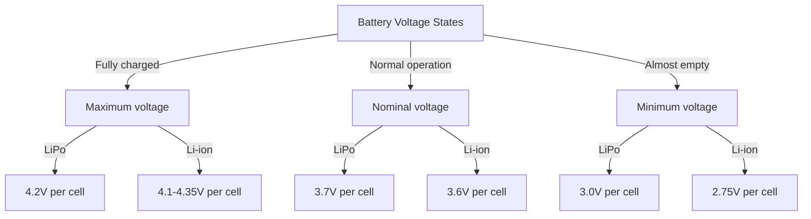

import { Callout } from 'fumadocs-ui/components/callout';
import { Tab, Tabs } from 'fumadocs-ui/components/tabs';

# Battery Ratings and Specifications

Decoding battery specifications is essential for proper selection. A single number like "5000mAh" doesn't tell the complete story—you need voltage, C-rating, and chemistry to make informed decisions.

## Voltage Rating

### Nominal vs Minimum vs Maximum

Each battery has three voltage specifications:



### Example: 3S LiPo (Three cells in series)

```
Maximum voltage: 4.2V × 3 = 12.6V (just charged)
Nominal voltage: 3.7V × 3 = 11.1V (50% discharged)
Minimum voltage: 3.0V × 3 = 9.0V (depleted)
```

### Why This Matters

Many components require specific voltage ranges:

```
Motor: Rated for 12V ±10% = 10.8V to 13.2V
Microcontroller 5V supply: ±5% = 4.75V to 5.25V
```

At minimum voltage (9V on 3S), the motor supply drops to ~4.5V, which is below acceptable range for 5V logic!

**Solution:** Use voltage regulator (buck converter) or choose battery with higher minimum voltage.

---

## Capacity Rating

### mAh vs Ah

Both measure charge storage, just different units:

```
1 Ah = 1000 mAh

Example:
5000 mAh = 5 Ah
2500 mAh = 2.5 Ah
```

### What Capacity Means

A 5000 mAh battery can provide:

```
5A for 1 hour, OR
2.5A for 2 hours, OR
10A for 0.5 hours (30 minutes)
```

**Formula:**
```
Runtime (hours) = Capacity (Ah) / Average Current (A)
```

### Example: Mobile Robot

```
Battery: 5000 mAh (5 Ah)
Robot draws: 10A average

Runtime = 5 Ah / 10 A = 0.5 hours = 30 minutes
```

### Rated vs Usable Capacity

Manufacturers sometimes overstate capacity. Reality:

```
Rated capacity: 5000 mAh (what they claim)
Usable capacity: 4500 mAh (typically 80-90%)
Lost to: Protection circuits, internal resistance, safety margin
```

**Rule of thumb:** Assume 70-80% of rated capacity is actually usable.

---

## C-Rating (Discharge Rate)

### What C-Rating Means

**C-rating** specifies safe maximum discharge current:

```
C = Battery capacity / 1 hour

Example: 5000 mAh battery
C = 5000 mAh / 1 hour = 5 A

Therefore:
1C = 5A (discharge in 1 hour)
2C = 10A (discharge in 30 minutes)
50C = 250A (discharge in 72 seconds)
```

### Why C-Rating Matters

High discharge current causes:
- Heat generation
- Voltage sag (temporary drop)
- Battery damage if exceeded
- Fire if too high

**Safe operation:**
```
Actual current ≤ C-rating × Capacity
```

### Example: Safe Discharge

Battery: 5000 mAh 50C

```
Maximum safe discharge = 50C × 5Ah = 250A
```

If you draw 300A, you exceed the rating and risk damage!

---

## Energy Rating (Watt-hours)

### Energy vs Capacity

Capacity (mAh) tells you charge, but energy (Wh) tells you total usable power:

```
Energy (Wh) = Voltage (V) × Capacity (Ah)
```

### Example: Different Voltages, Same Capacity

```
5V 5000mAh battery = 5V × 5Ah = 25 Wh
12V 5000mAh battery = 12V × 5Ah = 60 Wh
```

Same capacity, but 12V battery has 2.4× more energy!

### Practical Impact

Motor powered by 12V uses less current than 5V:
```
P = V × I, so I = P / V

1000W motor:
At 12V: I = 1000W / 12V = 83A
At 5V: I = 1000W / 5V = 200A (impossible for small batteries!)
```

Higher voltage = lighter wiring, smaller batteries, more efficient!

---

## Real Battery Labels Explained

### Example LiPo Label: "3S 5000mAh 50C 11.1V"

```
3S           = 3 cells in series (lithium)
5000mAh      = 5 Amp-hour capacity
50C          = Maximum discharge rate (250A)
11.1V        = Nominal voltage (3 × 3.7V)

Calculated:
Energy = 11.1V × 5Ah = 55.5 Wh
Max current = 50C × 5A = 250A
Min voltage = 3 × 3.0V = 9.0V
```

### Example Li-ion Label: "18650 2600mAh 10A"

```
18650        = Standard cell size (18mm × 65mm)
2600mAh      = 2.6 Amp-hour capacity
10A          = Maximum discharge current

Calculated:
Voltage = 3.7V nominal
C-rating = 10A / 2.6A = 3.85C (approximately)
Energy = 3.7V × 2.6Ah = 9.6 Wh
```

---

## Selecting a Battery

### Step-by-Step Selection

<Tabs items={['Calculate Requirements', 'Choose Voltage', 'Choose Capacity', 'Check C-Rating']}>
<Tab value="Calculate Requirements">
### 1. Calculate Your Needs

**Current draw:**
- List all components and their max current
- Sum them up
- Add 20% safety margin

Example robot:
```
Motors (4×): 4A each = 16A
Servos (2×): 1A each = 2A
Microcontroller + sensors: 0.3A
Total: 18.3A
With margin: 22A
```

**Required runtime:**
- How long should it operate?
- Example: 1 hour continuous

**Maximum weight:**
- Robot weight limit?
- Battery shouldn't exceed 30% of total weight

</Tab>

<Tab value="Choose Voltage">
### 2. Choose Voltage

**Most robotics use:**
- 12V (3S LiPo or 4S Li-ion): Very common
- 6V (2S LiPo): Smaller robots
- 24V (6S LiPo): Heavy duty
- 5V: Only with regulator from higher voltage

**Benefits of higher voltage:**
- Lower current needed
- Lighter wires
- More efficient motors
- Less voltage sag

**Constraint:** Components must support the voltage!

</Tab>

<Tab value="Choose Capacity">
### 3. Choose Capacity

**Formula:**
```
Capacity needed (Ah) = Peak current (A) × Runtime (h) / Usable capacity
                     = 22A × 1h / 0.8
                     = 27.5 Ah
```

Choose a battery ≥ 27.5Ah. Common sizes:
- 5000 mAh = 5 Ah (too small)
- 10000 mAh = 10 Ah (too small)
- 25000 mAh = 25 Ah (close, might be tight)
- 30000 mAh = 30 Ah (good choice)

**Real-world:** 25-30Ah for this robot.

</Tab>

<Tab value="Check C-Rating">
### 4. Check C-Rating

**Formula:**
```
Required C-rating = Peak current (A) / Capacity (Ah)
                  = 22A / 25Ah
                  = 0.88C
```

Any battery ≥ 1C will work. For margin, choose 3-5C typical.

**Safety:** 
- Minimum: 1C
- Comfortable: 3-5C
- Aggressive: 10-20C
- Racing: 30C+

For 25Ah, 3C = 75A (plenty safe).

</Tab>
</Tabs>

---

## Battery Specifications Comparison Table

| Specification | LiPo | Li-ion | NiMH |
|-----------|------|--------|------|
| **Nominal Voltage** | 3.7V/cell | 3.6V/cell | 1.2V/cell |
| **Typical Capacity** | 1000-10000 mAh | 2000-3500 mAh | 2000-2500 mAh |
| **Typical C-Rating** | 20-50C | 3-10C | 1-5C |
| **Energy Density** | 150-250 Wh/kg | 150-250 Wh/kg | 40-60 Wh/kg |
| **Cost per Wh** | Medium | Medium | Low |
| **Cycle Life** | 300-500 | 1000+ | 1000 |

---

## Common Battery Mistakes

| Mistake | Problem | Solution |
|---------|---------|----------|
| **Wrong voltage** | Components don't work, may fail | Check datasheets, use regulators |
| **Too small capacity** | Runs out quickly | Calculate runtime properly |
| **Ignoring C-rating** | Battery gets hot, may fail | Ensure C ≥ 3× peak current |
| **Mixing old/new** | Damaged cells, unbalanced discharge | Always replace full pack |
| **Overcharging** | Fire, damage | Use proper charger with cut-off |
| **Deep discharge** | Permanent capacity loss | Stop at 3.0V per cell minimum |

---

## Summary

**Key Takeaways:**

✓ Nominal voltage is middle of operating range
✓ Capacity (mAh/Ah) determines runtime
✓ C-rating limits safe discharge current
✓ Energy (Wh) is total usable power
✓ Higher voltage = more efficient, lighter

**Quick Selection Guide:**

1. Calculate peak current draw
2. Choose voltage matching components
3. Calculate capacity for desired runtime
4. Verify C-rating supports peak current
5. Check weight not exceeding 30% robot weight
6. Add 20-30% safety margin
7. Test with sample batch before large deployment